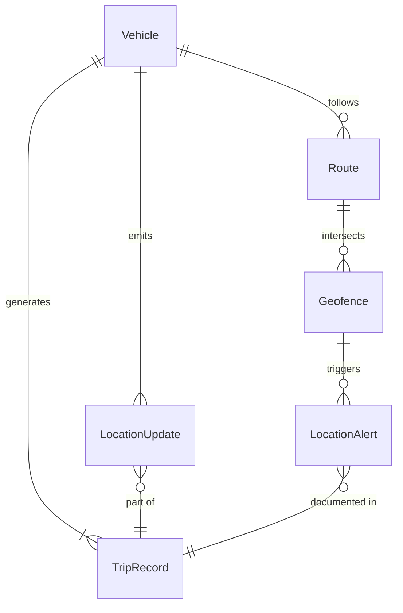
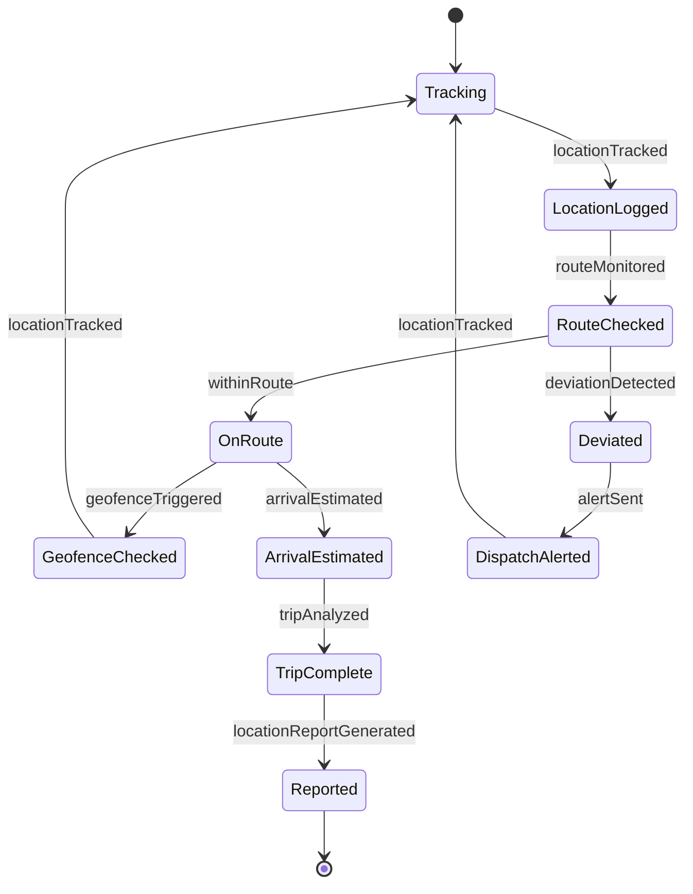
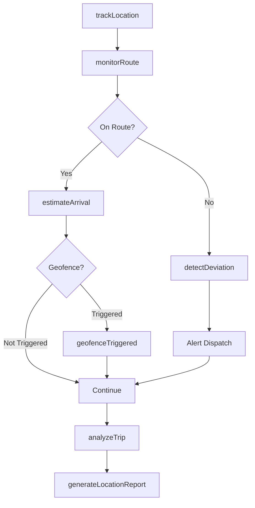
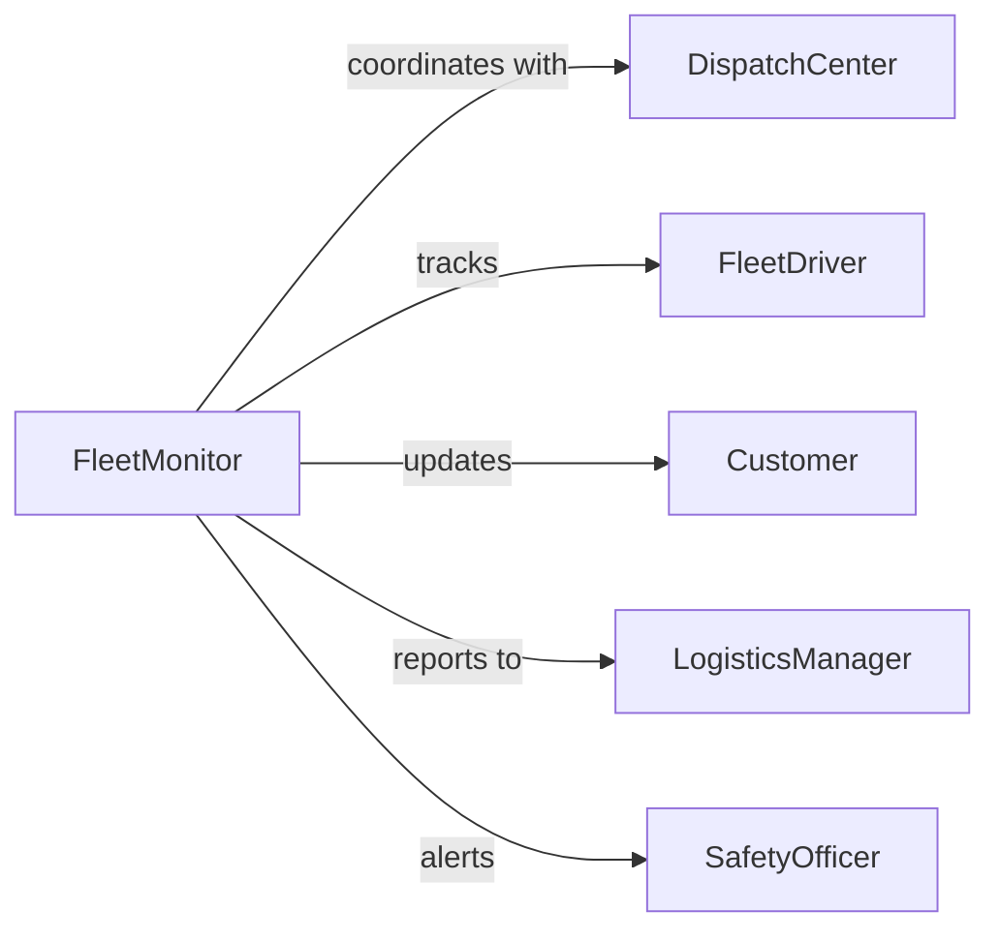

# Monitor Vehicle Movement Location

> Business-as-Code definition for monitoring vehicle movement and location. Provides real-time fleet tracking, route optimization, and location-based alerts for transportation and logistics operations.

## Overview

Vehicle movement and location monitoring involves real-time GPS tracking, route analysis, and location-based event detection to optimize fleet operations, ensure driver safety, and improve delivery performance. This definition exposes tracking actions, geofencing capabilities, and event-driven alerts for comprehensive vehicle fleet management.

## Actors

| Actor | Description |
|-------|-------------|
| FleetDriver | Operates vehicles and completes transportation assignments |
| DispatchCenter | Coordinates vehicle assignments and routes |
| MaintenanceProvider | Performs vehicle repairs and scheduled maintenance |
| Customer | Receives deliveries and tracks shipment progress |
| RegulatoryAuthority | Enforces transportation regulations and compliance |
| InsuranceProvider | Manages fleet insurance and risk assessment |

## Roles

| Role | Description |
|------|-------------|
| FleetMonitor | Tracks real-time vehicle locations and movements |
| DispatchCoordinator | Manages vehicle assignments and route optimization |
| SafetyOfficer | Monitors driver behavior and safety compliance |
| LogisticsManager | Oversees fleet operations and performance |

## Entities

| Entity | Description |
|--------|-------------|
| Vehicle | A fleet asset with tracking and monitoring capabilities |
| LocationUpdate | A GPS position record with timestamp |
| Route | A planned or actual path of vehicle travel |
| Geofence | A virtual boundary triggering location-based events |
| TripRecord | Documentation of vehicle journey from start to end |
| LocationAlert | A notification triggered by location-based rules |

## Actions

| Action | Description |
|--------|-------------|
| trackLocation | Record and update vehicle GPS position |
| monitorRoute | Observe vehicle progress along planned path |
| defineGeofence | Create virtual boundary for location-based alerts |
| detectDeviation | Identify vehicle movement outside expected route |
| estimateArrival | Calculate expected time of arrival at destination |
| analyzeTrip | Evaluate completed journey for performance metrics |
| generateLocationReport | Create documentation of vehicle movement history |

## Events

| Event | Description |
|-------|-------------|
| locationTracked | Vehicle GPS position has been recorded |
| routeMonitored | Vehicle progress along path has been assessed |
| geofenceTriggered | Vehicle has entered or exited defined boundary |
| deviationDetected | Vehicle movement outside expected route identified |
| arrivalEstimated | Expected arrival time has been calculated |
| tripAnalyzed | Journey performance evaluation completed |
| locationReportGenerated | Vehicle movement history report created |

## Searches

| Search | Description |
|--------|-------------|
| findVehicles | List vehicles by location, status, or assignment |
| getLocationHistory | Retrieve GPS position records by vehicle or period |
| getTrips | Find journey records by driver, route, or date |
| getGeofenceEvents | List boundary crossing events by vehicle or zone |

## Entity Relationships



## State Diagram



## Workflow



## Actor Relationships



## Usage

### Calling Actions

```typescript
import { monitorVehicleMovementLocation } from '@headlessly/monitor-vehicle-movement-location'

const fleet = monitorVehicleMovementLocation()

// Track vehicle location
await fleet.trackLocation({
  vehicleId: 'VH-2401',
  latitude: 37.7749,
  longitude: -122.4194,
  speed: 45,
  heading: 180,
  timestamp: new Date()
})

// Define geofence for customer delivery zone
await fleet.defineGeofence({
  name: 'Customer Warehouse Zone',
  type: 'delivery-area',
  boundaries: {
    center: { lat: 37.7749, lng: -122.4194 },
    radius: 500
  },
  triggerEvents: ['entry', 'exit']
})

// Monitor route progress
const progress = await fleet.monitorRoute({
  vehicleId: 'VH-2401',
  routeId: 'RT-20260205-001',
  checkpoints: ['departure', 'waypoint-1', 'destination']
})
```

### Event-Driven Automation

```typescript
// Notify customer on geofence entry
fleet.geofenceTriggered(async ({ vehicleId, geofence, eventType }) => {
  if (geofence.type === 'delivery-area' && eventType === 'entry') {
    const eta = await fleet.estimateArrival({ vehicleId, destination: geofence.name })
    await notify({
      to: 'customer',
      message: `Your delivery vehicle is approaching. ETA: ${eta.minutes} minutes`
    })
  }
})

// Alert on route deviation
fleet.deviationDetected(async ({ vehicleId, plannedRoute, actualLocation }) => {
  const deviation = calculateDistance(plannedRoute, actualLocation)

  if (deviation > 2) {
    await notify({
      to: 'dispatch-coordinator',
      message: `Vehicle ${vehicleId} is ${deviation} miles off route`,
      action: 'contact-driver'
    })
  }
})
```
