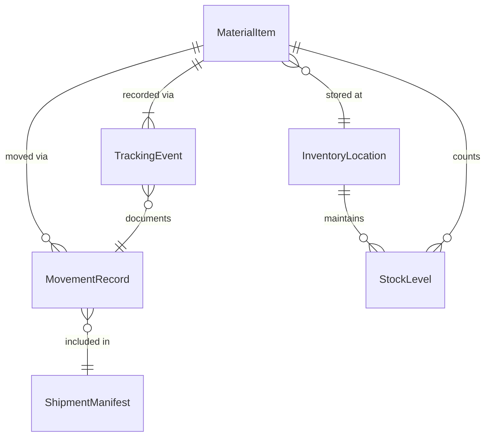
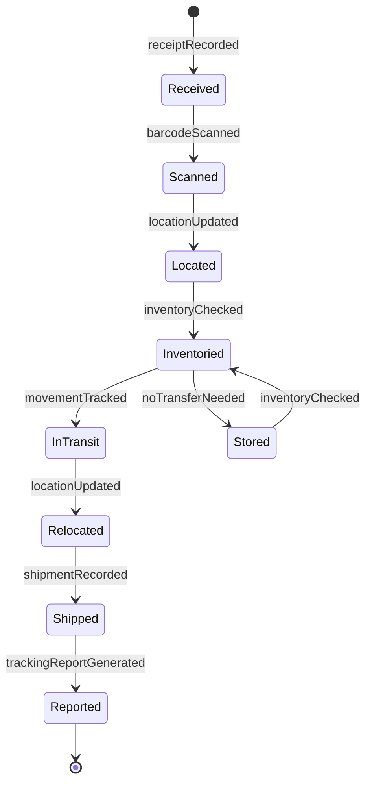
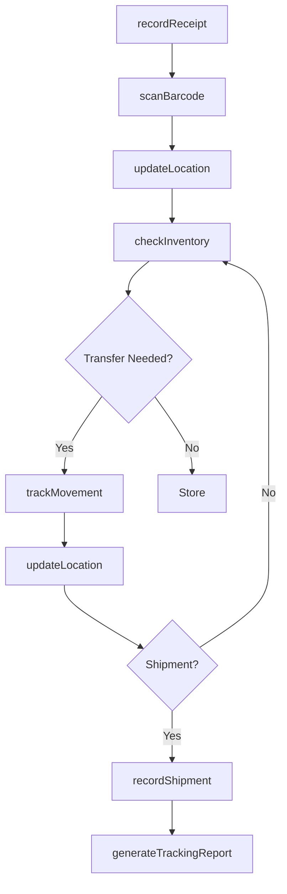
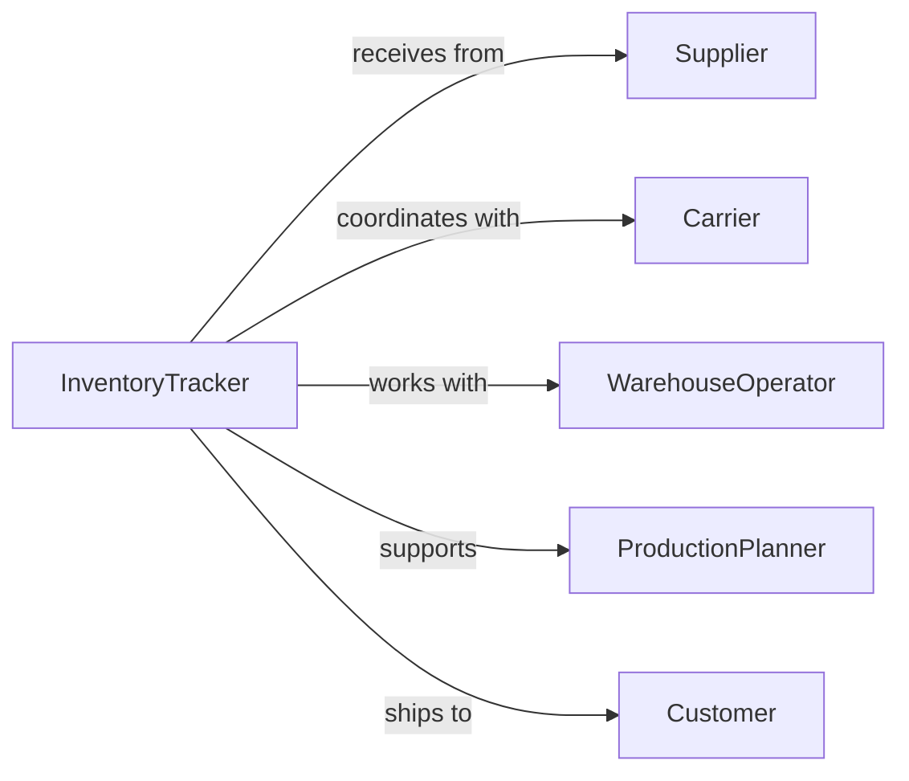

# Track Goods Materials

> Business-as-Code definition for tracking goods and materials. Provides end-to-end inventory visibility, supply chain tracking, and material movement monitoring across storage, production, and distribution networks.

## Overview

Tracking goods and materials involves real-time monitoring of inventory locations, movements, and status throughout the supply chain from receipt through production to delivery. This definition exposes tracking actions, inventory visibility capabilities, and event-driven alerts for comprehensive materials management and supply chain optimization.

## Actors

| Actor | Description |
|-------|-------------|
| Supplier | Provides materials and goods to the organization |
| Carrier | Transports goods between locations |
| WarehouseOperator | Manages storage and handling of materials |
| ProductionPlanner | Coordinates materials for manufacturing processes |
| Customer | Receives finished goods and shipments |
| CustomsAuthority | Regulates international goods movement |

## Roles

| Role | Description |
|------|-------------|
| InventoryTracker | Monitors real-time location and status of goods |
| WarehouseManager | Oversees material storage and movement operations |
| LogisticsCoordinator | Manages goods transportation and delivery |
| MaterialsPlanner | Ensures material availability for operations |

## Entities

| Entity | Description |
|--------|-------------|
| MaterialItem | A tracked unit of goods or raw materials |
| InventoryLocation | A storage or staging area for materials |
| MovementRecord | Documentation of material transfer or shipment |
| TrackingEvent | A recorded status change or location update |
| StockLevel | Current quantity of materials at a location |
| ShipmentManifest | Documentation of goods in transit |

## Actions

| Action | Description |
|--------|-------------|
| recordReceipt | Document arrival of goods at facility |
| trackMovement | Monitor transfer of materials between locations |
| updateLocation | Record current position of goods or materials |
| checkInventory | Verify quantity and status of materials at location |
| scanBarcode | Capture tracking data via barcode or RFID scan |
| recordShipment | Document departure of goods from facility |
| generateTrackingReport | Create documentation of material movement history |

## Events

| Event | Description |
|-------|-------------|
| receiptRecorded | Goods arrival has been documented |
| movementTracked | Material transfer has been monitored |
| locationUpdated | Current position of goods has been recorded |
| inventoryChecked | Material quantity and status has been verified |
| barcodeScanned | Tracking data has been captured via scan |
| shipmentRecorded | Goods departure has been documented |
| trackingReportGenerated | Material movement history report created |

## Searches

| Search | Description |
|--------|-------------|
| findMaterials | List materials by type, location, or status |
| getMovementHistory | Retrieve transfer records by item or period |
| getStockLevels | Find inventory quantities by location or material |
| getShipments | List shipments by origin, destination, or carrier |

## Entity Relationships



## State Diagram



## Workflow



## Actor Relationships



## Usage

### Calling Actions

```typescript
import { trackGoodsMaterials } from '@headlessly/track-goods-materials'

const tracking = trackGoodsMaterials()

// Record receipt of materials
await tracking.recordReceipt({
  poNumber: 'PO-2026-001',
  supplier: 'Acme Materials Inc',
  items: [
    { sku: 'MTL-4501', quantity: 500, unit: 'kg' },
    { sku: 'MTL-4502', quantity: 250, unit: 'kg' }
  ],
  receivedAt: 'WAREHOUSE-A',
  receivedBy: 'receiving-clerk-03'
})

// Track material movement
await tracking.trackMovement({
  itemId: 'MTL-4501-BATCH-001',
  fromLocation: 'WAREHOUSE-A',
  toLocation: 'PRODUCTION-FLOOR-2',
  quantity: 50,
  unit: 'kg',
  movedBy: 'forklift-operator-12',
  reason: 'production-order-5423'
})

// Check current inventory
const stock = await tracking.checkInventory({
  location: 'WAREHOUSE-A',
  materials: ['MTL-4501', 'MTL-4502'],
  includeReserved: true
})
```

### Event-Driven Automation

```typescript
// Alert on low stock levels
tracking.inventoryChecked(async ({ location, stockLevels }) => {
  for (const stock of stockLevels) {
    if (stock.quantity < stock.reorderPoint) {
      await notify({
        to: 'materials-planner',
        message: `Low stock alert: ${stock.sku} at ${location} - ${stock.quantity} ${stock.unit} remaining`,
        action: 'create-purchase-requisition'
      })
    }
  }
})

// Auto-update production on material receipt
tracking.receiptRecorded(async ({ items, receivedAt }) => {
  for (const item of items) {
    const pendingOrders = await findPendingProductionOrders({ materialSku: item.sku })

    if (pendingOrders.length > 0) {
      await notify({
        to: 'production-planner',
        message: `Material ${item.sku} now available at ${receivedAt} for ${pendingOrders.length} pending orders`
      })
    }
  }
})
```
