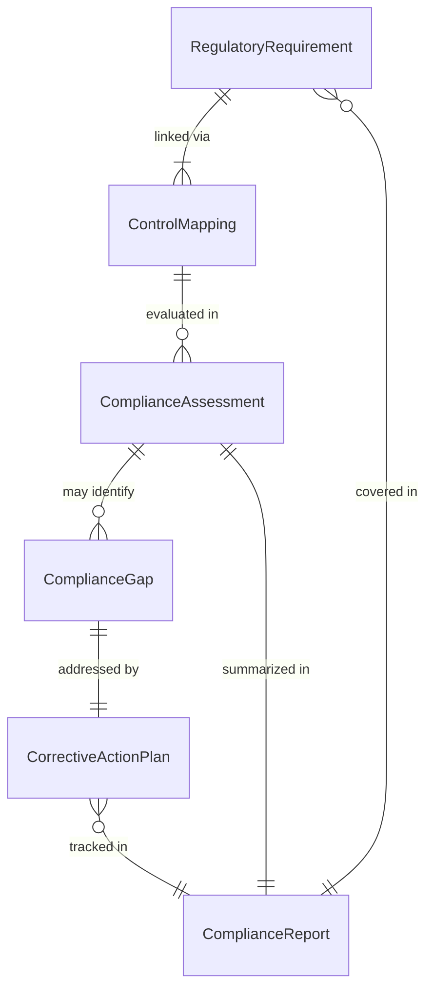
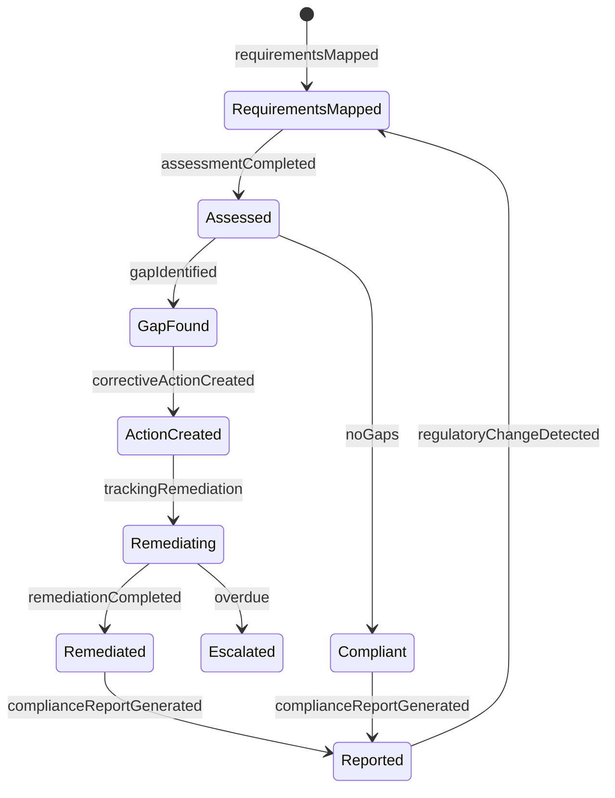
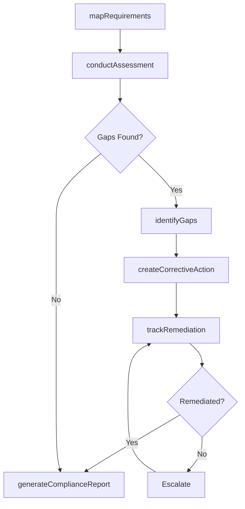
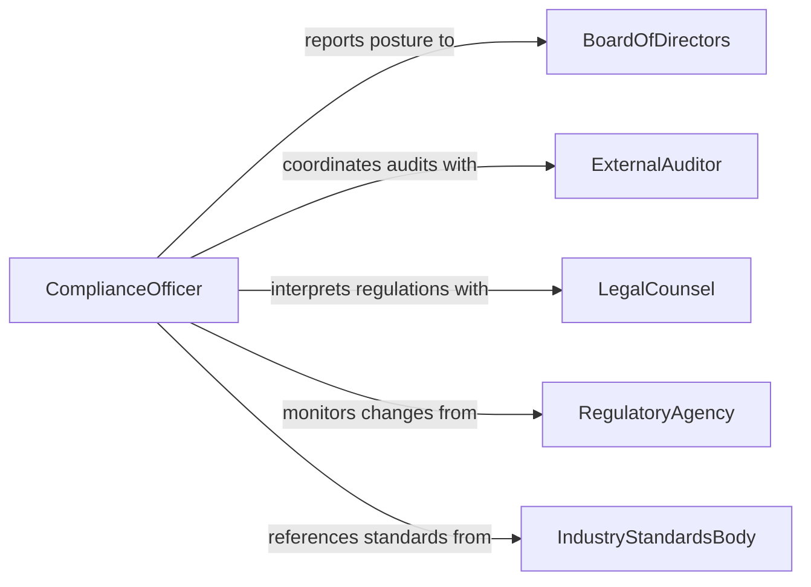

# Determine Operational Compliance Regulations Standards

> Business-as-Code definition for determining operational compliance with regulations or standards. Models the compliance assessment lifecycle from regulatory mapping through audit execution, gap identification, and remediation tracking.

## Overview

Determining operational compliance involves systematically evaluating an organization's processes, procedures, and controls against applicable laws, regulations, industry standards, and internal policies. Compliance professionals map regulatory requirements to specific operational areas, conduct audits and assessments, identify gaps between current practices and mandated standards, and track corrective actions to closure. The process ensures that organizations maintain legal standing, avoid penalties, and demonstrate due diligence to regulators, customers, and stakeholders.

## Actors

| Actor | Description |
|-------|-------------|
| RegulatoryAgency | Government body that issues regulations and conducts enforcement activities |
| ExternalAuditor | Independent firm engaged to verify compliance with specific regulations or standards |
| IndustryStandardsBody | Organization publishing operational standards such as ISO, NIST, or SOC |
| LegalCounsel | Attorney advising on regulatory interpretation and compliance obligations |
| BoardOfDirectors | Governing body requiring assurance of organizational compliance posture |

## Roles

| Role | Description |
|------|-------------|
| ComplianceOfficer | Manages the compliance program and reports organizational compliance status |
| InternalAuditor | Conducts assessments of operational practices against regulatory requirements |
| ProcessOwner | Business leader accountable for compliance within a specific operational area |
| RemediationManager | Tracks and ensures timely closure of identified compliance gaps |

## Entities

| Entity | Description |
|--------|-------------|
| RegulatoryRequirement | A specific obligation from a law, regulation, or standard applicable to operations |
| ComplianceAssessment | A structured evaluation of operations against mapped regulatory requirements |
| ControlMapping | Documentation linking regulatory requirements to specific operational controls |
| ComplianceGap | An identified deficiency where operations do not meet a regulatory requirement |
| CorrectiveActionPlan | A documented set of steps to remediate an identified compliance gap |
| ComplianceReport | A summary of assessment findings, gap status, and overall compliance posture |

## Actions

| Action | Description |
|--------|-------------|
| mapRequirements | Link applicable regulations and standards to specific operational areas and controls |
| conductAssessment | Evaluate operational practices against mapped regulatory requirements |
| identifyGaps | Document deficiencies where current operations fall short of compliance obligations |
| createCorrectiveAction | Define remediation steps, owners, and deadlines for identified gaps |
| trackRemediation | Monitor progress toward closure of corrective actions |
| generateComplianceReport | Produce a summary of compliance posture for leadership and regulators |
| updateControlMapping | Revise the linkage between requirements and controls based on regulatory changes |

## Events

| Event | Description |
|-------|-------------|
| requirementsMapped | Regulatory obligations have been linked to operational areas and controls |
| assessmentCompleted | A compliance assessment has been finished and findings documented |
| gapIdentified | A deficiency between operations and regulatory requirements has been found |
| correctiveActionCreated | A remediation plan has been defined for a compliance gap |
| remediationCompleted | A corrective action has been implemented and verified as effective |
| complianceReportGenerated | A compliance posture summary has been produced for stakeholders |
| regulatoryChangeDetected | A new or amended regulation affecting operations has been identified |

## Searches

| Search | Description |
|--------|-------------|
| findOpenGaps | Retrieve unresolved compliance gaps by regulation, severity, or process area |
| getAssessmentHistory | List completed assessments filtered by regulation, date range, or scope |
| getRemediationStatus | Look up corrective action progress by owner, deadline, or completion status |
| findApplicableRegulations | Identify regulations and standards applicable to a specific operational area |

## Entity Relationships



## State Diagram



## Workflow



## Actor Relationships



## Usage

### Calling Actions

```typescript
import { determineOperationalComplianceRegulationsStandards } from '@headlessly/determine-operational-compliance-regulations-standards'

const compliance = determineOperationalComplianceRegulationsStandards()

// Map SOX requirements to financial operations controls
await compliance.mapRequirements({
  regulation: 'SOX-Section-404',
  operationalAreas: ['accounts-payable', 'revenue-recognition', 'financial-reporting'],
  controls: [
    { id: 'ctrl-ap-01', description: 'Segregation of duties in invoice approval' },
    { id: 'ctrl-rr-01', description: 'Revenue cutoff procedures at period end' },
    { id: 'ctrl-fr-01', description: 'Management review of financial statements' }
  ]
})

// Conduct a compliance assessment
const assessment = await compliance.conductAssessment({
  regulation: 'SOX-Section-404',
  scope: ['accounts-payable'],
  assessorId: 'auditor-019',
  methodology: 'walkthrough-and-testing',
  sampleSize: 25
})

// Identify a gap found during assessment
await compliance.identifyGaps({
  assessmentId: assessment.id,
  gaps: [{
    requirement: 'Segregation of duties in invoice approval',
    controlId: 'ctrl-ap-01',
    finding: 'Same individual can create and approve invoices under $5,000',
    severity: 'high',
    evidence: 'Tested 25 invoices; 4 showed single-person approval path'
  }]
})
```

### Event-Driven Automation

```typescript
// Auto-create corrective action when gap is identified
compliance.gapIdentified(async ({ assessmentId, requirement, severity }) => {
  if (severity === 'high' || severity === 'critical') {
    await compliance.createCorrectiveAction({
      assessmentId,
      requirement,
      priority: severity,
      deadline: addBusinessDays(new Date(), 30)
    })
  }
})

// Alert compliance officer on regulatory changes
compliance.regulatoryChangeDetected(async ({ regulation, changeType, effectiveDate }) => {
  await notify({
    to: 'compliance-officer',
    message: `${changeType} to ${regulation} effective ${effectiveDate}. Control mapping review required.`
  })
  await compliance.updateControlMapping({ regulation })
})
```
