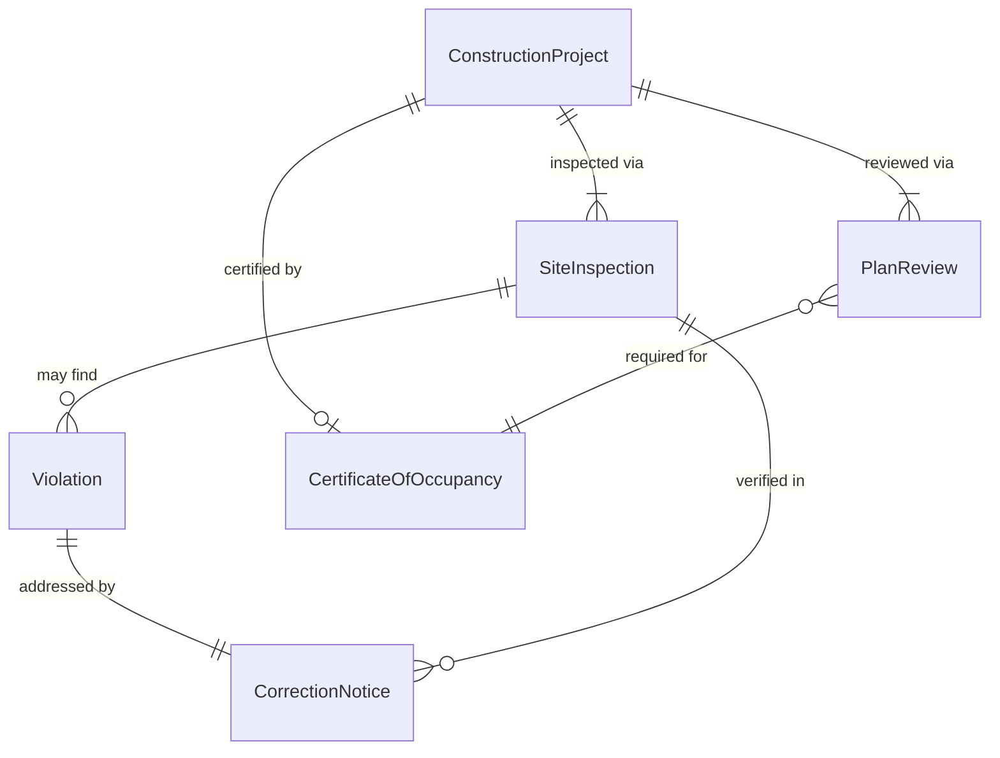
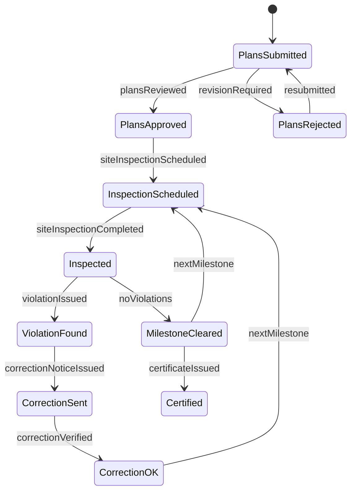
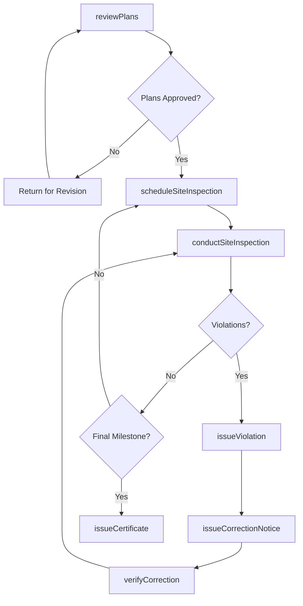
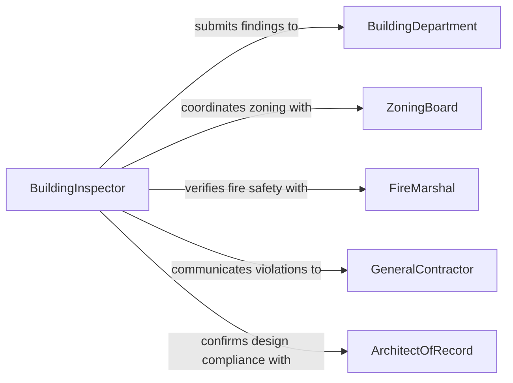

# Evaluate Construction Projects Determine Compliance

> Business-as-Code definition for evaluating construction projects to determine compliance with building codes, zoning regulations, and external construction standards. Covers plan review, site inspections, and certificate of occupancy processes.

## Overview

Construction project compliance evaluation involves reviewing architectural and engineering plans, conducting site inspections at key milestones, and verifying that construction work meets International Building Code (IBC), local zoning ordinances, ADA accessibility requirements, energy codes, and structural engineering standards. This definition provides actions for plan review, milestone inspections, violation tracking, and final compliance certification required for occupancy permits.

## Actors

| Actor | Description |
|-------|-------------|
| BuildingDepartment | Municipal authority that reviews plans and issues building permits |
| ZoningBoard | Local body that enforces land use and zoning regulations |
| FireMarshal | Authority reviewing fire protection and life safety compliance |
| GeneralContractor | Primary construction firm responsible for building the project |
| ArchitectOfRecord | Licensed architect who designed the project and certifies compliance |
| UtilityProvider | Electric, water, or gas company requiring code-compliant connections |

## Roles

| Role | Description |
|------|-------------|
| BuildingInspector | Conducts on-site inspections at construction milestones |
| PlanReviewer | Evaluates construction documents for code compliance |
| ProjectEngineer | Verifies structural and mechanical compliance on the project |
| ComplianceCoordinator | Manages the inspection schedule and violation tracking |
| PermittingSpecialist | Handles permit applications and regulatory submissions |

## Entities

| Entity | Description |
|--------|-------------|
| ConstructionProject | A building or infrastructure project subject to code compliance |
| PlanReview | An evaluation of construction documents against applicable codes |
| SiteInspection | An on-site evaluation of construction work at a milestone |
| Violation | A documented instance where construction fails to meet a code |
| CorrectionNotice | A formal directive to remedy a code violation |
| CertificateOfOccupancy | A final document certifying the project meets all codes |

## Actions

| Action | Description |
|--------|-------------|
| reviewPlans | Evaluate construction documents against building codes and standards |
| scheduleSiteInspection | Plan an on-site inspection for a specific construction milestone |
| conductSiteInspection | Perform an on-site evaluation of construction work |
| issueViolation | Document a construction code violation found during inspection |
| issueCorrectionNotice | Formally direct the contractor to remedy a violation |
| verifyCorrection | Confirm that a violation has been properly corrected |
| issueCertificate | Grant a certificate of occupancy or completion for the project |

## Events

| Event | Description |
|-------|-------------|
| plansReviewed | Construction documents have been evaluated for code compliance |
| siteInspectionScheduled | An on-site inspection has been planned for a milestone |
| siteInspectionCompleted | An on-site evaluation has been finalized with findings |
| violationIssued | A construction code violation has been documented |
| correctionNoticeIssued | A formal correction directive has been sent to the contractor |
| correctionVerified | A violated item has been confirmed as properly corrected |
| certificateIssued | A certificate of occupancy or completion has been granted |

## Searches

| Search | Description |
|--------|-------------|
| findProjects | List construction projects by status, location, or permit type |
| getInspections | Retrieve inspections by project, milestone, or result |
| getViolations | Find violations by severity, code section, or resolution status |
| getProjectCompliance | Retrieve overall compliance status for a construction project |

## Entity Relationships



## State Diagram



## Workflow



## Actor Relationships



## Usage

### Calling Actions

```typescript
import { evaluateConstructionProjectsDetermineCompliance } from '@headlessly/evaluate-construction-projects-determine-compliance'

const construction = evaluateConstructionProjectsDetermineCompliance()

// Review construction plans for code compliance
const review = await construction.reviewPlans({
  projectId: 'PROJ-2026-0088',
  documents: ['architectural-set-v3', 'structural-calculations', 'mep-drawings'],
  codes: ['IBC-2024', 'IECC-2024', 'ADA-2010', 'NFPA-13']
})

// Conduct a framing inspection
const inspection = await construction.conductSiteInspection({
  projectId: 'PROJ-2026-0088',
  milestone: 'rough-framing',
  inspectorId: 'inspector-chen'
})

// Issue a violation for non-compliant work
await construction.issueViolation({
  inspectionId: inspection.id,
  codeSection: 'IBC-2308.4.1',
  description: 'Stud spacing exceeds maximum 16 inches on center in load-bearing wall',
  severity: 'major'
})
```

### Event-Driven Automation

```typescript
// Notify contractor when a correction notice is issued
construction.correctionNoticeIssued(async ({ projectId, violationId, description }) => {
  const project = await construction.findProjects({ id: projectId })
  await notify({
    to: project[0].contractorId,
    message: `Correction required on ${projectId}: ${description}`
  })
})

// Auto-issue certificate when final inspection passes clean
construction.siteInspectionCompleted(async ({ projectId, milestone, violations }) => {
  if (milestone === 'final' && violations.length === 0) {
    await construction.issueCertificate({
      projectId,
      type: 'certificate-of-occupancy'
    })
  }
})
```
