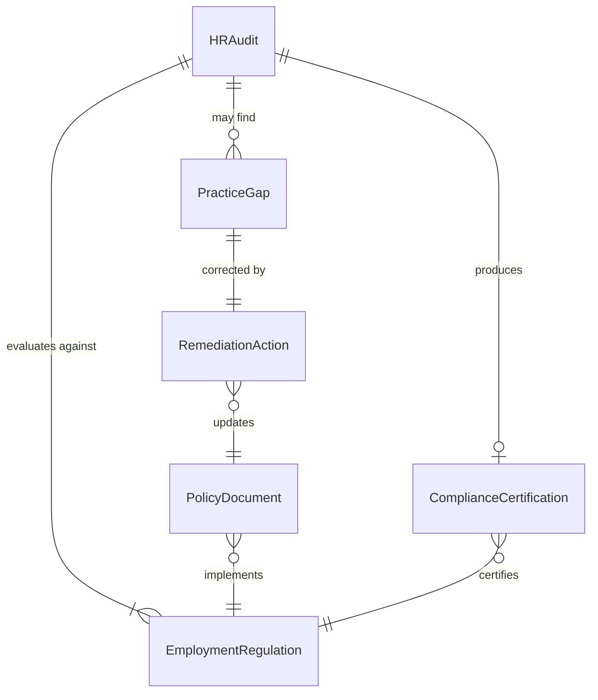
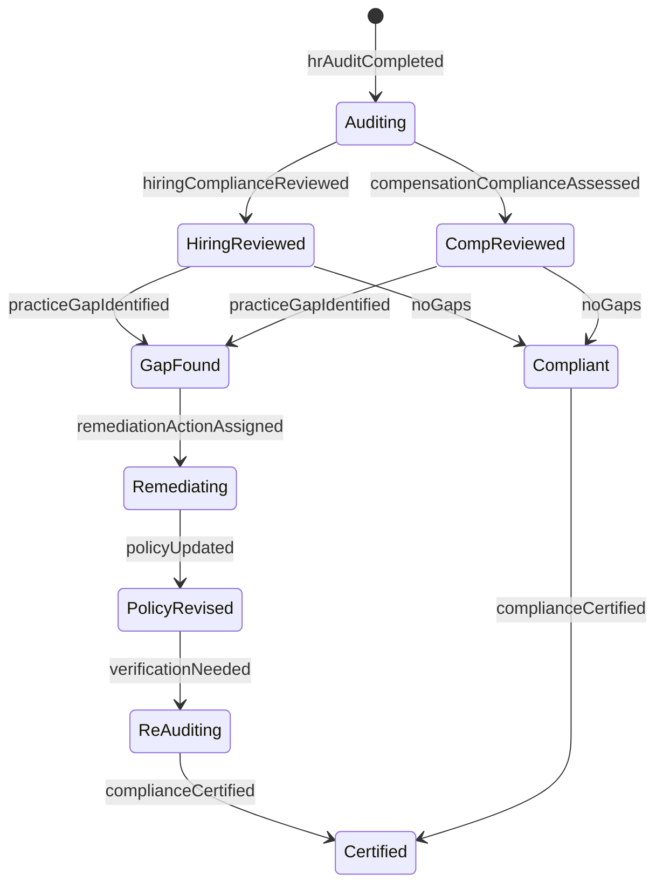
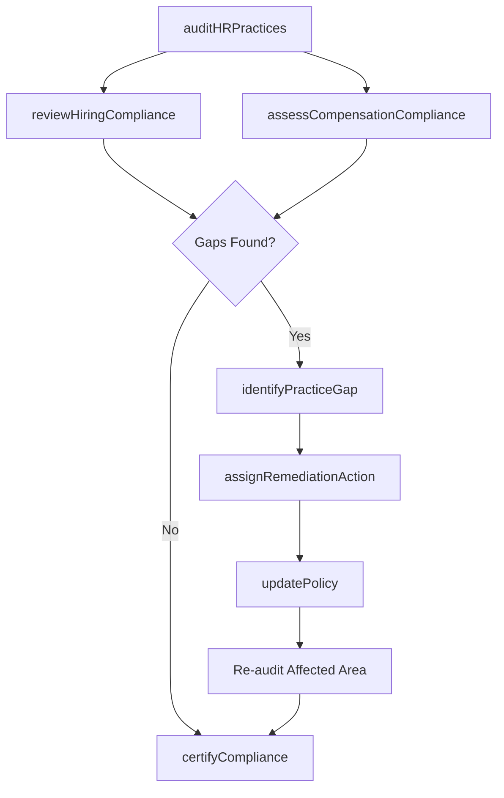
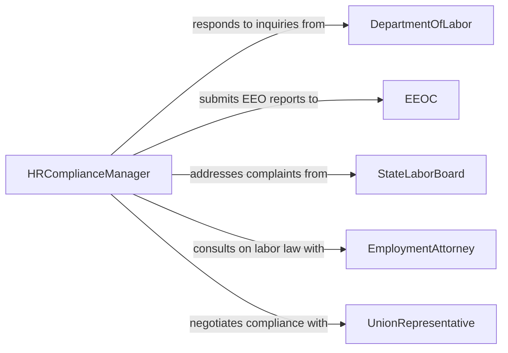

# Evaluate Personnel Practices Ensure Adherence

> Business-as-Code definition for evaluating personnel and HR practices to ensure adherence to employment laws, labor regulations, and organizational policies. Covers hiring, compensation, workplace conduct, and employee relations compliance.

## Overview

Evaluating personnel practices for regulatory adherence involves reviewing hiring procedures, compensation structures, workplace policies, employee classification, benefits administration, and disciplinary processes against applicable labor laws (FLSA, ADA, Title VII, FMLA), EEO requirements, and organizational HR policies. This definition provides actions for auditing HR practices, identifying compliance gaps, tracking corrective actions, and generating compliance reports for leadership and regulatory bodies.

## Actors

| Actor | Description |
|-------|-------------|
| DepartmentOfLabor | Federal agency enforcing wage, hour, and workplace standards |
| EEOC | Equal Employment Opportunity Commission enforcing anti-discrimination laws |
| StateLaborBoard | State agency overseeing local employment law compliance |
| EmploymentAttorney | External legal counsel advising on labor law matters |
| UnionRepresentative | Labor organization representative monitoring collective bargaining compliance |

## Roles

| Role | Description |
|------|-------------|
| HRComplianceManager | Leads the evaluation of personnel practices for regulatory adherence |
| HRDirector | Oversees all human resources functions and policy development |
| CompensationAnalyst | Reviews pay practices for compliance with wage and hour laws |
| RecruitingCompliance Lead | Ensures hiring practices meet EEO and anti-discrimination requirements |
| EmployeeRelationsSpecialist | Evaluates workplace conduct and disciplinary processes |

## Entities

| Entity | Description |
|--------|-------------|
| HRAudit | A structured review of personnel practices against regulations |
| EmploymentRegulation | A specific labor law or rule governing personnel practices |
| PracticeGap | A documented area where personnel practices deviate from requirements |
| PolicyDocument | An organizational HR policy subject to regulatory evaluation |
| RemediationAction | A corrective step to bring personnel practices into compliance |
| ComplianceCertification | A formal attestation that practices meet regulatory requirements |

## Actions

| Action | Description |
|--------|-------------|
| auditHRPractices | Conduct a systematic review of personnel practices against regulations |
| reviewHiringCompliance | Evaluate recruiting and selection processes for legal adherence |
| assessCompensationCompliance | Check pay practices against wage and hour laws |
| identifyPracticeGap | Document an area where personnel practices fail to meet regulations |
| assignRemediationAction | Create a corrective task to address a personnel practice gap |
| updatePolicy | Revise an HR policy to align with current regulatory requirements |
| certifyCompliance | Formally attest that personnel practices meet applicable regulations |

## Events

| Event | Description |
|-------|-------------|
| hrAuditCompleted | A personnel practices review has been finalized |
| hiringComplianceReviewed | Recruiting practices evaluation has been completed |
| compensationComplianceAssessed | Pay practices review has been finalized |
| practiceGapIdentified | A deviation from regulatory requirements has been documented |
| remediationActionAssigned | A corrective task has been created for a practice gap |
| policyUpdated | An HR policy has been revised to meet current regulations |
| complianceCertified | Formal attestation of personnel practice compliance has been completed |

## Searches

| Search | Description |
|--------|-------------|
| findAudits | List HR audits by type, date range, or department |
| getPracticeGaps | Retrieve gaps by regulation, severity, or resolution status |
| getRemediationActions | Find corrective actions by assignee, status, or due date |
| getPolicyHistory | Retrieve revision history for HR policies |

## Entity Relationships



## State Diagram



## Workflow



## Actor Relationships



## Usage

### Calling Actions

```typescript
import { evaluatePersonnelPracticesEnsureAdherence } from '@headlessly/evaluate-personnel-practices-ensure-adherence'

const personnel = evaluatePersonnelPracticesEnsureAdherence()

// Conduct an annual HR practices audit
const audit = await personnel.auditHRPractices({
  scope: ['hiring', 'compensation', 'classification', 'leave-management'],
  regulations: ['FLSA', 'Title-VII', 'ADA', 'FMLA'],
  departments: ['engineering', 'sales', 'operations'],
  period: '2026'
})

// Review hiring compliance specifically
await personnel.reviewHiringCompliance({
  auditId: audit.id,
  sampleSize: 100,
  evaluationCriteria: ['job-posting-language', 'interview-documentation', 'background-check-process']
})

// Identify a practice gap
await personnel.identifyPracticeGap({
  auditId: audit.id,
  regulation: 'FLSA-overtime',
  description: 'Misclassification of 12 employees as exempt who do not meet duties test',
  severity: 'high',
  affectedEmployees: 12
})
```

### Event-Driven Automation

```typescript
// Escalate high-severity practice gaps to legal counsel
personnel.practiceGapIdentified(async ({ regulation, severity, description }) => {
  if (severity === 'high') {
    await notify({
      to: ['hr-director', 'legal-counsel'],
      message: `High-severity HR compliance gap: ${regulation} - ${description}`
    })
  }
})

// Auto-schedule re-audit after policy updates
personnel.policyUpdated(async ({ policyId, affectedRegulations }) => {
  await personnel.auditHRPractices({
    scope: affectedRegulations,
    reason: `Post-policy-update verification for ${policyId}`,
    scheduledDate: '30-days-from-now'
  })
})
```
