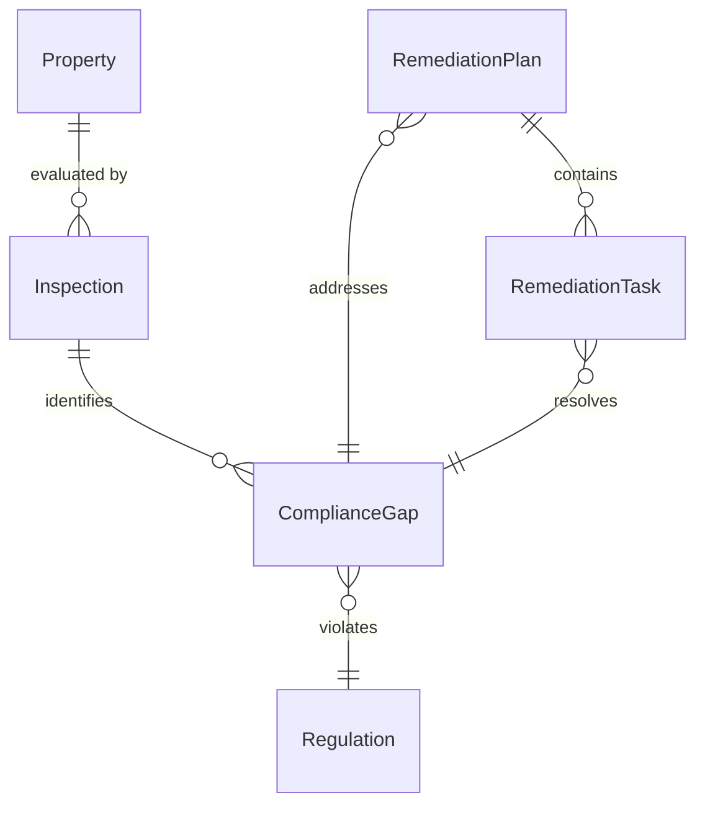
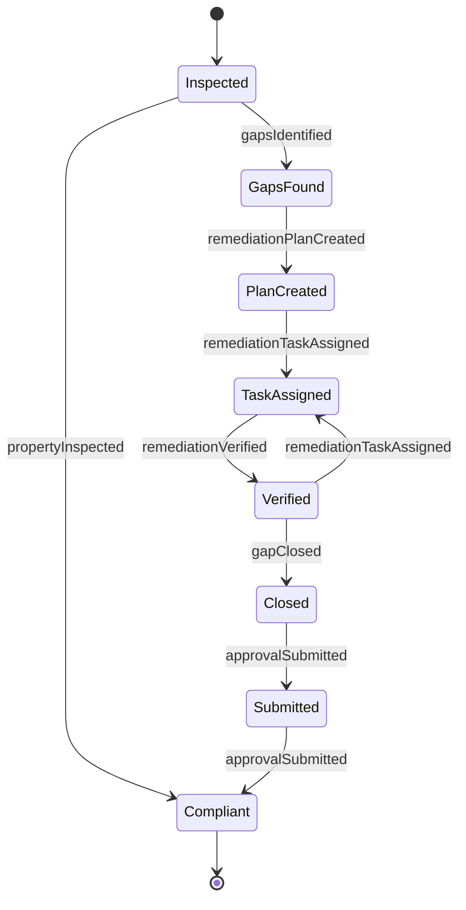
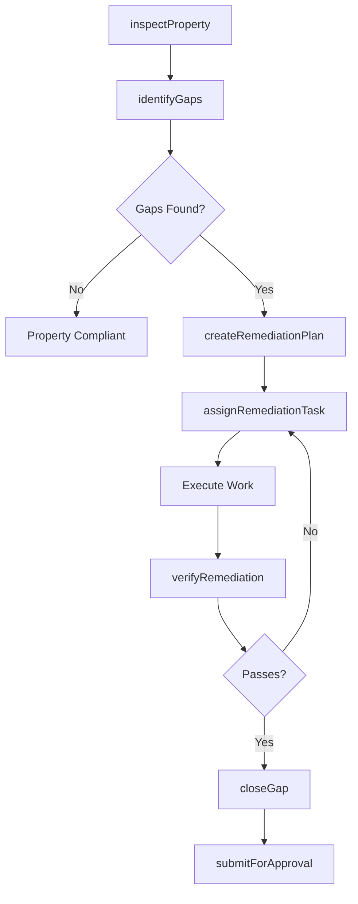
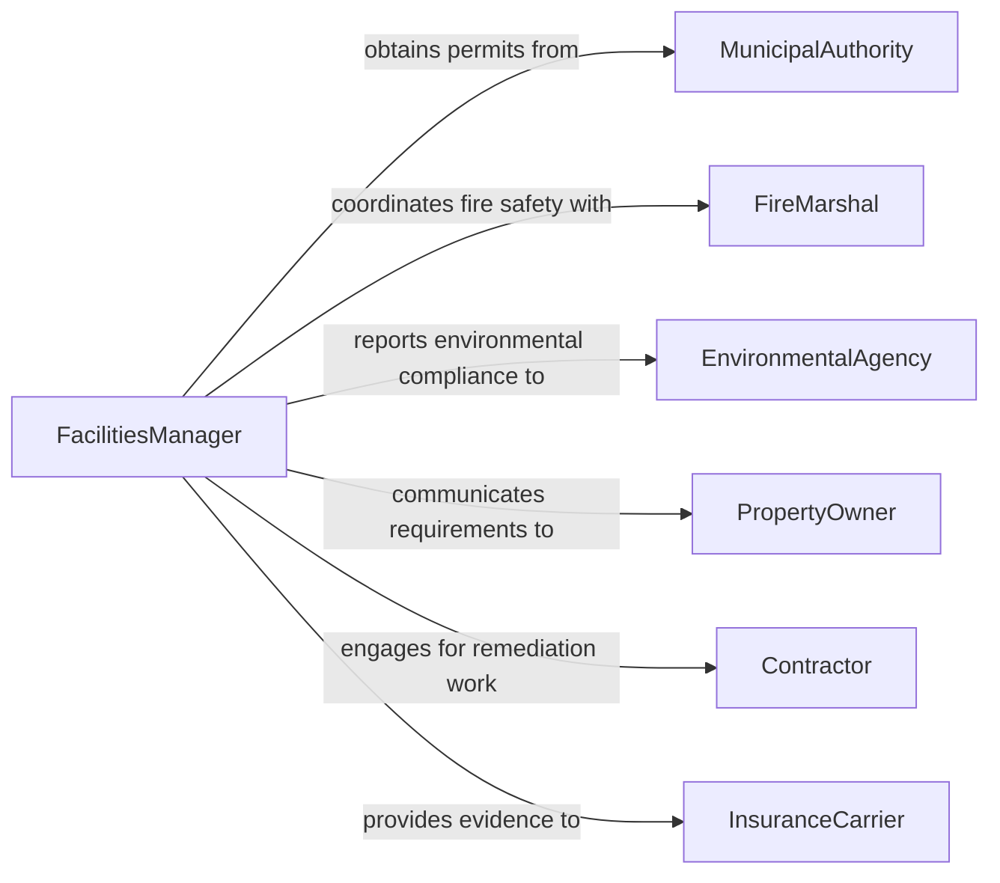

# Identify Actions Needed Bring Properties

> Business-as-Code definition for identifying remediation actions required to bring properties or facilities into regulatory compliance. Covers inspection findings, gap analysis, and corrective action planning for building codes, zoning, and environmental regulations.

## Overview

Identifying compliance remediation actions for properties and facilities involves inspecting physical assets, comparing conditions against applicable building codes, zoning ordinances, environmental regulations, and accessibility standards, then determining the specific corrective steps needed. This definition provides actions for conducting facility assessments, documenting compliance gaps, generating remediation plans, and tracking corrective work through completion.

## Actors

| Actor | Description |
|-------|-------------|
| MunicipalAuthority | Local government body that enforces building codes and zoning |
| FireMarshal | Authority responsible for fire safety code enforcement |
| EnvironmentalAgency | Regulatory body overseeing environmental compliance (e.g., EPA) |
| PropertyOwner | Individual or entity that owns the property or facility |
| Contractor | Licensed professional hired to perform remediation work |
| InsuranceCarrier | Insurer requiring compliance for property coverage |

## Roles

| Role | Description |
|------|-------------|
| FacilitiesManager | Oversees property condition and coordinates compliance efforts |
| ComplianceInspector | Conducts on-site evaluations against regulatory requirements |
| RemediationPlanner | Develops corrective action plans from inspection findings |
| ProjectCoordinator | Manages scheduling and execution of remediation work |
| CodeSpecialist | Interprets building codes and regulatory requirements |

## Entities

| Entity | Description |
|--------|-------------|
| Property | A building, facility, or land parcel subject to regulation |
| Inspection | A formal evaluation of property conditions against codes |
| ComplianceGap | A documented deficiency where a property fails to meet a regulation |
| RemediationPlan | A structured set of actions to resolve identified compliance gaps |
| RemediationTask | An individual corrective action within a remediation plan |
| Regulation | An applicable building code, zoning rule, or environmental law |

## Actions

| Action | Description |
|--------|-------------|
| inspectProperty | Conduct an on-site evaluation of a property against applicable codes |
| identifyGaps | Analyze inspection findings to document specific compliance deficiencies |
| createRemediationPlan | Develop a structured plan to address all identified gaps |
| assignRemediationTask | Assign a specific corrective task to a contractor or team |
| verifyRemediation | Confirm that completed work brings the property into compliance |
| submitForApproval | Send the remediation plan or completed work to the regulatory authority |
| closeGap | Mark a compliance gap as resolved after verification |

## Events

| Event | Description |
|-------|-------------|
| propertyInspected | An on-site property evaluation has been completed |
| gapsIdentified | Compliance deficiencies have been documented from an inspection |
| remediationPlanCreated | A corrective action plan has been developed |
| remediationTaskAssigned | A corrective task has been assigned for execution |
| remediationVerified | Completed remediation work has been confirmed as compliant |
| approvalSubmitted | A plan or completed work has been sent to a regulatory body |
| gapClosed | A compliance deficiency has been fully resolved |

## Searches

| Search | Description |
|--------|-------------|
| findProperties | List properties by compliance status, location, or type |
| getGaps | Retrieve compliance gaps by severity, regulation, or property |
| getRemediationPlans | Find remediation plans by status, property, or due date |
| getTasksByContractor | List remediation tasks assigned to a specific contractor |

## Entity Relationships



## State Diagram



## Workflow



## Actor Relationships



## Usage

### Calling Actions

```typescript
import { identifyActionsNeededBringProperties } from '@headlessly/identify-actions-needed-bring-properties'

const properties = identifyActionsNeededBringProperties()

// Inspect a property against applicable codes
const inspection = await properties.inspectProperty({
  propertyId: 'PROP-2026-0150',
  regulations: ['IBC-2024', 'ADA-2010', 'NFPA-101'],
  inspectorId: 'inspector-garcia'
})

// Identify compliance gaps from the inspection
const gaps = await properties.identifyGaps({
  inspectionId: inspection.id
})

// Create a remediation plan for identified gaps
const plan = await properties.createRemediationPlan({
  propertyId: 'PROP-2026-0150',
  gaps: gaps.map(g => g.id),
  targetCompletionDate: '2026-09-30'
})
```

### Event-Driven Automation

```typescript
// Notify property owner when gaps are identified
properties.gapsIdentified(async ({ propertyId, gapCount, severity }) => {
  const property = await properties.findProperties({ id: propertyId })
  await notify({
    to: property[0].ownerId,
    message: `${gapCount} compliance gaps found, highest severity: ${severity}`
  })
})

// Auto-submit for regulatory approval when all gaps are closed
properties.gapClosed(async ({ remediationPlanId }) => {
  const openGaps = await properties.getGaps({ planId: remediationPlanId, status: 'open' })
  if (openGaps.length === 0) {
    await properties.submitForApproval({ remediationPlanId })
  }
})
```
