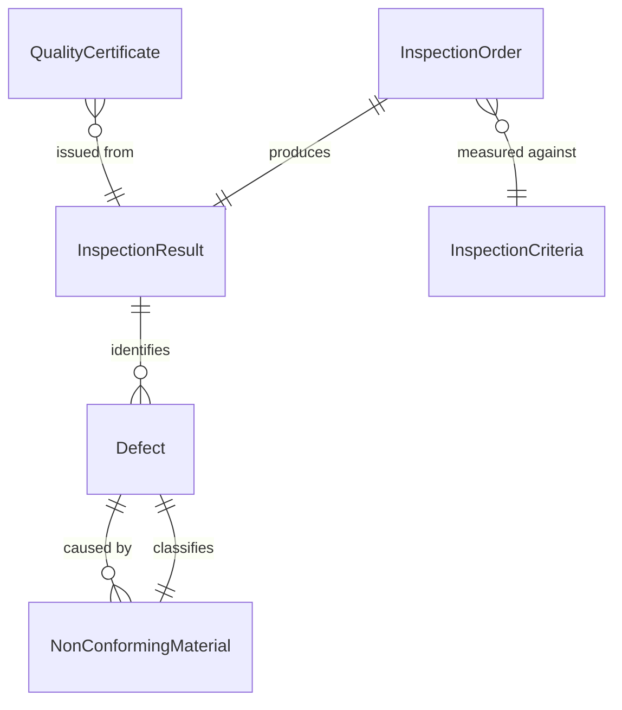
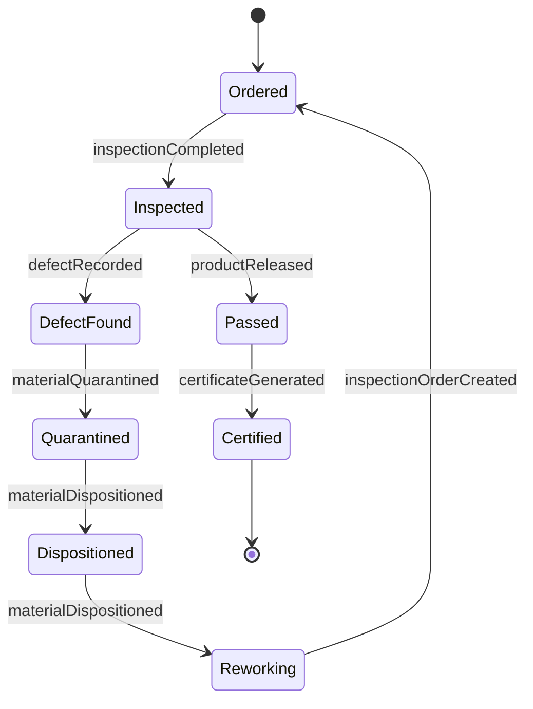
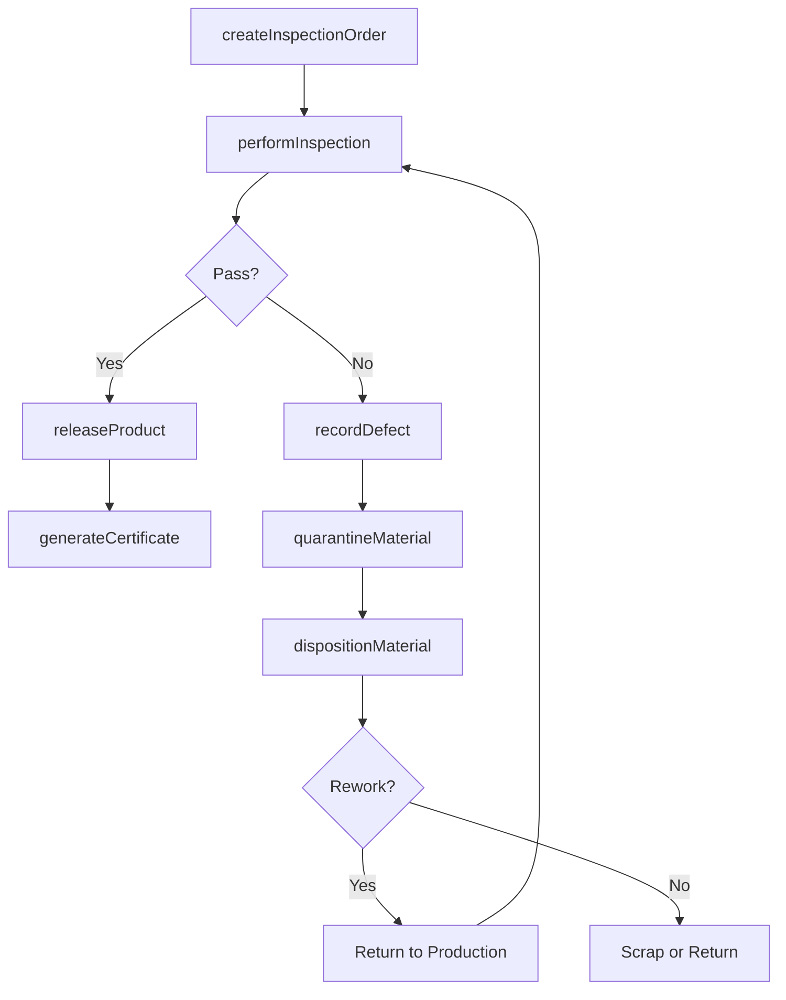
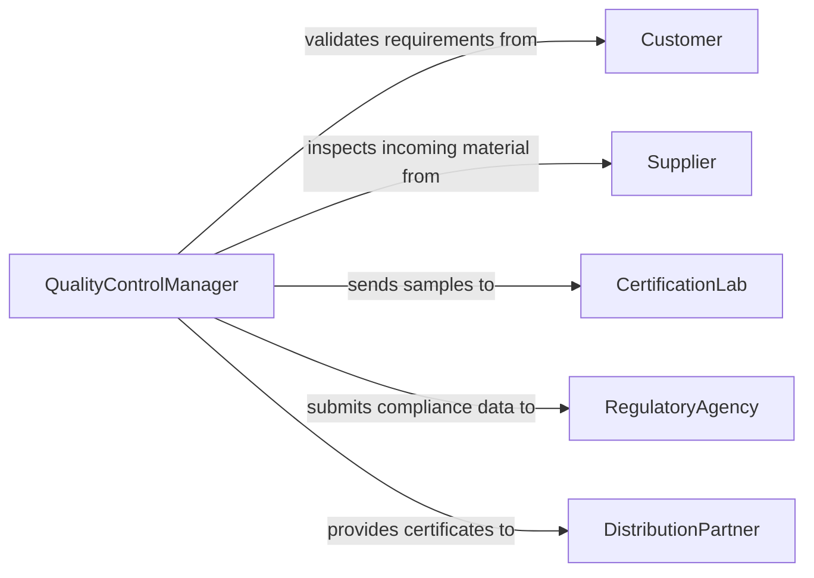

# Inspect Products Operations Ensure Standards

> Business-as-Code definition for inspecting products and production operations to ensure quality standards are met. Covers incoming material inspection, in-process checks, final product verification, and defect management.

## Overview

Product and operations inspection involves examining raw materials, in-process assemblies, and finished goods to verify they meet specified quality standards, customer requirements, and regulatory specifications. This definition provides actions for conducting inspections at each production stage, recording measurements and observations, managing defects and non-conforming material, and generating quality certificates for shipment release.

## Actors

| Actor | Description |
|-------|-------------|
| Customer | End buyer whose specifications and requirements drive quality standards |
| Supplier | Provider of raw materials and components subject to incoming inspection |
| CertificationLab | Third-party laboratory performing independent quality testing |
| RegulatoryAgency | Government body mandating product safety and quality standards |
| DistributionPartner | Logistics partner requiring quality documentation for shipment |

## Roles

| Role | Description |
|------|-------------|
| QualityControlManager | Oversees the inspection program and quality standards |
| InspectionTechnician | Performs physical inspections and measurements on products |
| ProductionSupervisor | Manages the manufacturing line and coordinates inspection holds |
| MetrologySpecialist | Maintains and calibrates measurement instruments used in inspections |
| DispositionAuthority | Makes accept, reject, or rework decisions on non-conforming material |

## Entities

| Entity | Description |
|--------|-------------|
| InspectionOrder | A directive to inspect a specific lot, batch, or production run |
| InspectionResult | The outcome of an inspection including measurements and pass/fail status |
| Defect | A documented non-conformance found during product inspection |
| NonConformingMaterial | Material or product that fails to meet specifications |
| QualityCertificate | A document attesting that a product lot meets quality standards |
| InspectionCriteria | The specifications and tolerances against which products are measured |

## Actions

| Action | Description |
|--------|-------------|
| createInspectionOrder | Schedule an inspection for a specific lot or production stage |
| performInspection | Execute measurements and visual checks against inspection criteria |
| recordDefect | Document a non-conformance found during inspection |
| dispositionMaterial | Decide whether to accept, reject, rework, or scrap non-conforming material |
| releaseProduct | Approve a product lot for shipment after passing inspection |
| generateCertificate | Create a quality certificate for a passing product lot |
| quarantineMaterial | Place non-conforming material on hold pending disposition |

## Events

| Event | Description |
|-------|-------------|
| inspectionOrderCreated | An inspection has been scheduled for a lot or stage |
| inspectionCompleted | An inspection has been performed and results recorded |
| defectRecorded | A product non-conformance has been documented |
| materialDispositioned | A disposition decision has been made on non-conforming material |
| productReleased | A product lot has been approved for shipment |
| certificateGenerated | A quality certificate has been issued for a product lot |
| materialQuarantined | Non-conforming material has been placed on hold |

## Searches

| Search | Description |
|--------|-------------|
| findInspectionOrders | List inspections by product, stage, date range, or status |
| getDefects | Retrieve defects by type, severity, product, or resolution |
| getInspectionResults | Find inspection results by lot, pass/fail status, or criteria |
| getProductQuality | Retrieve quality metrics and trends for a product line |

## Entity Relationships



## State Diagram



## Workflow



## Actor Relationships



## Usage

### Calling Actions

```typescript
import { inspectProductsOperationsEnsureStandards } from '@headlessly/inspect-products-operations-ensure-standards'

const inspection = inspectProductsOperationsEnsureStandards()

// Create an inspection order for a production batch
const order = await inspection.createInspectionOrder({
  productId: 'WIDGET-A-100',
  lotNumber: 'LOT-2026-03-0042',
  stage: 'final-assembly',
  criteria: ['dimensional-tolerance', 'surface-finish', 'functional-test'],
  sampleSize: 32
})

// Perform the inspection
const result = await inspection.performInspection({
  orderId: order.id,
  measurements: [
    { criteria: 'outer-diameter', value: 25.02, unit: 'mm', tolerance: { min: 24.95, max: 25.05 } },
    { criteria: 'surface-roughness', value: 1.2, unit: 'Ra', tolerance: { max: 1.6 } }
  ],
  visualCheck: 'pass'
})

// Release the product lot
await inspection.releaseProduct({
  lotNumber: 'LOT-2026-03-0042',
  inspectionResultId: result.id
})
```

### Event-Driven Automation

```typescript
// Quarantine material automatically on defect detection
inspection.defectRecorded(async ({ lotNumber, defectType, severity }) => {
  await inspection.quarantineMaterial({ lotNumber })
  await notify({
    to: 'quality-control-team',
    message: `Defect found in ${lotNumber}: ${defectType} (${severity})`
  })
})

// Auto-generate certificate when product passes final inspection
inspection.productReleased(async ({ lotNumber, inspectionResultId }) => {
  await inspection.generateCertificate({
    lotNumber,
    inspectionResultId,
    format: 'CoC'
  })
})
```
