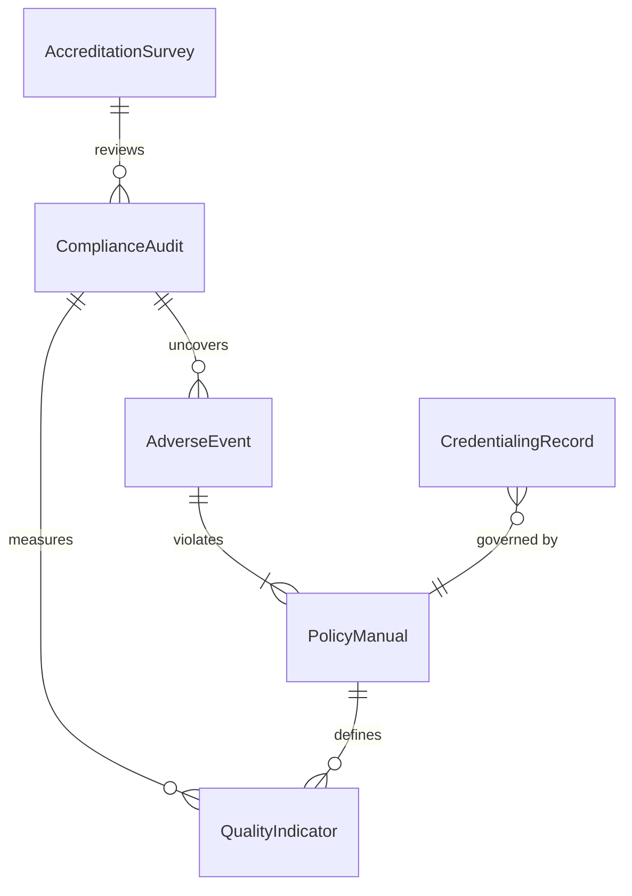
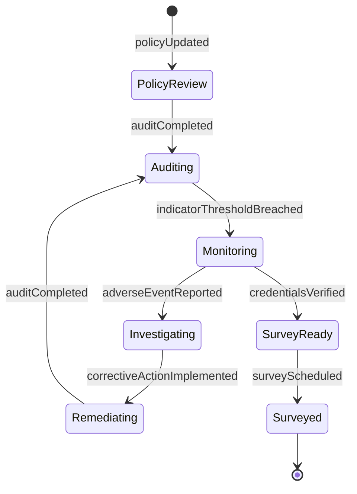
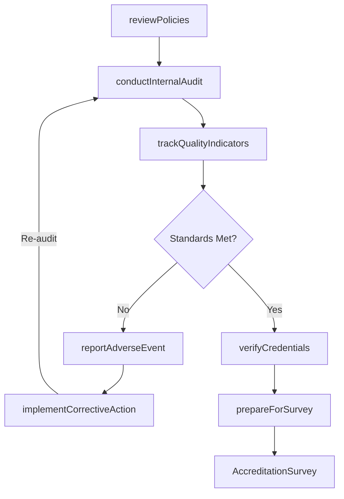
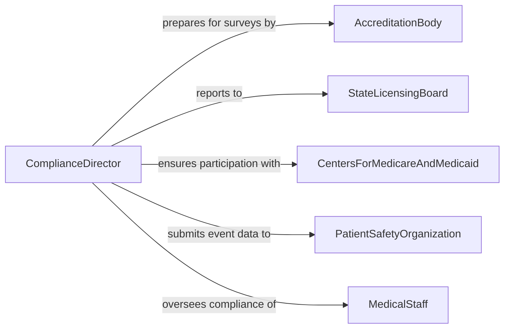

# Monitor Medical Facility Activities Ensure

> Business-as-Code definition for monitoring medical facility activities to ensure adherence to standards or regulations. Models the healthcare compliance lifecycle from regulatory review through audit, corrective action, and accreditation readiness.

## Overview

Medical facility compliance monitoring involves the systematic oversight of clinical operations, patient safety practices, infection control protocols, medication management, staff credentialing, and documentation standards to ensure adherence to healthcare regulations and accreditation requirements. Compliance teams conduct internal audits, track quality indicators, review adverse event reports, and prepare for external surveys by organizations such as The Joint Commission, CMS, and state health departments. The process safeguards patient welfare, maintains accreditation status, and ensures eligibility for reimbursement programs.

## Actors

| Actor | Description |
|-------|-------------|
| AccreditationBody | Organization such as The Joint Commission that surveys and accredits healthcare facilities |
| StateLicensingBoard | Government agency issuing facility operating licenses and conducting inspections |
| CentersForMedicareAndMedicaid | Federal agency setting conditions of participation for reimbursement eligibility |
| PatientSafetyOrganization | External entity receiving and analyzing adverse event data to improve care quality |
| MedicalStaff | Physicians, nurses, and allied health professionals subject to credentialing and practice standards |

## Roles

| Role | Description |
|------|-------------|
| ComplianceDirector | Manages the facility-wide compliance program and reports to executive leadership |
| QualityImprovementCoordinator | Tracks clinical quality metrics and leads performance improvement initiatives |
| InfectionPreventionist | Monitors infection rates, implements control measures, and ensures protocol adherence |
| CredentialingSpecialist | Verifies and maintains medical staff licensure, certifications, and privileging records |

## Entities

| Entity | Description |
|--------|-------------|
| ComplianceAudit | A structured internal review of facility practices against regulatory standards |
| QualityIndicator | A measurable metric such as infection rate, fall rate, or readmission rate |
| AdverseEvent | An incident of patient harm or near-miss requiring documentation and root cause analysis |
| CredentialingRecord | Documentation of a practitioner's licenses, certifications, and clinical privileges |
| PolicyManual | A collection of approved facility policies and procedures aligned to regulatory standards |
| AccreditationSurvey | A formal external evaluation of facility compliance with accreditation standards |

## Actions

| Action | Description |
|--------|-------------|
| conductInternalAudit | Perform a structured review of facility operations against regulatory standards |
| trackQualityIndicators | Collect and trend clinical performance metrics across departments |
| reportAdverseEvent | Document and analyze a patient safety incident with root cause findings |
| verifyCredentials | Confirm the current licensure, certifications, and privileges of medical staff |
| reviewPolicies | Evaluate facility policies for alignment with current regulatory requirements |
| prepareForSurvey | Organize documentation and staff readiness for an external accreditation visit |
| implementCorrectiveAction | Execute changes to address findings from audits, surveys, or adverse events |

## Events

| Event | Description |
|-------|-------------|
| auditCompleted | An internal compliance audit has been finished and findings documented |
| indicatorThresholdBreached | A quality metric has fallen outside acceptable performance ranges |
| adverseEventReported | A patient safety incident has been formally documented and submitted |
| credentialsVerified | A practitioner's licensure and privileges have been confirmed as current |
| policyUpdated | A facility policy has been revised to reflect current regulatory requirements |
| surveyScheduled | An external accreditation survey date has been confirmed |
| correctiveActionImplemented | A remediation change has been put into practice and verified |

## Searches

| Search | Description |
|--------|-------------|
| findOpenFindings | Retrieve unresolved audit or survey findings by department or standard |
| getQualityTrends | List quality indicator values over time for a specific metric or department |
| getCredentialingStatus | Look up medical staff credentialing records by status or expiration date |
| findAdverseEvents | Search adverse event reports by type, department, or severity |

## Entity Relationships



## State Diagram



## Workflow



## Actor Relationships



## Usage

### Calling Actions

```typescript
import { monitorMedicalFacilityActivitiesEnsure } from '@headlessly/monitor-medical-facility-activities-ensure'

const facility = monitorMedicalFacilityActivitiesEnsure()

// Conduct an internal audit of infection control practices
const audit = await facility.conductInternalAudit({
  department: 'surgical-services',
  standards: ['IC.01.01', 'IC.02.01', 'IC.02.02'],
  auditType: 'infection-control',
  auditorId: 'ip-nurse-014'
})

// Track quality indicators for the current quarter
await facility.trackQualityIndicators({
  department: 'surgical-services',
  period: '2026-Q1',
  indicators: [
    { name: 'surgical-site-infection-rate', value: 1.8, benchmark: 2.0 },
    { name: 'hand-hygiene-compliance', value: 92, benchmark: 95 },
    { name: 'central-line-infection-rate', value: 0.5, benchmark: 1.0 }
  ]
})

// Report an adverse event
await facility.reportAdverseEvent({
  department: 'surgical-services',
  eventType: 'medication-error',
  severity: 'moderate',
  description: 'Wrong dose of prophylactic antibiotic administered pre-operatively',
  patientHarm: 'no-harm-reached-patient',
  rootCauseAnalysis: 'pending'
})
```

### Event-Driven Automation

```typescript
// Alert quality team when indicator breaches threshold
facility.indicatorThresholdBreached(async ({ department, indicator, value, benchmark }) => {
  await notify({
    to: 'quality-improvement-coordinator',
    message: `${indicator} in ${department} at ${value}%, below benchmark of ${benchmark}%. Improvement plan required.`
  })
})

// Auto-trigger credential review before expiration
facility.credentialsVerified(async ({ practitionerId, expirationDate }) => {
  const daysUntilExpiry = daysBetween(new Date(), new Date(expirationDate))
  if (daysUntilExpiry <= 90) {
    await notify({
      to: 'credentialing-specialist',
      message: `Credentials for practitioner ${practitionerId} expire in ${daysUntilExpiry} days. Renewal process required.`
    })
  }
})
```
