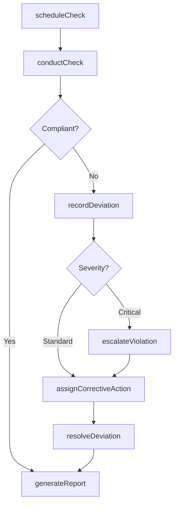
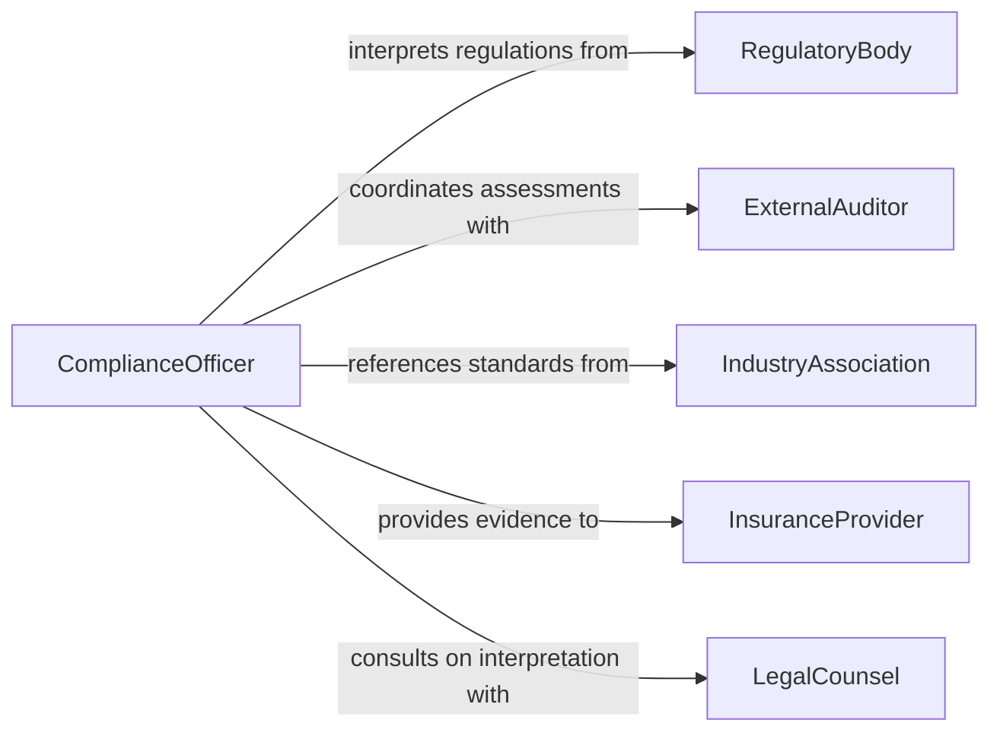

# Monitor Operational Activities Ensure Compliance

> Business-as-Code definition for monitoring operational activities against regulations and standard operating procedures. Tracks compliance status across business units and triggers corrective actions when deviations are detected.

## Overview

Operational compliance monitoring involves systematically observing, measuring, and evaluating day-to-day business activities to ensure they conform to applicable regulations, internal policies, and standard operating procedures. This definition provides actions for scheduling and conducting compliance checks, events for automated escalation workflows, and searches for retrieving compliance status across the organization.

## Actors

| Actor | Description |
|-------|-------------|
| RegulatoryBody | Government or industry authority that issues and enforces regulations |
| ExternalAuditor | Independent party conducting compliance assessments |
| IndustryAssociation | Trade group that publishes operational standards and best practices |
| InsuranceProvider | Underwriter requiring proof of regulatory compliance for coverage |
| LegalCounsel | External attorneys advising on regulatory interpretation |

## Roles

| Role | Description |
|------|-------------|
| ComplianceOfficer | Oversees the compliance monitoring program and reporting |
| OperationsManager | Manages day-to-day activities subject to compliance requirements |
| InternalAuditor | Conducts scheduled and ad-hoc compliance reviews |
| ComplianceAnalyst | Analyzes operational data for compliance gaps |
| ProcessOwner | Accountable for adherence within a specific operational area |

## Entities

| Entity | Description |
|--------|-------------|
| ComplianceCheck | A scheduled or ad-hoc evaluation of operational activities |
| Regulation | An external rule or law that governs operational behavior |
| StandardOperatingProcedure | An internal documented process that personnel must follow |
| Deviation | A recorded instance where activity diverges from requirements |
| CorrectiveAction | A remediation step assigned to resolve a deviation |
| ComplianceReport | A summary document of findings from monitoring activities |

## Actions

| Action | Description |
|--------|-------------|
| scheduleCheck | Plan a compliance check for a specific operation and timeframe |
| conductCheck | Execute a compliance evaluation against applicable regulations |
| recordDeviation | Log an identified deviation from a regulation or procedure |
| assignCorrectiveAction | Create and assign a remediation task for a deviation |
| resolveDeviation | Mark a deviation as resolved after corrective action is verified |
| generateReport | Produce a compliance report for a given period or business unit |
| escalateViolation | Elevate a serious or recurring violation to senior leadership |

## Events

| Event | Description |
|-------|-------------|
| checkScheduled | A compliance check has been planned and assigned |
| checkCompleted | A compliance evaluation has finished with findings recorded |
| deviationRecorded | A non-compliance instance has been identified and logged |
| correctiveActionAssigned | A remediation task has been created for a deviation |
| deviationResolved | A deviation has been verified as corrected |
| violationEscalated | A critical violation has been raised to senior leadership |
| reportGenerated | A compliance summary report has been produced |

## Searches

| Search | Description |
|--------|-------------|
| findChecks | List compliance checks by status, date range, or business unit |
| getDeviations | Retrieve deviations filtered by severity, regulation, or status |
| getCorrectiveActions | Find corrective actions by assignee, due date, or completion status |
| getComplianceStatus | Retrieve overall compliance posture for a unit or regulation |

## Workflow



## Actor Relationships



## Usage

### Calling Actions

```typescript
import { monitorOperationalActivitiesEnsureCompliance } from '@headlessly/monitor-operational-activities-ensure-compliance'

const compliance = monitorOperationalActivitiesEnsureCompliance()

// Schedule a quarterly compliance check
const check = await compliance.scheduleCheck({
  operation: 'warehouse-fulfillment',
  regulations: ['OSHA-1910', 'EPA-RCRA'],
  scheduledDate: '2026-04-01',
  assignedTo: 'internal-audit-team'
})

// Record a deviation found during the check
await compliance.recordDeviation({
  checkId: check.id,
  regulation: 'OSHA-1910.178',
  description: 'Forklift operators missing current certification',
  severity: 'high'
})

// Assign corrective action
await compliance.assignCorrectiveAction({
  deviationId: 'DEV-2026-0042',
  assignee: 'operations-manager',
  action: 'Schedule recertification training for all forklift operators',
  dueDate: '2026-04-15'
})
```

### Event-Driven Automation

```typescript
// Escalate critical deviations automatically
compliance.deviationRecorded(async ({ deviationId, severity, regulation }) => {
  if (severity === 'critical') {
    await compliance.escalateViolation({
      deviationId,
      notifyRoles: ['ComplianceOfficer', 'ExecutiveLeadership'],
      regulation
    })
  }
})

// Auto-generate report when all deviations in a check are resolved
compliance.deviationResolved(async ({ checkId }) => {
  const openDeviations = await compliance.getDeviations({ checkId, status: 'open' })
  if (openDeviations.length === 0) {
    await compliance.generateReport({ checkId })
  }
})
```
