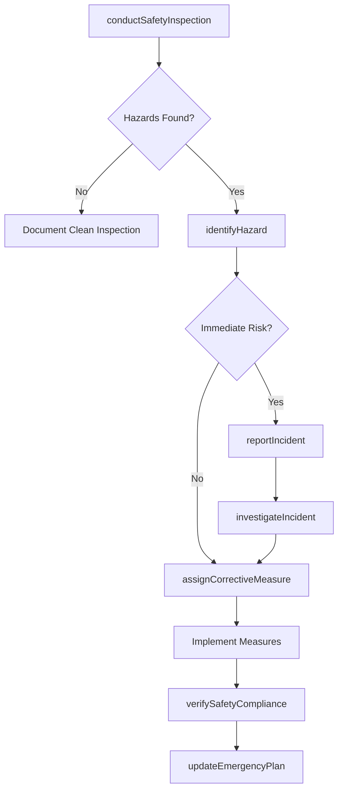
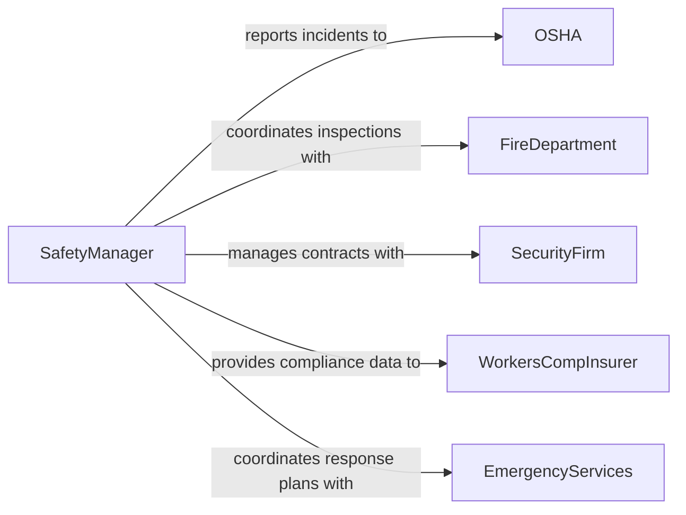

# Monitor Operations Ensure Compliance Safety

> Business-as-Code definition for monitoring operations to ensure compliance with safety and security policies and regulations. Covers workplace safety inspections, security protocol adherence, incident tracking, and OSHA/fire code enforcement.

## Overview

Safety and security compliance monitoring involves systematically observing workplace operations, physical environments, and personnel practices to verify adherence to safety regulations (OSHA, NFPA), security policies, and organizational safety programs. This definition exposes actions for conducting safety walkthroughs, documenting hazards, managing incident investigations, and tracking corrective measures to maintain a safe and secure operational environment.

## Actors

| Actor | Description |
|-------|-------------|
| OSHA | Occupational Safety and Health Administration enforcing workplace safety |
| FireDepartment | Local fire authority conducting inspections and enforcing fire codes |
| SecurityFirm | External provider of security personnel and systems |
| WorkersCompInsurer | Insurance carrier requiring safety compliance for coverage |
| EmergencyServices | First responders coordinating with facility safety programs |

## Roles

| Role | Description |
|------|-------------|
| SafetyManager | Oversees the workplace safety program and regulatory compliance |
| SecurityDirector | Manages physical and operational security policies |
| SafetyInspector | Conducts workplace walkthroughs and hazard assessments |
| IncidentInvestigator | Investigates safety or security incidents to determine root cause |
| EmergencyCoordinator | Manages emergency response plans and evacuation procedures |

## Entities

| Entity | Description |
|--------|-------------|
| SafetyInspection | A scheduled walkthrough evaluating safety and security conditions |
| Hazard | An identified condition posing risk to personnel or property |
| Incident | A safety or security event requiring investigation and reporting |
| SafetyPolicy | An internal policy governing safe work practices |
| CorrectiveMeasure | An action taken to eliminate or mitigate a hazard |
| TrainingRecord | Documentation of employee safety and security training completion |

## Actions

| Action | Description |
|--------|-------------|
| conductSafetyInspection | Perform a walkthrough to evaluate safety and security conditions |
| identifyHazard | Document a hazard or security vulnerability found during inspection |
| reportIncident | Record a safety or security incident with initial details |
| investigateIncident | Conduct a root cause analysis of a safety or security event |
| assignCorrectiveMeasure | Create and assign an action to address a hazard or incident finding |
| verifySafetyCompliance | Confirm that corrective measures restore compliance |
| updateEmergencyPlan | Revise emergency response procedures based on findings |

## Events

| Event | Description |
|-------|-------------|
| safetyInspectionCompleted | A safety walkthrough has been finalized with findings |
| hazardIdentified | A safety or security hazard has been documented |
| incidentReported | A safety or security event has been recorded |
| incidentInvestigated | A root cause analysis has been completed |
| correctiveMeasureAssigned | A remediation action has been created for a hazard |
| safetyComplianceVerified | Corrective measures have been confirmed effective |
| emergencyPlanUpdated | Emergency response procedures have been revised |

## Searches

| Search | Description |
|--------|-------------|
| findInspections | List safety inspections by location, date range, or status |
| getHazards | Retrieve hazards by severity, location, or resolution status |
| getIncidents | Find incidents by type, date range, or investigation status |
| getTrainingStatus | Retrieve employee safety training completion records |

## Workflow



## Actor Relationships



## Usage

### Calling Actions

```typescript
import { monitorOperationsEnsureComplianceSafety } from '@headlessly/monitor-operations-ensure-compliance-safety'

const safety = monitorOperationsEnsureComplianceSafety()

// Conduct a monthly safety inspection
const inspection = await safety.conductSafetyInspection({
  location: 'manufacturing-floor-B',
  standards: ['OSHA-1910.147', 'NFPA-70E'],
  inspectorId: 'inspector-williams'
})

// Identify a hazard
await safety.identifyHazard({
  inspectionId: inspection.id,
  description: 'Lockout/tagout procedure not followed on conveyor maintenance',
  severity: 'high',
  location: 'conveyor-line-3'
})

// Report and investigate a safety incident
const incident = await safety.reportIncident({
  type: 'near-miss',
  description: 'Employee nearly contacted energized equipment during maintenance',
  location: 'manufacturing-floor-B',
  dateOccurred: '2026-03-15'
})
```

### Event-Driven Automation

```typescript
// Immediately halt operations for critical hazards
safety.hazardIdentified(async ({ severity, location, description }) => {
  if (severity === 'critical') {
    await safety.reportIncident({
      type: 'imminent-danger',
      location,
      description
    })
    await notify({
      to: ['safety-manager', 'operations-director'],
      message: `CRITICAL: Imminent danger at ${location} - operations halted`
    })
  }
})

// Schedule retraining after incident investigation
safety.incidentInvestigated(async ({ incidentId, rootCause, affectedArea }) => {
  if (rootCause.includes('training-gap')) {
    await scheduleTraining({
      area: affectedArea,
      topic: 'safety-procedure-refresher',
      dueDate: '14-days-from-now'
    })
  }
})
```
