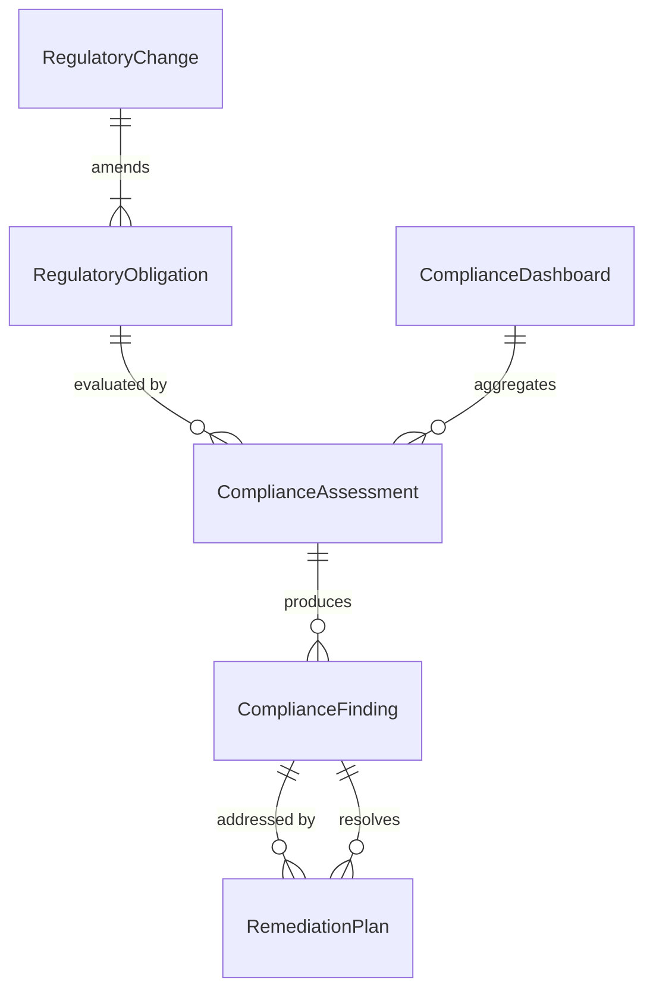
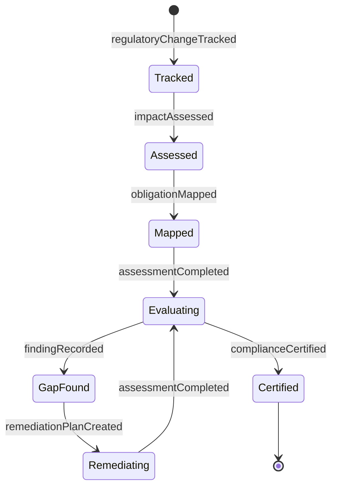
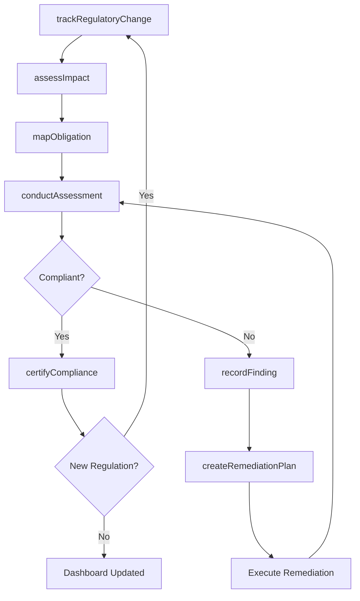
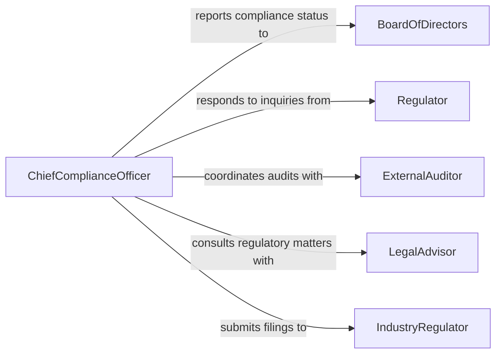

# Monitor Organizational Compliance Regulations

> Business-as-Code definition for monitoring enterprise-wide compliance with laws, regulations, and industry mandates. Tracks regulatory obligations across departments, manages compliance assessments, and provides a centralized compliance posture view.

## Overview

Organizational compliance monitoring involves establishing a comprehensive framework to track and assess adherence to all applicable laws, regulations, and industry mandates across the enterprise. This definition provides actions for mapping regulatory obligations, conducting compliance assessments, managing findings and remediation, and producing executive-level compliance dashboards. It covers regulations spanning data privacy (GDPR, CCPA), financial reporting (SOX), anti-corruption (FCPA), and sector-specific mandates.

## Actors

| Actor | Description |
|-------|-------------|
| Regulator | Government agency that issues and enforces compliance requirements |
| ExternalAuditor | Independent auditor conducting compliance examinations |
| BoardOfDirectors | Governing body requiring compliance assurance reporting |
| LegalAdvisor | External counsel advising on regulatory interpretation and risk |
| IndustryRegulator | Sector-specific authority overseeing compliance obligations |

## Roles

| Role | Description |
|------|-------------|
| ChiefComplianceOfficer | Leads the enterprise compliance program and strategy |
| ComplianceManager | Manages day-to-day compliance monitoring across business units |
| RegulatoryAnalyst | Tracks regulatory changes and assesses organizational impact |
| ComplianceCoordinator | Coordinates compliance activities within a specific department |
| RiskOfficer | Evaluates compliance-related risks and mitigation strategies |

## Entities

| Entity | Description |
|--------|-------------|
| RegulatoryObligation | A specific legal or regulatory requirement applicable to the organization |
| ComplianceAssessment | A structured evaluation of organizational adherence to obligations |
| ComplianceFinding | A documented gap or weakness identified during an assessment |
| RemediationPlan | A set of actions to resolve compliance findings |
| ComplianceDashboard | An aggregate view of compliance posture across the organization |
| RegulatoryChange | A new or amended regulation that affects organizational obligations |

## Actions

| Action | Description |
|--------|-------------|
| mapObligation | Register a regulatory requirement and assign it to responsible units |
| conductAssessment | Execute a compliance evaluation across one or more business units |
| recordFinding | Document a compliance gap discovered during an assessment |
| createRemediationPlan | Develop a plan to address one or more compliance findings |
| trackRegulatoryChange | Monitor and record a new or amended regulation |
| assessImpact | Evaluate how a regulatory change affects the organization |
| certifyCompliance | Formally attest to compliance status for a regulation or period |

## Events

| Event | Description |
|-------|-------------|
| obligationMapped | A regulatory requirement has been registered and assigned |
| assessmentCompleted | A compliance evaluation has been finalized with findings |
| findingRecorded | A compliance gap has been documented |
| remediationPlanCreated | A corrective plan has been established for findings |
| regulatoryChangeTracked | A new or amended regulation has been recorded |
| impactAssessed | The organizational impact of a regulatory change has been evaluated |
| complianceCertified | Formal compliance attestation has been completed |

## Searches

| Search | Description |
|--------|-------------|
| findObligations | List regulatory obligations by jurisdiction, domain, or business unit |
| getAssessments | Retrieve assessments by status, date range, or regulation |
| getFindings | Find compliance findings by severity, status, or responsible unit |
| getCompliancePosture | Retrieve aggregate compliance status across the organization |

## Entity Relationships



## State Diagram



## Workflow



## Actor Relationships



## Usage

### Calling Actions

```typescript
import { monitorOrganizationalComplianceRegulations } from '@headlessly/monitor-organizational-compliance-regulations'

const compliance = monitorOrganizationalComplianceRegulations()

// Track a new regulatory change
await compliance.trackRegulatoryChange({
  regulation: 'EU AI Act 2024',
  effectiveDate: '2026-08-01',
  jurisdiction: 'EU',
  summary: 'Requirements for high-risk AI systems classification and governance'
})

// Conduct an enterprise-wide compliance assessment
const assessment = await compliance.conductAssessment({
  scope: ['data-privacy', 'financial-reporting', 'anti-corruption'],
  businessUnits: ['sales', 'engineering', 'finance'],
  period: '2026-H1'
})

// Map a regulatory obligation to responsible units
await compliance.mapObligation({
  regulation: 'GDPR-Article-30',
  description: 'Maintain records of processing activities',
  responsibleUnits: ['legal', 'engineering', 'marketing'],
  reviewFrequency: 'quarterly'
})
```

### Event-Driven Automation

```typescript
// Alert leadership when a new regulation impacts the organization
compliance.impactAssessed(async ({ regulation, impactLevel, affectedUnits }) => {
  if (impactLevel === 'high') {
    await notify({
      to: 'executive-leadership',
      message: `High-impact regulation: ${regulation} affects ${affectedUnits.join(', ')}`
    })
  }
})

// Schedule follow-up assessment after remediation plan is created
compliance.remediationPlanCreated(async ({ planId, targetDate, obligationId }) => {
  await compliance.conductAssessment({
    scope: [obligationId],
    scheduledDate: targetDate,
    reason: `Follow-up for remediation plan ${planId}`
  })
})
```
