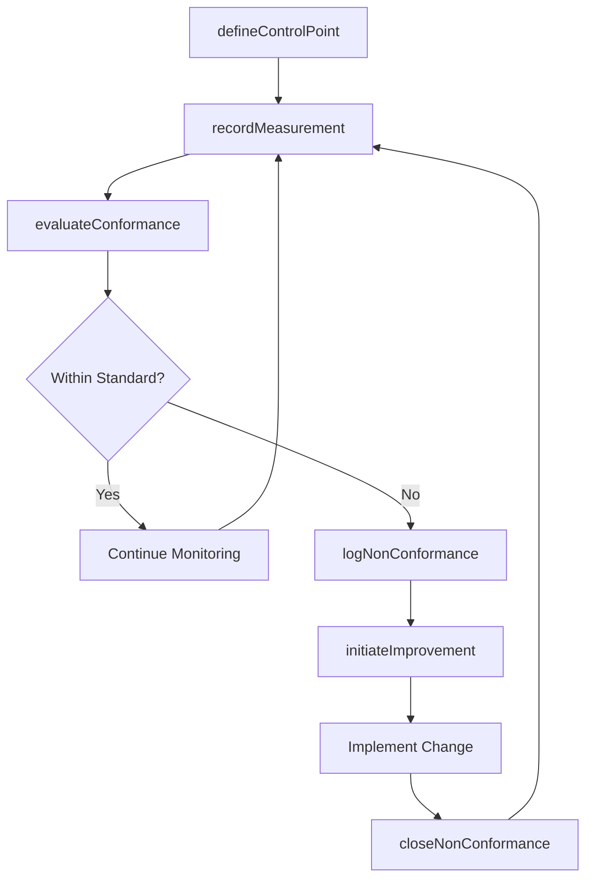
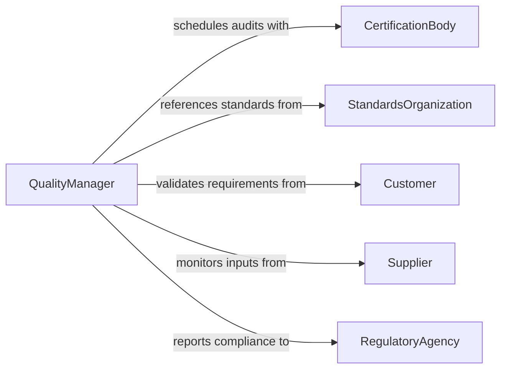

# Monitor Processes Compliance Standards

> Business-as-Code definition for monitoring business and manufacturing processes against quality and industry standards. Tracks process conformance, captures deviations, and drives continuous improvement cycles.

## Overview

Process compliance monitoring involves systematically observing and measuring operational processes to verify they meet defined quality standards such as ISO 9001, Six Sigma, or industry-specific benchmarks. This definition exposes actions for configuring process checks, recording measurements, and managing non-conformances, along with events for triggering automated quality workflows and searches for process performance analytics.

## Actors

| Actor | Description |
|-------|-------------|
| CertificationBody | External organization that certifies process compliance (e.g., ISO registrar) |
| StandardsOrganization | Body that publishes and maintains process standards (e.g., ISO, ASTM) |
| Customer | Downstream consumer whose requirements drive process standards |
| Supplier | Upstream provider whose processes affect input quality |
| RegulatoryAgency | Government entity mandating process controls in regulated industries |

## Roles

| Role | Description |
|------|-------------|
| QualityManager | Oversees the process monitoring program and standard adherence |
| ProcessEngineer | Designs and maintains process controls and measurement points |
| QualityInspector | Conducts on-the-ground process observations and measurements |
| ContinuousImprovementLead | Analyzes process data to identify improvement opportunities |
| DocumentController | Manages process documentation and standard revisions |

## Entities

| Entity | Description |
|--------|-------------|
| Process | A defined sequence of operations subject to standards compliance |
| Standard | A published specification or benchmark the process must meet |
| ControlPoint | A specific measurement or checkpoint within a process |
| Measurement | A recorded value captured at a control point |
| NonConformance | A documented instance where a process fails to meet a standard |
| ImprovementAction | A planned change to bring a process back into compliance |

## Actions

| Action | Description |
|--------|-------------|
| defineControlPoint | Establish a measurement checkpoint within a process |
| recordMeasurement | Capture a value or observation at a control point |
| evaluateConformance | Compare measurements against standard thresholds |
| logNonConformance | Record a process deviation from an applicable standard |
| initiateImprovement | Create an improvement action to address a non-conformance |
| closeNonConformance | Mark a non-conformance as resolved after verification |
| auditProcess | Conduct a formal review of a process against its standards |

## Events

| Event | Description |
|-------|-------------|
| controlPointDefined | A new measurement checkpoint has been established |
| measurementRecorded | A process measurement has been captured |
| conformanceEvaluated | A process has been assessed against its applicable standards |
| nonConformanceLogged | A process deviation has been documented |
| improvementInitiated | A corrective or preventive action has been created |
| nonConformanceClosed | A process deviation has been verified as resolved |
| processAudited | A formal process audit has been completed |

## Searches

| Search | Description |
|--------|-------------|
| findProcesses | List processes by standard, status, or department |
| getMeasurements | Retrieve measurements by control point, date range, or process |
| getNonConformances | Find non-conformances by severity, standard, or resolution status |
| getProcessPerformance | Retrieve compliance trend data for a process over time |

## Workflow



## Actor Relationships



## Usage

### Calling Actions

```typescript
import { monitorProcessesComplianceStandards } from '@headlessly/monitor-processes-compliance-standards'

const processes = monitorProcessesComplianceStandards()

// Define a control point for a manufacturing process
const controlPoint = await processes.defineControlPoint({
  processId: 'PROC-ASSEMBLY-001',
  name: 'Torque Verification',
  standard: 'ISO-9001-7.1.5',
  threshold: { min: 45, max: 55, unit: 'Nm' }
})

// Record a measurement
await processes.recordMeasurement({
  controlPointId: controlPoint.id,
  value: 52.3,
  unit: 'Nm',
  measuredBy: 'inspector-jones'
})

// Evaluate process conformance
const result = await processes.evaluateConformance({
  processId: 'PROC-ASSEMBLY-001',
  period: '2026-Q1'
})
```

### Event-Driven Automation

```typescript
// Alert when a measurement falls outside standard thresholds
processes.nonConformanceLogged(async ({ processId, controlPointId, severity }) => {
  if (severity === 'major') {
    await notify({
      to: 'quality-team',
      message: `Major non-conformance on process ${processId} at ${controlPointId}`
    })
  }
})

// Trigger re-audit after improvement action completion
processes.nonConformanceClosed(async ({ processId }) => {
  await processes.auditProcess({
    processId,
    scope: 'targeted',
    reason: 'post-improvement-verification'
  })
})
```
