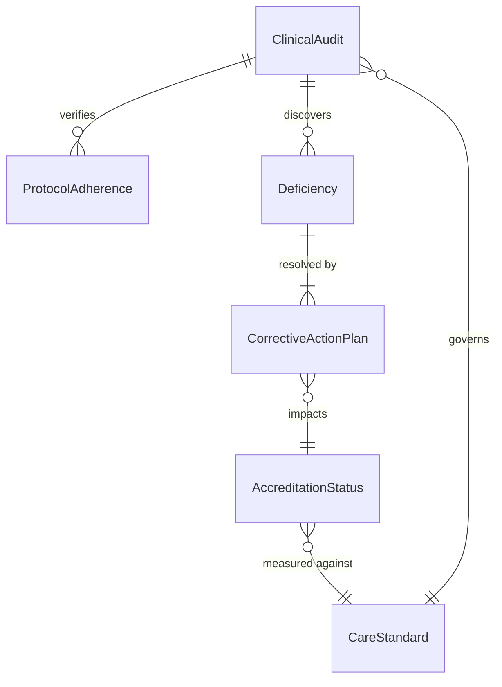
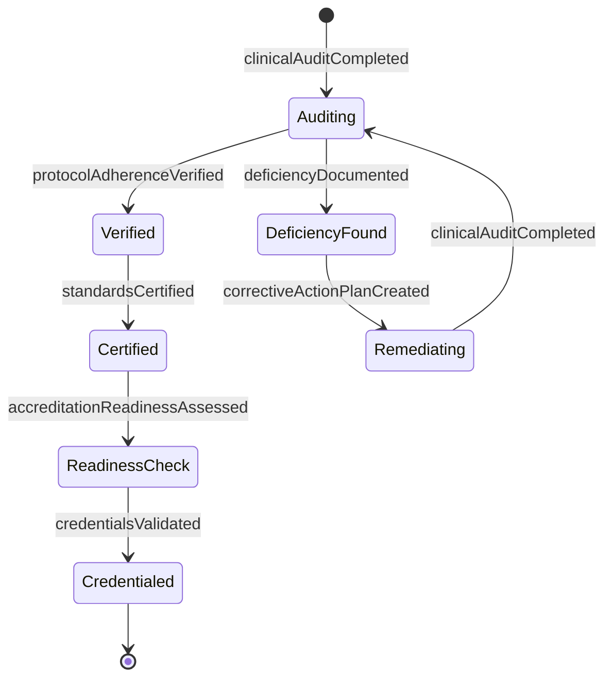
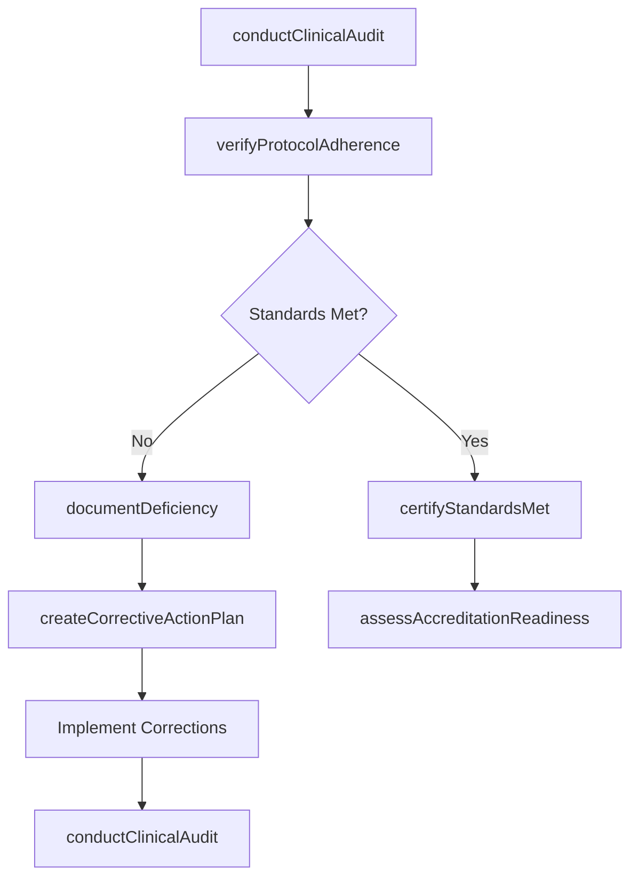
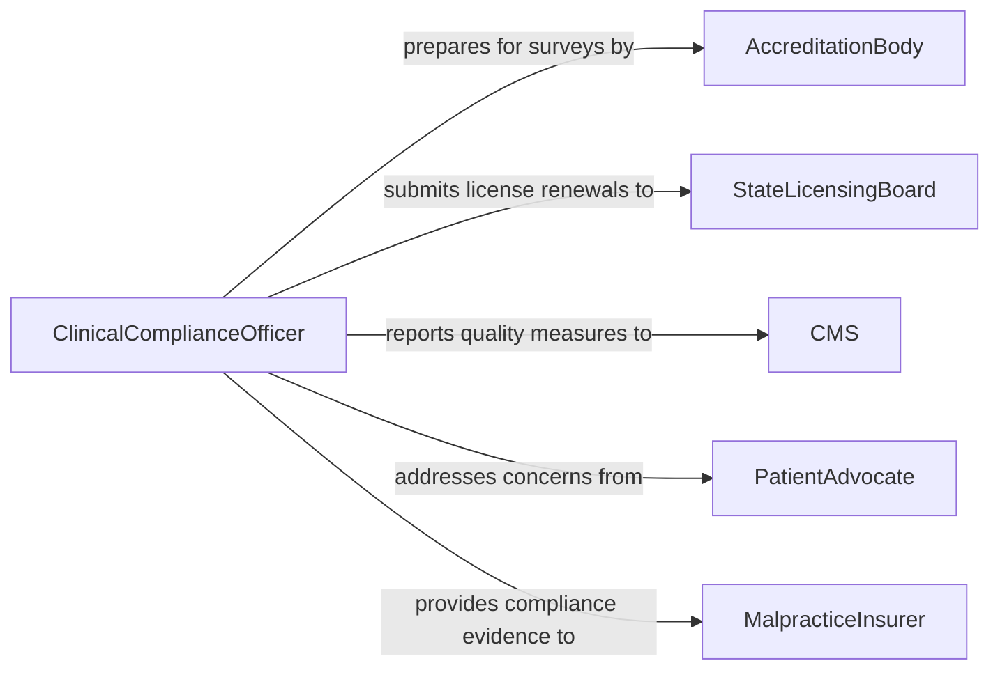

# Verify Medical Activities Operations Meet

> Business-as-Code definition for verifying that medical activities and clinical operations meet healthcare standards and regulatory requirements. Covers clinical protocol adherence, accreditation standards, and patient safety benchmarks.

## Overview

Verifying medical activities against standards involves systematically evaluating clinical procedures, patient care workflows, laboratory operations, and administrative processes to ensure compliance with healthcare regulations (HIPAA, CMS Conditions of Participation), accreditation standards (Joint Commission, AAAHC), and evidence-based clinical guidelines. This definition provides actions for conducting clinical audits, verifying protocol adherence, managing deficiencies, and maintaining accreditation readiness.

## Actors

| Actor | Description |
|-------|-------------|
| AccreditationBody | Organization that certifies healthcare facility standards (e.g., Joint Commission) |
| StateLicensingBoard | Government agency issuing and overseeing healthcare facility licenses |
| CMS | Centers for Medicare and Medicaid Services enforcing federal healthcare standards |
| PatientAdvocate | External representative ensuring patient rights and safety standards |
| MalpracticeInsurer | Insurance provider requiring adherence to care standards for coverage |

## Roles

| Role | Description |
|------|-------------|
| ClinicalComplianceOfficer | Oversees healthcare regulatory compliance and accreditation readiness |
| MedicalDirector | Ensures clinical activities follow evidence-based standards |
| QualityAssuranceNurse | Conducts chart audits and clinical process reviews |
| InfectionControlPractitioner | Monitors infection prevention protocols and compliance |
| CredentialingCoordinator | Verifies practitioner qualifications and ongoing competency |

## Entities

| Entity | Description |
|--------|-------------|
| ClinicalAudit | A formal review of medical activities against applicable standards |
| CareStandard | A clinical guideline or regulatory requirement governing medical activities |
| ProtocolAdherence | A record of whether a specific clinical protocol was properly followed |
| Deficiency | A documented instance where medical activities fail to meet standards |
| CorrectiveActionPlan | A structured response to address identified clinical deficiencies |
| AccreditationStatus | The current standing of a facility with an accreditation body |

## Actions

| Action | Description |
|--------|-------------|
| conductClinicalAudit | Perform a systematic review of medical activities against standards |
| verifyProtocolAdherence | Check whether a specific clinical protocol was followed correctly |
| documentDeficiency | Record an instance where medical activities deviate from standards |
| createCorrectiveActionPlan | Develop a plan to remediate identified clinical deficiencies |
| assessAccreditationReadiness | Evaluate the facility's preparedness for accreditation review |
| validateCredentials | Confirm that practitioners meet qualification and competency standards |
| certifyStandardsMet | Formally attest that medical activities comply with applicable standards |

## Events

| Event | Description |
|-------|-------------|
| clinicalAuditCompleted | A medical activities review has been finalized |
| protocolAdherenceVerified | A clinical protocol check has been completed |
| deficiencyDocumented | A deviation from medical standards has been recorded |
| correctiveActionPlanCreated | A remediation plan for clinical deficiencies has been established |
| accreditationReadinessAssessed | A facility readiness evaluation has been completed |
| credentialsValidated | Practitioner qualifications have been confirmed |
| standardsCertified | Formal attestation of compliance has been completed |

## Searches

| Search | Description |
|--------|-------------|
| findAudits | List clinical audits by department, date range, or standard |
| getDeficiencies | Retrieve deficiencies by severity, department, or resolution status |
| getProtocolAdherence | Find protocol adherence records by procedure type or practitioner |
| getAccreditationStatus | Retrieve current accreditation standing and upcoming review dates |

## Entity Relationships



## State Diagram



## Workflow



## Actor Relationships



## Usage

### Calling Actions

```typescript
import { verifyMedicalActivitiesOperationsMeet } from '@headlessly/verify-medical-activities-operations-meet'

const medical = verifyMedicalActivitiesOperationsMeet()

// Conduct a clinical audit of surgical department
const audit = await medical.conductClinicalAudit({
  department: 'surgical-services',
  standards: ['Joint-Commission-NPSG', 'CMS-CoP-482.51'],
  sampleSize: 50,
  period: '2026-Q1'
})

// Verify protocol adherence for a specific procedure
await medical.verifyProtocolAdherence({
  protocol: 'surgical-site-marking',
  auditId: audit.id,
  caseIds: ['CASE-2026-1201', 'CASE-2026-1202', 'CASE-2026-1203']
})

// Document a deficiency found during audit
await medical.documentDeficiency({
  auditId: audit.id,
  standard: 'NPSG-01.01.01',
  description: 'Patient identification not verified using two identifiers in 3 of 50 cases',
  severity: 'moderate'
})
```

### Event-Driven Automation

```typescript
// Escalate critical clinical deficiencies immediately
medical.deficiencyDocumented(async ({ auditId, severity, department, standard }) => {
  if (severity === 'critical') {
    await notify({
      to: ['medical-director', 'chief-nursing-officer'],
      message: `Critical deficiency in ${department}: ${standard} non-compliance`
    })
  }
})

// Trigger accreditation readiness check after all deficiencies resolved
medical.correctiveActionPlanCreated(async ({ planId, auditId }) => {
  await scheduleFollowUp({
    action: 'assessAccreditationReadiness',
    triggerDate: '30-days-after-plan-completion',
    auditId
  })
})
```
