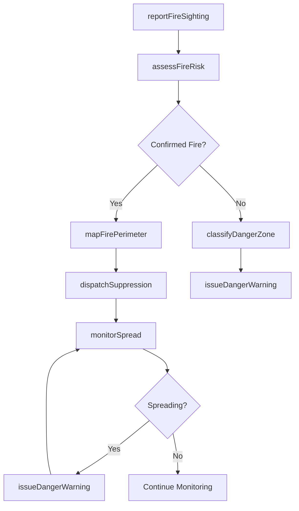
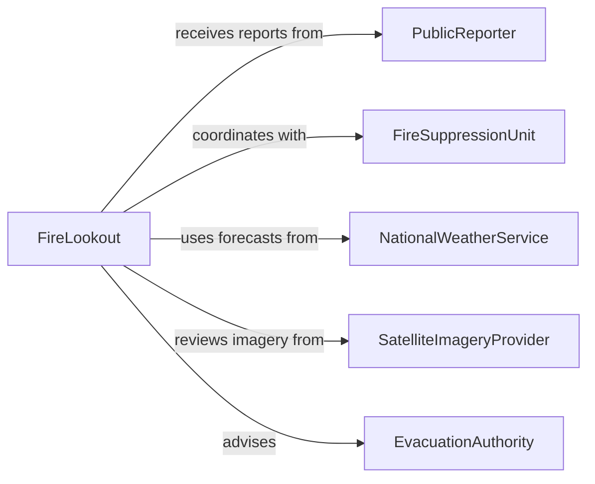

# Locate Fires Fire Danger Areas

> Business-as-Code definition for fire and fire danger area detection. Models the identification and assessment of active fires, smoldering hotspots, and high-risk zones through lookout observation, aerial reconnaissance, satellite imagery, and ground-level patrol.

## Overview

Locating fires and fire danger areas involves detecting active blazes, identifying areas of elevated ignition risk, and mapping fire perimeters to guide suppression and evacuation efforts. Fire lookouts, aerial observers, and ground crews use visual observation, thermal imaging, weather data, and vegetation analysis to pinpoint fire origins and predict spread patterns. This definition covers fire detection, danger zone classification, reporting, and coordination with suppression resources.

## Actors

| Actor | Description |
|-------|-------------|
| PublicReporter | A citizen who calls in a smoke sighting or suspected fire |
| FireSuppressionUnit | Ground crews, engine companies, or aerial tankers deployed to contain and extinguish fires |
| NationalWeatherService | Provides fire weather forecasts including red flag warnings and wind predictions |
| SatelliteImageryProvider | Supplies thermal and visible-spectrum imagery for large-area fire detection |
| EvacuationAuthority | Local government agency that orders civilian evacuations from threatened areas |

## Roles

| Role | Description |
|------|-------------|
| FireLookout | Staffs observation towers or conducts aerial patrols to spot smoke and fire |
| FireBehaviorAnalyst | Evaluates fire characteristics and predicts spread based on terrain, weather, and fuel |
| DispatchCoordinator | Assigns suppression resources and manages communication during fire events |
| GISSpecialist | Maps fire perimeters, danger zones, and evacuation routes using geospatial data |

## Entities

| Entity | Description |
|--------|-------------|
| FireReport | A documented sighting of smoke, flame, or thermal anomaly with location and time |
| DangerZone | A geographic area classified as high risk for fire ignition or spread |
| FirePerimeter | The mapped boundary of an active or contained fire |
| WeatherForecast | Meteorological data used to assess fire risk including humidity, wind, and temperature |
| FuelLoadAssessment | An evaluation of vegetation type, density, and moisture content in an area |
| ThermalHotspot | A location identified through infrared imaging as having elevated surface temperature |

## Actions

| Action | Description |
|--------|-------------|
| reportFireSighting | Document and communicate the observation of smoke, flame, or thermal anomaly |
| assessFireRisk | Evaluate an area's ignition and spread potential based on weather, fuel, and terrain |
| classifyDangerZone | Designate an area as a fire danger zone with an associated risk level |
| mapFirePerimeter | Define the geographic boundary of an active or spreading fire |
| dispatchSuppression | Assign firefighting resources to a confirmed fire location |
| monitorSpread | Track changes in fire perimeter and behavior over time |
| issueDangerWarning | Broadcast fire danger or evacuation advisories to affected populations |

## Events

| Event | Description |
|-------|-------------|
| fireSightingReported | A smoke or flame observation has been documented and communicated |
| fireRiskAssessed | An area's fire ignition and spread potential has been evaluated |
| dangerZoneClassified | An area has been formally designated as a fire danger zone |
| firePerimeterMapped | The boundary of an active fire has been defined or updated |
| suppressionDispatched | Firefighting resources have been assigned and deployed to a fire |
| fireSpreadDetected | An active fire's perimeter has expanded beyond its previous boundary |
| dangerWarningIssued | A fire danger or evacuation advisory has been broadcast |

## Searches

| Search | Description |
|--------|-------------|
| findActiveFires | Retrieve current fire reports filtered by location, size, or containment status |
| getDangerZones | List classified fire danger areas by risk level, region, or date |
| getFireWeather | Query fire weather forecasts and red flag warnings for a geographic area |
| findThermalHotspots | Locate areas of elevated surface temperature from satellite or aerial imagery |

## Workflow



## Actor Relationships



## Usage

### Calling Actions

```typescript
import { locateFiresFireDangerAreas } from '@headlessly/locate-fires-fire-danger-areas'

const fireWatch = locateFiresFireDangerAreas()

// Report a fire sighting from a lookout tower
const sighting = await fireWatch.reportFireSighting({
  observerId: 'LOOKOUT-TAHOE-12',
  type: 'smoke-column',
  location: { lat: 39.0968, lng: -120.0324 },
  bearing: 247,
  description: 'White smoke column rising from forested ridge, estimated 2 miles SW',
  timestamp: '2026-02-05T13:42:00Z'
})

// Assess fire risk for an area
const risk = await fireWatch.assessFireRisk({
  areaId: 'SECTOR-TAHOE-NW',
  weather: { temperature: 94, humidity: 12, windSpeed: 25, windDirection: 'NE' },
  fuelMoisture: 6,
  terrainSlope: 'steep'
})

// Map a fire perimeter from aerial reconnaissance
await fireWatch.mapFirePerimeter({
  fireId: sighting.fireId,
  perimeter: [
    { lat: 39.0962, lng: -120.0340 },
    { lat: 39.0975, lng: -120.0310 },
    { lat: 39.0958, lng: -120.0295 },
    { lat: 39.0945, lng: -120.0328 }
  ],
  acreage: 45,
  containmentPercent: 0
})
```

### Event-Driven Automation

```typescript
// Auto-dispatch suppression when fire is confirmed
fireWatch.fireSightingReported(async ({ fireId, location, type }) => {
  if (type === 'confirmed-flame') {
    await fireWatch.dispatchSuppression({
      fireId,
      resources: ['engine-company', 'hand-crew'],
      priority: 'immediate'
    })
  }
})

// Issue evacuation warnings when fire spread is detected near populated areas
fireWatch.fireSpreadDetected(async ({ fireId, newPerimeter, nearbyPopulation }) => {
  if (nearbyPopulation > 0) {
    await fireWatch.issueDangerWarning({
      fireId,
      type: 'evacuation-advisory',
      affectedAreas: nearbyPopulation,
      message: 'Wildfire expanding toward residential areas. Prepare for possible evacuation.'
    })
  }
})
```
