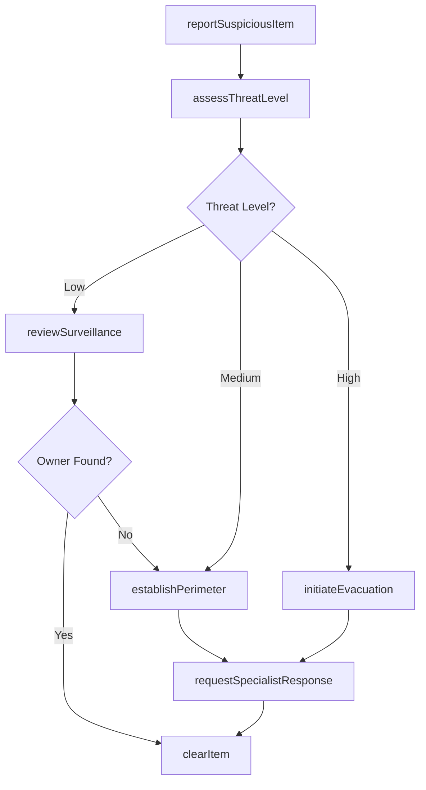
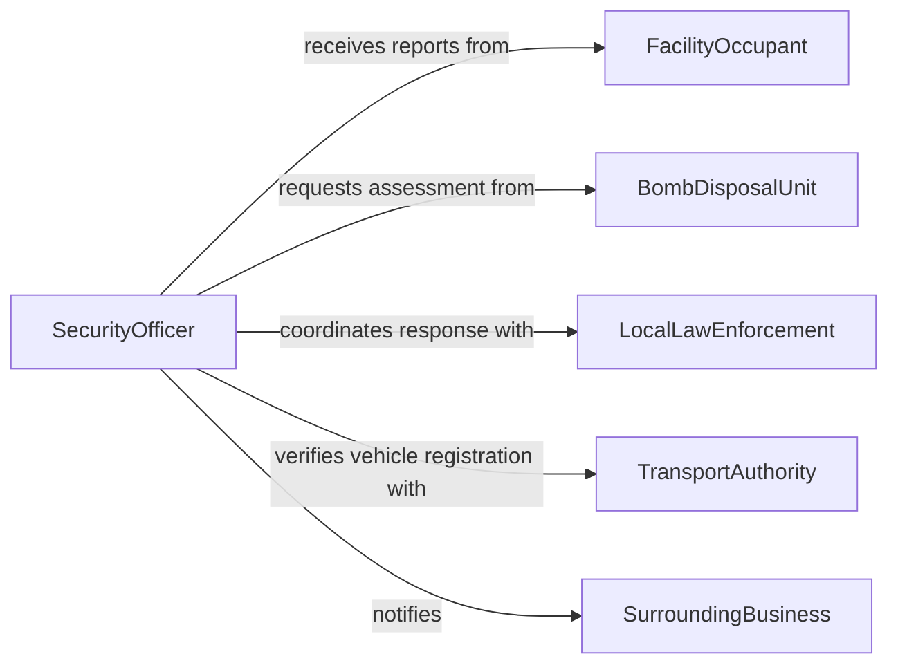

# Locate Suspicious Objects Vehicles

> Business-as-Code definition for locating suspicious objects and vehicles. Models the identification, assessment, and response to unattended items, out-of-place vehicles, and other anomalies that may pose security threats to facilities and public spaces.

## Overview

Locating suspicious objects and vehicles involves systematic visual inspection, surveillance review, and anomaly detection to identify items or vehicles that appear abandoned, unauthorized, or potentially dangerous. Security personnel compare observed conditions against established baselines to flag deviations such as unattended bags, vehicles parked in restricted zones, or packages left near critical infrastructure. This definition covers detection, threat assessment, perimeter establishment, and coordination with specialized response units.

## Actors

| Actor | Description |
|-------|-------------|
| FacilityOccupant | An employee or visitor who may report a suspicious item or vehicle |
| BombDisposalUnit | Specialized team that assesses and neutralizes potential explosive threats |
| LocalLawEnforcement | Police who respond to and investigate confirmed suspicious item reports |
| TransportAuthority | Manages parking and vehicle access in the monitored area |
| SurroundingBusiness | Neighboring establishments that may need to be notified or evacuated |

## Roles

| Role | Description |
|------|-------------|
| SecurityOfficer | Conducts visual sweeps and responds to reported suspicious items |
| ThreatAssessmentLead | Evaluates the risk level of identified objects or vehicles |
| EvacuationCoordinator | Manages perimeter establishment and occupant evacuation when required |
| SurveillanceAnalyst | Reviews camera footage to track the origin and timeline of suspicious items |

## Entities

| Entity | Description |
|--------|-------------|
| SuspiciousItem | An unattended object flagged for investigation due to placement, appearance, or context |
| SuspiciousVehicle | A vehicle identified as unauthorized, abandoned, or positioned anomalously |
| ThreatAssessment | A documented evaluation of the risk posed by a flagged item or vehicle |
| IncidentPerimeter | A defined exclusion zone established around a suspicious item or vehicle |
| SurveillanceFootage | Recorded video used to determine when and how an item or vehicle was placed |
| EvacuationOrder | A directive to clear occupants from an area due to a potential threat |

## Actions

| Action | Description |
|--------|-------------|
| reportSuspiciousItem | Log the discovery of an unattended object or unauthorized vehicle |
| assessThreatLevel | Evaluate the potential danger of a flagged item or vehicle |
| establishPerimeter | Define and enforce an exclusion zone around the suspicious item |
| reviewSurveillance | Examine camera footage to determine the origin and owner of the item |
| initiateEvacuation | Order occupants to leave the affected area following established procedures |
| requestSpecialistResponse | Call in bomb disposal, K-9 units, or hazmat teams for assessment |
| clearItem | Declare a suspicious item or vehicle as safe after investigation |

## Events

| Event | Description |
|-------|-------------|
| suspiciousItemReported | An unattended object or unauthorized vehicle has been flagged |
| threatLevelAssessed | The risk evaluation for a suspicious item has been completed |
| perimeterEstablished | An exclusion zone has been set up around the item or vehicle |
| surveillanceReviewed | Camera footage analysis for the item has been completed |
| evacuationInitiated | Occupants have been ordered to clear the affected area |
| specialistResponseRequested | A specialized team has been called to assess the item |
| itemCleared | A suspicious item or vehicle has been declared safe |

## Searches

| Search | Description |
|--------|-------------|
| findActiveIncidents | Retrieve open suspicious item or vehicle investigations by location or status |
| getIncidentHistory | Query past suspicious item reports for a facility or area over a time range |
| getSurveillanceClips | Locate relevant camera footage segments for a specific time and location |
| findUnresolvedAlerts | List flagged items or vehicles that have not yet been cleared or escalated |

## Workflow



## Actor Relationships



## Usage

### Calling Actions

```typescript
import { locateSuspiciousObjectsVehicles } from '@headlessly/locate-suspicious-objects-vehicles'

const suspicious = locateSuspiciousObjectsVehicles()

// Report a suspicious unattended package
const report = await suspicious.reportSuspiciousItem({
  type: 'unattended-package',
  location: 'Terminal B, Gate 14, near column 3',
  description: 'Black duffel bag, no visible owner, present for over 30 minutes',
  reportedBy: 'OCC-1142',
  timestamp: '2026-02-05T14:22:00Z'
})

// Assess the threat level
const assessment = await suspicious.assessThreatLevel({
  incidentId: report.id,
  proximity: 'high-traffic-area',
  itemCharacteristics: ['unattended', 'no-identification', 'rigid-container'],
  contextFactors: ['elevated-threat-level', 'no-matching-lost-item-report']
})

// Establish a safety perimeter
await suspicious.establishPerimeter({
  incidentId: report.id,
  radiusMeters: 100,
  center: { lat: 40.6413, lng: -73.7781 },
  restrictionLevel: 'full-exclusion'
})
```

### Event-Driven Automation

```typescript
// Auto-escalate high-threat assessments
suspicious.threatLevelAssessed(async ({ incidentId, threatLevel }) => {
  if (threatLevel === 'high') {
    await suspicious.initiateEvacuation({ incidentId })
    await suspicious.requestSpecialistResponse({
      incidentId,
      teamType: 'bomb-disposal',
      priority: 'immediate'
    })
  }
})

// Notify surrounding businesses when perimeters are established
suspicious.perimeterEstablished(async ({ incidentId, center, radiusMeters }) => {
  await notify({
    to: 'surrounding-businesses',
    message: `Security perimeter established: ${radiusMeters}m radius. Shelter in place until cleared.`
  })
})
```
