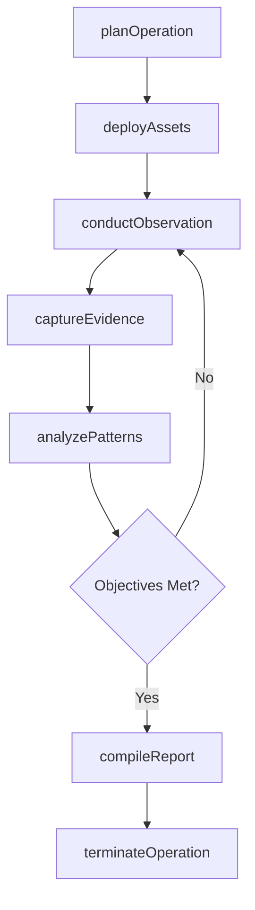
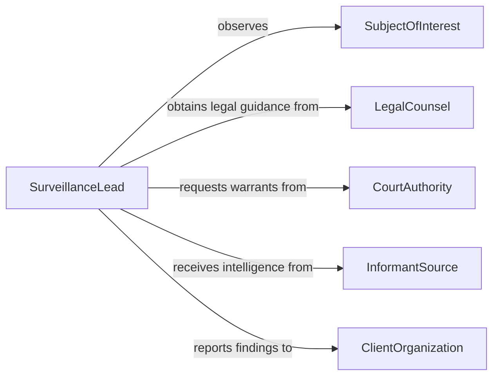

# Maintain Surveillance Individuals Establishments

> Business-as-Code definition for surveillance of individuals and establishments. Models the sustained observation of persons of interest or premises to gather intelligence, detect illegal activity, or protect assets through covert and overt monitoring methods.

## Overview

Maintaining surveillance of individuals or establishments involves the systematic and sustained observation of subjects or locations to collect information relevant to investigations, loss prevention, or protective security. Surveillance operations use a combination of fixed cameras, mobile observation teams, electronic monitoring, and data analysis to track movements, document activities, and identify patterns of behavior. This definition covers surveillance planning, execution, evidence collection, and intelligence reporting.

## Actors

| Actor | Description |
|-------|-------------|
| SubjectOfInterest | The individual or entity being observed during the surveillance operation |
| LegalCounsel | Provides guidance on lawful surveillance boundaries and admissibility of evidence |
| CourtAuthority | Issues warrants and authorizations required for certain surveillance methods |
| InformantSource | Provides tips and intelligence that guide surveillance targeting decisions |
| ClientOrganization | The entity that commissioned the surveillance for investigative or protective purposes |

## Roles

| Role | Description |
|------|-------------|
| SurveillanceLead | Plans and directs surveillance operations and manages the observation team |
| FieldObserver | Conducts on-the-ground surveillance and documents subject activities |
| AnalyticsSpecialist | Reviews surveillance data, identifies patterns, and prepares intelligence reports |
| TechnicalOperator | Deploys and manages cameras, GPS trackers, and electronic monitoring equipment |

## Entities

| Entity | Description |
|--------|-------------|
| SurveillanceOperation | A planned and authorized effort to observe a subject or location over a defined period |
| ObservationLog | A chronological record of subject activities, locations, and interactions |
| SurveillanceFootage | Video or photographic evidence captured during an observation session |
| IntelligenceReport | An analytical summary of findings derived from surveillance data |
| SurveillanceAuthorization | A legal warrant or organizational approval permitting the surveillance activity |
| SubjectProfile | A compiled dossier of known information about the person or entity under surveillance |

## Actions

| Action | Description |
|--------|-------------|
| planOperation | Design the surveillance approach including methods, resources, and legal authorizations |
| deployAssets | Position cameras, vehicles, and personnel at observation points |
| conductObservation | Actively monitor and document the subject's activities and movements |
| captureEvidence | Record video, photographs, or audio during surveillance sessions |
| analyzePatterns | Review accumulated data to identify behavioral patterns and associations |
| compileReport | Prepare a formal intelligence report summarizing surveillance findings |
| terminateOperation | Conclude the surveillance operation and secure all collected evidence |

## Events

| Event | Description |
|-------|-------------|
| operationPlanned | A surveillance operation has been designed and authorized |
| assetsDeployed | Surveillance equipment and personnel have been positioned |
| observationConducted | A surveillance session has been completed with activities documented |
| evidenceCaptured | Video, photographic, or audio evidence has been recorded |
| patternIdentified | Behavioral analysis has revealed a significant pattern or association |
| reportCompiled | A formal intelligence report has been completed and submitted |
| operationTerminated | The surveillance operation has been concluded and evidence secured |

## Searches

| Search | Description |
|--------|-------------|
| findActiveOperations | Retrieve ongoing surveillance operations by subject, location, or status |
| getObservationLogs | Query chronological surveillance records for a subject or operation |
| getEvidenceInventory | List captured evidence items by operation, type, or date |
| findSubjectAssociations | Identify individuals or locations connected to a subject based on surveillance data |

## Workflow



## Actor Relationships



## Usage

### Calling Actions

```typescript
import { maintainSurveillanceIndividualsEstablishments } from '@headlessly/maintain-surveillance-individuals-establishments'

const surveillance = maintainSurveillanceIndividualsEstablishments()

// Plan a new surveillance operation
const operation = await surveillance.planOperation({
  subjectId: 'SUBJ-4482',
  type: 'loss-prevention',
  methods: ['fixed-camera', 'mobile-observation'],
  authorizationId: 'AUTH-2026-0119',
  startDate: '2026-02-05',
  durationDays: 14
})

// Conduct an observation session
await surveillance.conductObservation({
  operationId: operation.id,
  observerId: 'FO-031',
  startTime: '2026-02-05T08:00:00Z',
  endTime: '2026-02-05T16:00:00Z',
  entries: [
    { time: '08:22', activity: 'Subject arrived at warehouse, met unknown individual' },
    { time: '10:45', activity: 'Subject loaded unmarked boxes into personal vehicle' },
    { time: '14:30', activity: 'Subject departed toward industrial district' }
  ]
})

// Compile findings into a report
await surveillance.compileReport({
  operationId: operation.id,
  findings: 'Subject observed making unauthorized inventory transfers on 6 of 10 observed days',
  recommendation: 'Refer to internal investigations for asset recovery'
})
```

### Event-Driven Automation

```typescript
// Alert when significant patterns are identified
surveillance.patternIdentified(async ({ operationId, pattern, significance }) => {
  if (significance === 'high') {
    await notify({
      to: 'surveillance-lead',
      message: `High-significance pattern in operation ${operationId}: ${pattern}`
    })
  }
})

// Auto-archive evidence when operations are terminated
surveillance.operationTerminated(async ({ operationId }) => {
  const evidence = await surveillance.getEvidenceInventory({ operationId })
  await archiveEvidence({
    operationId,
    items: evidence,
    retentionYears: 7
  })
})
```
