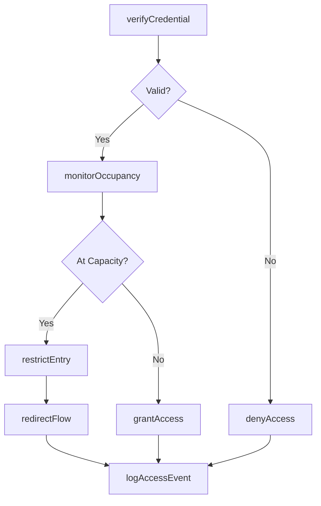
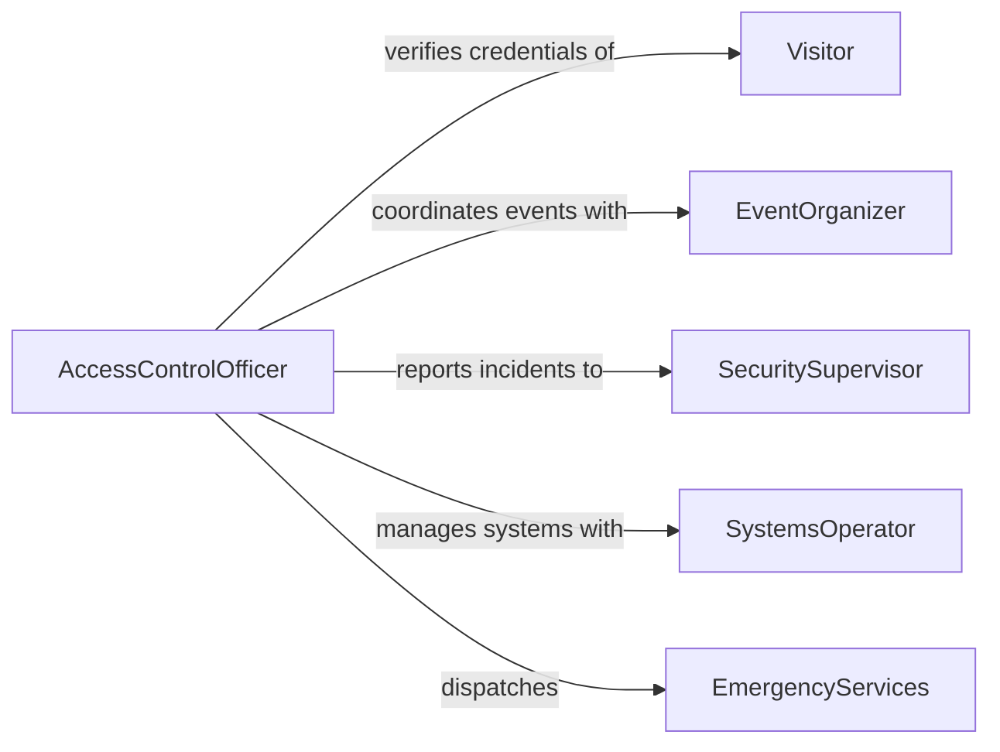

# Monitor Access Flow People Prevent

> Business-as-Code definition for access and crowd flow monitoring. Models the observation and control of people entering, exiting, and moving through facilities to prevent overcrowding, unauthorized entry, and safety incidents.

## Overview

Monitoring access and flow of people involves tracking movement through entry points, corridors, and gathering areas to maintain order and prevent safety hazards. Security and facility management personnel use credential verification, surveillance systems, and occupancy counting to ensure only authorized individuals enter restricted areas and that spaces do not exceed safe capacity limits. This definition covers access control operations from credential validation through real-time crowd monitoring and incident prevention.

## Actors

| Actor | Description |
|-------|-------------|
| Visitor | An individual seeking entry to a facility or controlled area |
| Tenant | A permanent occupant or business operating within the managed facility |
| EmergencyServices | Fire, police, or EMS responding to incidents related to access or overcrowding |
| EventOrganizer | Coordinates large gatherings and provides expected attendance figures |
| BuildingOwner | The property holder responsible for facility safety and liability |

## Roles

| Role | Description |
|------|-------------|
| AccessControlOfficer | Verifies credentials and manages entry at controlled access points |
| SecuritySupervisor | Oversees monitoring operations and makes access policy decisions |
| CrowdManagementCoordinator | Monitors occupancy levels and directs flow during high-traffic periods |
| SystemsOperator | Manages electronic access control, turnstiles, and surveillance feeds |

## Entities

| Entity | Description |
|--------|-------------|
| AccessPoint | A physical entry or exit location such as a gate, door, or turnstile |
| Credential | A badge, ticket, biometric identifier, or pass used to gain entry |
| OccupancyCount | A real-time measurement of the number of people in a defined area |
| AccessLog | A chronological record of entry and exit events at controlled points |
| RestrictedZone | A designated area requiring elevated authorization for entry |
| CapacityThreshold | A maximum occupancy limit for a space based on fire code or safety policy |

## Actions

| Action | Description |
|--------|-------------|
| verifyCredential | Check the validity of a badge, ticket, or biometric identifier at an access point |
| grantAccess | Authorize an individual to pass through a controlled entry point |
| denyAccess | Refuse entry to an individual who does not meet access requirements |
| monitorOccupancy | Track real-time people counts within a defined space |
| restrictEntry | Temporarily close an access point when capacity thresholds are approached |
| redirectFlow | Guide people to alternate entry points or routes to balance crowd distribution |
| logAccessEvent | Record an entry, exit, or access denial in the facility access log |

## Events

| Event | Description |
|-------|-------------|
| credentialVerified | A credential has been checked and its validity determined |
| accessGranted | An individual has been authorized to enter a controlled area |
| accessDenied | An individual has been refused entry at an access point |
| occupancyThresholdReached | A monitored space has reached its maximum safe capacity |
| entryRestricted | An access point has been temporarily closed due to capacity concerns |
| flowRedirected | People have been rerouted to alternate access paths |
| unauthorizedEntryDetected | An individual has entered a restricted area without valid credentials |

## Searches

| Search | Description |
|--------|-------------|
| findAccessEvents | Retrieve access log entries filtered by person, point, time, or status |
| getOccupancyLevels | Query current and historical occupancy counts for monitored spaces |
| getAccessDenials | List access denial events by reason, access point, or time period |
| findRestrictedZoneActivity | Retrieve entry and exit records for high-security areas |

## Workflow



## Actor Relationships



## Usage

### Calling Actions

```typescript
import { monitorAccessFlowPeoplePrevent } from '@headlessly/monitor-access-flow-people-prevent'

const access = monitorAccessFlowPeoplePrevent()

// Verify a visitor credential at the main entrance
const result = await access.verifyCredential({
  accessPointId: 'AP-MAIN-LOBBY',
  credentialType: 'visitor-badge',
  credentialId: 'VB-20260205-0042',
  timestamp: '2026-02-05T09:15:00Z'
})

// Monitor real-time occupancy
const occupancy = await access.monitorOccupancy({
  zoneId: 'CONFERENCE-HALL-A',
  capacityThreshold: 500
})

// Restrict entry when nearing capacity
if (occupancy.current >= occupancy.threshold * 0.9) {
  await access.restrictEntry({
    accessPointId: 'AP-HALL-A-NORTH',
    reason: 'Approaching maximum occupancy',
    duration: 'until-below-threshold'
  })
}
```

### Event-Driven Automation

```typescript
// Alert security when unauthorized entry is detected
access.unauthorizedEntryDetected(async ({ zone, accessPoint, timestamp }) => {
  await notify({
    to: 'security-supervisor',
    message: `Unauthorized entry at ${accessPoint} into ${zone} at ${timestamp}`
  })
})

// Auto-redirect when occupancy thresholds are reached
access.occupancyThresholdReached(async ({ zoneId, current, maximum }) => {
  await access.redirectFlow({
    fromZone: zoneId,
    toAccessPoints: ['AP-HALL-A-SOUTH', 'AP-HALL-B-NORTH'],
    message: `${zoneId} at capacity (${current}/${maximum}). Redirecting to alternate entrances.`
  })
})
```
