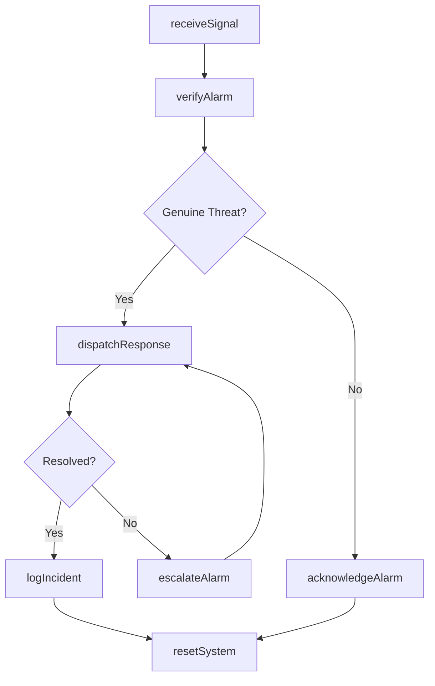
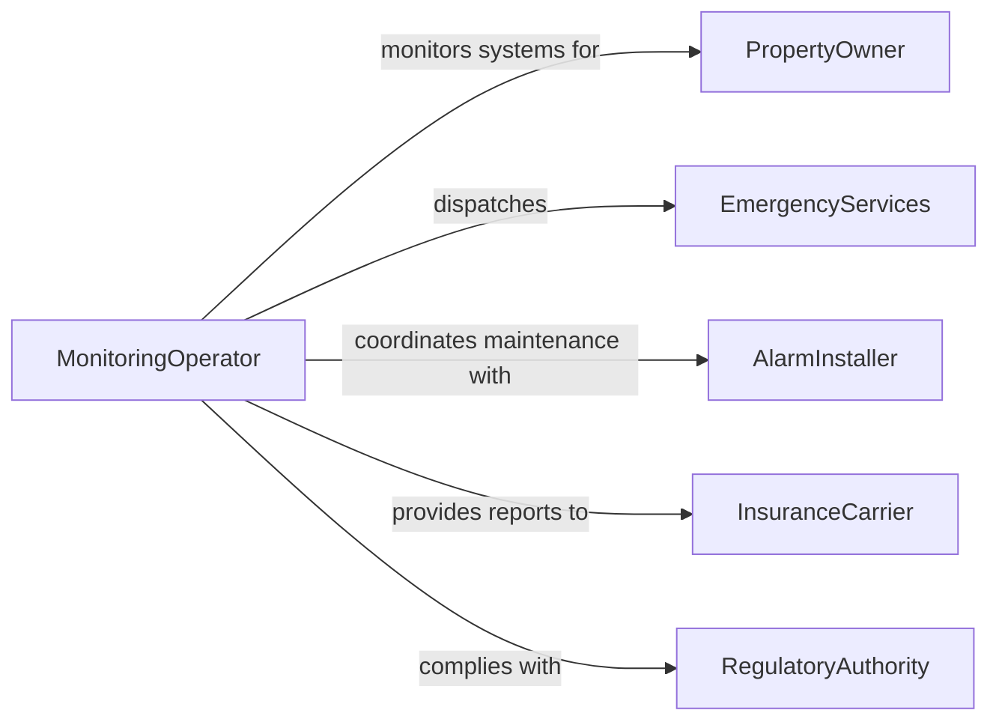

# Monitor Alarm Systems

> Business-as-Code definition for alarm system monitoring. Models the continuous surveillance of intrusion, fire, environmental, and panic alarm systems to detect and respond to security or safety events.

## Overview

Alarm system monitoring involves watching over electronic security and safety systems that protect facilities, assets, and people. Monitoring center operators observe alarm panels, verify alerts, and dispatch appropriate responses to confirmed events. This definition covers the full alarm monitoring lifecycle from signal receipt through verification, dispatch, and incident resolution.

## Actors

| Actor | Description |
|-------|-------------|
| PropertyOwner | The client whose premises are protected by the monitored alarm system |
| EmergencyServices | Police, fire, or EMS dispatched in response to confirmed alarm events |
| AlarmInstaller | Installs and maintains the physical alarm equipment on-site |
| InsuranceCarrier | Requires proof of active monitoring for coverage eligibility |
| RegulatoryAuthority | Enforces alarm permitting, false alarm ordinances, and monitoring standards |

## Roles

| Role | Description |
|------|-------------|
| MonitoringOperator | Watches alarm feeds and responds to incoming signals |
| DispatchCoordinator | Manages response assignments and communicates with emergency services |
| SystemAdministrator | Configures alarm zones, schedules, and escalation rules |
| QualityAssuranceAnalyst | Reviews alarm response times and false alarm rates |

## Entities

| Entity | Description |
|--------|-------------|
| AlarmSystem | A configured set of sensors, panels, and communication paths for a protected site |
| AlarmSignal | A discrete event received from a sensor or panel indicating a potential threat |
| Zone | A defined area within a facility with its own sensor group and alarm rules |
| IncidentReport | A documented record of an alarm event including response actions taken |
| EscalationRule | A policy defining who to notify and when based on alarm type and verification status |
| MaintenanceSchedule | A planned timeline for testing and servicing alarm equipment |

## Actions

| Action | Description |
|--------|-------------|
| receiveSignal | Accept and log an incoming alarm signal from a monitored system |
| verifyAlarm | Confirm whether an alarm signal represents a genuine threat or false activation |
| dispatchResponse | Send security personnel or emergency services to the alarm location |
| acknowledgeAlarm | Mark an alarm as reviewed and indicate the action taken |
| escalateAlarm | Elevate an unresolved alarm to the next tier of contacts or authority |
| resetSystem | Restore an alarm system to its normal monitoring state after resolution |
| logIncident | Create a detailed incident report for an alarm event |

## Events

| Event | Description |
|-------|-------------|
| signalReceived | An alarm signal has arrived at the monitoring center |
| alarmVerified | An alarm has been confirmed as a genuine event after verification |
| falseAlarmIdentified | An alarm signal has been determined to be non-threatening |
| responseDispatched | Security or emergency services have been sent to the site |
| alarmAcknowledged | An operator has reviewed and acted on an alarm signal |
| alarmEscalated | An unresolved alarm has been elevated to a higher authority |
| systemReset | The alarm system has been returned to normal monitoring status |

## Searches

| Search | Description |
|--------|-------------|
| findActiveAlarms | Retrieve all currently unacknowledged or unresolved alarm signals |
| getAlarmHistory | Query past alarm events for a specific site, zone, or time period |
| getFalseAlarmRate | Calculate false alarm statistics by site, zone, or period |
| findSystemsRequiringMaintenance | Locate alarm systems due for scheduled testing or service |

## Workflow



## Actor Relationships



## Usage

### Calling Actions

```typescript
import { monitorAlarmSystems } from '@headlessly/monitor-alarm-systems'

const alarms = monitorAlarmSystems()

// Receive and log an incoming alarm signal
const signal = await alarms.receiveSignal({
  systemId: 'SYS-4420',
  zone: 'rear-entrance',
  type: 'intrusion',
  sensorId: 'PIR-08',
  timestamp: '2026-02-05T02:14:33Z'
})

// Verify the alarm through video or callback
const verification = await alarms.verifyAlarm({
  signalId: signal.id,
  method: 'video-review',
  result: 'confirmed',
  notes: 'Individual observed forcing rear door lock'
})

// Dispatch emergency response
await alarms.dispatchResponse({
  signalId: signal.id,
  responderId: 'police-dispatch',
  priority: 'high',
  siteAddress: '1200 Industrial Blvd, Suite 300'
})
```

### Event-Driven Automation

```typescript
// Auto-dispatch for verified intrusion alarms
alarms.alarmVerified(async ({ signalId, systemId, type }) => {
  if (type === 'intrusion') {
    await alarms.dispatchResponse({
      signalId,
      responderId: 'police-dispatch',
      priority: 'high'
    })
  }
})

// Track false alarm rates and flag problematic zones
alarms.falseAlarmIdentified(async ({ systemId, zone }) => {
  const rate = await alarms.getFalseAlarmRate({ systemId, zone, periodDays: 90 })
  if (rate.percentage > 50) {
    await notify({
      to: 'system-administrator',
      message: `Zone ${zone} on ${systemId} has ${rate.percentage}% false alarm rate`
    })
  }
})
```
