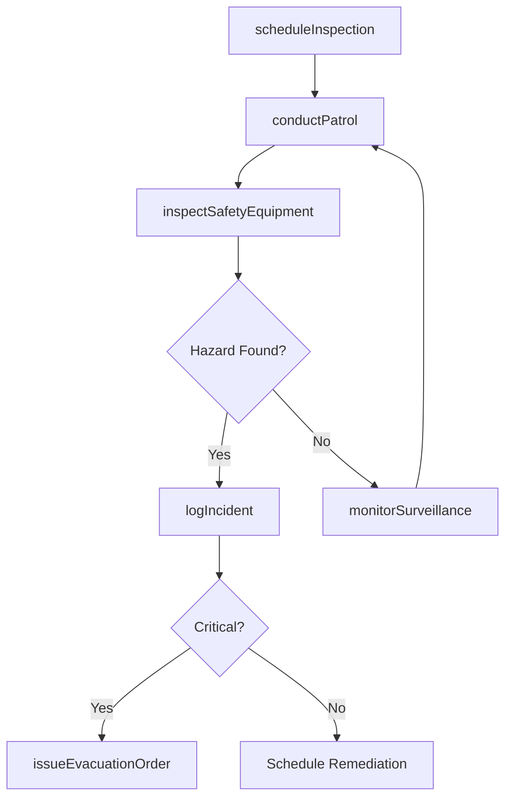
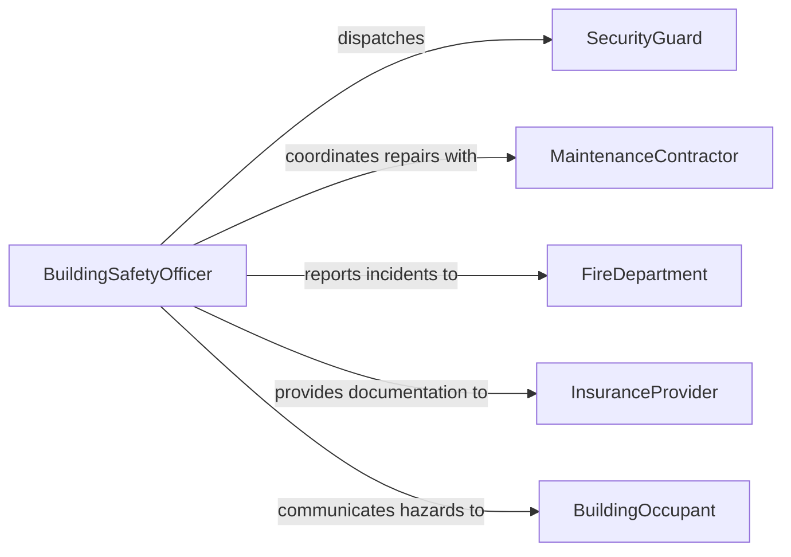

# Monitor Building Premises Ensure Occupant

> Business-as-Code definition for monitoring building premises to ensure occupant and visitor safety. Models the continuous surveillance and inspection lifecycle from patrol scheduling through incident response.

## Overview

Building premises monitoring encompasses the systematic observation and inspection of commercial, residential, and institutional structures to protect occupants and visitors from safety hazards. This includes conducting routine patrols, operating surveillance systems, verifying fire and life safety equipment, and coordinating emergency response when threats are detected. The process ensures that building conditions remain compliant with occupancy codes, fire regulations, and organizational safety policies.

## Actors

| Actor | Description |
|-------|-------------|
| BuildingOccupant | Individuals who regularly occupy the building and report safety concerns |
| Visitor | Temporary guests who must be tracked and protected during their stay |
| FireDepartment | External agency that inspects fire safety systems and responds to emergencies |
| EmergencyServices | First responders dispatched when serious safety incidents occur |
| InsuranceProvider | Underwriter requiring documentation of safety monitoring practices |
| MaintenanceContractor | External vendor performing repairs on building safety systems |

## Roles

| Role | Description |
|------|-------------|
| BuildingSafetyOfficer | Oversees all safety monitoring operations and compliance programs |
| SecurityGuard | Conducts physical patrols and monitors surveillance equipment |
| FacilitiesManager | Manages building systems including HVAC, electrical, and structural components |
| SafetyInspector | Performs scheduled and ad-hoc inspections of safety equipment and conditions |

## Entities

| Entity | Description |
|--------|-------------|
| SafetyInspection | A documented review of building conditions and safety equipment |
| Patrol | A scheduled walk-through of building areas to identify hazards |
| Incident | A safety event requiring documentation and response |
| SafetyEquipment | Fire extinguishers, alarms, sprinklers, and emergency lighting |
| OccupancyRecord | Tracking data for the number and location of building occupants |
| HazardReport | A documented safety concern requiring remediation |

## Actions

| Action | Description |
|--------|-------------|
| conductPatrol | Execute a scheduled walk-through of designated building areas |
| inspectSafetyEquipment | Verify operational status of fire extinguishers, alarms, and emergency systems |
| logIncident | Record a safety event with details on location, severity, and response |
| monitorSurveillance | Observe live camera feeds and sensor data for safety anomalies |
| trackOccupancy | Monitor building occupant counts against maximum capacity limits |
| issueEvacuationOrder | Initiate building evacuation procedures when a critical hazard is detected |
| scheduleInspection | Plan and assign upcoming safety inspections for building zones |

## Events

| Event | Description |
|-------|-------------|
| patrolCompleted | A scheduled patrol has been finished and findings documented |
| hazardDetected | A safety hazard has been identified during patrol or monitoring |
| incidentLogged | A safety incident has been formally recorded in the system |
| equipmentInspected | Safety equipment has been checked and its status updated |
| evacuationOrdered | An evacuation directive has been issued for part or all of the building |
| occupancyExceeded | Building occupancy has surpassed the permitted capacity limit |
| inspectionScheduled | A future safety inspection has been planned and assigned |

## Searches

| Search | Description |
|--------|-------------|
| findOpenHazards | Retrieve unresolved hazard reports by building zone or severity |
| getPatrolHistory | List completed patrols filtered by date range, guard, or area |
| getEquipmentStatus | Look up current inspection status of safety equipment by type or location |
| findIncidents | Search incident logs by date, severity, or building section |

## Workflow



## Actor Relationships



## Usage

### Calling Actions

```typescript
import { monitorBuildingPremisesEnsureOccupant } from '@headlessly/monitor-building-premises-ensure-occupant'

const premises = monitorBuildingPremisesEnsureOccupant()

// Conduct a scheduled patrol of the west wing
const patrol = await premises.conductPatrol({
  building: 'HQ-West',
  zones: ['lobby', 'stairwellA', 'floor2', 'floor3'],
  guardId: 'guard-047'
})

// Inspect fire safety equipment on floor 2
await premises.inspectSafetyEquipment({
  building: 'HQ-West',
  zone: 'floor2',
  equipmentTypes: ['fireExtinguisher', 'smokeDetector', 'emergencyLighting']
})

// Log a hazard found during patrol
await premises.logIncident({
  patrolId: patrol.id,
  type: 'hazard',
  severity: 'medium',
  location: { building: 'HQ-West', zone: 'stairwellA', detail: 'Step 12 loose railing' },
  description: 'Handrail bolt loose on stairwell A between floors 2 and 3'
})
```

### Event-Driven Automation

```typescript
// Alert facilities when occupancy limits are approached
premises.occupancyExceeded(async ({ building, zone, currentCount, maxCapacity }) => {
  await notify({
    to: 'facilities-team',
    message: `Occupancy exceeded in ${building} ${zone}: ${currentCount}/${maxCapacity}`
  })
})

// Trigger emergency protocols on critical hazard detection
premises.hazardDetected(async ({ severity, building, zone }) => {
  if (severity === 'critical') {
    await premises.issueEvacuationOrder({ building, zones: [zone] })
  }
})
```
