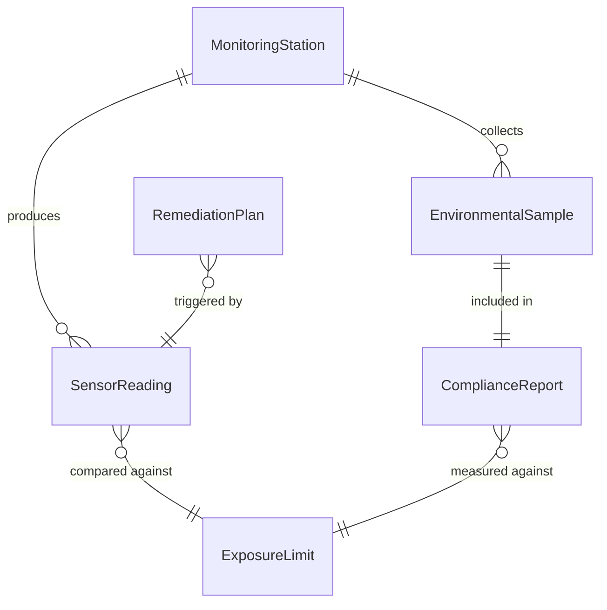
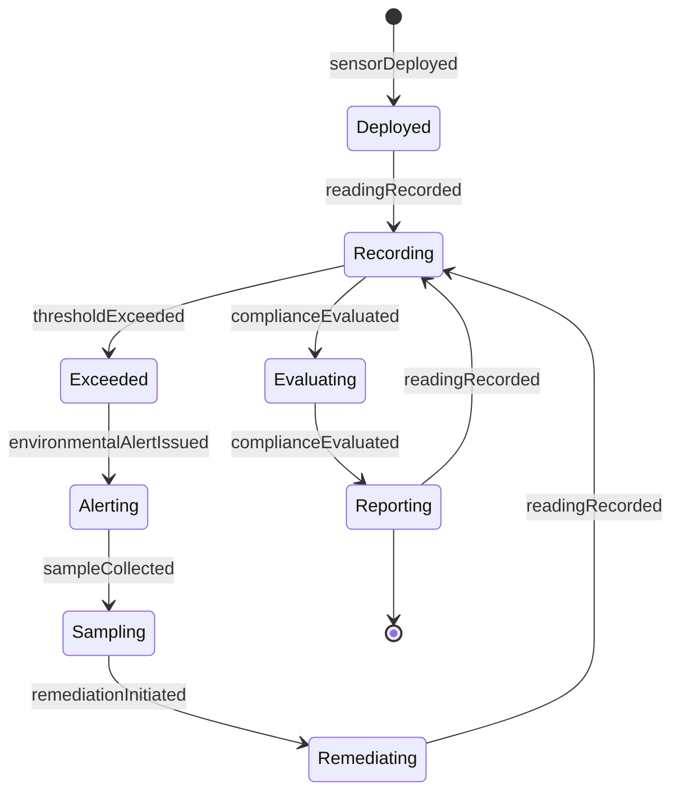
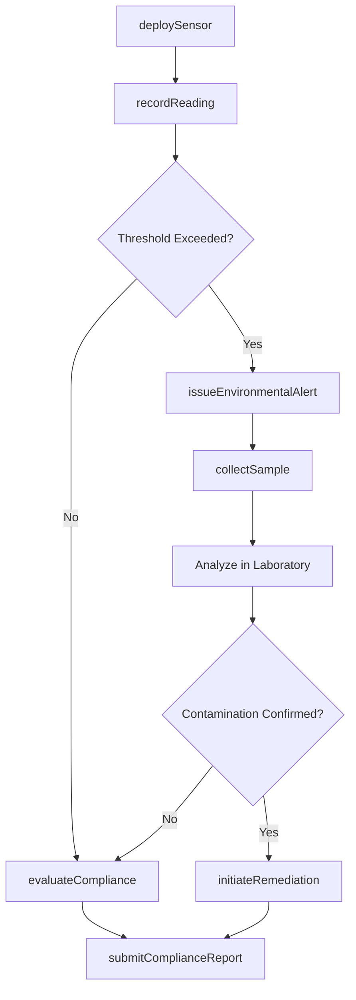
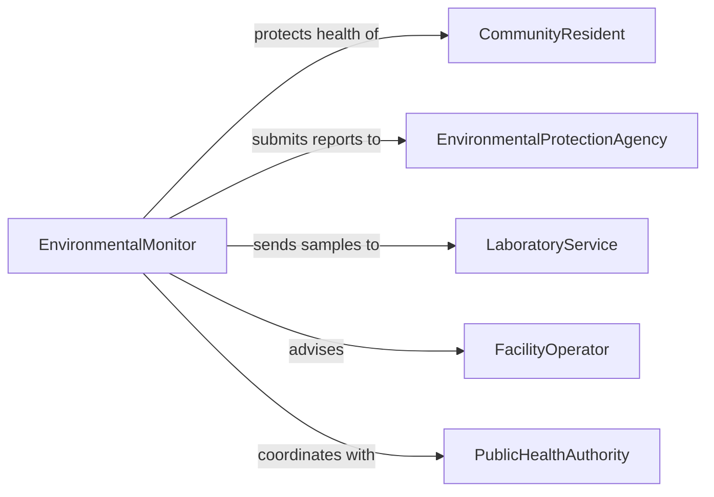

# Monitor Environment Ensure Safety

> Business-as-Code definition for environmental safety monitoring. Models the continuous assessment of physical environments including air quality, temperature, water conditions, and radiation levels to protect the health and safety of workers, residents, and the public.

## Overview

Environmental safety monitoring involves measuring and evaluating physical, chemical, and biological conditions in and around facilities to ensure they remain within safe limits. Monitoring teams deploy sensors, conduct sampling, and analyze data to detect contamination, exposure risks, and environmental degradation. This definition covers sensor deployment, data collection, threshold management, alert dissemination, and regulatory reporting for environmental safety programs.

## Actors

| Actor | Description |
|-------|-------------|
| CommunityResident | Members of the public living near monitored facilities or sites |
| EnvironmentalProtectionAgency | Regulatory body that sets permissible exposure limits and requires compliance reporting |
| LaboratoryService | Analyzes environmental samples for contaminant identification and quantification |
| FacilityOperator | The organization responsible for the site where environmental monitoring occurs |
| PublicHealthAuthority | Evaluates community health impacts from environmental conditions |

## Roles

| Role | Description |
|------|-------------|
| EnvironmentalMonitor | Collects samples, deploys sensors, and records environmental measurements |
| DataAnalyst | Processes monitoring data and identifies trends or threshold exceedances |
| ComplianceOfficer | Ensures monitoring activities and results meet regulatory requirements |
| SiteManager | Makes operational decisions based on environmental monitoring findings |

## Entities

| Entity | Description |
|--------|-------------|
| MonitoringStation | A fixed or mobile location equipped with environmental sensors and sampling equipment |
| EnvironmentalSample | A collected specimen of air, water, soil, or other media for laboratory analysis |
| SensorReading | A real-time measurement from an environmental monitoring instrument |
| ExposureLimit | A regulatory or organizational threshold for a specific environmental parameter |
| ComplianceReport | A formal document submitted to regulators summarizing monitoring results |
| RemediationPlan | A corrective action strategy for addressing identified environmental contamination |

## Actions

| Action | Description |
|--------|-------------|
| deploySensor | Install or position an environmental monitoring instrument at a designated location |
| collectSample | Gather an air, water, or soil specimen for laboratory analysis |
| recordReading | Capture and store a measurement from an environmental sensor |
| evaluateCompliance | Compare monitoring results against applicable exposure limits and standards |
| issueEnvironmentalAlert | Notify affected parties when environmental conditions exceed safe thresholds |
| submitComplianceReport | File a regulatory report documenting monitoring results and findings |
| initiateRemediation | Begin corrective actions to address identified environmental contamination |

## Events

| Event | Description |
|-------|-------------|
| sensorDeployed | An environmental monitoring instrument has been installed at a location |
| sampleCollected | An environmental specimen has been gathered for laboratory analysis |
| readingRecorded | A new environmental measurement has been captured and stored |
| thresholdExceeded | A monitored parameter has risen above its permissible exposure limit |
| complianceEvaluated | Monitoring results have been compared against regulatory standards |
| environmentalAlertIssued | A notification has been sent regarding unsafe environmental conditions |
| remediationInitiated | Corrective actions have begun to address environmental contamination |

## Searches

| Search | Description |
|--------|-------------|
| findExceedances | Retrieve instances where environmental readings exceeded exposure limits |
| getReadingHistory | Query sensor data for a specific parameter and location over time |
| getSampleResults | List laboratory analysis results for collected environmental samples |
| findStationsByStatus | Locate monitoring stations filtered by operational status or parameter type |

## Entity Relationships



## State Diagram



## Workflow



## Actor Relationships



## Usage

### Calling Actions

```typescript
import { monitorEnvironmentEnsureSafety } from '@headlessly/monitor-environment-ensure-safety'

const envSafety = monitorEnvironmentEnsureSafety()

// Deploy a new air quality sensor
await envSafety.deploySensor({
  stationId: 'MS-NORTH-FENCE',
  sensorType: 'particulate-matter',
  parameter: 'PM2.5',
  location: { lat: 33.7490, lng: -84.3880 },
  samplingInterval: '15-minutes'
})

// Record a reading and check against limits
const reading = await envSafety.recordReading({
  stationId: 'MS-NORTH-FENCE',
  parameter: 'PM2.5',
  value: 38.5,
  unit: 'ug/m3',
  timestamp: '2026-02-05T14:30:00Z'
})

// Submit a quarterly compliance report
await envSafety.submitComplianceReport({
  facilityId: 'FAC-ATLANTA-PLANT',
  reportingPeriod: '2026-Q1',
  parameters: ['PM2.5', 'SO2', 'NOx', 'VOC'],
  status: 'compliant',
  attachments: ['monitoring-data-q1.csv', 'lab-results-q1.pdf']
})
```

### Event-Driven Automation

```typescript
// Alert community when thresholds are exceeded
envSafety.thresholdExceeded(async ({ stationId, parameter, value, limit }) => {
  await notify({
    to: 'public-health-authority',
    message: `${parameter} at station ${stationId}: ${value} exceeds limit of ${limit}`
  })
})

// Auto-collect confirmation samples when readings are elevated
envSafety.readingRecorded(async ({ stationId, parameter, value, limit }) => {
  if (value > limit * 0.8) {
    await envSafety.collectSample({
      stationId,
      parameter,
      reason: `Elevated reading at ${Math.round((value / limit) * 100)}% of limit`,
      priority: 'high'
    })
  }
})
```
