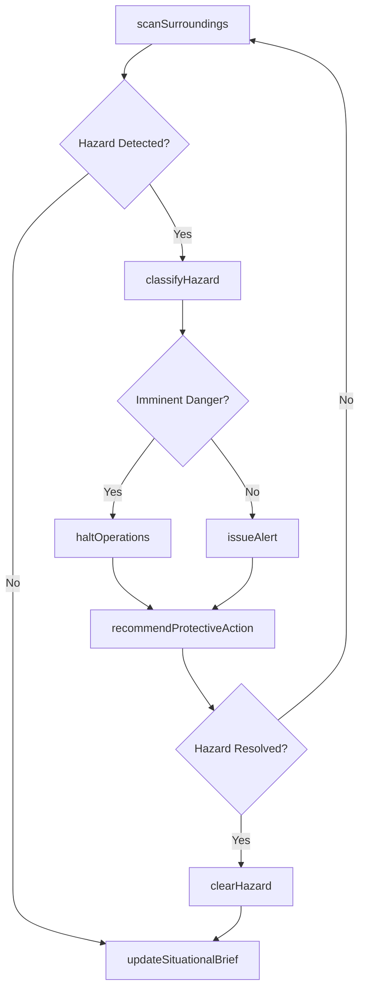
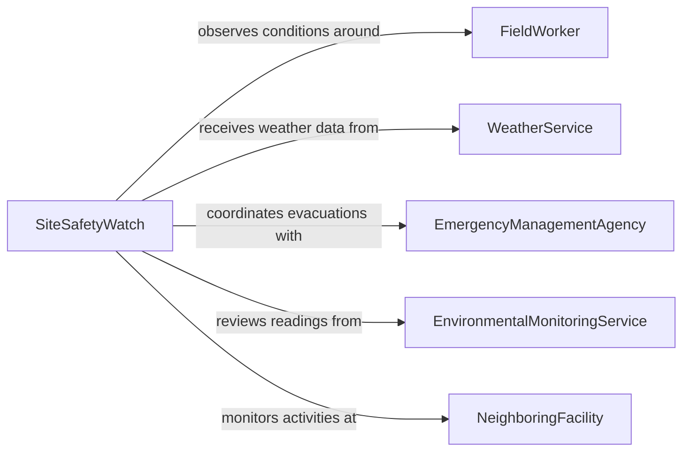

# Monitor Surroundings Detect Potential Hazards

> Business-as-Code definition for environmental hazard detection. Models the continuous observation of physical surroundings to identify potential hazards such as weather changes, structural risks, chemical releases, and unstable terrain before they cause harm.

## Overview

Monitoring surroundings for potential hazards involves maintaining situational awareness of environmental conditions, structural integrity, and physical risks in and around work areas. Personnel scan for changes in weather, ground stability, traffic patterns, falling object risks, and chemical or biological exposure indicators. This definition covers hazard scanning protocols, threat classification, alert dissemination, and protective action coordination across diverse operational environments.

## Actors

| Actor | Description |
|-------|-------------|
| FieldWorker | An employee operating in environments with variable and unpredictable hazard exposure |
| WeatherService | Provides forecasts, warnings, and real-time meteorological data |
| EmergencyManagementAgency | Coordinates community-level disaster response and issues evacuation directives |
| EnvironmentalMonitoringService | Provides air quality, seismic, and water quality data for the area |
| NeighboringFacility | Adjacent operations whose activities may create hazards for the monitored area |

## Roles

| Role | Description |
|------|-------------|
| SiteSafetyWatch | Maintains continuous observation of the surroundings during operations |
| HazardAssessmentOfficer | Evaluates identified hazards for severity and recommends protective actions |
| OperationsForeman | Decides whether to continue, modify, or halt work based on hazard assessments |
| EmergencyActionCoordinator | Manages evacuations and shelter-in-place procedures when hazards materialize |

## Entities

| Entity | Description |
|--------|-------------|
| HazardObservation | A documented sighting or measurement of a potential environmental risk |
| ThreatLevel | A classification of hazard severity ranging from minimal to imminent danger |
| WeatherAlert | A notification of approaching severe weather conditions that may affect operations |
| ProtectiveAction | A directive to take specific steps such as evacuation, shelter, or work stoppage |
| EnvironmentalReading | A sensor measurement of conditions such as wind speed, gas concentration, or temperature |
| SituationalBrief | A periodic summary of current hazard conditions communicated to all personnel |

## Actions

| Action | Description |
|--------|-------------|
| scanSurroundings | Perform a systematic visual and instrumental check of the immediate environment |
| classifyHazard | Assign a threat level to an observed or reported environmental risk |
| issueAlert | Broadcast a hazard notification to affected personnel and stakeholders |
| recommendProtectiveAction | Advise work modification, shelter-in-place, or evacuation based on threat level |
| updateSituationalBrief | Compile and distribute a current summary of all active hazard conditions |
| haltOperations | Order a temporary work stoppage due to imminent environmental danger |
| clearHazard | Declare a hazard as resolved and authorize resumption of normal operations |

## Events

| Event | Description |
|-------|-------------|
| hazardObserved | A potential environmental risk has been identified and documented |
| hazardClassified | A threat level has been assigned to an observed hazard |
| alertIssued | A hazard notification has been broadcast to affected personnel |
| protectiveActionRecommended | A specific safety action has been advised based on current conditions |
| operationsHalted | Work has been stopped due to an imminent environmental hazard |
| situationalBriefUpdated | A current hazard conditions summary has been distributed |
| hazardCleared | An environmental risk has been resolved and operations may resume |

## Searches

| Search | Description |
|--------|-------------|
| findActiveHazards | Retrieve all currently unresolved hazard observations by location or threat level |
| getEnvironmentalReadings | Query sensor data for a specific parameter, location, and time range |
| getAlertHistory | List hazard alerts issued for a site or area over a given period |
| findProtectiveActions | Retrieve active or historical protective action directives by type or status |

## Workflow



## Actor Relationships



## Usage

### Calling Actions

```typescript
import { monitorSurroundingsDetectPotentialHazards } from '@headlessly/monitor-surroundings-detect-potential-hazards'

const hazardWatch = monitorSurroundingsDetectPotentialHazards()

// Perform a surroundings scan
const scan = await hazardWatch.scanSurroundings({
  siteId: 'SITE-PIPELINE-SEC-7',
  observerId: 'SSW-019',
  conditions: {
    windSpeed: 45,
    windDirection: 'NW',
    visibility: 'reduced',
    groundCondition: 'saturated'
  }
})

// Classify a detected hazard
await hazardWatch.classifyHazard({
  observationId: scan.observations[0].id,
  type: 'high-wind',
  threatLevel: 'elevated',
  description: 'Sustained winds above 40 mph with gusts to 55 mph near crane operations'
})

// Issue a site-wide alert
await hazardWatch.issueAlert({
  siteId: 'SITE-PIPELINE-SEC-7',
  hazardType: 'high-wind',
  message: 'Suspend all crane and elevated work until wind speeds drop below 30 mph',
  affectedAreas: ['crane-pad-A', 'scaffold-zone-3', 'rooftop-mechanical']
})
```

### Event-Driven Automation

```typescript
// Auto-halt operations for imminent danger classifications
hazardWatch.hazardClassified(async ({ observationId, threatLevel, siteId }) => {
  if (threatLevel === 'imminent') {
    await hazardWatch.haltOperations({
      siteId,
      reason: `Imminent hazard detected (observation: ${observationId})`
    })
  }
})

// Distribute situational briefs on a schedule
hazardWatch.situationalBriefUpdated(async ({ siteId, brief }) => {
  await notify({
    to: 'all-site-personnel',
    message: `Hazard brief for ${siteId}: ${brief.activeHazards} active hazards, threat level: ${brief.overallThreatLevel}`
  })
})
```
