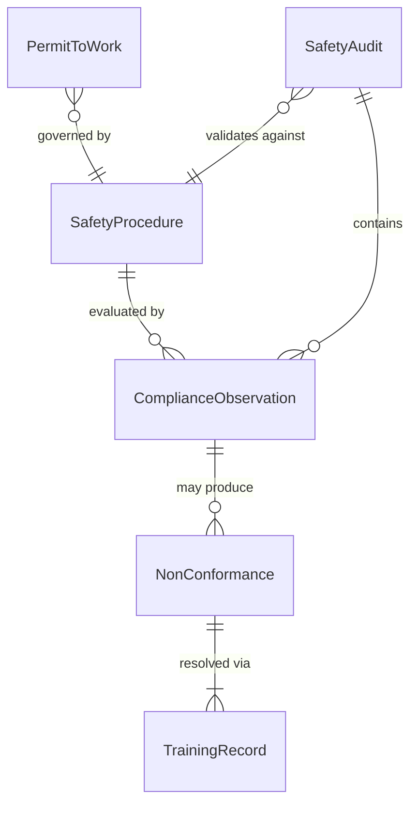
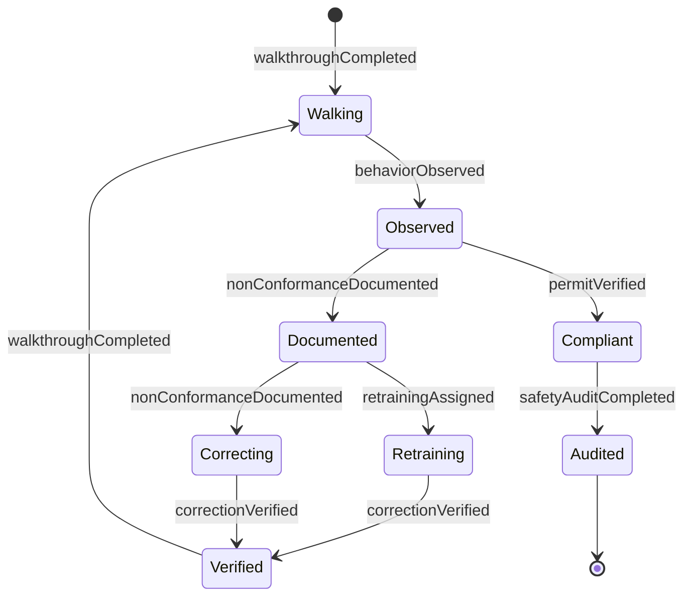
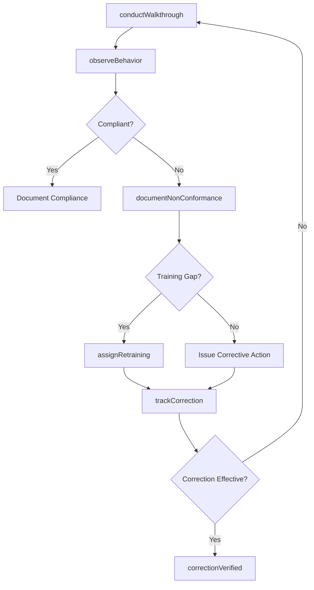
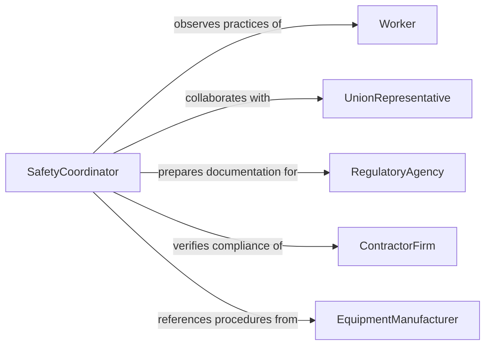

# Monitor Work Areas Procedures Ensure

> Business-as-Code definition for work area and procedure compliance monitoring. Models the observation and verification of workplace practices, equipment usage, and procedural adherence to ensure compliance with established safety regulations and operational standards.

## Overview

Monitoring work areas and procedures for safety compliance involves conducting walkthroughs, observing work practices, and auditing documentation to verify that employees follow established safety protocols. Supervisors and safety professionals check that lockout/tagout procedures are followed, confined space entry permits are current, personal protective equipment is worn correctly, and housekeeping standards are maintained. This definition covers routine compliance monitoring, behavioral observation, deviation documentation, and corrective follow-up.

## Actors

| Actor | Description |
|-------|-------------|
| Worker | An employee whose work practices and environment are being monitored for compliance |
| UnionRepresentative | Advocates for worker safety and participates in safety committee activities |
| RegulatoryAgency | Government body such as OSHA that sets and enforces workplace safety standards |
| ContractorFirm | External company whose workers must comply with the host facility's safety rules |
| EquipmentManufacturer | Provides safe operating procedures and maintenance requirements for machinery |

## Roles

| Role | Description |
|------|-------------|
| SafetyCoordinator | Conducts compliance walkthroughs and documents observations |
| OperationsSupervisor | Monitors team adherence to safety procedures during daily operations |
| ComplianceAuditor | Performs formal audits of safety programs against regulatory requirements |
| SafetyTrainer | Delivers safety training and verifies worker competency on procedures |

## Entities

| Entity | Description |
|--------|-------------|
| SafetyProcedure | A documented set of steps required to perform a task safely |
| ComplianceObservation | A recorded instance of worker or workplace adherence or non-adherence to safety rules |
| SafetyAudit | A formal review of safety program elements against standards and regulations |
| NonConformance | A documented deviation from an established safety procedure or standard |
| TrainingRecord | Documentation of a worker's completion of required safety training |
| PermitToWork | A formal authorization for performing high-risk tasks such as hot work or confined space entry |

## Actions

| Action | Description |
|--------|-------------|
| conductWalkthrough | Perform a visual inspection of a work area to assess safety compliance |
| observeBehavior | Watch and document worker adherence to safety procedures during task execution |
| documentNonConformance | Record a specific deviation from established safety procedures |
| verifyPermitStatus | Check that active work permits are current and conditions are being met |
| auditSafetyProgram | Perform a comprehensive review of safety procedures, records, and practices |
| assignRetraining | Require a worker or team to complete additional safety training for a deficiency |
| trackCorrection | Monitor the completion and effectiveness of corrective actions for non-conformances |

## Events

| Event | Description |
|-------|-------------|
| walkthroughCompleted | A safety compliance walkthrough of a work area has been finished |
| behaviorObserved | A worker behavior observation has been recorded as compliant or non-compliant |
| nonConformanceDocumented | A safety procedure deviation has been formally recorded |
| permitVerified | A work permit has been checked and confirmed as valid or expired |
| safetyAuditCompleted | A formal safety program audit has been finished with findings documented |
| retrainingAssigned | Additional safety training has been required for a worker or team |
| correctionVerified | A corrective action for a non-conformance has been confirmed as complete |

## Searches

| Search | Description |
|--------|-------------|
| findNonConformances | Retrieve safety deviations by area, procedure, severity, or resolution status |
| getObservationHistory | Query behavioral safety observations for a team, area, or time period |
| getAuditResults | List safety audit findings by program element, area, or compliance status |
| findExpiredPermits | Locate work permits that have passed their expiration without renewal |

## Entity Relationships



## State Diagram



## Workflow



## Actor Relationships



## Usage

### Calling Actions

```typescript
import { monitorWorkAreasProceduresEnsure } from '@headlessly/monitor-work-areas-procedures-ensure'

const compliance = monitorWorkAreasProceduresEnsure()

// Conduct a safety walkthrough of a construction zone
const walkthrough = await compliance.conductWalkthrough({
  areaId: 'ZONE-C-SCAFFOLD',
  inspectorId: 'SC-032',
  checklist: ['fall-protection', 'scaffold-integrity', 'housekeeping', 'ppe-usage'],
  date: '2026-02-05'
})

// Document a non-conformance
await compliance.documentNonConformance({
  walkthroughId: walkthrough.id,
  procedure: 'fall-protection-harness-inspection',
  description: 'Worker at elevation without completing daily harness inspection checklist',
  severity: 'major',
  workerId: 'W-4401'
})

// Verify an active confined space entry permit
await compliance.verifyPermitStatus({
  permitId: 'PTW-2026-0892',
  type: 'confined-space-entry',
  conditions: ['atmospheric-monitoring-active', 'rescue-team-standby', 'entrant-trained']
})
```

### Event-Driven Automation

```typescript
// Escalate critical non-conformances immediately
compliance.nonConformanceDocumented(async ({ areaId, severity, description }) => {
  if (severity === 'critical') {
    await notify({
      to: 'operations-supervisor',
      message: `STOP WORK: Critical safety non-conformance in ${areaId}: ${description}`
    })
  }
})

// Auto-assign retraining when behavioral observations show patterns
compliance.behaviorObserved(async ({ workerId, compliant, procedure }) => {
  if (!compliant) {
    const history = await compliance.getObservationHistory({ workerId, procedure, days: 90 })
    const violations = history.filter(o => !o.compliant).length
    if (violations >= 3) {
      await compliance.assignRetraining({
        workerId,
        procedure,
        reason: `${violations} non-compliant observations in 90 days`
      })
    }
  }
})
```
