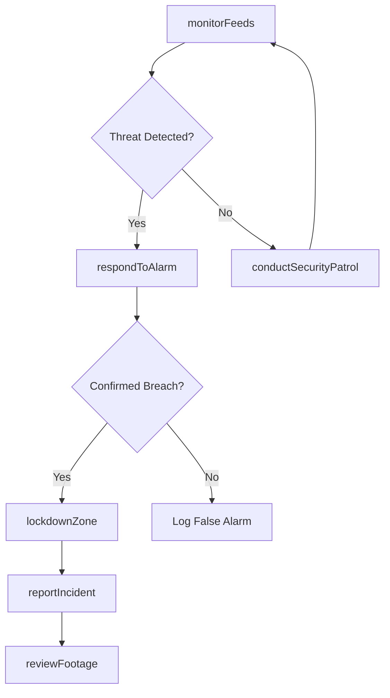
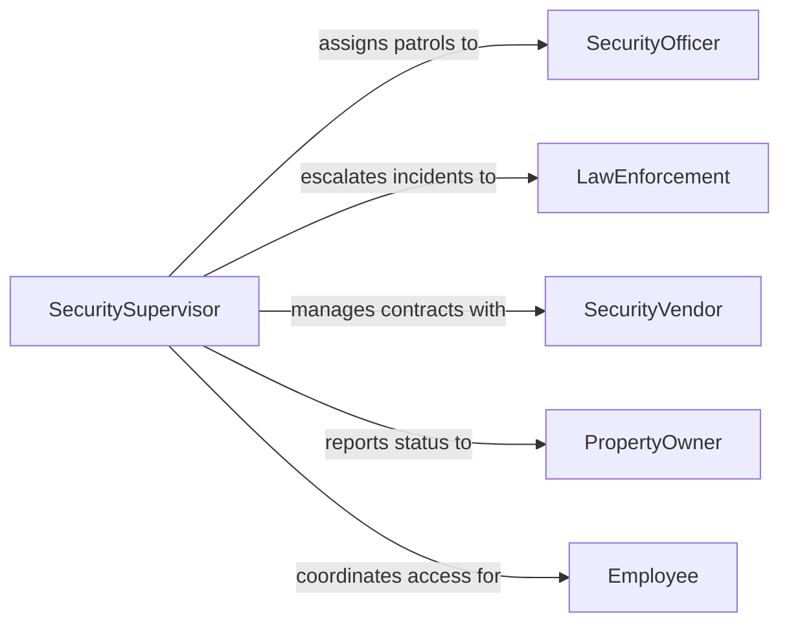

# Monitor Work Areas Provide Security

> Business-as-Code definition for monitoring work areas to provide security. Models the surveillance and access control lifecycle from threat assessment through incident resolution.

## Overview

Work area security monitoring involves the continuous observation of workplaces, warehouses, construction sites, and other operational facilities to prevent unauthorized access, theft, vandalism, and workplace violence. This definition covers access control management, video surveillance operations, alarm response, and security incident documentation. The process integrates physical security measures with technology-driven monitoring to maintain safe working environments.

## Actors

| Actor | Description |
|-------|-------------|
| Employee | Staff members whose work areas are under security protection |
| AuthorizedVisitor | Pre-approved individuals granted temporary access to secured areas |
| LawEnforcement | Police or sheriff agencies responding to criminal activity reports |
| SecurityVendor | Third-party providers of surveillance equipment, alarm systems, and guard services |
| PropertyOwner | Building or land owner with oversight of security requirements |

## Roles

| Role | Description |
|------|-------------|
| SecuritySupervisor | Manages the security team and oversees monitoring operations |
| SecurityOfficer | Performs patrols, monitors feeds, and responds to alarms |
| AccessControlAdministrator | Manages badge systems, access permissions, and visitor credentials |
| IncidentInvestigator | Reviews security incidents and compiles evidence for reporting |

## Entities

| Entity | Description |
|--------|-------------|
| SecurityZone | A defined area with specific access requirements and monitoring coverage |
| AccessCredential | Badge, key card, or biometric authorization for zone entry |
| SurveillanceFeed | Live or recorded video stream from a security camera |
| SecurityIncident | A documented breach, intrusion attempt, or suspicious activity event |
| AlarmEvent | An automated alert triggered by sensors, motion detectors, or perimeter breaches |
| PatrolRoute | A predefined path and schedule for security officer walk-throughs |

## Actions

| Action | Description |
|--------|-------------|
| monitorFeeds | Observe live surveillance camera feeds across all security zones |
| controlAccess | Grant, revoke, or modify access credentials for individuals |
| respondToAlarm | Investigate and address a triggered alarm event |
| conductSecurityPatrol | Execute a scheduled walk-through of designated security zones |
| reportIncident | Document a security breach or suspicious activity with evidence |
| lockdownZone | Restrict all access to a specific security zone during a threat |
| reviewFootage | Retrieve and analyze recorded surveillance video for investigations |

## Events

| Event | Description |
|-------|-------------|
| alarmTriggered | A security alarm has been activated by sensor or manual activation |
| accessGranted | An individual has been authorized to enter a secured zone |
| accessDenied | An access attempt has been rejected due to invalid credentials |
| incidentReported | A security incident has been formally documented |
| patrolCompleted | A scheduled security patrol has been finished |
| zoneLocked | A security zone has been placed in lockdown status |
| unauthorizedAccessDetected | An individual has entered a restricted zone without authorization |

## Searches

| Search | Description |
|--------|-------------|
| findActiveAlarms | Retrieve currently unresolved alarm events by zone or severity |
| getAccessLog | List access events filtered by individual, zone, or time range |
| findIncidents | Search security incidents by type, date, or zone |
| getPatrolSchedule | Retrieve upcoming and completed patrol assignments by officer or route |

## Workflow



## Actor Relationships



## Usage

### Calling Actions

```typescript
import { monitorWorkAreasProvideSecurity } from '@headlessly/monitor-work-areas-provide-security'

const security = monitorWorkAreasProvideSecurity()

// Monitor surveillance feeds for the warehouse zone
const feeds = await security.monitorFeeds({
  zones: ['warehouse-north', 'warehouse-south', 'loading-dock'],
  alertThreshold: 'motion'
})

// Grant temporary access to a contractor
await security.controlAccess({
  action: 'grant',
  individual: { name: 'Jane Rivera', company: 'Apex Electric' },
  zones: ['warehouse-north'],
  validFrom: '2026-03-01T08:00:00Z',
  validUntil: '2026-03-01T17:00:00Z'
})

// Report a security incident
await security.reportIncident({
  zone: 'loading-dock',
  type: 'unauthorizedAccess',
  description: 'Individual without badge observed entering through bay door 3',
  severity: 'high',
  timestamp: '2026-03-01T14:23:00Z'
})
```

### Event-Driven Automation

```typescript
// Auto-lockdown on unauthorized access
security.unauthorizedAccessDetected(async ({ zone, individual, timestamp }) => {
  await security.lockdownZone({ zone })
  await notify({
    to: 'security-team',
    message: `Unauthorized access in ${zone} at ${timestamp}`
  })
})

// Escalate repeated access denials
security.accessDenied(async ({ individual, zone, attemptCount }) => {
  if (attemptCount >= 3) {
    await security.reportIncident({
      zone,
      type: 'repeatedAccessDenial',
      description: `${individual.name} denied access ${attemptCount} times`
    })
  }
})
```
