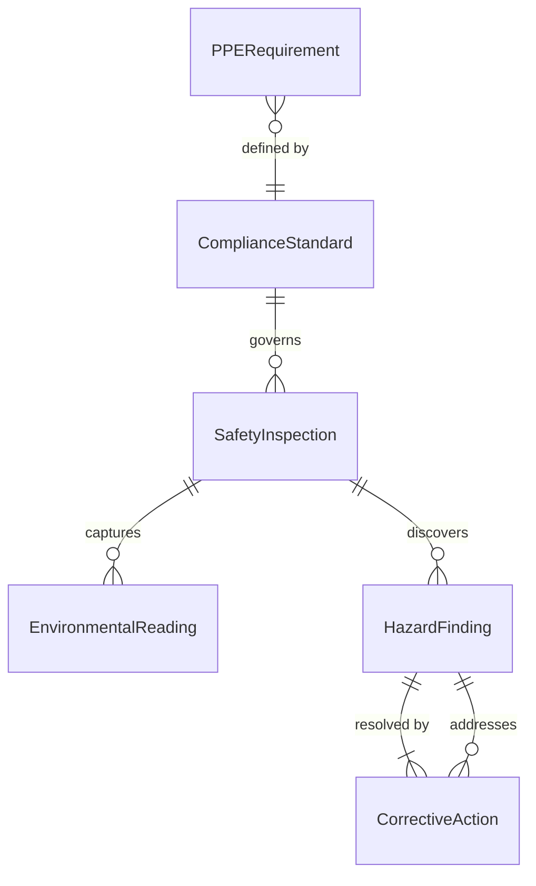
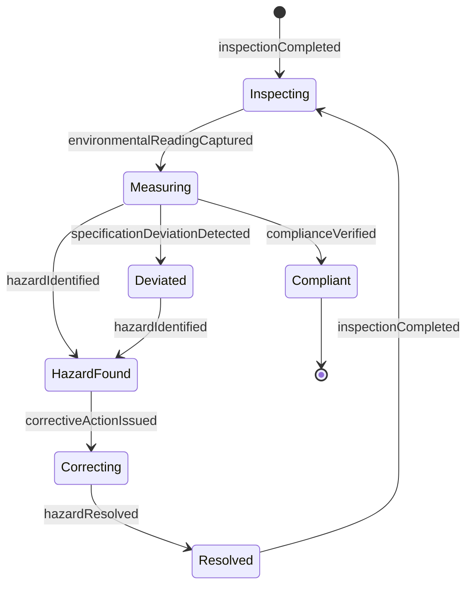
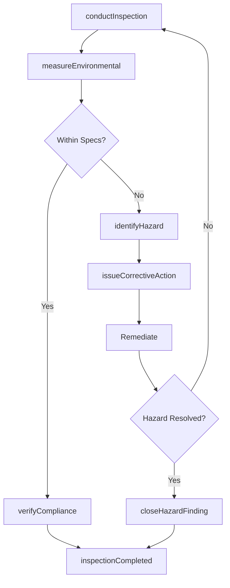
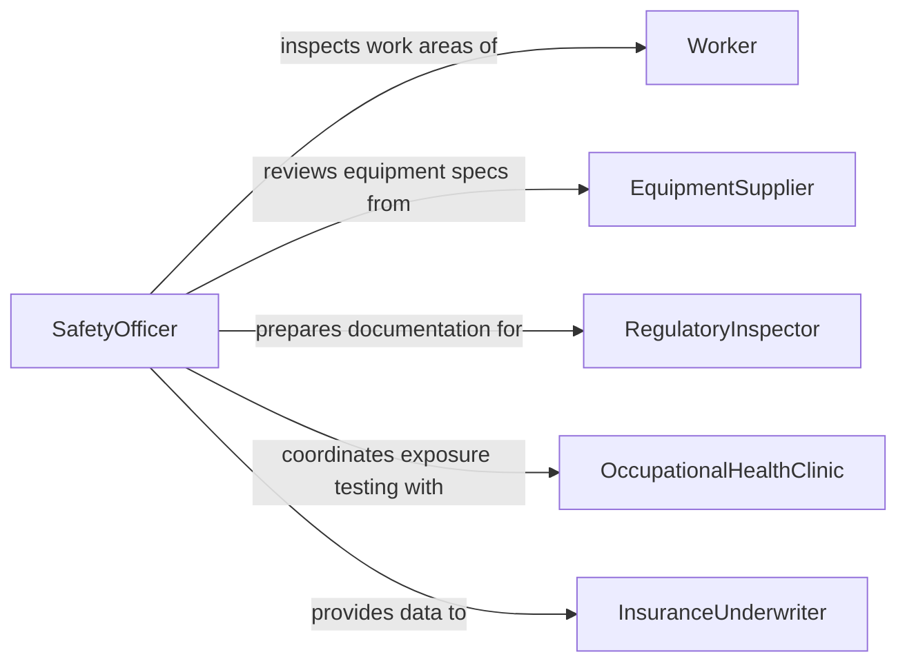

# Monitor Work Environment Ensure Safety

> Business-as-Code definition for work environment safety monitoring. Models the systematic observation of workplace conditions, equipment, and practices to ensure compliance with safety standards and adherence to operational specifications.

## Overview

Work environment monitoring involves inspecting physical conditions, equipment states, and worker practices to identify safety hazards and specification deviations before they cause harm. Safety professionals measure environmental factors such as air quality, noise levels, and temperature, while also observing worker behavior and equipment operation for compliance with established standards. This definition covers ongoing environmental assessment, hazard identification, corrective action tracking, and regulatory compliance verification.

## Actors

| Actor | Description |
|-------|-------------|
| Worker | An employee performing tasks in the monitored work environment |
| EquipmentSupplier | Provides machinery and tools with defined safety operating parameters |
| RegulatoryInspector | External authority that audits workplace conditions for legal compliance |
| OccupationalHealthClinic | Provides medical surveillance and exposure assessments for workers |
| InsuranceUnderwriter | Evaluates workplace safety conditions for liability and premium determinations |

## Roles

| Role | Description |
|------|-------------|
| SafetyOfficer | Conducts inspections, identifies hazards, and enforces safety protocols |
| EnvironmentalHealthSpecialist | Monitors air quality, noise, chemical exposure, and other environmental factors |
| ProductionSupervisor | Ensures work processes adhere to both safety and operational specifications |
| ComplianceManager | Tracks regulatory requirements and manages audit readiness |

## Entities

| Entity | Description |
|--------|-------------|
| SafetyInspection | A formal evaluation of a work area against safety checklists and standards |
| EnvironmentalReading | A measured value for air quality, noise, temperature, humidity, or chemical concentration |
| HazardFinding | A documented safety risk identified during inspection or monitoring |
| CorrectiveAction | A planned or completed remediation for an identified hazard |
| ComplianceStandard | A regulatory or organizational rule that the work environment must satisfy |
| PPERequirement | A documented personal protective equipment mandate for a specific work area or task |

## Actions

| Action | Description |
|--------|-------------|
| conductInspection | Perform a systematic safety evaluation of a work area |
| measureEnvironmental | Capture readings for air quality, noise, temperature, or chemical levels |
| identifyHazard | Document a discovered safety risk with severity and location details |
| issueCorrectiveAction | Assign a remediation task for an identified hazard with a deadline |
| verifyCompliance | Check a work area or process against applicable regulatory standards |
| assessPPEAdherence | Evaluate whether workers are using required protective equipment correctly |
| closeHazardFinding | Mark a hazard as resolved after corrective action is verified |

## Events

| Event | Description |
|-------|-------------|
| inspectionCompleted | A formal safety inspection of a work area has been finished |
| environmentalReadingCaptured | An environmental measurement has been recorded |
| hazardIdentified | A safety risk has been found and documented |
| correctiveActionIssued | A remediation task has been assigned for a hazard |
| complianceVerified | A work area or process has been confirmed as meeting regulatory standards |
| specificationDeviationDetected | A monitored condition has fallen outside its acceptable operating range |
| hazardResolved | A corrective action has been completed and verified |

## Searches

| Search | Description |
|--------|-------------|
| findOpenHazards | Retrieve unresolved hazard findings filtered by area, severity, or age |
| getEnvironmentalHistory | Query environmental readings over time for a specific location and parameter |
| getInspectionResults | List completed inspections by area, date, or compliance outcome |
| findOverdueCorrectiveActions | Locate corrective actions that have passed their remediation deadline |

## Entity Relationships



## State Diagram



## Workflow



## Actor Relationships



## Usage

### Calling Actions

```typescript
import { monitorWorkEnvironmentEnsureSafety } from '@headlessly/monitor-work-environment-ensure-safety'

const envMonitor = monitorWorkEnvironmentEnsureSafety()

// Conduct a scheduled safety inspection
const inspection = await envMonitor.conductInspection({
  areaId: 'WELDING-SHOP-B',
  inspectorId: 'SO-204',
  checklistId: 'CL-WELDING-SAFETY-V3',
  date: '2026-02-05'
})

// Measure air quality in the work area
await envMonitor.measureEnvironmental({
  areaId: 'WELDING-SHOP-B',
  parameter: 'hexavalent-chromium',
  value: 0.0048,
  unit: 'mg/m3',
  permissibleLimit: 0.005
})

// Issue a corrective action for a finding
await envMonitor.issueCorrectiveAction({
  hazardId: 'HZ-1192',
  assignedTo: 'production-supervisor',
  description: 'Install additional local exhaust ventilation at welding station 4',
  deadline: '2026-02-19'
})
```

### Event-Driven Automation

```typescript
// Alert when environmental readings exceed limits
envMonitor.specificationDeviationDetected(async ({ areaId, parameter, value, limit }) => {
  await notify({
    to: 'safety-officer',
    message: `${parameter} at ${value} exceeds limit of ${limit} in ${areaId}`
  })
})

// Escalate overdue corrective actions
envMonitor.correctiveActionIssued(async ({ hazardId, deadline }) => {
  await scheduleReminder({
    at: deadline,
    action: async () => {
      const open = await envMonitor.findOpenHazards({ hazardId })
      if (open.length > 0) {
        await notify({
          to: 'compliance-manager',
          message: `Corrective action for hazard ${hazardId} is overdue`
        })
      }
    }
  })
})
```
