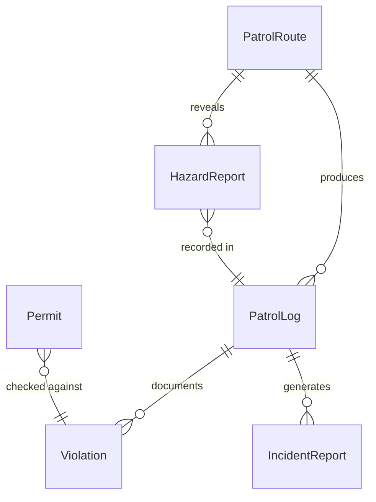
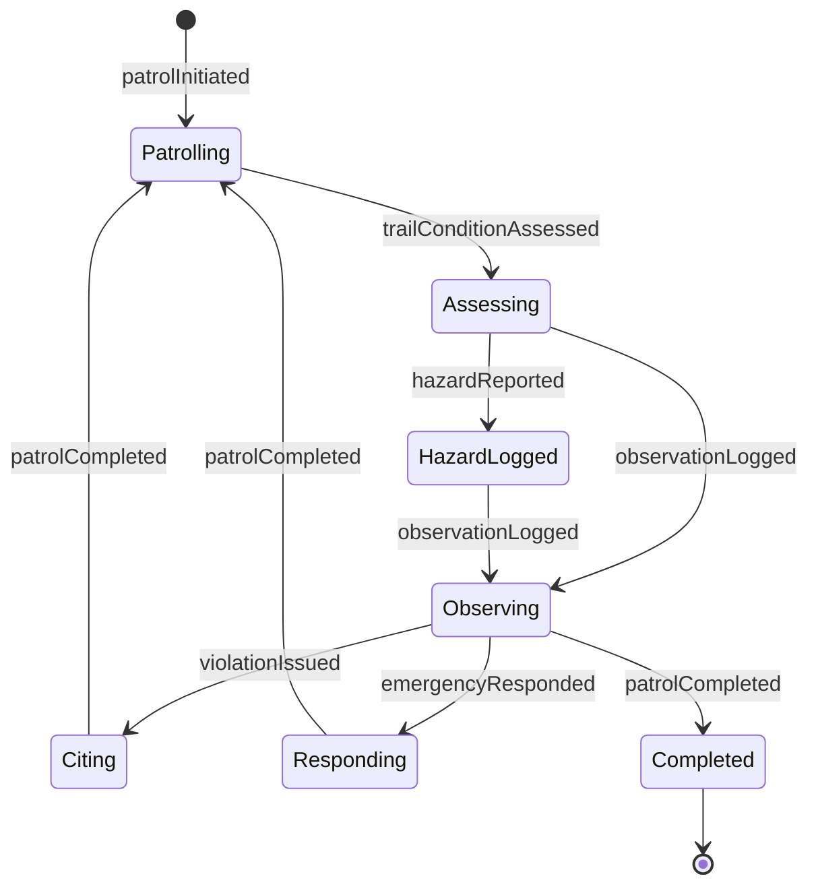
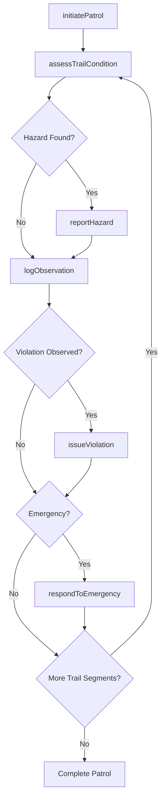
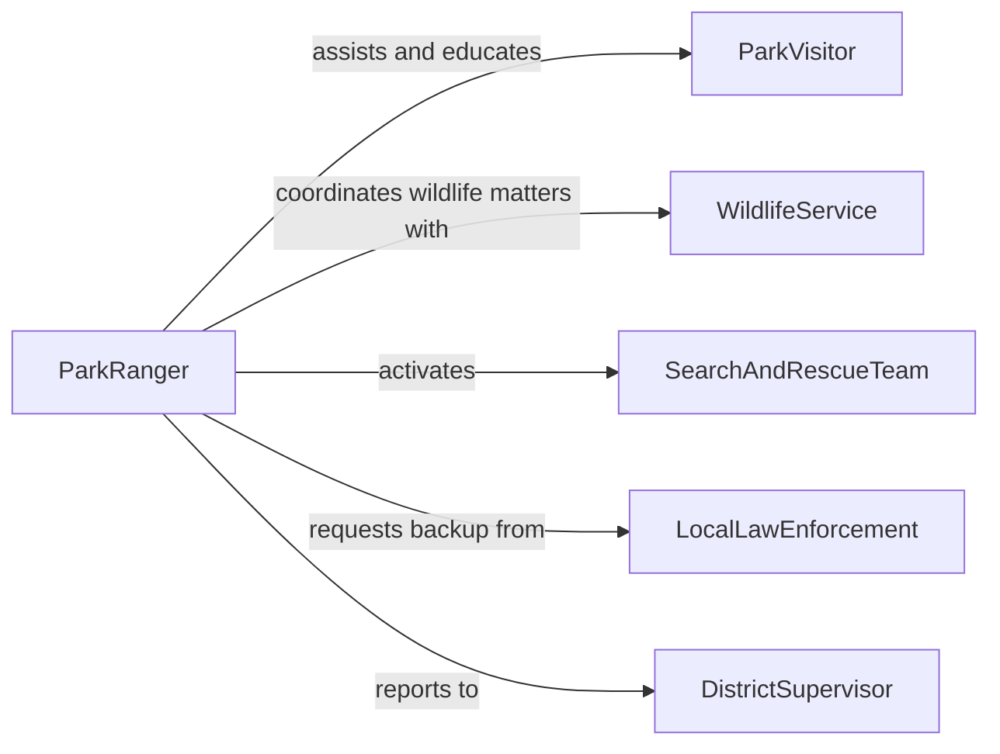

# Patrol Natural Areas Ensure Safety

> Business-as-Code definition for natural area patrol operations. Models the systematic patrolling of parks, forests, wildlife refuges, and other natural areas to ensure public safety, enforce environmental regulations, and protect natural resources.

## Overview

Patrolling natural areas involves traversing designated territories on foot, by vehicle, or by watercraft to maintain public safety and enforce land-use regulations. Rangers and conservation officers monitor for illegal activities such as poaching and unauthorized logging, respond to visitor emergencies, and assess environmental conditions including wildfire risk and trail hazards. This definition covers patrol planning, execution, incident documentation, and regulatory enforcement across managed natural lands.

## Actors

| Actor | Description |
|-------|-------------|
| ParkVisitor | Members of the public using trails, campsites, and recreational facilities |
| WildlifeService | Federal or state agency responsible for wildlife management and protection |
| SearchAndRescueTeam | Specialized responders deployed for lost or injured visitor emergencies |
| LocalLawEnforcement | Police agencies that assist with criminal activity in natural areas |
| LandManagementAgency | Government body that sets policies for the managed natural territory |

## Roles

| Role | Description |
|------|-------------|
| ParkRanger | Conducts field patrols, enforces regulations, and assists visitors |
| DistrictSupervisor | Assigns patrol routes and manages ranger staffing across districts |
| ConservationOfficer | Investigates wildlife violations and enforces hunting and fishing laws |
| TrailMaintenanceLead | Assesses trail conditions and coordinates hazard remediation |

## Entities

| Entity | Description |
|--------|-------------|
| PatrolRoute | A defined path through a natural area with designated checkpoints |
| PatrolLog | A chronological record of observations and actions during a patrol |
| Violation | A documented instance of a rule or regulation being broken |
| IncidentReport | A formal record of a safety event, crime, or emergency in the area |
| Permit | An authorization for a specific activity such as camping, hunting, or logging |
| HazardReport | A documented environmental risk such as a downed tree, flood, or fire danger |

## Actions

| Action | Description |
|--------|-------------|
| initiatePatrol | Begin a patrol session along a designated route with recorded start time |
| logObservation | Record a notable condition, wildlife sighting, or environmental change |
| issueViolation | Document and cite a person for breaking a park or wildlife regulation |
| respondToEmergency | Provide immediate assistance for an injured, lost, or endangered visitor |
| assessTrailCondition | Evaluate a trail segment for hazards and accessibility |
| reportHazard | File a formal report for an identified environmental or infrastructure hazard |
| verifyPermit | Check that individuals or groups hold valid permits for their activity |

## Events

| Event | Description |
|-------|-------------|
| patrolInitiated | A ranger has begun a patrol on a designated route |
| observationLogged | A notable field observation has been recorded during patrol |
| violationIssued | A regulation violation citation has been documented |
| emergencyResponded | An emergency response action has been completed in the field |
| trailConditionAssessed | A trail segment evaluation has been recorded |
| hazardReported | An environmental or infrastructure hazard has been formally documented |
| patrolCompleted | A patrol session has ended with all checkpoints covered |

## Searches

| Search | Description |
|--------|-------------|
| findPatrolsByRoute | Retrieve patrol logs for a specific route or district over a time range |
| getActiveViolations | List open violation citations by type, location, or date |
| getHazardReports | Query reported hazards filtered by severity, area, or resolution status |
| findPermitActivity | Locate active permits and associated holder information for a given area |

## Entity Relationships



## State Diagram



## Workflow



## Actor Relationships



## Usage

### Calling Actions

```typescript
import { patrolNaturalAreasEnsureSafety } from '@headlessly/patrol-natural-areas-ensure-safety'

const patrol = patrolNaturalAreasEnsureSafety()

// Start a patrol session
const session = await patrol.initiatePatrol({
  rangerId: 'R-114',
  routeId: 'ROUTE-NORTH-RIDGE',
  startTime: '2026-02-05T06:00:00Z',
  mode: 'foot'
})

// Log a field observation
await patrol.logObservation({
  patrolId: session.id,
  type: 'wildlife-sighting',
  location: { lat: 37.7459, lng: -119.5332 },
  description: 'Black bear with two cubs near Merced River crossing'
})

// Issue a violation citation
await patrol.issueViolation({
  patrolId: session.id,
  type: 'illegal-campfire',
  location: { lat: 37.7481, lng: -119.5298 },
  individualId: 'VIS-9923',
  details: 'Campfire outside designated ring during fire restriction period'
})
```

### Event-Driven Automation

```typescript
// Alert dispatch when emergency response occurs
patrol.emergencyResponded(async ({ patrolId, location, emergencyType }) => {
  await notify({
    to: 'district-supervisor',
    message: `Emergency response initiated: ${emergencyType} at ${location.lat}, ${location.lng}`
  })
})

// Auto-close trail when hazard severity is critical
patrol.hazardReported(async ({ hazardId, severity, trailSegment }) => {
  if (severity === 'critical') {
    await closeTrailSegment({
      segment: trailSegment,
      reason: `Hazard report ${hazardId}: critical condition`
    })
  }
})
```
