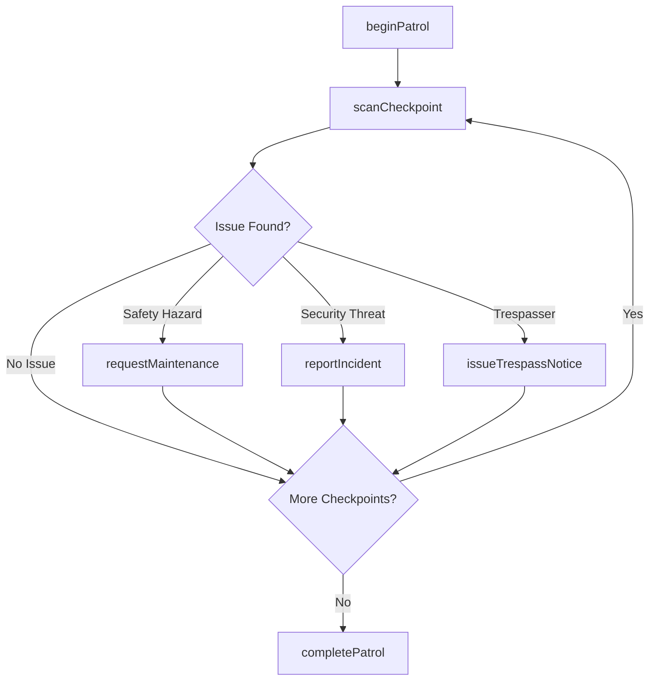
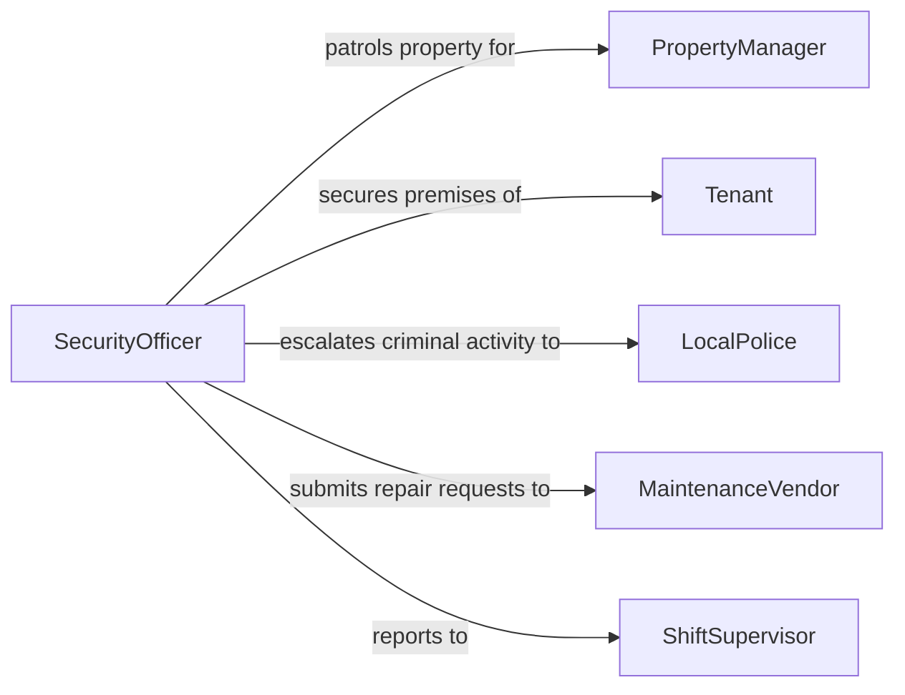

# Patrol Properties Maintain Safety

> Business-as-Code definition for property safety patrols. Models the systematic physical inspection of buildings, grounds, and perimeters to deter crime, identify hazards, and maintain a safe environment for occupants and visitors.

## Overview

Property patrolling involves security personnel making scheduled or random rounds through buildings, parking structures, grounds, and perimeter fencing to detect unauthorized activity, safety hazards, and maintenance issues. Officers verify that doors are secured, lighting is functional, fire exits are unobstructed, and no suspicious persons or conditions are present. This definition covers patrol scheduling, checkpoint verification, incident documentation, and escalation procedures.

## Actors

| Actor | Description |
|-------|-------------|
| PropertyManager | The facility owner or management company responsible for the property |
| Tenant | A business or resident occupying space within the patrolled property |
| LocalPolice | Law enforcement that responds to criminal activity discovered during patrols |
| MaintenanceVendor | Service provider that repairs hazards or equipment issues found on patrol |
| Visitor | A guest, customer, or delivery person present on the property |

## Roles

| Role | Description |
|------|-------------|
| SecurityOfficer | Performs physical patrols and reports observations |
| ShiftSupervisor | Assigns patrol routes, reviews patrol completion, and manages officer schedules |
| SecurityDirector | Sets patrol policies, reviews incident trends, and manages vendor contracts |
| ControlRoomOperator | Monitors camera feeds and communicates with officers during patrols |

## Entities

| Entity | Description |
|--------|-------------|
| PatrolRoute | A defined sequence of checkpoints and areas to be covered during a patrol |
| Checkpoint | A specific location that must be visited and verified during a patrol round |
| PatrolLog | A timestamped record of checkpoint visits and observations during a patrol |
| IncidentReport | A formal document describing a security or safety event found during patrol |
| MaintenanceRequest | A work order generated when a patrol reveals a facility issue |
| TrespassNotice | A formal warning issued to an unauthorized individual found on the property |

## Actions

| Action | Description |
|--------|-------------|
| beginPatrol | Start a patrol round with route assignment and officer check-in |
| scanCheckpoint | Verify a specific location and record its condition during patrol |
| reportIncident | Document a security or safety event discovered during patrol |
| detainIndividual | Temporarily hold a trespasser or suspect until law enforcement arrives |
| requestMaintenance | Submit a work order for a hazard or facility issue found during patrol |
| issueTrespassNotice | Formally warn and document an unauthorized person on the property |
| completePatrol | Close out a patrol round with summary observations and checkpoint completion |

## Events

| Event | Description |
|-------|-------------|
| patrolBegun | A security officer has started a scheduled or ad-hoc patrol round |
| checkpointScanned | A specific location has been visited and verified during patrol |
| incidentReported | A security or safety event has been documented during patrol |
| individualDetained | An unauthorized person has been held pending law enforcement arrival |
| maintenanceRequested | A facility repair work order has been generated from a patrol finding |
| trespassNoticeIssued | A formal trespass warning has been documented and served |
| patrolCompleted | A patrol round has been finished with all checkpoints visited |

## Searches

| Search | Description |
|--------|-------------|
| findPatrolLogs | Retrieve patrol records by officer, route, date range, or completion status |
| getIncidentsByProperty | List security and safety incidents for a property over a given period |
| getMissedCheckpoints | Identify checkpoints that were not scanned during completed patrols |
| findOpenMaintenanceRequests | Locate unresolved maintenance issues generated from patrol findings |

## Workflow



## Actor Relationships



## Usage

### Calling Actions

```typescript
import { patrolPropertiesMaintainSafety } from '@headlessly/patrol-properties-maintain-safety'

const patrol = patrolPropertiesMaintainSafety()

// Start an evening patrol round
const round = await patrol.beginPatrol({
  officerId: 'SEC-087',
  routeId: 'ROUTE-EVENING-BLDG-A',
  startTime: '2026-02-05T22:00:00Z',
  propertyId: 'PROP-RIVERSIDE-PLAZA'
})

// Scan a checkpoint and record observations
await patrol.scanCheckpoint({
  patrolId: round.id,
  checkpointId: 'CP-PARKING-LEVEL-3',
  status: 'secure',
  notes: 'All lights functional, no vehicles after hours, gate locked'
})

// Report a discovered incident
await patrol.reportIncident({
  patrolId: round.id,
  type: 'vandalism',
  location: 'Building A, stairwell B, floor 2',
  description: 'Broken window in stairwell door, glass debris on landing',
  severity: 'medium'
})
```

### Event-Driven Automation

```typescript
// Auto-generate maintenance request when incidents involve property damage
patrol.incidentReported(async ({ patrolId, type, location, description }) => {
  if (['vandalism', 'water-leak', 'structural-damage'].includes(type)) {
    await patrol.requestMaintenance({
      patrolId,
      location,
      description: `Patrol finding: ${description}`,
      priority: 'urgent'
    })
  }
})

// Alert supervisor when checkpoints are missed
patrol.patrolCompleted(async ({ patrolId, routeId }) => {
  const missed = await patrol.getMissedCheckpoints({ patrolId })
  if (missed.length > 0) {
    await notify({
      to: 'shift-supervisor',
      message: `Patrol ${patrolId} missed ${missed.length} checkpoints on route ${routeId}`
    })
  }
})
```
