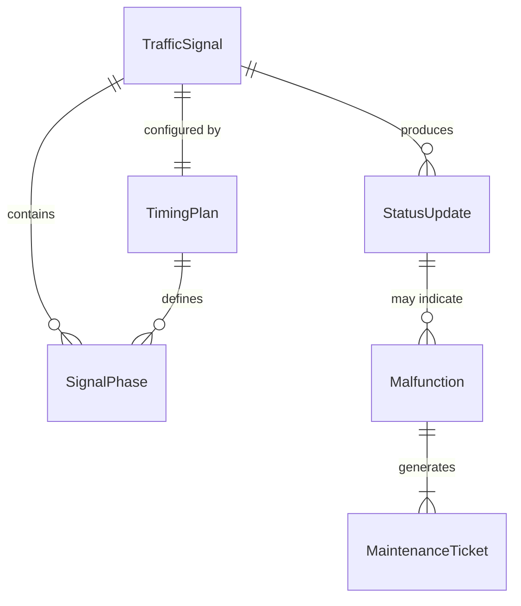
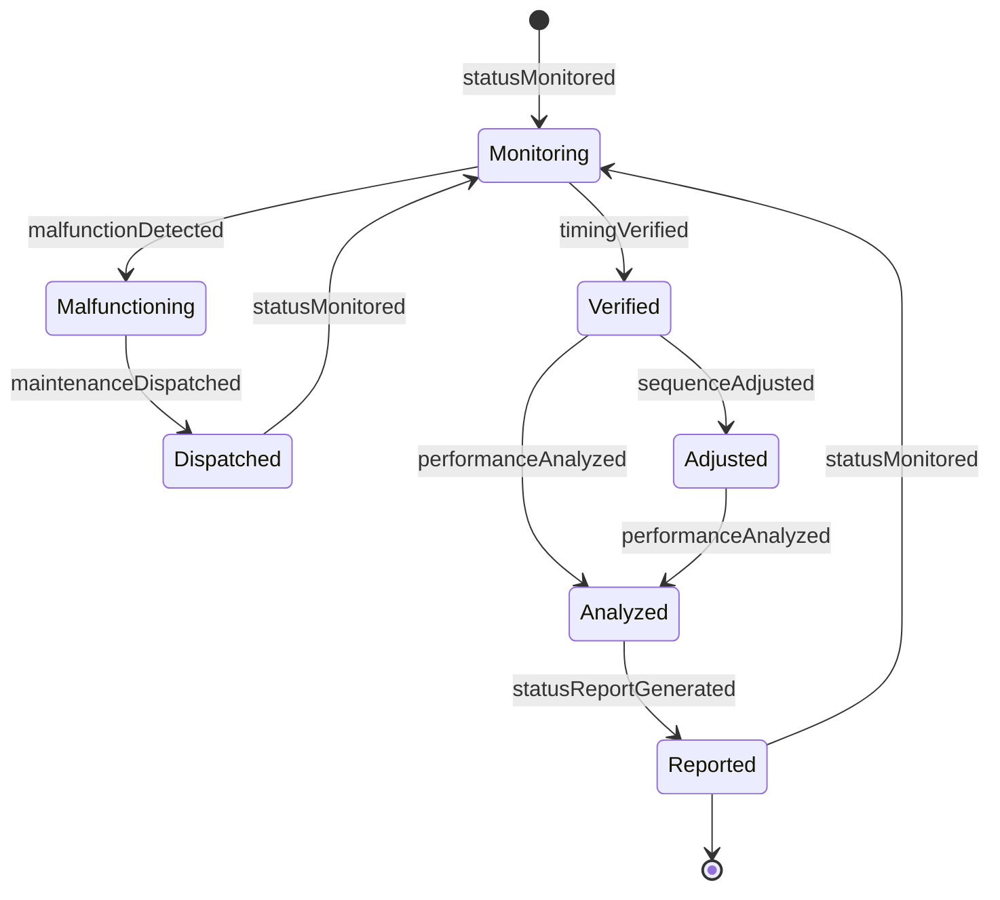
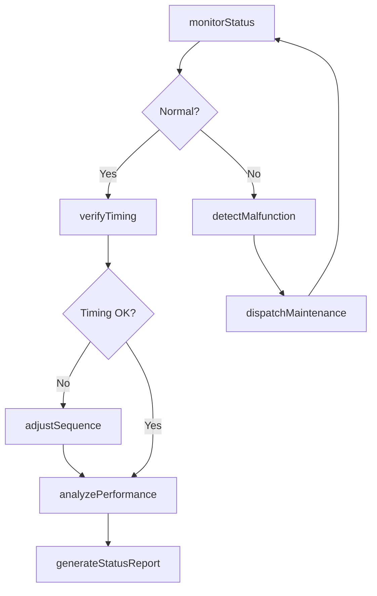
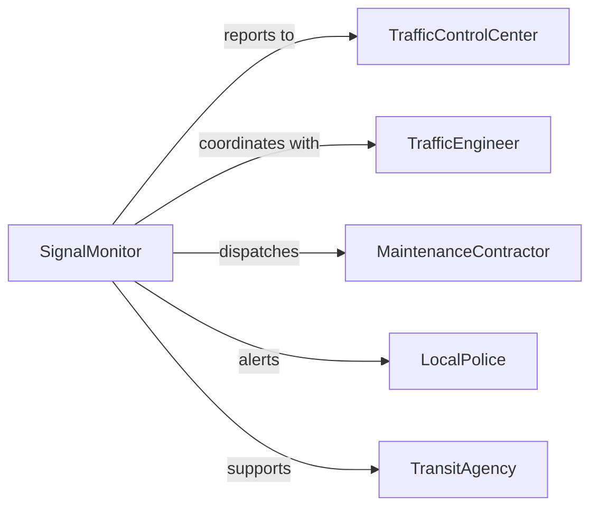

# Monitor Traffic Signals

> Business-as-Code definition for monitoring traffic signals. Provides real-time signal status tracking, malfunction detection, and traffic flow optimization for intelligent transportation systems.

## Overview

Traffic signal monitoring involves real-time observation of signal operations, timing sequences, and performance to ensure proper traffic flow and safety. This definition exposes monitoring actions for signal status tracking, malfunction detection, and event-driven alerts to maintain efficient and safe intersection management.

## Actors

| Actor | Description |
|-------|-------------|
| TrafficEngineer | Designs and optimizes traffic signal timing plans |
| MaintenanceContractor | Performs signal repairs and equipment servicing |
| LocalPolice | Responds to traffic signal malfunctions and incidents |
| EmergencyVehicle | Requires priority signal coordination |
| TransitAgency | Coordinates signal priority for public transportation |
| TrafficControlCenter | Manages central monitoring and control systems |

## Roles

| Role | Description |
|------|-------------|
| SignalMonitor | Tracks real-time traffic signal status and operations |
| TrafficController | Adjusts signal timing based on traffic conditions |
| MaintenanceCoordinator | Schedules and manages signal repair activities |
| SystemAdministrator | Maintains traffic management system infrastructure |

## Entities

| Entity | Description |
|--------|-------------|
| TrafficSignal | A traffic control device at an intersection |
| SignalPhase | A specific timing sequence within signal cycle |
| StatusUpdate | A real-time report of signal operational state |
| Malfunction | A detected failure or abnormal signal operation |
| TimingPlan | A configured schedule of signal phase durations |
| MaintenanceTicket | A documented signal repair or service request |

## Actions

| Action | Description |
|--------|-------------|
| monitorStatus | Track real-time operational state of traffic signals |
| detectMalfunction | Identify signal failures or abnormal operations |
| verifyTiming | Confirm signal phase durations match timing plan |
| adjustSequence | Modify signal timing in response to traffic conditions |
| dispatchMaintenance | Request repair service for malfunctioning signals |
| analyzePerformance | Evaluate signal effectiveness on traffic flow |
| generateStatusReport | Create documentation of signal monitoring findings |

## Events

| Event | Description |
|-------|-------------|
| statusMonitored | Signal operational state has been tracked |
| malfunctionDetected | Signal failure or abnormal operation identified |
| timingVerified | Signal phase durations confirmed as correct |
| sequenceAdjusted | Signal timing has been modified |
| maintenanceDispatched | Repair service has been requested |
| performanceAnalyzed | Signal effectiveness evaluation completed |
| statusReportGenerated | Signal monitoring documentation created |

## Searches

| Search | Description |
|--------|-------------|
| findSignals | List traffic signals by location or status |
| getMalfunctions | Retrieve signal failures by type or date |
| getTimingPlans | Find signal timing configurations by intersection |
| getMaintenanceTickets | List repair requests by signal or priority |

## Entity Relationships



## State Diagram



## Workflow



## Actor Relationships



## Usage

### Calling Actions

```typescript
import { monitorTrafficSignals } from '@headlessly/monitor-traffic-signals'

const signals = monitorTrafficSignals()

// Monitor signal status
await signals.monitorStatus({
  signalId: 'SIG-MAIN-5TH-001',
  intersection: 'Main St & 5th Ave',
  checkInterval: 30,
  monitoredPhases: ['northbound', 'southbound', 'eastbound', 'westbound']
})

// Detect malfunction
const malfunction = await signals.detectMalfunction({
  signalId: 'SIG-MAIN-5TH-001',
  issue: 'Red light not illuminating in northbound phase',
  detectedAt: new Date(),
  severity: 'critical'
})

// Dispatch maintenance
await signals.dispatchMaintenance({
  malfunctionId: malfunction.id,
  signalId: 'SIG-MAIN-5TH-001',
  priority: 'emergency',
  contractor: 'City Signal Services',
  estimatedResponseTime: 30
})
```

### Event-Driven Automation

```typescript
// Alert on critical malfunctions
signals.malfunctionDetected(async ({ signalId, issue, severity }) => {
  if (severity === 'critical') {
    await notify({
      to: ['traffic-control-center', 'local-police'],
      priority: 'urgent',
      message: `Critical traffic signal malfunction at ${signalId}: ${issue}`,
      action: 'dispatch-traffic-control'
    })
    await signals.dispatchMaintenance({ signalId, priority: 'emergency' })
  }
})

// Optimize timing based on performance analysis
signals.performanceAnalyzed(async ({ signalId, metrics }) => {
  if (metrics.averageDelay > 120 || metrics.queueLength > 20) {
    await signals.adjustSequence({
      signalId,
      optimization: 'reduce-congestion',
      adjustedPhases: metrics.congestedDirections
    })
  }
})
```
