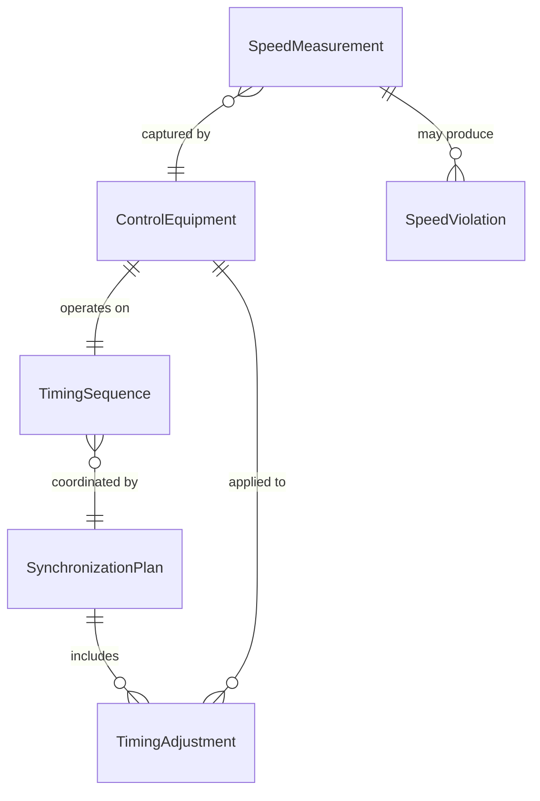
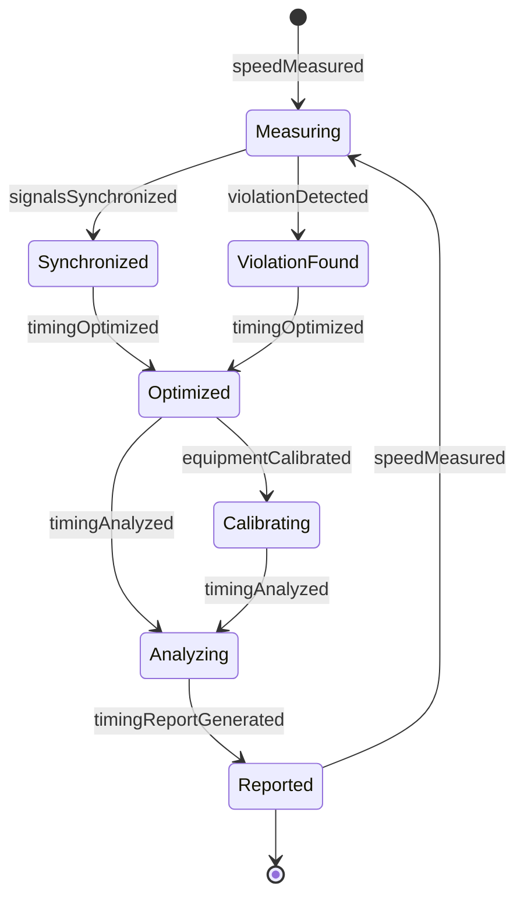
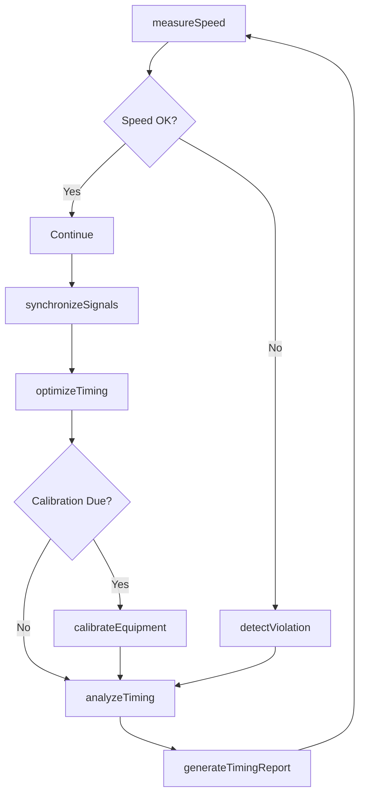
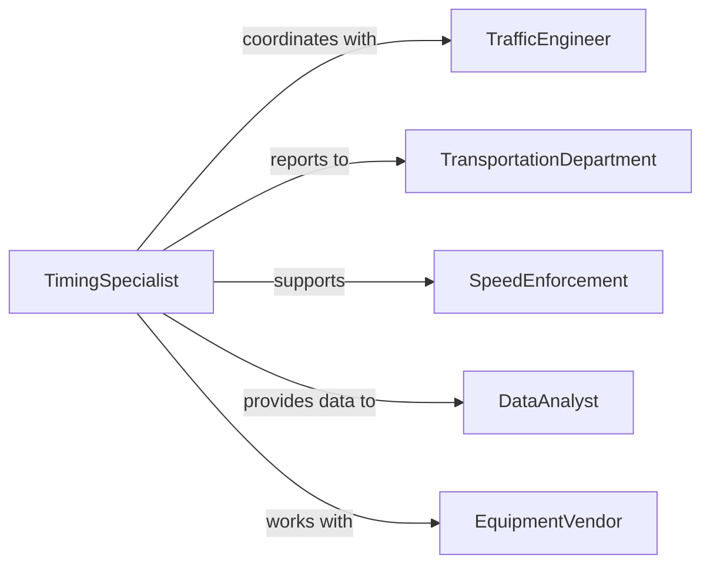

# Time Vehicle Speed Traffic-control Equipment

> Business-as-Code definition for timing vehicle speed and traffic-control equipment operation. Provides speed measurement, timing synchronization, and traffic control optimization for intelligent transportation management.

## Overview

Timing vehicle speed and traffic-control equipment involves precise measurement of vehicle velocities, synchronization of traffic signals, and coordination of traffic control devices to optimize traffic flow and safety. This definition exposes timing actions, speed monitoring capabilities, and event-driven alerts for adaptive traffic management systems.

## Actors

| Actor | Description |
|-------|-------------|
| TrafficEngineer | Designs and optimizes traffic timing strategies |
| SpeedEnforcement | Monitors and enforces speed regulations |
| TransportationDepartment | Manages traffic infrastructure and systems |
| DataAnalyst | Analyzes traffic patterns and timing effectiveness |
| EquipmentVendor | Provides and maintains traffic control hardware |
| SafetyCouncil | Advocates for traffic safety improvements |

## Roles

| Role | Description |
|------|-------------|
| TimingSpecialist | Configures and optimizes traffic control timing |
| SpeedMonitor | Tracks vehicle velocities and traffic flow rates |
| SystemOperator | Manages real-time traffic control equipment |
| PerformanceAnalyst | Evaluates timing effectiveness and safety outcomes |

## Entities

| Entity | Description |
|--------|-------------|
| SpeedMeasurement | A recorded vehicle velocity at specific location |
| TimingSequence | A coordinated schedule of traffic control operations |
| ControlEquipment | A traffic management device with timing capabilities |
| SynchronizationPlan | A strategy for coordinating multiple traffic signals |
| SpeedViolation | A recorded instance of excessive vehicle velocity |
| TimingAdjustment | A modification to traffic control timing parameters |

## Actions

| Action | Description |
|--------|-------------|
| measureSpeed | Capture vehicle velocity at monitoring location |
| synchronizeSignals | Coordinate timing of multiple traffic control devices |
| optimizeTiming | Adjust control equipment timing for traffic flow |
| detectViolation | Identify vehicles exceeding speed limits |
| calibrateEquipment | Verify accuracy of timing and speed measurement devices |
| analyzeTiming | Evaluate effectiveness of traffic control timing |
| generateTimingReport | Create documentation of speed and timing data |

## Events

| Event | Description |
|-------|-------------|
| speedMeasured | Vehicle velocity has been captured |
| signalsSynchronized | Traffic control devices have been coordinated |
| timingOptimized | Control equipment timing has been adjusted |
| violationDetected | Excessive vehicle speed has been identified |
| equipmentCalibrated | Timing and measurement device accuracy verified |
| timingAnalyzed | Traffic control timing effectiveness evaluated |
| timingReportGenerated | Speed and timing documentation created |

## Searches

| Search | Description |
|--------|-------------|
| findSpeedMeasurements | Retrieve vehicle velocities by location or time |
| getTimingSequences | List traffic control timing schedules |
| getViolations | Find speed violations by location or severity |
| getSynchronizationPlans | Retrieve signal coordination strategies |

## Entity Relationships



## State Diagram



## Workflow



## Actor Relationships



## Usage

### Calling Actions

```typescript
import { timeVehicleSpeedTrafficControlEquipment } from '@headlessly/time-vehicle-speed-traffic-control-equipment'

const timing = timeVehicleSpeedTrafficControlEquipment()

// Measure vehicle speed
await timing.measureSpeed({
  location: 'Main St between 5th and 6th Ave',
  equipmentId: 'RADAR-MAIN-001',
  speedLimit: 35,
  captureInterval: 'continuous'
})

// Synchronize traffic signals
await timing.synchronizeSignals({
  corridor: 'Main Street Corridor',
  signals: ['SIG-MAIN-5TH-001', 'SIG-MAIN-6TH-001', 'SIG-MAIN-7TH-001'],
  strategy: 'green-wave',
  targetSpeed: 35,
  direction: 'northbound'
})

// Optimize timing based on traffic patterns
await timing.optimizeTiming({
  equipmentId: 'SIG-MAIN-5TH-001',
  adjustments: {
    peakHours: { cycleLength: 120, greenTime: { northbound: 45, eastbound: 35 } },
    offPeakHours: { cycleLength: 90, greenTime: { northbound: 35, eastbound: 25 } }
  }
})
```

### Event-Driven Automation

```typescript
// Alert on speed violations
timing.violationDetected(async ({ location, measuredSpeed, speedLimit }) => {
  const excessSpeed = measuredSpeed - speedLimit

  if (excessSpeed > 15) {
    await notify({
      to: 'speed-enforcement',
      message: `Significant speed violation at ${location}: ${measuredSpeed} mph in ${speedLimit} mph zone`,
      action: 'dispatch-officer'
    })
  }
})

// Auto-adjust timing during high-speed periods
timing.speedMeasured(async ({ location, averageSpeed, speedLimit }) => {
  if (averageSpeed > speedLimit * 1.2) {
    await timing.optimizeTiming({
      location,
      adjustment: 'reduce-green-time',
      reason: 'excessive-speed-detected'
    })
  }
})

// Schedule calibration on timing analysis
timing.timingAnalyzed(async ({ equipmentId, metrics }) => {
  if (metrics.accuracy < 0.95 || metrics.lastCalibration > 180) {
    await timing.calibrateEquipment({
      equipmentId,
      priority: 'scheduled',
      reason: 'routine-maintenance'
    })
  }
})
```
