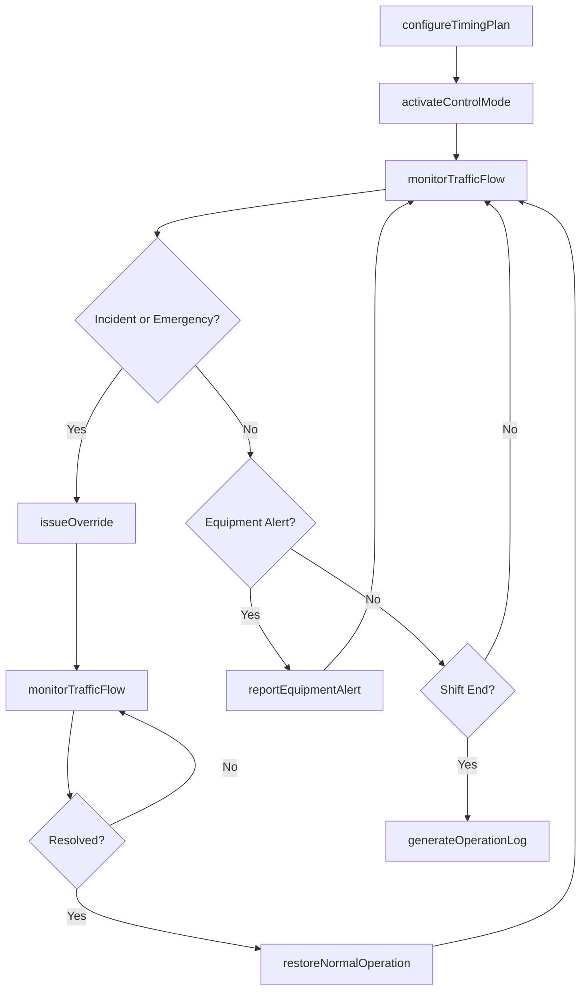
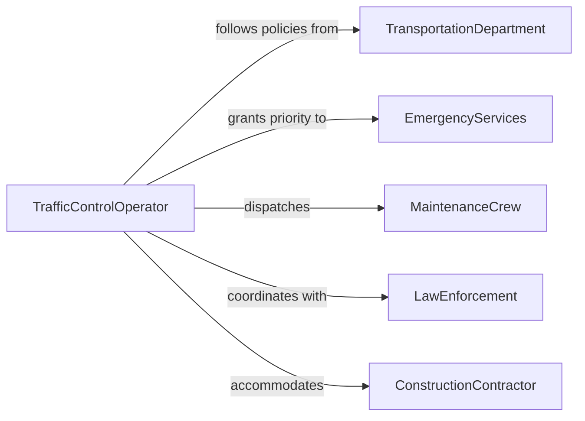

# Control Equipment Regulates Vehicle Traffic

> Business-as-Code definition for controlling equipment that regulates vehicle traffic. Models the operation, monitoring, and management of traffic control systems from signal configuration through real-time adjustment and incident response.

## Overview

Controlling equipment that regulates vehicle traffic involves operating and monitoring traffic signals, barriers, gates, railroad crossings, drawbridge controls, and other devices that direct or restrict the flow of vehicles. This definition exposes actions for configuring signal patterns, monitoring traffic flow, responding to incidents, and maintaining equipment operational status. It supports workflows for traffic management centers, railroad operations, bridge operations, airport ground control, and construction zone traffic management.

## Actors

| Actor | Description |
|-------|-------------|
| TransportationDepartment | Sets traffic management policies and signal timing standards |
| EmergencyServices | Requests priority signal changes for emergency vehicle passage |
| MaintenanceCrew | Performs repairs and calibration on traffic control equipment |
| LawEnforcement | Enforces traffic regulations and responds to control system failures |
| ConstructionContractor | Requests temporary traffic control modifications for work zones |

## Roles

| Role | Description |
|------|-------------|
| TrafficControlOperator | Operates and adjusts traffic regulation equipment in real time |
| TrafficEngineer | Designs signal timing plans and traffic flow configurations |
| SystemMonitor | Watches equipment status dashboards and alerts for anomalies |
| FieldTechnician | Performs on-site adjustments and emergency repairs to equipment |

## Entities

| Entity | Description |
|--------|-------------|
| TrafficSignal | An intersection or zone signal system with programmable phases |
| TimingPlan | A configured sequence of signal phases, durations, and offsets |
| ControlZone | A geographic area managed by a set of traffic control devices |
| EquipmentAlert | A notification of a malfunction or anomaly in traffic control hardware |
| IncidentOverride | A temporary modification to normal traffic control patterns |
| OperationLog | A chronological record of control actions and system events |

## Actions

| Action | Description |
|--------|-------------|
| configureTimingPlan | Set signal phase sequences, durations, and coordination offsets |
| activateControlMode | Switch equipment to a specific operating mode such as normal, flash, or manual |
| monitorTrafficFlow | Observe real-time vehicle counts, speeds, and queue lengths |
| issueOverride | Apply a temporary modification to signal patterns for emergencies or incidents |
| restoreNormalOperation | Return equipment to standard timing after an override or maintenance |
| reportEquipmentAlert | Log a malfunction or anomaly detected in traffic control hardware |
| generateOperationLog | Produce a record of all control actions for a shift or time period |

## Events

| Event | Description |
|-------|-------------|
| timingPlanConfigured | Signal phase sequences and durations have been set |
| controlModeActivated | Equipment has been switched to a designated operating mode |
| trafficFlowMonitored | Real-time traffic data has been observed and recorded |
| overrideIssued | A temporary modification to traffic signals has been applied |
| normalOperationRestored | Equipment has been returned to standard timing and mode |
| equipmentAlertReported | A hardware malfunction or anomaly has been logged |
| operationLogGenerated | A shift or period operation record has been produced |

## Searches

| Search | Description |
|--------|-------------|
| findSignals | List traffic signals by location, control zone, or status |
| getEquipmentAlerts | Retrieve active or historical alerts by severity or equipment |
| getTrafficData | Query real-time or historical vehicle counts and flow metrics |
| getOverrideHistory | Look up temporary signal modifications by date or reason |

## Workflow



## Actor Relationships



## Usage

### Calling Actions

```typescript
import { controlEquipmentRegulatesVehicleTraffic } from '@headlessly/control-equipment-regulates-vehicle-traffic'

const traffic = controlEquipmentRegulatesVehicleTraffic()

// Configure a timing plan for a signalized intersection
await traffic.configureTimingPlan({
  signalId: 'sig-main-5th',
  phases: [
    { direction: 'NS', green: 45, yellow: 4, red: 2 },
    { direction: 'EW', green: 30, yellow: 4, red: 2 }
  ],
  cycleLength: 90
})

// Issue an emergency override for an approaching ambulance
await traffic.issueOverride({
  signalId: 'sig-main-5th',
  reason: 'emergency-vehicle-preemption',
  requestedBy: 'dispatch-911',
  duration: 120
})

// Restore normal operations
await traffic.restoreNormalOperation({
  signalId: 'sig-main-5th'
})
```

### Event-Driven Automation

```typescript
// Alert maintenance on equipment failure
traffic.equipmentAlertReported(async ({ signalId, alertType, severity }) => {
  if (severity === 'critical') {
    await traffic.activateControlMode({ signalId, mode: 'flash' })
    await notify({
      to: 'field-technician',
      message: `Critical alert on signal ${signalId}: ${alertType}. Set to flash mode.`
    })
  }
})

// Log all overrides for audit trail
traffic.overrideIssued(async ({ signalId, reason, requestedBy, duration }) => {
  await auditLog({
    action: 'traffic-override',
    signal: signalId,
    reason,
    requestedBy,
    duration
  })
})
```
