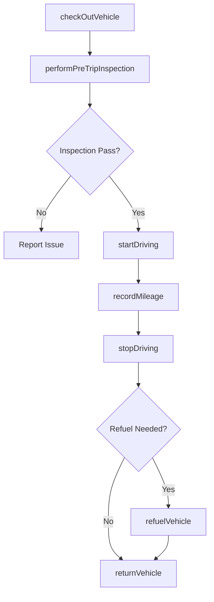
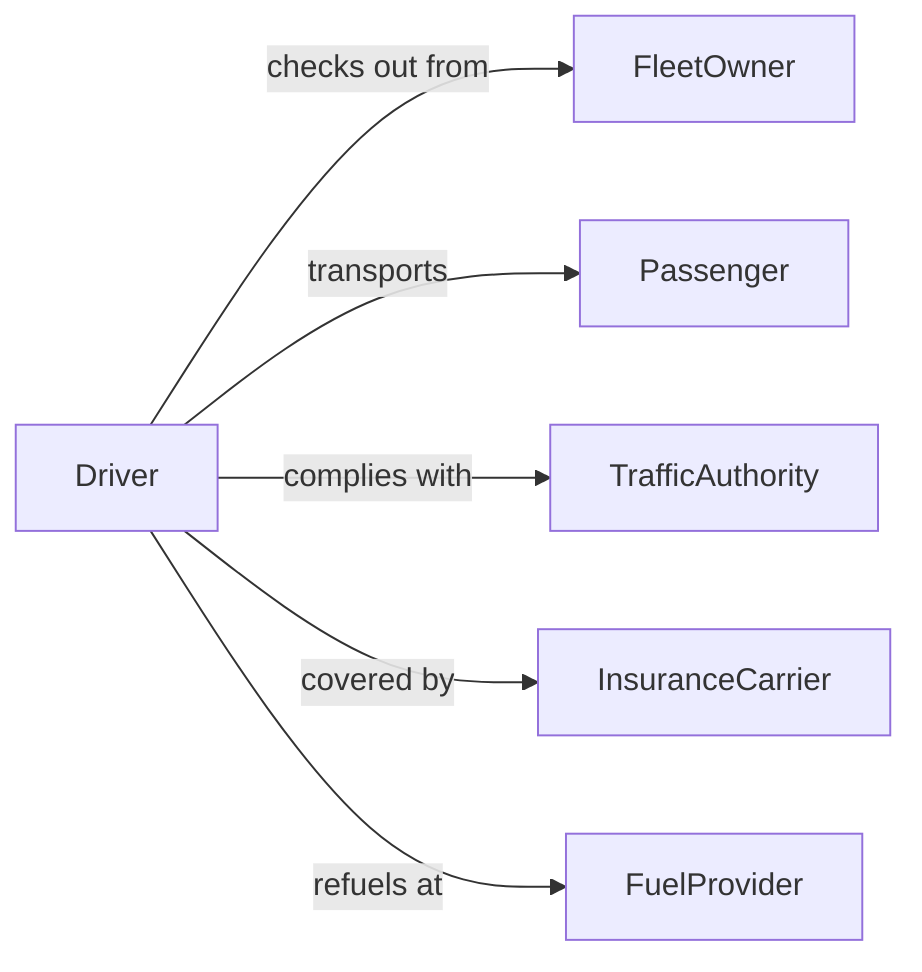

# Drive Passenger Vehicles

> Business-as-Code definition for driving passenger vehicles. Models the complete vehicle operation lifecycle from pre-trip inspection through driving and post-trip reporting.

## Overview

Driving passenger vehicles involves the safe operation of cars, vans, and similar vehicles to fulfill organizational transportation needs such as deliveries, field visits, and personnel shuttling. This definition exposes actions for vehicle checkout, driving operations, and trip documentation, along with events for fleet management automation and searches for vehicle and trip data retrieval.

## Actors

| Actor | Description |
|-------|-------------|
| FleetOwner | Organization or individual that owns and maintains the vehicle fleet |
| Passenger | Person being transported in the vehicle |
| TrafficAuthority | Enforces road regulations and issues citations |
| InsuranceCarrier | Provides vehicle and liability insurance coverage |
| FuelProvider | Supplies fuel or charging services for the vehicle |

## Roles

| Role | Description |
|------|-------------|
| Driver | Operates the passenger vehicle in compliance with traffic laws |
| FleetManager | Manages vehicle assignments, maintenance schedules, and utilization |
| SafetyCoordinator | Monitors driving behavior and enforces safety policies |
| DispatchCoordinator | Assigns vehicles and routes to drivers based on operational needs |

## Entities

| Entity | Description |
|--------|-------------|
| Vehicle | A passenger car, van, or similar transport asset in the fleet |
| TripRecord | Documentation of a single vehicle use including origin, destination, and mileage |
| InspectionChecklist | Pre-trip and post-trip safety inspection form for the vehicle |
| DrivingLog | Cumulative record of a driver's trips, hours, and incidents |
| FuelRecord | Log of fuel purchases or charging sessions for a vehicle |

## Actions

| Action | Description |
|--------|-------------|
| checkOutVehicle | Reserve and sign out a vehicle for an authorized trip |
| performPreTripInspection | Complete a safety check before operating the vehicle |
| startDriving | Begin operating the vehicle and record departure details |
| recordMileage | Log odometer readings at trip start and end |
| stopDriving | Park the vehicle and record arrival details |
| refuelVehicle | Log a fuel stop or charging session during or after the trip |
| returnVehicle | Check the vehicle back in and complete the post-trip report |

## Events

| Event | Description |
|-------|-------------|
| vehicleCheckedOut | A vehicle has been reserved and signed out to a driver |
| preTripInspectionCompleted | The pre-trip safety inspection has been finished |
| drivingStarted | The driver has begun operating the vehicle |
| mileageRecorded | Odometer readings have been captured for the trip |
| drivingStopped | The driver has parked and ended the driving segment |
| vehicleRefueled | A fuel or charging event has been logged |
| vehicleReturned | The vehicle has been checked back into the fleet |

## Searches

| Search | Description |
|--------|-------------|
| findAvailableVehicles | List vehicles not currently checked out and ready for use |
| getTripRecords | Retrieve trip history by driver, vehicle, or date range |
| getVehicleMileage | Get cumulative mileage and usage statistics for a vehicle |
| findOverdueReturns | Identify vehicles not returned by their scheduled time |

## Workflow



## Actor Relationships



## Usage

### Calling Actions

```typescript
import { drivePassengerVehicles } from '@headlessly/drive-passenger-vehicles'

const vehicles = drivePassengerVehicles()

// Check out a vehicle for the day
const checkout = await vehicles.checkOutVehicle({
  vehicleId: 'vehicle-312',
  driverId: 'driver-107',
  purpose: 'Client site visit',
  expectedReturn: '2026-04-10T17:00:00Z'
})

// Complete pre-trip inspection and begin driving
await vehicles.performPreTripInspection({
  vehicleId: 'vehicle-312',
  items: { tires: 'pass', lights: 'pass', brakes: 'pass', fluids: 'pass' }
})

await vehicles.startDriving({ vehicleId: 'vehicle-312', odometerStart: 45230 })

// Return vehicle after the trip
await vehicles.stopDriving({ vehicleId: 'vehicle-312', odometerEnd: 45298 })
await vehicles.returnVehicle({ vehicleId: 'vehicle-312', condition: 'good' })
```

### Event-Driven Automation

```typescript
// Alert fleet manager when a vehicle return is overdue
vehicles.vehicleCheckedOut(async ({ vehicleId, expectedReturn }) => {
  scheduleReminder({
    at: expectedReturn,
    action: async () => {
      const records = await vehicles.findOverdueReturns()
      if (records.some(r => r.vehicleId === vehicleId)) {
        await notify({ to: 'fleet-manager', message: `Vehicle ${vehicleId} is overdue for return` })
      }
    }
  })
})

// Track fuel consumption trends
vehicles.vehicleRefueled(async ({ vehicleId, gallons, cost }) => {
  await updateFuelMetrics({ vehicleId, gallons, cost })
})
```
