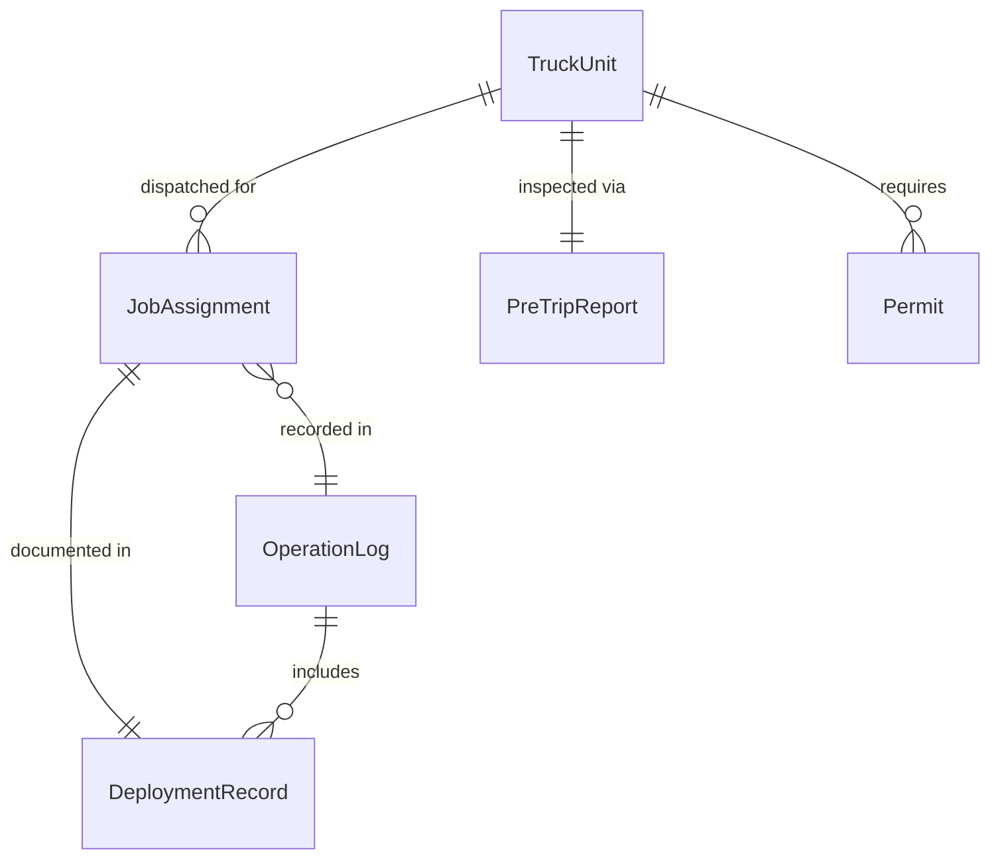
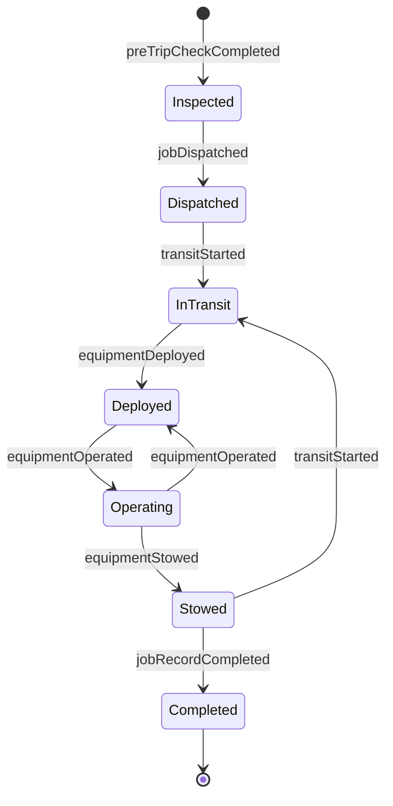
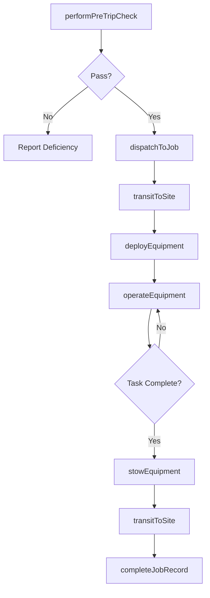
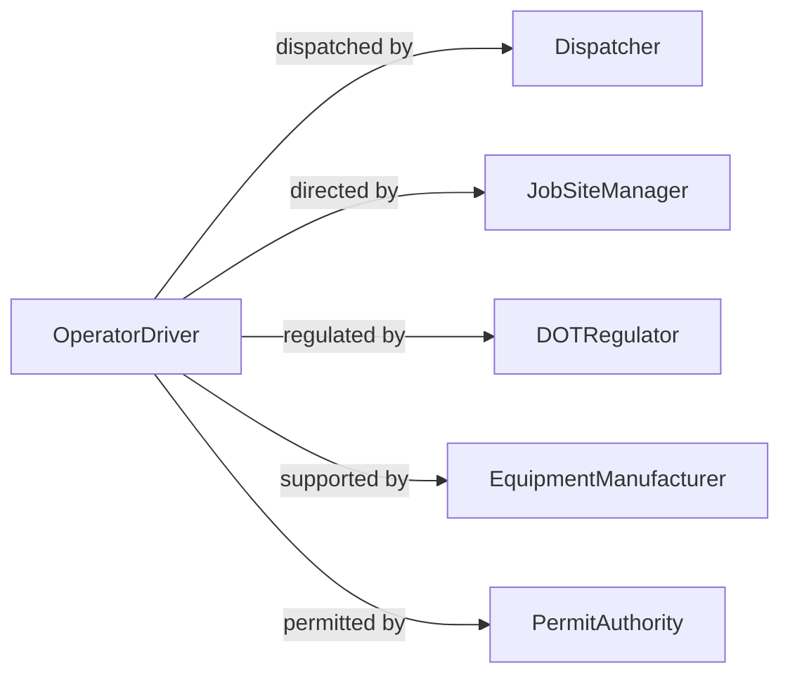

# Drive Trucks Truck-mounted Equipment

> Business-as-Code definition for driving trucks or truck-mounted equipment. Models the operation lifecycle from pre-trip preparation and dispatch through transit, equipment deployment, and trip completion for vehicles with integrated specialized equipment.

## Overview

Driving trucks or truck-mounted equipment involves operating commercial vehicles that carry or integrate specialized apparatus such as cranes, concrete pumps, aerial lifts, vacuum systems, or drilling rigs. This definition exposes actions for vehicle preparation, transit management, equipment deployment at the work location, and post-operation reporting. It supports workflows for utility companies, construction firms, waste management operations, and emergency service providers.

## Actors

| Actor | Description |
|-------|-------------|
| Dispatcher | Assigns truck-mounted equipment to jobs and coordinates routing |
| JobSiteManager | Directs equipment placement and operation at the work location |
| DOTRegulator | Enforces vehicle weight, dimension, and safety regulations for road transit |
| EquipmentManufacturer | Provides specifications, maintenance schedules, and technical support |
| PermitAuthority | Issues oversize, overweight, or special movement permits |

## Roles

| Role | Description |
|------|-------------|
| OperatorDriver | Drives the truck and operates the mounted equipment at the work site |
| FleetMechanic | Inspects and maintains the truck and mounted equipment systems |
| SafetyOfficer | Ensures compliance with operating procedures and regulatory requirements |
| EquipmentCoordinator | Schedules and tracks equipment utilization across job sites |

## Entities

| Entity | Description |
|--------|-------------|
| TruckUnit | The combined vehicle and mounted equipment identified as a single asset |
| JobAssignment | A dispatched task linking a truck unit to a specific work location |
| PreTripReport | A documented inspection of both the truck and mounted equipment before transit |
| DeploymentRecord | A log of equipment setup, operation, and teardown at the work site |
| Permit | Authorization for oversize, overweight, or restricted-route transit |
| OperationLog | A comprehensive record of driving time, equipment hours, and fuel usage |

## Actions

| Action | Description |
|--------|-------------|
| performPreTripCheck | Inspect the truck and mounted equipment before departure |
| dispatchToJob | Assign the truck unit to a job and provide routing instructions |
| transitToSite | Drive the truck and equipment to the designated work location |
| deployEquipment | Set up and activate the truck-mounted equipment at the work site |
| operateEquipment | Run the mounted equipment to perform the assigned task |
| stowEquipment | Secure the mounted equipment for road transit after use |
| completeJobRecord | Finalize the operation log with hours, fuel, and task details |

## Events

| Event | Description |
|-------|-------------|
| preTripCheckCompleted | The truck and equipment inspection has been documented |
| jobDispatched | A truck unit has been assigned and routed to a work location |
| transitStarted | The truck has departed for the job site |
| equipmentDeployed | The mounted equipment has been set up and activated |
| equipmentOperated | The mounted equipment has performed the assigned task |
| equipmentStowed | The mounted equipment has been secured for transit |
| jobRecordCompleted | The operation log has been finalized |

## Searches

| Search | Description |
|--------|-------------|
| findTruckUnits | List truck units by type, location, or availability |
| getJobAssignments | Retrieve job assignments by truck unit, date, or site |
| getDeploymentHistory | Query equipment deployment records by unit or date range |
| getOperationLogs | Look up completed operation logs by driver, unit, or period |

## Entity Relationships



## State Diagram



## Workflow



## Actor Relationships



## Usage

### Calling Actions

```typescript
import { driveTrucksTruckMountedEquipment } from '@headlessly/drive-trucks-truck-mounted-equipment'

const trucks = driveTrucksTruckMountedEquipment()

// Perform a pre-trip check
const inspection = await trucks.performPreTripCheck({
  truckUnitId: 'crane-truck-207',
  operatorId: 'driver-033',
  checklist: ['engine', 'brakes', 'outriggers', 'boom-condition', 'hydraulics', 'lights']
})

// Dispatch to a job site
const job = await trucks.dispatchToJob({
  truckUnitId: 'crane-truck-207',
  jobSite: '450 Industrial Blvd',
  task: 'Steel beam placement',
  estimatedDuration: 4,
  permitId: 'OW-2026-1198'
})

// Deploy and operate equipment on site
await trucks.deployEquipment({
  jobId: job.id,
  setupNotes: 'Level ground, outriggers extended, 40-foot radius swing clearance'
})

await trucks.operateEquipment({
  jobId: job.id,
  task: 'Lift and place 6 steel beams',
  startTime: '2026-05-03T09:00:00Z'
})
```

### Event-Driven Automation

```typescript
// Notify site manager when truck departs
trucks.transitStarted(async ({ truckUnitId, jobSite, estimatedArrival }) => {
  await notify({
    to: 'job-site-manager',
    message: `Crane truck ${truckUnitId} en route. ETA: ${estimatedArrival}`
  })
})

// Auto-generate job record when equipment is stowed
trucks.equipmentStowed(async ({ jobId, truckUnitId }) => {
  await trucks.completeJobRecord({
    jobId,
    truckUnitId,
    completedAt: new Date().toISOString()
  })
})
```
