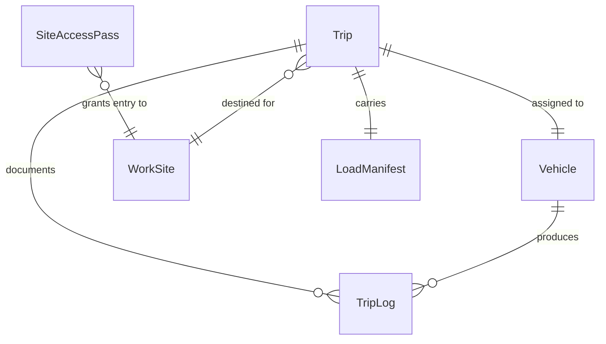
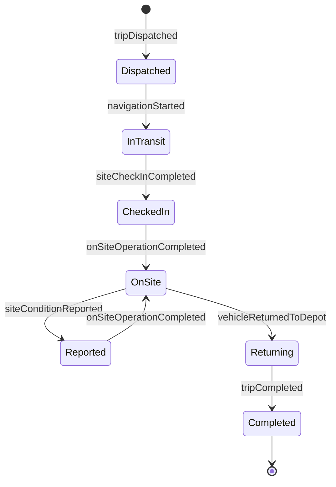
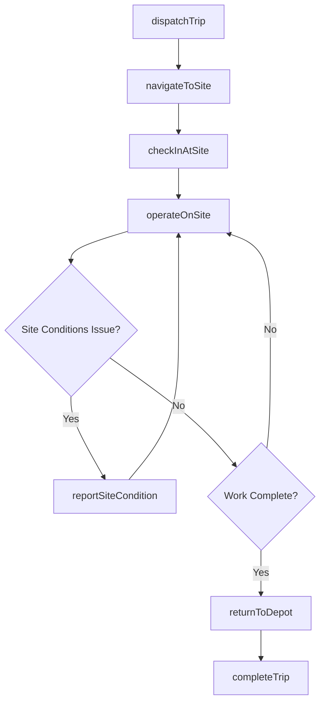
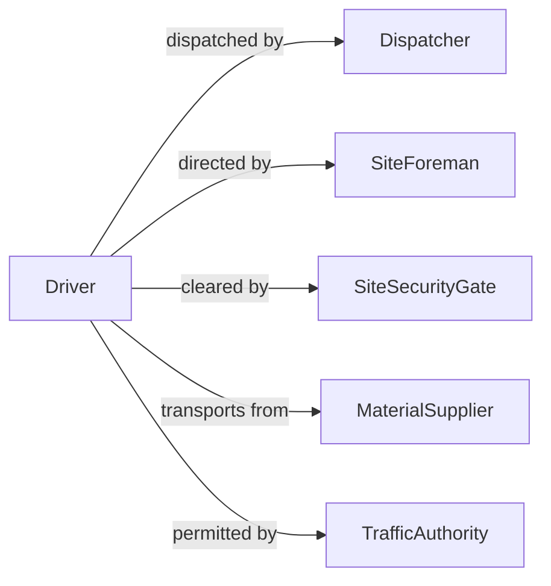

# Drive Trucks Vehicles Work Sites

> Business-as-Code definition for driving trucks or other vehicles to or at work sites. Models the dispatch, transit, on-site operation, and trip completion lifecycle for vehicles serving construction, utility, and industrial work sites.

## Overview

Driving trucks or other vehicles to or at work sites involves operating commercial and industrial vehicles for transporting materials, equipment, and personnel to job sites, as well as maneuvering vehicles on site for positioning, loading, and unloading operations. This definition exposes actions for trip dispatch, route navigation, on-site vehicle operation, and completion reporting. It supports workflows for construction companies, utility providers, mining operations, and field service organizations.

## Actors

| Actor | Description |
|-------|-------------|
| SiteForeman | Directs vehicle positioning and material placement at the work site |
| Dispatcher | Assigns trips and coordinates vehicle routing to work sites |
| SiteSecurityGate | Controls vehicle access and verifies authorization at the work site |
| MaterialSupplier | Provides cargo and materials transported to the work site |
| TrafficAuthority | Regulates road use, permits, and oversize load requirements |

## Roles

| Role | Description |
|------|-------------|
| Driver | Operates the vehicle on public roads and at the work site |
| FleetCoordinator | Manages vehicle assignments and availability across work sites |
| LoadMaster | Supervises loading and securement of cargo for transit |
| SiteSupervisor | Oversees all vehicle movements and safety within the work site |

## Entities

| Entity | Description |
|--------|-------------|
| Trip | A planned or active transit from depot or origin to a work site |
| WorkSite | A designated location where construction, utility, or industrial work occurs |
| Vehicle | The truck or other vehicle being operated for the trip |
| LoadManifest | A record of cargo, weight, and securement details for the trip |
| SiteAccessPass | Authorization credentials for entering a restricted work site |
| TripLog | A record of departure, arrival, mileage, and on-site activities |

## Actions

| Action | Description |
|--------|-------------|
| dispatchTrip | Assign a vehicle and driver to a specific work site destination |
| navigateToSite | Follow the designated route from origin to the work site |
| checkInAtSite | Register vehicle arrival and verify site access authorization |
| operateOnSite | Maneuver the vehicle for positioning, loading, or unloading at the site |
| completeTrip | Finalize the trip with mileage, time, and activity records |
| reportSiteCondition | Document road or site conditions affecting vehicle operation |
| returnToDepot | Drive the vehicle back to the home base or staging area |

## Events

| Event | Description |
|-------|-------------|
| tripDispatched | A vehicle and driver have been assigned to a work site trip |
| navigationStarted | The vehicle has departed and is in transit to the work site |
| siteCheckInCompleted | The vehicle has arrived and been authorized at the work site |
| onSiteOperationCompleted | Vehicle positioning, loading, or unloading at the site is finished |
| tripCompleted | The trip has been finalized with all records documented |
| siteConditionReported | Road or site conditions have been documented |
| vehicleReturnedToDepot | The vehicle has arrived back at the home base |

## Searches

| Search | Description |
|--------|-------------|
| findTrips | List trips by driver, vehicle, work site, or date |
| getActiveVehicles | Retrieve vehicles currently in transit or on site |
| getSiteAccessHistory | Query check-in and check-out records for a work site |
| getTripLogs | Look up completed trip records by vehicle or date range |

## Entity Relationships



## State Diagram



## Workflow



## Actor Relationships



## Usage

### Calling Actions

```typescript
import { driveTrucksVehiclesWorkSites } from '@headlessly/drive-trucks-vehicles-work-sites'

const trips = driveTrucksVehiclesWorkSites()

// Dispatch a trip to a construction site
const trip = await trips.dispatchTrip({
  vehicleId: 'dump-truck-118',
  driverId: 'driver-045',
  workSite: 'Riverside Bridge Project',
  origin: 'Central Depot',
  loadManifest: { material: 'Gravel', weight: 22000, unit: 'lbs' }
})

// Check in at the site
await trips.checkInAtSite({
  tripId: trip.id,
  siteAccessPass: 'SAP-2026-0412',
  arrivalTime: '2026-04-12T08:30:00Z'
})

// Complete the trip
await trips.completeTrip({
  tripId: trip.id,
  mileage: 34,
  departureTime: '2026-04-12T07:00:00Z',
  returnTime: '2026-04-12T11:15:00Z'
})
```

### Event-Driven Automation

```typescript
// Track vehicle arrivals at sites
trips.siteCheckInCompleted(async ({ tripId, workSite, vehicleId }) => {
  await notify({
    to: 'site-foreman',
    message: `Vehicle ${vehicleId} has arrived at ${workSite}`
  })
})

// Alert on delayed returns
trips.tripDispatched(async ({ tripId, estimatedReturn }) => {
  await scheduleCheck({
    at: estimatedReturn,
    action: async () => {
      const trip = await trips.findTrips({ tripId })
      if (trip.status !== 'completed') {
        await notify({
          to: 'fleet-coordinator',
          message: `Trip ${tripId} has not returned by estimated time`
        })
      }
    }
  })
})
```
