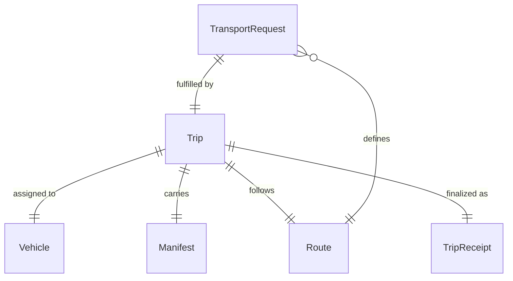
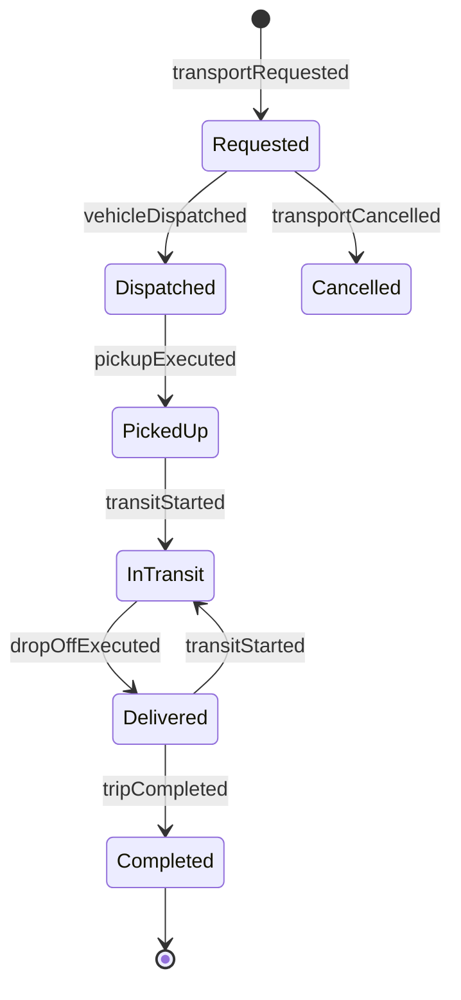
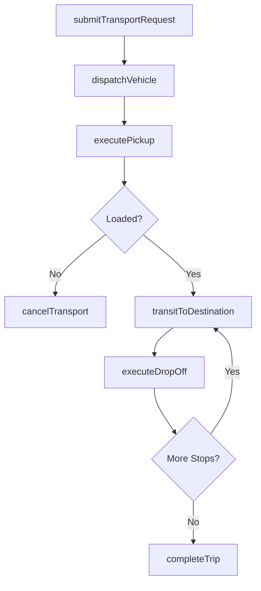
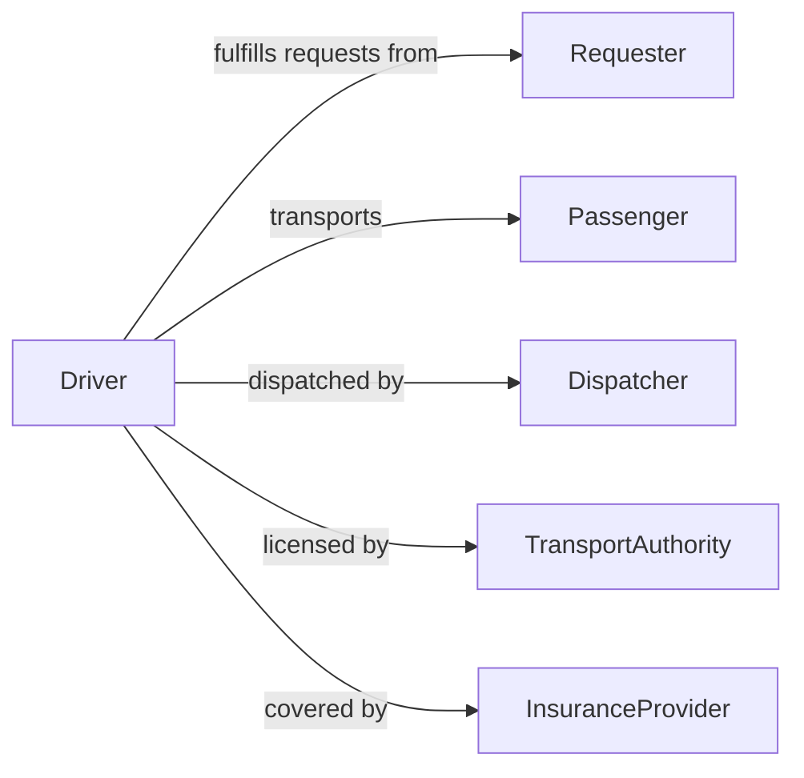

# Drive Vehicles Transport Individuals Equipment

> Business-as-Code definition for driving vehicles to transport individuals or equipment. Models the full transportation lifecycle from booking and dispatch through pickup, transit, delivery, and trip completion.

## Overview

Driving vehicles to transport individuals or equipment involves operating cars, vans, buses, shuttles, and utility vehicles to move passengers, personnel, or cargo between locations. This definition exposes actions for scheduling transport requests, dispatching vehicles, managing pickups and drop-offs, and tracking trip outcomes. It supports workflows for shuttle services, ride-hailing operations, corporate fleet management, patient transport, and equipment delivery services.

## Actors

| Actor | Description |
|-------|-------------|
| Passenger | An individual being transported from one location to another |
| Requester | The person or system initiating a transport request |
| Dispatcher | Assigns vehicles and drivers to transport requests |
| TransportAuthority | Regulates passenger transport licensing and safety standards |
| InsuranceProvider | Underwrites liability coverage for vehicle transport operations |

## Roles

| Role | Description |
|------|-------------|
| Driver | Operates the vehicle and manages the transport of individuals or equipment |
| FleetManager | Oversees vehicle allocation, maintenance scheduling, and driver assignments |
| RouteOptimizer | Plans efficient routes for multi-stop or recurring transport operations |
| TransportCoordinator | Manages scheduling and communication between requesters and drivers |

## Entities

| Entity | Description |
|--------|-------------|
| TransportRequest | A submitted request to move individuals or equipment between locations |
| Trip | An active or completed transport from pickup to drop-off |
| Vehicle | The car, van, bus, or utility vehicle used for transport |
| Manifest | A list of passengers or equipment items being transported on a trip |
| Route | The planned path with waypoints and estimated timing |
| TripReceipt | A finalized record of the completed transport with distance, time, and cost |

## Actions

| Action | Description |
|--------|-------------|
| submitTransportRequest | Create a request to transport individuals or equipment |
| dispatchVehicle | Assign a vehicle and driver to fulfill a transport request |
| executePickup | Arrive at the origin and load passengers or equipment |
| transitToDestination | Drive the planned route to the drop-off location |
| executeDropOff | Arrive at the destination and unload passengers or equipment |
| completeTrip | Finalize the trip record with mileage, duration, and status |
| cancelTransport | Abort a transport request or in-progress trip |

## Events

| Event | Description |
|-------|-------------|
| transportRequested | A new transport request has been submitted |
| vehicleDispatched | A vehicle and driver have been assigned to the request |
| pickupExecuted | Passengers or equipment have been loaded at the origin |
| transitStarted | The vehicle has departed the pickup location |
| dropOffExecuted | Passengers or equipment have been delivered at the destination |
| tripCompleted | The trip record has been finalized |
| transportCancelled | A transport request or trip has been aborted |

## Searches

| Search | Description |
|--------|-------------|
| findTransportRequests | List transport requests by status, date, or requester |
| getActiveTrips | Retrieve currently in-progress trips by driver or vehicle |
| getTripHistory | Query completed trip records by date range, driver, or route |
| findAvailableVehicles | Identify vehicles not currently assigned to a trip |

## Entity Relationships



## State Diagram



## Workflow



## Actor Relationships



## Usage

### Calling Actions

```typescript
import { driveVehiclesTransportIndividualsEquipment } from '@headlessly/drive-vehicles-transport-individuals-equipment'

const transport = driveVehiclesTransportIndividualsEquipment()

// Submit a transport request
const request = await transport.submitTransportRequest({
  type: 'passenger',
  pickup: { address: '100 Main St', time: '2026-04-20T08:00:00Z' },
  dropOff: { address: '500 Corporate Blvd' },
  passengers: 3,
  notes: 'Wheelchair accessible vehicle required'
})

// Dispatch a vehicle
await transport.dispatchVehicle({
  requestId: request.id,
  vehicleId: 'van-accessible-012',
  driverId: 'driver-056'
})

// Complete the trip after drop-off
await transport.completeTrip({
  requestId: request.id,
  mileage: 18.4,
  duration: 32,
  status: 'delivered'
})
```

### Event-Driven Automation

```typescript
// Notify passenger when vehicle is dispatched
transport.vehicleDispatched(async ({ requestId, vehicleId, estimatedArrival }) => {
  await notify({
    to: 'requester',
    message: `Vehicle ${vehicleId} dispatched. Estimated pickup: ${estimatedArrival}`
  })
})

// Alert fleet manager on cancellations
transport.transportCancelled(async ({ requestId, reason }) => {
  await notify({
    to: 'fleet-manager',
    message: `Transport request ${requestId} cancelled: ${reason}`
  })
})
```
