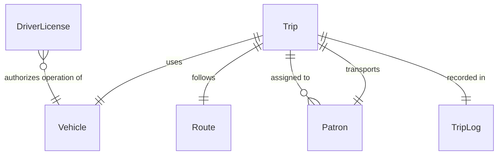
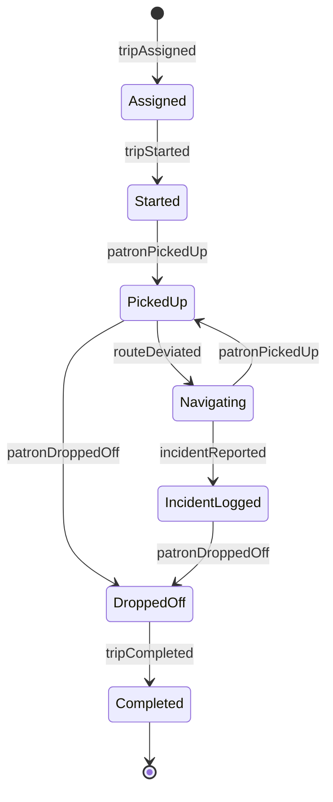
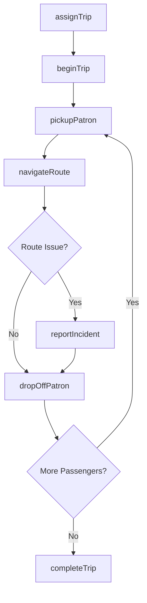
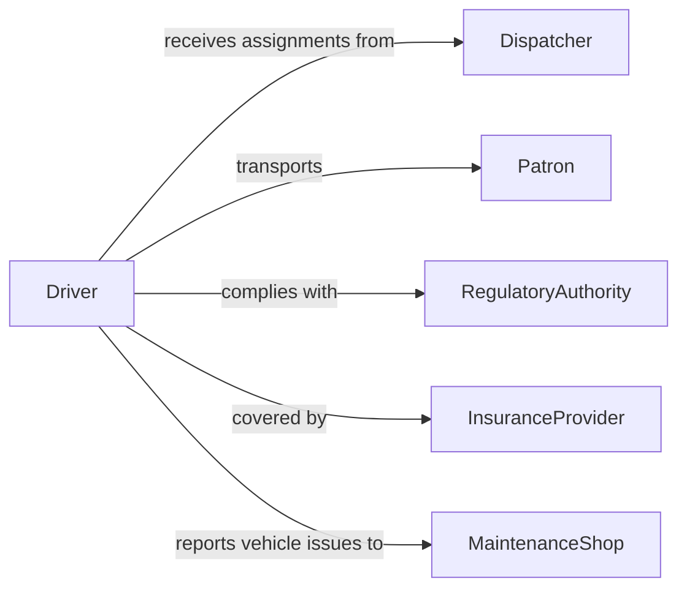

# Drive Vehicles Transport Patrons

> Business-as-Code definition for driving vehicles to transport patrons. Models the complete passenger transport lifecycle from trip request through pickup, transit, and drop-off.

## Overview

Driving vehicles to transport patrons encompasses the operation of cars, buses, shuttles, limousines, and other vehicles to move passengers between locations safely and on schedule. This definition exposes actions for trip management and vehicle operation, events for real-time tracking and automation, and searches for retrieving trip and vehicle data.

## Actors

| Actor | Description |
|-------|-------------|
| Patron | Passenger requesting or receiving transportation services |
| Dispatcher | Coordinates vehicle assignments and routing for trips |
| RegulatoryAuthority | Enforces transportation licensing and safety regulations |
| InsuranceProvider | Underwrites liability and vehicle coverage for transport operations |
| MaintenanceShop | Performs vehicle inspections, repairs, and servicing |
| TransportAgency | Government or private entity managing transit networks and permits |

## Roles

| Role | Description |
|------|-------------|
| Driver | Operates the vehicle and ensures patron safety during transit |
| FleetSupervisor | Oversees driver assignments, schedules, and fleet readiness |
| SafetyOfficer | Monitors compliance with safety standards and driving regulations |
| RouteCoordinator | Plans and optimizes routes for efficiency and timeliness |

## Entities

| Entity | Description |
|--------|-------------|
| Trip | A scheduled or on-demand journey transporting one or more patrons |
| Vehicle | The car, bus, shuttle, or other transport asset assigned to a trip |
| Route | The planned path from pickup to destination including waypoints |
| Patron | A passenger profile with pickup preferences and accessibility needs |
| TripLog | A record of trip details including times, distance, and incidents |
| DriverLicense | Certification and credentials authorizing a driver to operate |

## Actions

| Action | Description |
|--------|-------------|
| assignTrip | Assign a vehicle and driver to a patron transport request |
| beginTrip | Start the trip and record departure time and odometer reading |
| pickupPatron | Arrive at the pickup location and confirm patron boarding |
| navigateRoute | Follow the planned route with real-time adjustments for traffic |
| dropOffPatron | Deliver the patron to the destination and confirm arrival |
| completeTrip | Finalize the trip record with distance, time, and fare data |
| reportIncident | Log any safety incidents or irregularities during transport |

## Events

| Event | Description |
|-------|-------------|
| tripAssigned | A driver and vehicle have been assigned to a transport request |
| tripStarted | The vehicle has departed from the origin point |
| patronPickedUp | The patron has boarded the vehicle at the pickup location |
| routeDeviated | The driver has deviated from the planned route |
| patronDroppedOff | The patron has been delivered to the destination |
| tripCompleted | The trip has been finalized with all metrics recorded |
| incidentReported | A safety or operational incident has been logged during transit |

## Searches

| Search | Description |
|--------|-------------|
| findTrips | List trips by date, driver, patron, or status |
| getActiveVehicles | Retrieve vehicles currently in service with live position data |
| getTripHistory | Retrieve completed trip records for a patron or driver |
| findAvailableDrivers | List drivers available for assignment within a service area |

## Entity Relationships



## State Diagram



## Workflow



## Actor Relationships



## Usage

### Calling Actions

```typescript
import { driveVehiclesTransportPatrons } from '@headlessly/drive-vehicles-transport-patrons'

const transport = driveVehiclesTransportPatrons()

// Assign a trip to a driver and vehicle
const trip = await transport.assignTrip({
  patronId: 'patron-2201',
  driverId: 'driver-415',
  vehicleId: 'vehicle-88',
  pickup: { address: '100 Main St', time: '2026-03-15T08:00:00Z' },
  destination: { address: '500 Airport Blvd' }
})

// Begin and pick up the patron
await transport.beginTrip({ tripId: trip.id })
await transport.pickupPatron({ tripId: trip.id, confirmedAt: '2026-03-15T08:05:00Z' })

// Complete the trip after drop-off
await transport.dropOffPatron({ tripId: trip.id })
await transport.completeTrip({ tripId: trip.id, fare: 45.00, distanceMiles: 22.4 })
```

### Event-Driven Automation

```typescript
// Notify dispatcher when a route deviation occurs
transport.routeDeviated(async ({ tripId, driverId, deviation }) => {
  await notify({
    to: 'dispatch-center',
    message: `Driver ${driverId} deviated from route on trip ${tripId}: ${deviation.reason}`
  })
})

// Auto-generate trip summary on completion
transport.tripCompleted(async ({ tripId, patronId, fare, distanceMiles }) => {
  await generateReceipt({ tripId, patronId, fare, distanceMiles })
})
```
