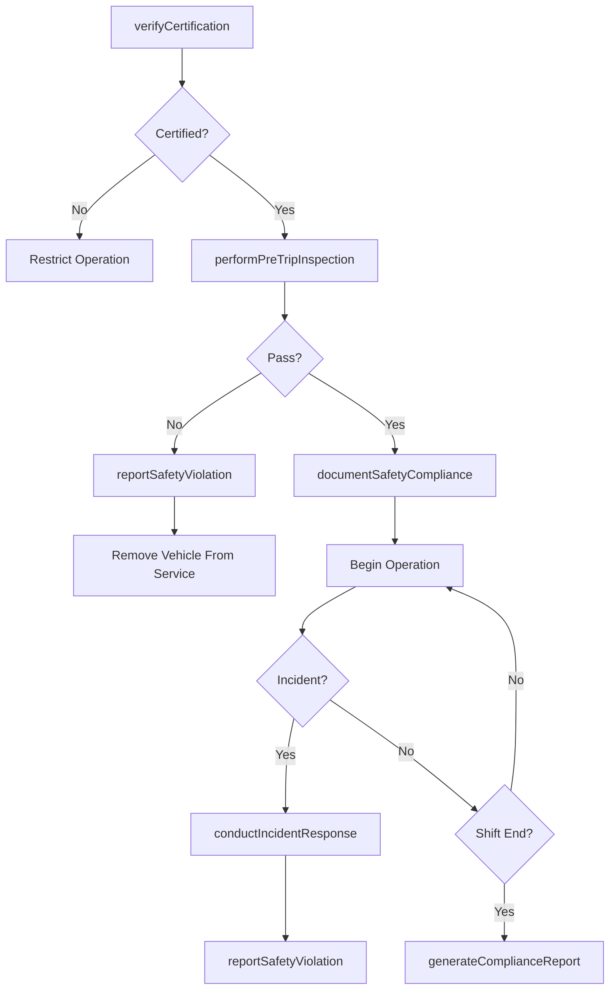
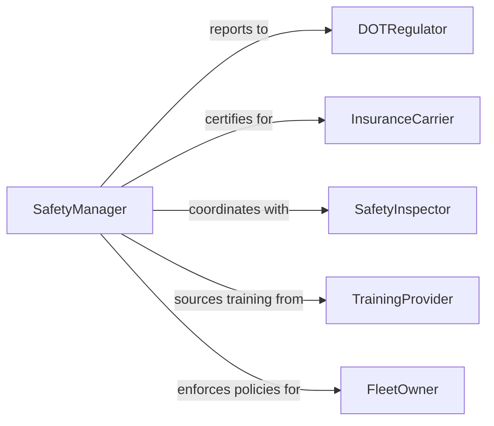

# Follow Safety Procedures Vehicle Operation

> Business-as-Code definition for following safety procedures for vehicle operation. Models the enforcement, documentation, and monitoring of vehicle safety protocols from pre-operation inspections through incident response and compliance reporting.

## Overview

Following safety procedures for vehicle operation involves conducting pre-trip inspections, adhering to operational safety protocols, maintaining documentation of safety compliance, and responding appropriately to hazardous conditions or incidents. This definition exposes actions for performing safety checks, recording compliance activities, managing safety violations, and tracking regulatory adherence. It supports workflows for fleet operators, logistics companies, public transit agencies, and any organization operating commercial or industrial vehicles.

## Actors

| Actor | Description |
|-------|-------------|
| DOTRegulator | Enforces federal and state vehicle safety regulations and standards |
| FleetOwner | Owns vehicles and bears responsibility for maintaining safety compliance |
| InsuranceCarrier | Underwrites vehicle operations and requires safety documentation |
| SafetyInspector | Conducts periodic audits and inspections of vehicles and procedures |
| TrainingProvider | Delivers safety training programs and certifications for operators |

## Roles

| Role | Description |
|------|-------------|
| VehicleOperator | Executes pre-trip checks and follows safety protocols during operation |
| SafetyManager | Develops, enforces, and monitors safety policies across the fleet |
| FleetSupervisor | Oversees daily operations and ensures drivers follow safety procedures |
| ComplianceCoordinator | Tracks regulatory requirements and manages audit documentation |

## Entities

| Entity | Description |
|--------|-------------|
| SafetyInspection | A documented pre-trip or periodic safety check of a vehicle |
| SafetyProtocol | A defined set of procedures for safe vehicle operation |
| ViolationRecord | A documented instance of safety non-compliance |
| IncidentReport | A record of an accident, near-miss, or hazardous event |
| ComplianceLog | A cumulative record of safety adherence for a vehicle or operator |
| SafetyCertification | A credential confirming an operator has completed required training |

## Actions

| Action | Description |
|--------|-------------|
| performPreTripInspection | Execute a systematic safety check of the vehicle before operation |
| documentSafetyCompliance | Record adherence to a specific safety protocol or checklist |
| reportSafetyViolation | Log a non-compliance event with details and severity |
| conductIncidentResponse | Execute emergency or accident response procedures |
| updateSafetyProtocol | Revise safety procedures based on regulatory changes or incidents |
| verifyCertification | Confirm an operator holds current safety training credentials |
| generateComplianceReport | Produce a summary of safety performance for a period or fleet segment |

## Events

| Event | Description |
|-------|-------------|
| preTripInspectionCompleted | A vehicle safety check has been performed and documented |
| safetyComplianceDocumented | Adherence to a safety protocol has been recorded |
| safetyViolationReported | A non-compliance event has been logged |
| incidentResponseConducted | Emergency or accident procedures have been executed |
| safetyProtocolUpdated | A safety procedure has been revised |
| certificationVerified | An operator safety credential has been confirmed as current |
| complianceReportGenerated | A safety performance summary has been produced |

## Searches

| Search | Description |
|--------|-------------|
| findInspections | List safety inspections by vehicle, operator, or date |
| getViolationHistory | Retrieve violation records by operator, vehicle, or severity |
| getComplianceSummary | Query overall safety compliance rates for a fleet or period |
| findExpiredCertifications | Identify operators with lapsed safety training credentials |

## Workflow



## Actor Relationships



## Usage

### Calling Actions

```typescript
import { followSafetyProceduresVehicleOperation } from '@headlessly/follow-safety-procedures-vehicle-operation'

const safety = followSafetyProceduresVehicleOperation()

// Perform a pre-trip inspection
const inspection = await safety.performPreTripInspection({
  vehicleId: 'truck-4521',
  operatorId: 'driver-089',
  checklist: ['brakes', 'tires', 'lights', 'mirrors', 'fluids', 'cargo-securement'],
  date: '2026-03-15'
})

// Document compliance
await safety.documentSafetyCompliance({
  inspectionId: inspection.id,
  protocolId: 'DOT-pre-trip-commercial',
  status: 'pass',
  notes: 'All items within specification'
})

// Generate a monthly compliance report
const report = await safety.generateComplianceReport({
  fleetSegment: 'long-haul',
  period: { start: '2026-03-01', end: '2026-03-31' }
})
```

### Event-Driven Automation

```typescript
// Escalate safety violations
safety.safetyViolationReported(async ({ vehicleId, severity, operatorId }) => {
  if (severity === 'critical') {
    await notify({
      to: 'fleet-supervisor',
      message: `Critical safety violation on vehicle ${vehicleId} by operator ${operatorId}`
    })
  }
})

// Notify on expired certifications
safety.certificationVerified(async ({ operatorId, status, expirationDate }) => {
  if (status === 'expired') {
    await notify({
      to: 'compliance-coordinator',
      message: `Operator ${operatorId} certification expired on ${expirationDate}. Remove from active duty.`
    })
  }
})
```
