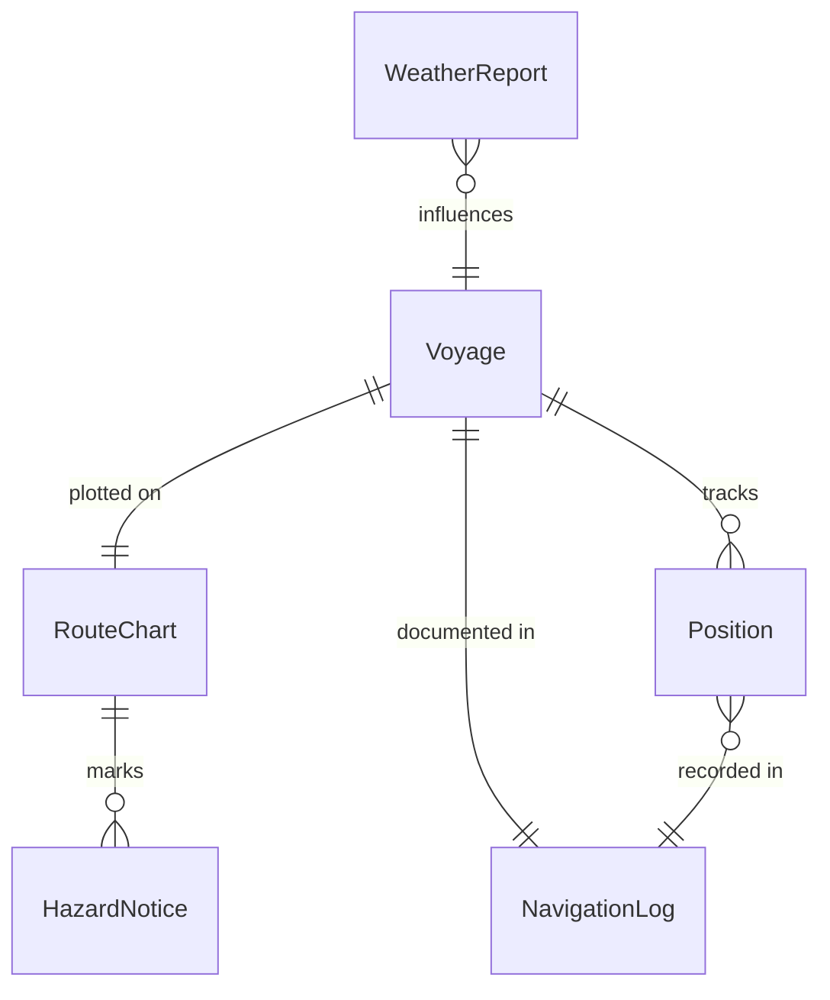
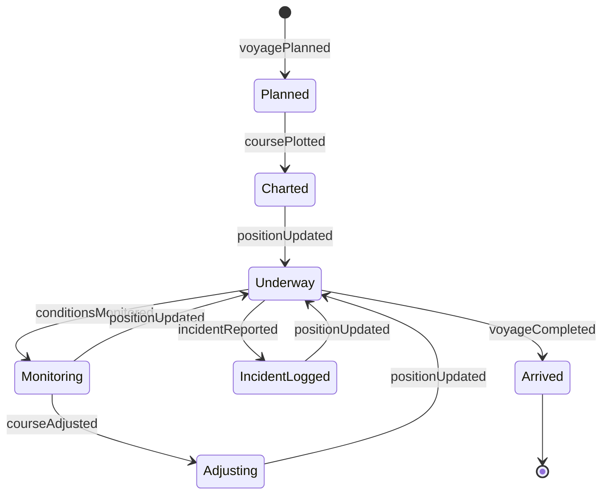
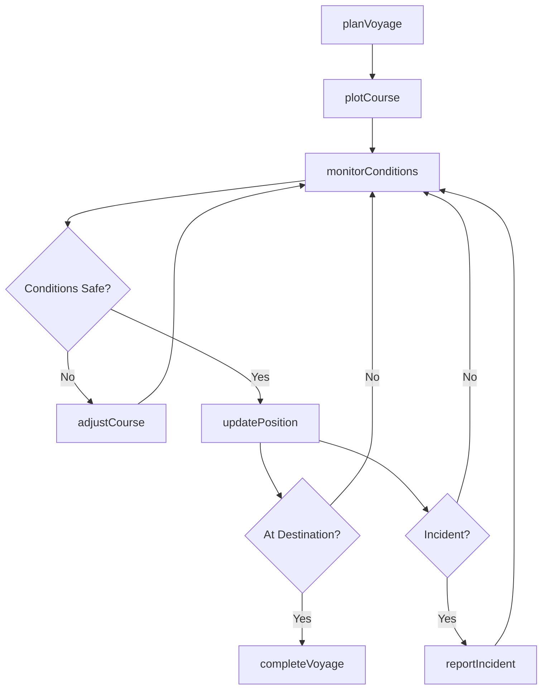
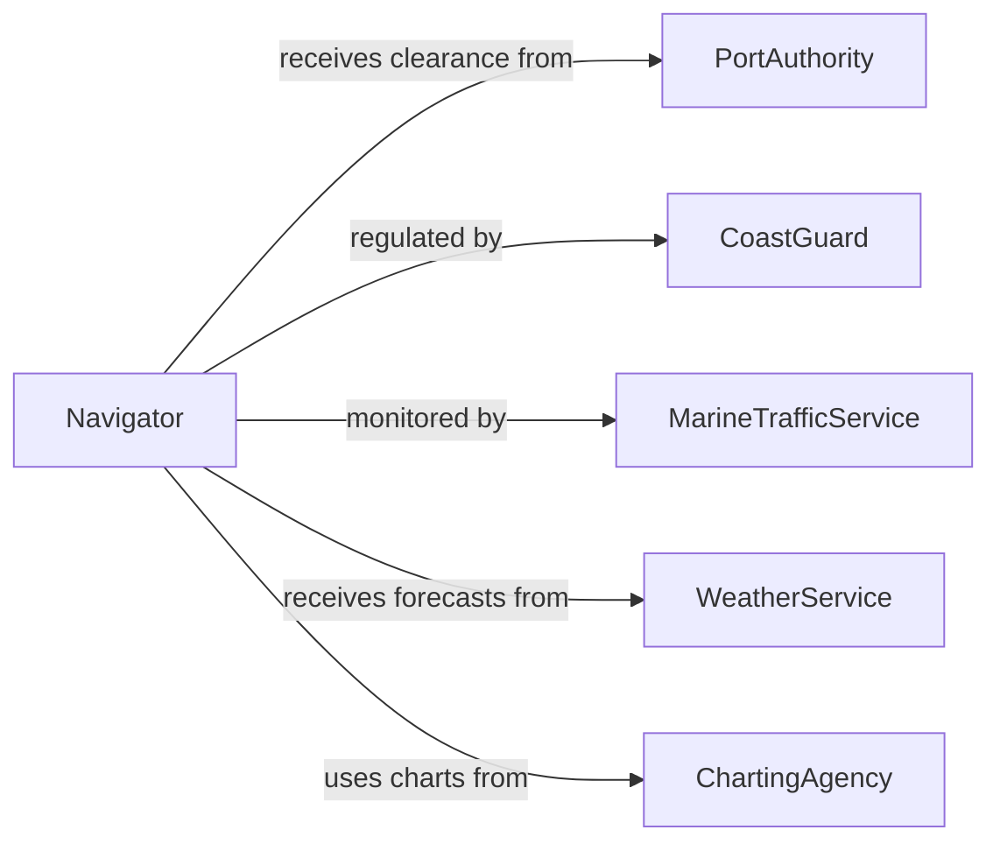

# Navigate Water Vessels

> Business-as-Code definition for navigating water vessels. Models the planning, execution, and monitoring of maritime navigation from route planning through voyage completion and incident reporting.

## Overview

Navigating water vessels involves planning routes, operating helm and navigation systems, monitoring weather and sea conditions, and safely guiding boats, ships, barges, and other watercraft to their destinations. This definition exposes actions for voyage planning, course management, hazard avoidance, and regulatory compliance. It supports workflows for commercial shipping, passenger ferries, tugboat operations, fishing vessels, and recreational maritime services.

## Actors

| Actor | Description |
|-------|-------------|
| PortAuthority | Controls vessel traffic, berth assignments, and port entry permissions |
| CoastGuard | Enforces maritime safety regulations and responds to emergencies |
| MarineTrafficService | Provides vessel traffic separation and advisory information |
| WeatherService | Supplies forecasts, sea state data, and storm warnings |
| ChartingAgency | Publishes and updates nautical charts and navigational aids |
| Pilot | Provides local navigation expertise for port approaches and restricted waterways |

## Roles

| Role | Description |
|------|-------------|
| Captain | Commands the vessel and holds ultimate navigational authority |
| Navigator | Plans routes, plots positions, and monitors course compliance |
| Helmsman | Operates the steering controls under the navigator or captain direction |
| WatchOfficer | Maintains bridge watch and monitors vessel surroundings during transit |

## Entities

| Entity | Description |
|--------|-------------|
| Voyage | A planned transit from origin to destination with defined waypoints |
| RouteChart | The plotted course with waypoints, hazards, and tidal considerations |
| Position | The current geographic coordinates and heading of the vessel |
| NavigationLog | A chronological record of course changes, positions, and observations |
| WeatherReport | Current and forecasted conditions relevant to the voyage |
| HazardNotice | An advisory about navigational dangers such as shoals, debris, or restricted zones |

## Actions

| Action | Description |
|--------|-------------|
| planVoyage | Define origin, destination, waypoints, and estimated timing for a transit |
| plotCourse | Chart the specific route accounting for hazards, tides, and traffic |
| updatePosition | Record current vessel coordinates and heading |
| adjustCourse | Change heading or speed in response to conditions or traffic |
| monitorConditions | Check weather, sea state, and traffic in the vessel vicinity |
| reportIncident | Document a navigational event, near-miss, or emergency |
| completeVoyage | Finalize the transit and close the navigation log |

## Events

| Event | Description |
|-------|-------------|
| voyagePlanned | A voyage route and schedule have been defined |
| coursePlotted | The navigational route has been charted and approved |
| positionUpdated | The vessel position has been recorded in the navigation log |
| courseAdjusted | The vessel heading or speed has been changed |
| conditionsMonitored | Weather and traffic conditions have been checked and logged |
| incidentReported | A navigational event or emergency has been documented |
| voyageCompleted | The vessel has arrived and the navigation log has been closed |

## Searches

| Search | Description |
|--------|-------------|
| findVoyages | List voyages by vessel, date range, or route |
| getNavigationLog | Retrieve the chronological log for a specific voyage |
| getActiveHazards | Query current navigational hazards by region or route |
| getWeatherForRoute | Retrieve weather forecasts along a planned course |

## Entity Relationships



## State Diagram



## Workflow



## Actor Relationships



## Usage

### Calling Actions

```typescript
import { navigateWaterVessels } from '@headlessly/navigate-water-vessels'

const navigation = navigateWaterVessels()

// Plan a voyage
const voyage = await navigation.planVoyage({
  vesselId: 'mv-pacific-star',
  origin: { port: 'Long Beach', coordinates: [33.75, -118.19] },
  destination: { port: 'Honolulu', coordinates: [21.31, -157.86] },
  departureTime: '2026-04-01T06:00:00Z',
  estimatedArrival: '2026-04-06T14:00:00Z'
})

// Plot the course with waypoints
await navigation.plotCourse({
  voyageId: voyage.id,
  waypoints: [
    { name: 'Channel Exit', coordinates: [33.70, -118.30] },
    { name: 'Mid-Pacific', coordinates: [27.50, -140.00] },
    { name: 'Approach', coordinates: [21.50, -158.00] }
  ]
})

// Update position during transit
await navigation.updatePosition({
  voyageId: voyage.id,
  coordinates: [30.12, -130.45],
  heading: 245,
  speed: 18.5
})
```

### Event-Driven Automation

```typescript
// Alert on hazardous conditions
navigation.conditionsMonitored(async ({ voyageId, weather, seaState }) => {
  if (seaState.waveHeight > 4.0) {
    await notify({
      to: 'captain',
      message: `High seas detected on voyage ${voyageId}. Wave height: ${seaState.waveHeight}m`
    })
  }
})

// Notify port authority on voyage completion
navigation.voyageCompleted(async ({ voyageId, destination }) => {
  await notify({
    to: 'port-authority',
    message: `Vessel arrived at ${destination.port}. Voyage ${voyageId} complete.`
  })
})
```
