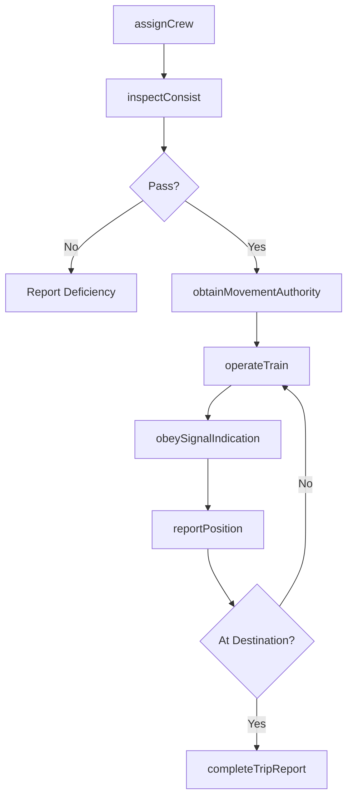
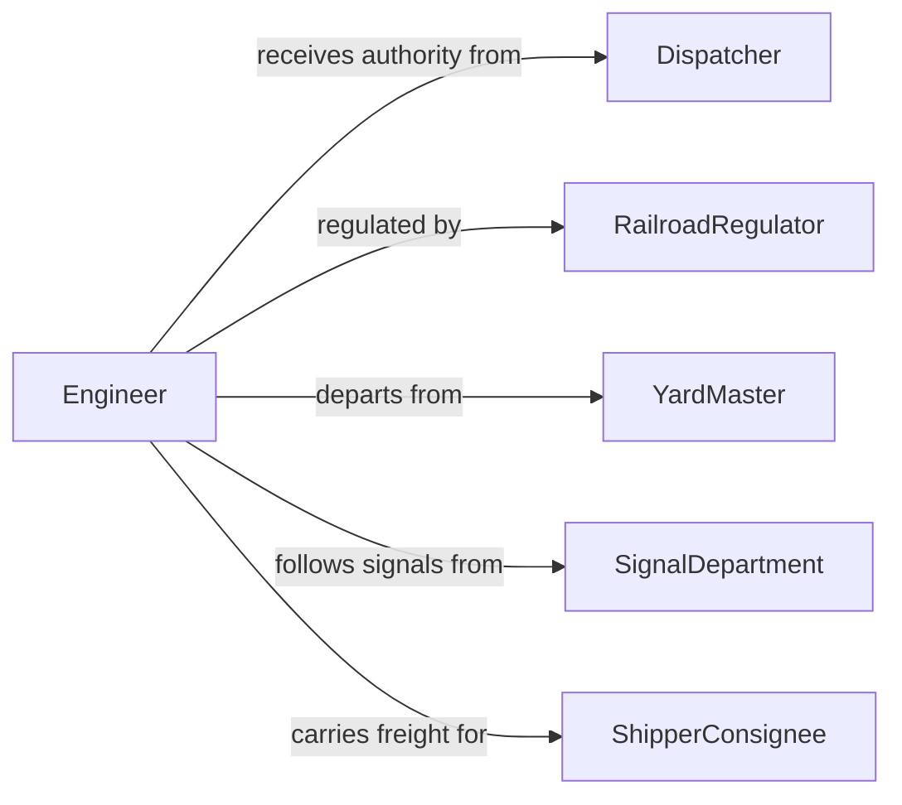

# Operate Locomotives Rail Vehicles

> Business-as-Code definition for operating locomotives or other rail vehicles. Models the complete rail operation lifecycle from crew assignment and consist inspection through train movement, signal compliance, and trip completion.

## Overview

Operating locomotives or other rail vehicles involves controlling the movement of trains, light rail vehicles, subway cars, and other rail-based transportation for the movement of freight or passengers along designated rail corridors. This definition exposes actions for crew assignment, train preparation, signal adherence, movement authority management, and trip reporting. It supports workflows for freight railroads, passenger rail services, commuter transit agencies, and industrial rail operations.

## Actors

| Actor | Description |
|-------|-------------|
| Dispatcher | Issues movement authorities and coordinates train traffic on the rail network |
| RailroadRegulator | Enforces federal safety standards for rail operations and equipment |
| YardMaster | Manages train assembly, switching, and departure sequencing in rail yards |
| SignalDepartment | Maintains and operates wayside signal systems and track circuits |
| ShipperConsignee | Originates or receives freight carried by rail |

## Roles

| Role | Description |
|------|-------------|
| Engineer | Controls the locomotive throttle, brakes, and horn during train movement |
| Conductor | Manages the train crew, cargo documentation, and on-board operations |
| Brakeman | Assists with switching operations, coupling, and hand brake application |
| TrainmasterSupervisor | Oversees daily train operations, crew scheduling, and performance |

## Entities

| Entity | Description |
|--------|-------------|
| Train | A consist of locomotive and cars operating as a single unit on the rail network |
| MovementAuthority | Permission to occupy a specific track segment between defined limits |
| Consist | The list of locomotives and cars comprising a train with weight and length |
| TrainOrder | Instructions from the dispatcher regarding speed, routing, or restrictions |
| TripReport | A record of departure, arrival, speed compliance, and incidents for a run |
| SignalIndication | The displayed aspect of a wayside signal governing train movement |

## Actions

| Action | Description |
|--------|-------------|
| assignCrew | Designate engineer, conductor, and other crew members to a train |
| inspectConsist | Perform a brake test and mechanical inspection of the train before departure |
| obtainMovementAuthority | Receive dispatcher clearance to proceed on a track segment |
| operateTrain | Control locomotive power, speed, and braking during movement |
| obeySignalIndication | Respond to wayside signal aspects by adjusting speed or stopping |
| reportPosition | Communicate current location and status to the dispatcher |
| completeTripReport | Finalize the run record with timing, fuel, and compliance data |

## Events

| Event | Description |
|-------|-------------|
| crewAssigned | Engineer and conductor have been designated for a train |
| consistInspected | The train has passed its pre-departure brake test and inspection |
| movementAuthorityObtained | Dispatcher clearance to proceed has been received |
| trainOperated | The locomotive is under power and moving on the rail network |
| signalObeyed | A wayside signal indication has been acknowledged and complied with |
| positionReported | The train current location has been communicated to the dispatcher |
| tripReportCompleted | The run record has been finalized and filed |

## Searches

| Search | Description |
|--------|-------------|
| findTrains | List trains by route, status, or scheduled departure |
| getMovementAuthorities | Retrieve active authorities by train, dispatcher, or track segment |
| getTripReports | Query completed trip records by date range, crew, or route |
| getConsistDetails | Look up the car and locomotive composition of a train |

## Workflow



## Actor Relationships



## Usage

### Calling Actions

```typescript
import { operateLocomotivesRailVehicles } from '@headlessly/operate-locomotives-rail-vehicles'

const rail = operateLocomotivesRailVehicles()

// Assign crew to a train
await rail.assignCrew({
  trainId: 'BNSF-4521',
  engineer: 'eng-078',
  conductor: 'cond-045',
  departureTime: '2026-05-10T04:30:00Z'
})

// Inspect the consist before departure
const inspection = await rail.inspectConsist({
  trainId: 'BNSF-4521',
  brakeTestType: 'Class I',
  cars: 112,
  totalWeight: 14200,
  weightUnit: 'tons'
})

// Obtain movement authority and begin operation
await rail.obtainMovementAuthority({
  trainId: 'BNSF-4521',
  fromMilepost: 0.0,
  toMilepost: 45.2,
  subdivision: 'Transcon',
  maxSpeed: 60
})
```

### Event-Driven Automation

```typescript
// Alert dispatcher on position updates
rail.positionReported(async ({ trainId, milepost, speed }) => {
  await updateTrainTracker({
    trainId,
    milepost,
    speed,
    timestamp: new Date().toISOString()
  })
})

// Auto-file trip report on arrival
rail.tripReportCompleted(async ({ trainId, route, fuelUsed }) => {
  await notify({
    to: 'trainmaster',
    message: `Train ${trainId} completed ${route}. Fuel consumed: ${fuelUsed} gallons.`
  })
})
```
