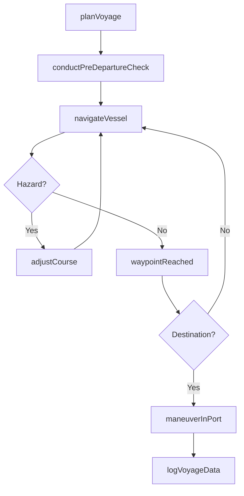
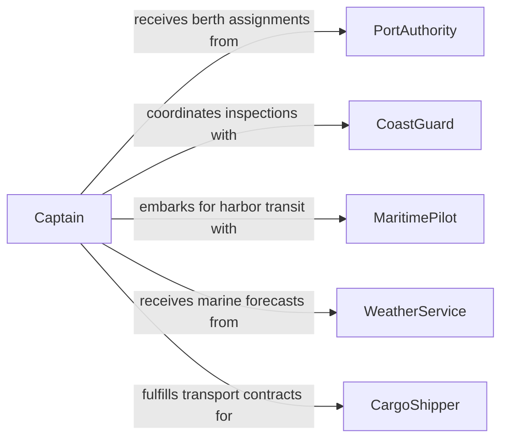

# Operate Ships Watercraft

> Business-as-Code definition for operating ships and other watercraft. Models the complete vessel operation lifecycle from pre-departure checks through navigation, docking, and post-voyage procedures.

## Overview

Operating ships and watercraft encompasses the navigation, maneuvering, and control of vessels ranging from tugboats and ferries to cargo ships and offshore supply vessels. This activity includes plotting courses, monitoring weather and sea conditions, managing propulsion and steering systems, and ensuring compliance with maritime regulations. It supports commercial shipping, passenger transport, fishing operations, and harbor management.

## Actors

| Actor | Description |
|-------|-------------|
| PortAuthority | Governs vessel traffic, berth assignments, and harbor regulations |
| CoastGuard | Enforces maritime safety standards and conducts vessel inspections |
| MaritimePilot | Guides vessels through restricted or congested waterways |
| CargoShipper | Contracts vessel services for freight transportation |
| PassengerAgent | Books and manages passenger manifests for ferry or cruise operations |
| WeatherService | Provides marine forecasts and storm warnings |

## Roles

| Role | Description |
|------|-------------|
| Captain | Commands the vessel and holds ultimate responsibility for safe operation |
| NavigationOfficer | Plots courses, monitors instruments, and maintains watch |
| Helmsman | Physically steers the vessel under officer direction |
| ChiefEngineer | Manages propulsion systems, fuel, and mechanical operations |

## Entities

| Entity | Description |
|--------|-------------|
| Vessel | A ship, boat, or watercraft being operated |
| Voyage | A planned journey from origin port to destination port |
| NavigationChart | Electronic or paper chart used for route planning |
| BerthAssignment | An allocated docking position at a port facility |
| CrewManifest | Record of all personnel aboard the vessel |
| CargoManifest | Inventory of goods being transported on the voyage |

## Actions

| Action | Description |
|--------|-------------|
| planVoyage | Define route, waypoints, and estimated arrival times |
| conductPreDepartureCheck | Verify vessel systems, safety equipment, and crew readiness |
| navigateVessel | Steer the vessel along the planned route using instruments |
| adjustCourse | Modify heading in response to weather, traffic, or hazards |
| maneuverInPort | Control vessel during docking, undocking, and harbor transit |
| monitorSystems | Track engine performance, fuel levels, and bilge status |
| logVoyageData | Record position, speed, weather, and incidents in the ship log |

## Events

| Event | Description |
|-------|-------------|
| voyagePlanned | Route and schedule have been established |
| vesselDeparted | Vessel has cleared the departure port |
| courseAdjusted | Heading or speed has been modified en route |
| waypointReached | Vessel has arrived at a planned navigation waypoint |
| hazardDetected | Weather, obstacle, or traffic hazard has been identified |
| vesselDocked | Vessel has been secured at the destination berth |
| voyageCompleted | All post-arrival procedures have been finalized |

## Searches

| Search | Description |
|--------|-------------|
| findVoyages | List voyages by vessel, route, date range, or status |
| getVesselPosition | Retrieve current position and heading of a vessel |
| getPortAvailability | Check berth availability at a given port and date |
| getWeatherConditions | Retrieve marine weather forecasts for a route segment |

## Workflow



## Actor Relationships



## Usage

### Calling Actions

```typescript
import { operateShipsWatercraft } from '@headlessly/operate-ships-watercraft'

const ops = operateShipsWatercraft()

// Plan a cargo voyage
const voyage = await ops.planVoyage({
  vesselId: 'mv-pacific-trader',
  origin: 'Port of Long Beach',
  destination: 'Port of Yokohama',
  departureDate: '2026-03-15',
  waypoints: ['Great Circle Route WP1', 'Great Circle Route WP2']
})

// Conduct pre-departure checks
await ops.conductPreDepartureCheck({
  voyageId: voyage.id,
  checks: ['navigation', 'propulsion', 'safety-equipment', 'crew-manifest']
})

// Log voyage data at waypoint
await ops.logVoyageData({
  voyageId: voyage.id,
  position: { lat: 35.4437, lon: -139.638 },
  speed: 18.5,
  heading: 270
})
```

### Event-Driven Automation

```typescript
// Alert bridge crew on hazard detection
ops.hazardDetected(async ({ voyageId, hazardType, severity }) => {
  if (severity === 'high') {
    await notify({
      to: 'bridge-watch',
      message: `${hazardType} hazard detected on voyage ${voyageId} - immediate course adjustment required`
    })
  }
})

// Notify port authority on arrival
ops.vesselDocked(async ({ vesselId, portId, berthId }) => {
  await notify({
    to: 'port-operations',
    message: `Vessel ${vesselId} secured at berth ${berthId}`
  })
})
```
