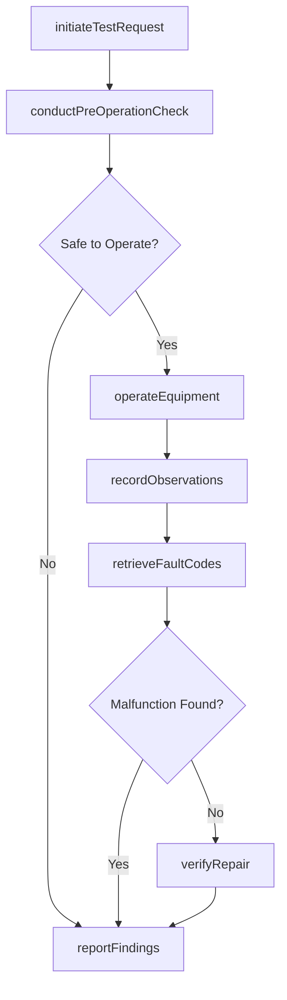
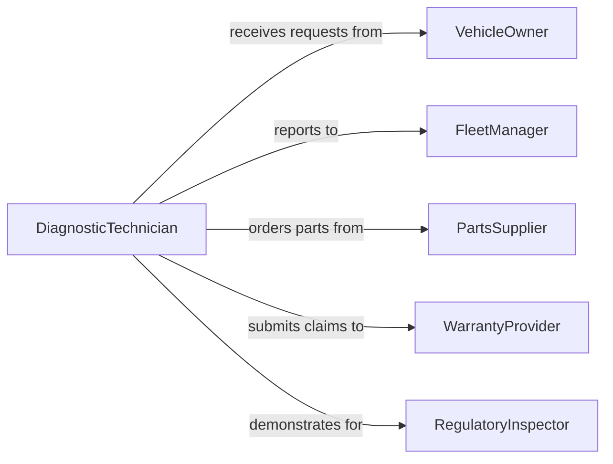

# Operate Transportation Equipment to Demonstrate Function

> Business-as-Code definition for operating transportation equipment to demonstrate its functional or malfunctioning state. Models the diagnostic operation lifecycle from test request through equipment operation, observation, and findings documentation.

## Overview

Operating transportation equipment for demonstration purposes involves starting, running, and manipulating vehicles, engines, transmissions, and related systems to reveal operational characteristics, identify malfunctions, or verify completed repairs. This definition covers the complete diagnostic operation workflow from receiving a test request through pre-operation inspection, controlled equipment operation, symptom observation, data capture, and findings reporting.

## Actors

| Actor | Description |
|-------|-------------|
| VehicleOwner | Individual or organization that owns the equipment being tested |
| FleetManager | Oversees vehicle pool and authorizes diagnostic operations |
| PartsSupplier | Provides replacement components identified through testing |
| WarrantyProvider | Manufacturer or insurer covering defect-related repairs |
| RegulatoryInspector | Government official verifying equipment meets safety standards |
| InsuranceAdjuster | Evaluates equipment condition for claims processing |

## Roles

| Role | Description |
|------|-------------|
| DiagnosticTechnician | Operates equipment and interprets functional behavior |
| ServiceAdvisor | Coordinates between the vehicle owner and the shop |
| QualityInspector | Validates that equipment meets performance standards |
| TestDriver | Operates vehicles under controlled conditions to reproduce symptoms |

## Entities

| Entity | Description |
|--------|-------------|
| TestRequest | Formal order to operate equipment for diagnostic purposes |
| EquipmentRecord | Vehicle or equipment identification and service history |
| DiagnosticSession | A recorded instance of operating equipment for evaluation |
| ObservationLog | Documented findings from operating the equipment |
| FaultCode | Electronic diagnostic trouble code retrieved from onboard systems |
| TestRoute | Predefined course or conditions for reproducing symptoms |
| RepairVerification | Confirmation that a completed repair resolved the issue |

## Actions

| Action | Description |
|--------|-------------|
| initiateTestRequest | Create a request to operate equipment for demonstration |
| conductPreOperationCheck | Inspect equipment safety and readiness before operation |
| operateEquipment | Run the vehicle or system under specified conditions |
| recordObservations | Document operational behavior, sounds, and performance data |
| retrieveFaultCodes | Pull electronic diagnostic codes from onboard computers |
| verifyRepair | Operate equipment post-repair to confirm issue resolution |
| reportFindings | Compile and deliver diagnostic operation results |

## Events

| Event | Description |
|-------|-------------|
| testRequestInitiated | A diagnostic operation request has been created |
| preOperationCheckCompleted | Equipment safety and readiness inspection is done |
| equipmentOperated | The vehicle or system has been run under test conditions |
| observationsRecorded | Operational behavior and data have been documented |
| faultCodesRetrieved | Electronic diagnostic codes have been pulled |
| repairVerified | Post-repair operation confirms the fix is effective |
| findingsReported | Diagnostic results have been compiled and delivered |

## Searches

| Search | Description |
|--------|-------------|
| findTestRequests | List diagnostic operation requests by equipment or status |
| getDiagnosticSessions | Retrieve test sessions by date, technician, or equipment |
| getFaultCodes | Look up fault codes by equipment or system category |
| getRepairVerifications | Find post-repair verification results by work order |

## Workflow



## Actor Relationships



## Usage

### Calling Actions

```typescript
import { operateTransportationEquipmentToDemonstrateFunction } from '@headlessly/operate-transportation-equipment-to-demonstrate-function'

const diagnostic = operateTransportationEquipmentToDemonstrateFunction()

// Initiate a test request
const request = await diagnostic.initiateTestRequest({
  equipmentId: 'VIN-1HGCM82633A004352',
  reportedSymptom: 'intermittent transmission slipping at highway speed',
  requestedBy: 'fleet-manager-northeast',
  priority: 'high'
})

// Conduct pre-operation check
const check = await diagnostic.conductPreOperationCheck({
  testRequestId: request.id,
  items: ['fluid-levels', 'tire-pressure', 'brake-function', 'warning-lights'],
  technicianId: 'tech-0042'
})

// Operate the equipment under test conditions
const session = await diagnostic.operateEquipment({
  testRequestId: request.id,
  conditions: { route: 'highway-loop', speed: '60-75mph', duration: '20min' },
  instruments: ['OBD-II-scanner', 'transmission-temp-gauge']
})

// Record observations
await diagnostic.recordObservations({
  sessionId: session.id,
  findings: [
    { timestamp: '00:08:32', observation: 'Transmission slipped from 4th to 3rd at 68mph' },
    { timestamp: '00:12:15', observation: 'Fluid temperature reached 220F before slip occurred' }
  ]
})
```

### Event-Driven Automation

```typescript
// Alert fleet manager when critical fault codes are retrieved
diagnostic.faultCodesRetrieved(async ({ equipmentId, codes }) => {
  const critical = codes.filter(c => c.severity === 'critical')
  if (critical.length > 0) {
    await notify({
      to: 'fleet-manager',
      message: `Critical faults on ${equipmentId}: ${critical.map(c => c.code).join(', ')}`
    })
  }
})

// Auto-schedule follow-up after repair verification
diagnostic.repairVerified(async ({ testRequestId, passed }) => {
  if (!passed) {
    await diagnostic.initiateTestRequest({
      parentRequestId: testRequestId,
      reason: 'repair-verification-failed',
      priority: 'urgent'
    })
  }
})
```
