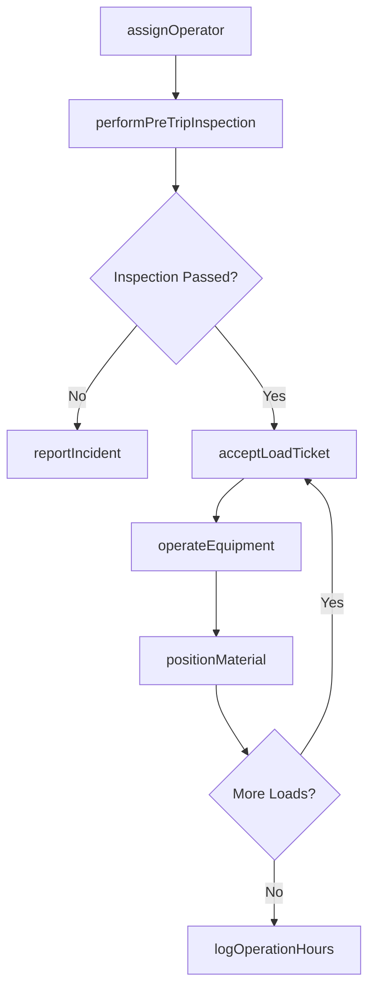
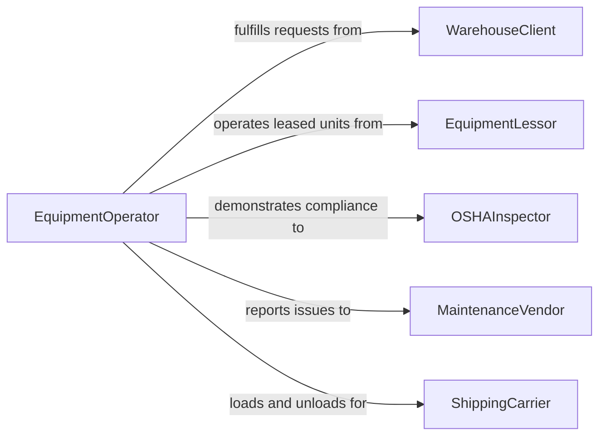

# Operate Vehicles or Material-Moving Equipment

> Business-as-Code definition for operating vehicles and material-moving equipment such as forklifts, cranes, loaders, and industrial trucks. Models the complete operational lifecycle from assignment through pre-trip inspection, load handling, transport, and shift closeout.

## Overview

Operating vehicles and material-moving equipment encompasses driving forklifts, overhead cranes, front-end loaders, conveyor systems, and other powered industrial trucks to transport, load, unload, and position materials in warehouses, construction sites, ports, and manufacturing facilities. This definition covers operator assignment, equipment checkout, load planning, safe operation, material placement, and end-of-shift reporting.

## Actors

| Actor | Description |
|-------|-------------|
| WarehouseClient | Customer or department requesting material movement |
| EquipmentLessor | Company providing leased vehicles and material handlers |
| OSHAInspector | Federal safety inspector evaluating workplace compliance |
| MaintenanceVendor | Third-party provider servicing equipment |
| ShippingCarrier | Trucking or freight company receiving or delivering loads |
| SiteOwner | Property or facility owner where equipment operates |

## Roles

| Role | Description |
|------|-------------|
| EquipmentOperator | Certified individual operating the vehicle or material handler |
| ShiftSupervisor | Assigns operators to equipment and oversees daily operations |
| SafetyOfficer | Monitors compliance with equipment operation safety standards |
| LoadPlanner | Determines material placement sequences and load configurations |

## Entities

| Entity | Description |
|--------|-------------|
| OperatorAssignment | Record linking a certified operator to specific equipment for a shift |
| EquipmentUnit | Individual vehicle or material handler with serial number and class |
| PreTripInspection | Documented safety check completed before operating equipment |
| LoadTicket | Instruction specifying materials, origin, destination, and priority |
| OperationLog | Continuous record of equipment usage, movements, and hours |
| IncidentReport | Documentation of any accident, near-miss, or equipment damage |
| CertificationRecord | Proof of operator training and licensing for equipment class |

## Actions

| Action | Description |
|--------|-------------|
| assignOperator | Link a certified operator to equipment for a shift period |
| performPreTripInspection | Complete and document the required safety checklist |
| acceptLoadTicket | Receive and acknowledge a material movement instruction |
| operateEquipment | Drive the vehicle or run the material handler to move loads |
| positionMaterial | Place materials at the designated storage or staging location |
| logOperationHours | Record equipment run time and fuel or battery consumption |
| reportIncident | Document any accident, near-miss, or equipment malfunction |

## Events

| Event | Description |
|-------|-------------|
| operatorAssigned | A certified operator has been linked to equipment for a shift |
| preTripInspectionCompleted | Safety checklist has been documented and passed |
| loadTicketAccepted | Material movement instruction has been acknowledged |
| equipmentOperated | Vehicle or material handler has completed a transport run |
| materialPositioned | Materials have been placed at the designated location |
| operationHoursLogged | Run time and consumption data have been recorded |
| incidentReported | An accident or near-miss has been documented |

## Searches

| Search | Description |
|--------|-------------|
| findAssignments | List operator-equipment assignments by shift or date |
| getEquipmentStatus | Retrieve availability and condition of equipment units |
| getLoadTickets | Find material movement tickets by status or priority |
| getOperationLogs | Look up equipment usage records by unit or operator |
| getIncidents | Search incident reports by severity, date, or equipment |

## Workflow



## Actor Relationships



## Usage

### Calling Actions

```typescript
import { operateVehiclesOrMaterialMovingEquipment } from '@headlessly/operate-vehicles-or-material-moving-equipment'

const ops = operateVehiclesOrMaterialMovingEquipment()

// Assign operator to forklift for the morning shift
const assignment = await ops.assignOperator({
  operatorId: 'op-1187',
  equipmentId: 'FL-2200-07',
  equipmentClass: 'Class-IV-internal-combustion',
  shift: { start: '2026-03-15T06:00:00', end: '2026-03-15T14:00:00' },
  certificationId: 'cert-FL-2025-1187'
})

// Perform pre-trip inspection
const inspection = await ops.performPreTripInspection({
  assignmentId: assignment.id,
  checklist: ['hydraulics', 'brakes', 'steering', 'horn', 'lights', 'seatbelt', 'forks'],
  fuelLevel: 0.85
})

// Accept and execute a load ticket
const ticket = await ops.acceptLoadTicket({
  ticketId: 'LT-44021',
  material: 'palletized-electronics',
  weight: 2400,
  origin: 'receiving-dock-3',
  destination: 'rack-B-12'
})

await ops.operateEquipment({
  assignmentId: assignment.id,
  ticketId: ticket.id,
  route: 'dock-3-to-aisle-B'
})
```

### Event-Driven Automation

```typescript
// Alert safety officer on any incident
ops.incidentReported(async ({ equipmentId, operatorId, severity }) => {
  await notify({
    to: 'safety-officer',
    message: `Incident reported on ${equipmentId} by ${operatorId} - severity: ${severity}`
  })
  if (severity === 'critical') {
    await ops.assignOperator({ equipmentId, status: 'out-of-service' })
  }
})

// Auto-flag equipment approaching maintenance threshold
ops.operationHoursLogged(async ({ equipmentId, totalHours }) => {
  if (totalHours % 250 < 8) {
    await notify({
      to: 'maintenance-scheduler',
      message: `Equipment ${equipmentId} at ${totalHours} hours - schedule preventive maintenance`
    })
  }
})
```
