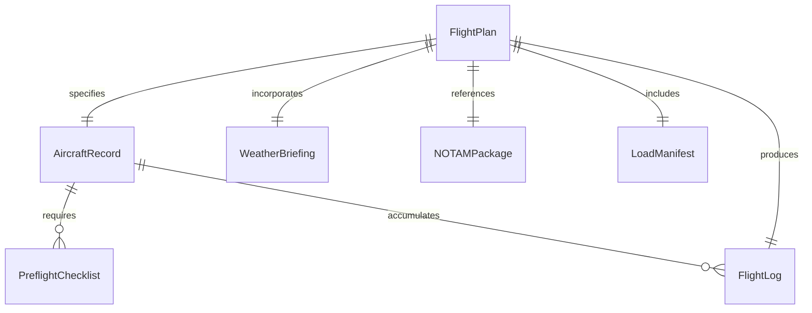
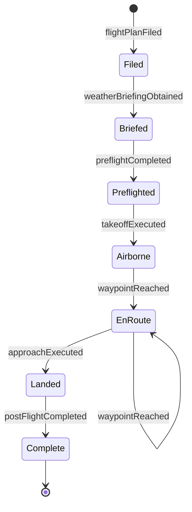
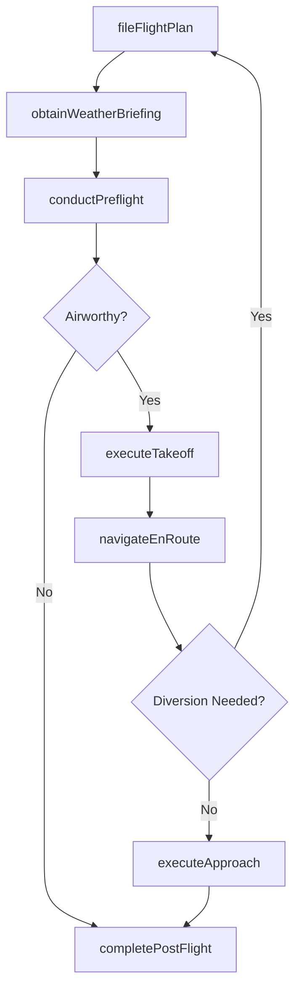
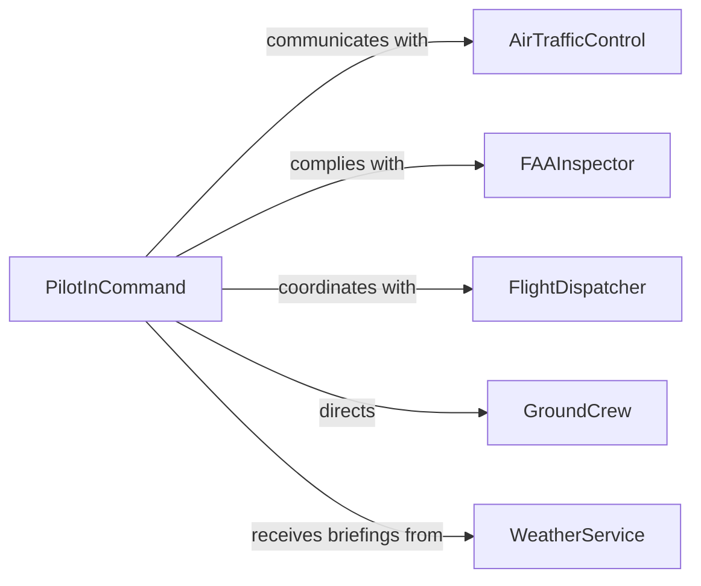

# Pilot Aircraft

> Business-as-Code definition for piloting aircraft including fixed-wing airplanes, rotorcraft, and unmanned aerial systems. Models the complete flight lifecycle from mission planning through preflight, departure, en-route operations, arrival, and post-flight procedures.

## Overview

Piloting aircraft involves planning flight routes, conducting preflight inspections, communicating with air traffic control, executing takeoff and landing procedures, navigating en-route segments, managing in-flight emergencies, and completing post-flight documentation. This definition covers commercial, cargo, charter, agricultural, and unmanned flight operations from mission assignment through debriefing.

## Actors

| Actor | Description |
|-------|-------------|
| AirTrafficControl | Ground-based authority directing aircraft movement in controlled airspace |
| FAAInspector | Federal Aviation Administration official overseeing compliance |
| FlightDispatcher | Operations center personnel planning and monitoring flights |
| GroundCrew | Personnel handling fueling, loading, and aircraft marshalling |
| PassengerAgent | Airline representative coordinating passenger boarding |
| WeatherService | Meteorological provider supplying forecasts and advisories |

## Roles

| Role | Description |
|------|-------------|
| PilotInCommand | Licensed aviator with final authority over the aircraft and flight |
| FirstOfficer | Second pilot assisting with flight duties and monitoring |
| FlightEngineer | Crew member managing aircraft systems on larger aircraft |
| CheckAirman | Designated pilot evaluating other pilots during proficiency checks |

## Entities

| Entity | Description |
|--------|-------------|
| FlightPlan | Filed route, altitude, fuel, and timing document |
| AircraftRecord | Tail number, type certificate, and maintenance logbook reference |
| PreflightChecklist | Systematic inspection list completed before each flight |
| WeatherBriefing | Meteorological summary for the planned route and timeframe |
| FlightLog | Continuous record of flight times, fuel burn, and events |
| NOTAMPackage | Notices to Air Missions relevant to the planned route |
| LoadManifest | Weight and balance document for passengers, cargo, and fuel |

## Actions

| Action | Description |
|--------|-------------|
| fileFlightPlan | Submit route, altitude, and timing to aviation authorities |
| conductPreflight | Complete the aircraft inspection checklist before departure |
| obtainWeatherBriefing | Review current and forecast conditions along the route |
| executeTakeoff | Perform departure procedures and transition to climb |
| navigateEnRoute | Fly the planned route while managing altitude and heading |
| executeApproach | Transition from cruise to final approach and landing |
| completePostFlight | Shut down systems, log flight data, and document squawks |

## Events

| Event | Description |
|-------|-------------|
| flightPlanFiled | Route and timing have been submitted to authorities |
| preflightCompleted | Aircraft inspection checklist has been finished |
| weatherBriefingObtained | Meteorological conditions have been reviewed |
| takeoffExecuted | Aircraft has departed and entered the climb phase |
| waypointReached | Aircraft has crossed a planned navigation fix |
| approachExecuted | Aircraft has transitioned to final approach and landed |
| postFlightCompleted | Flight data and squawks have been logged |

## Searches

| Search | Description |
|--------|-------------|
| findFlightPlans | List filed flight plans by route, date, or aircraft |
| getAircraftStatus | Retrieve airworthiness and availability of a tail number |
| getWeatherAlongRoute | Fetch current and forecast conditions for a flight path |
| getFlightLogs | Look up historical flight records by pilot or aircraft |
| getNOTAMs | Retrieve active notices for a route or airport |

## Entity Relationships



## State Diagram



## Workflow



## Actor Relationships



## Usage

### Calling Actions

```typescript
import { pilotAircraft } from '@headlessly/pilot-aircraft'

const flight = pilotAircraft()

// File a flight plan
const plan = await flight.fileFlightPlan({
  departure: 'KJFK',
  destination: 'KLAX',
  alternate: 'KLAS',
  aircraft: 'N742BA',
  type: 'B738',
  route: 'GREKI J60 AIR J584 MCI J80 TBC KEPEC KIMMO',
  altitude: 'FL350',
  estimatedTime: '5h12m',
  fuelOnBoard: '6h30m',
  passengers: 162
})

// Obtain weather briefing
const weather = await flight.obtainWeatherBriefing({
  flightPlanId: plan.id,
  briefingType: 'standard',
  route: plan.route,
  departureTime: '2026-04-10T14:00Z'
})

// Conduct preflight inspection
const preflight = await flight.conductPreflight({
  aircraftId: 'N742BA',
  checklist: 'B738-standard',
  fuelQuantity: 42000,
  loadManifest: { passengers: 162, cargo: 8200, bags: 12400 }
})

// Execute takeoff
await flight.executeTakeoff({
  flightPlanId: plan.id,
  runway: '31L',
  clearance: 'CLR-JFK-2026041014-3421',
  conditions: { wind: '310/12', visibility: '10SM', ceiling: 'CLR' }
})
```

### Event-Driven Automation

```typescript
// Notify dispatch when waypoints are reached
flight.waypointReached(async ({ flightPlanId, waypoint, eta }) => {
  await notify({
    to: 'flight-dispatch',
    message: `Flight ${flightPlanId} crossed ${waypoint} - ETA destination: ${eta}`
  })
})

// Trigger maintenance review on squawk report
flight.postFlightCompleted(async ({ aircraftId, squawks }) => {
  if (squawks.length > 0) {
    await notify({
      to: 'maintenance-control',
      message: `Aircraft ${aircraftId} has ${squawks.length} squawk(s) requiring review`
    })
  }
})
```
