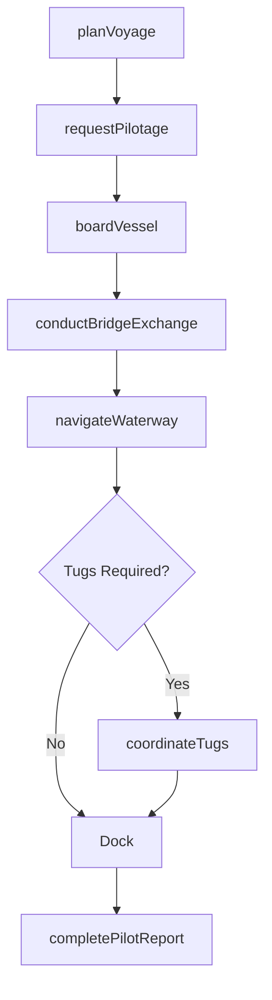
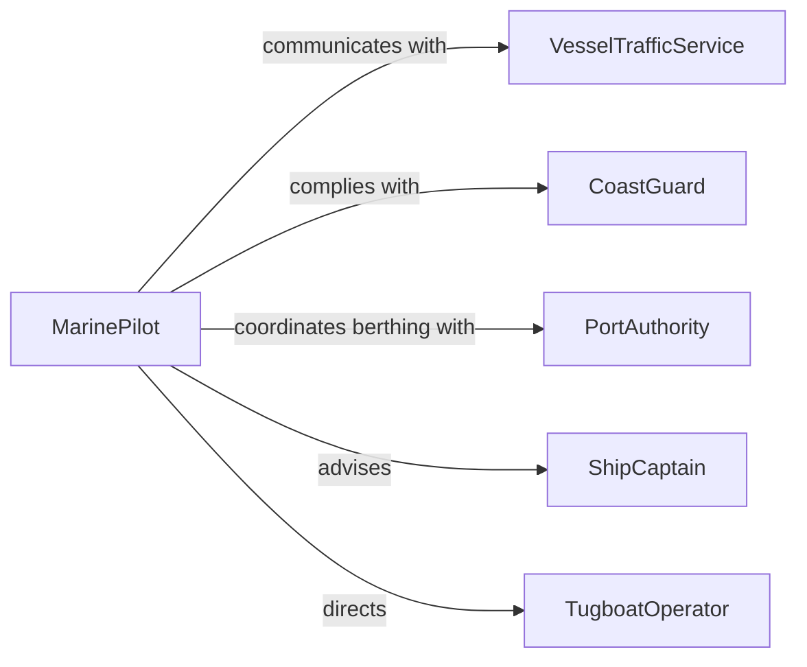

# Pilot Water Vessels

> Business-as-Code definition for piloting water vessels including commercial ships, tugboats, ferries, and harbor craft through navigable waterways. Models the complete voyage lifecycle from voyage planning through departure, transit, docking, and post-voyage procedures.

## Overview

Piloting water vessels involves planning transit routes through harbors, rivers, coastal waters, and open ocean; maneuvering vessels through channels, locks, and ports; communicating with vessel traffic services; managing weather and sea conditions; and completing port arrival and departure procedures. This definition covers commercial maritime pilotage, harbor operations, and inland waterway navigation from voyage assignment through post-voyage reporting.

## Actors

| Actor | Description |
|-------|-------------|
| VesselTrafficService | Shore-based authority monitoring and directing vessel movements |
| CoastGuard | Maritime safety and law enforcement authority |
| PortAuthority | Organization managing harbor operations and berth assignments |
| ShipOwner | Entity that owns the vessel and employs the crew |
| CargoAgent | Representative coordinating cargo loading and discharge schedules |
| TugboatOperator | Provider of assist tugs for docking and undocking maneuvers |

## Roles

| Role | Description |
|------|-------------|
| MarinePilot | Licensed navigator guiding vessels through specific waterways |
| ShipCaptain | Master of the vessel with overall command authority |
| Helmsman | Crew member steering the vessel under the pilot's direction |
| NavigationOfficer | Officer managing charts, radar, and electronic navigation systems |

## Entities

| Entity | Description |
|--------|-------------|
| VoyagePlan | Documented route, waypoints, tidal windows, and contingencies |
| PilotageOrder | Request for a licensed pilot to board and guide a vessel |
| NavigationChart | Electronic or paper chart covering the transit area |
| TidalSchedule | Predicted tide heights and current flows for the route |
| BerthAssignment | Designated dock position and arrival window |
| VesselLog | Official record of positions, headings, speeds, and events |
| PilotReport | Post-transit documentation of conditions and incidents |

## Actions

| Action | Description |
|--------|-------------|
| planVoyage | Chart the route, waypoints, and tidal windows for transit |
| requestPilotage | Submit a request for a licensed pilot to board the vessel |
| boardVessel | Pilot physically boards the ship via pilot ladder or boat |
| conductBridgeExchange | Share navigation plan and vessel particulars with the captain |
| navigateWaterway | Guide the vessel through the channel, river, or harbor |
| coordinateTugs | Direct tugboat assists for docking or undocking maneuvers |
| completePilotReport | Document the transit conditions, events, and anomalies |

## Events

| Event | Description |
|-------|-------------|
| voyagePlanned | Route and tidal windows have been charted |
| pilotageRequested | A licensed pilot has been requested for the transit |
| vesselBoarded | The pilot has boarded and assumed navigational guidance |
| bridgeExchangeCompleted | Navigation plan and vessel details have been shared |
| waypointPassed | The vessel has crossed a planned navigation waypoint |
| vesselDocked | The ship has been secured at the assigned berth |
| pilotReportCompleted | Transit documentation has been filed |

## Searches

| Search | Description |
|--------|-------------|
| findVoyagePlans | List voyage plans by vessel, route, or date |
| getPilotageOrders | Retrieve pilotage requests by port or status |
| getTidalWindows | Look up favorable transit windows for a waterway |
| getVesselLogs | Search vessel position and event records by voyage |
| getBerthAvailability | Check dock assignments and availability at a port |

## Workflow



## Actor Relationships



## Usage

### Calling Actions

```typescript
import { pilotWaterVessels } from '@headlessly/pilot-water-vessels'

const pilotage = pilotWaterVessels()

// Plan the inbound voyage
const voyage = await pilotage.planVoyage({
  vessel: 'MV-Pacific-Horizon',
  imo: '9876543',
  route: 'Ambrose-Channel-to-Newark-Bay',
  waypoints: ['Ambrose-Light', 'Verrazano-Narrows', 'Kill-Van-Kull', 'Newark-Channel'],
  tidalWindow: { highTide: '2026-05-12T08:42Z', draft: 12.5 },
  destination: 'Port-Newark-Berth-74'
})

// Request pilotage
const order = await pilotage.requestPilotage({
  voyageId: voyage.id,
  port: 'New-York-New-Jersey',
  eta: '2026-05-12T06:00Z',
  vesselType: 'container-ship',
  loa: 294,
  beam: 32.2
})

// Navigate the waterway
await pilotage.navigateWaterway({
  voyageId: voyage.id,
  pilotId: order.assignedPilotId,
  speed: 8,
  channels: ['Ambrose-Channel', 'Kill-Van-Kull'],
  underKeelClearance: 2.1
})

// Coordinate tugs for docking
await pilotage.coordinateTugs({
  voyageId: voyage.id,
  tugs: [
    { name: 'McAllister-Freedom', position: 'bow', power: 5000 },
    { name: 'McAllister-Liberty', position: 'stern', power: 4200 }
  ],
  berth: 'Newark-74'
})
```

### Event-Driven Automation

```typescript
// Notify port operations when vessel enters the channel
pilotage.vesselBoarded(async ({ vesselId, voyageId, eta }) => {
  await notify({
    to: 'port-operations',
    message: `Pilot aboard ${vesselId} - ETA berth: ${eta}`
  })
})

// Alert harbor master on tidal window changes
pilotage.waypointPassed(async ({ voyageId, waypoint, underKeelClearance }) => {
  if (underKeelClearance < 1.5) {
    await notify({
      to: 'harbor-master',
      message: `Low under-keel clearance (${underKeelClearance}m) at ${waypoint} for voyage ${voyageId}`
    })
  }
})
```
