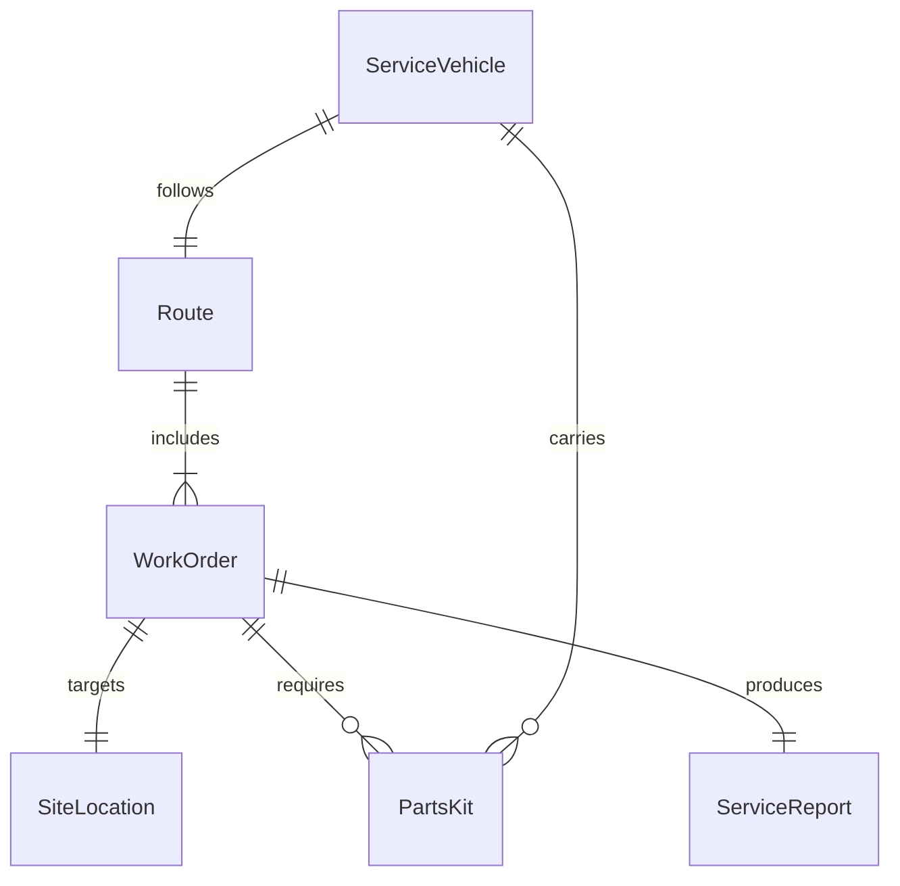
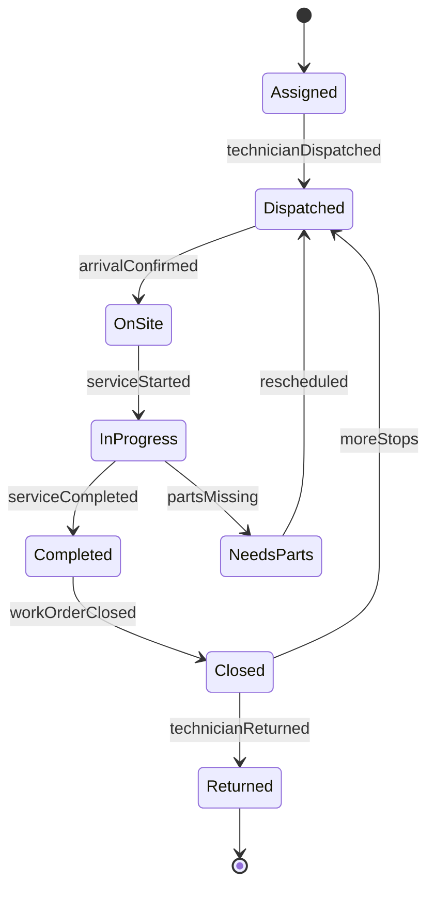
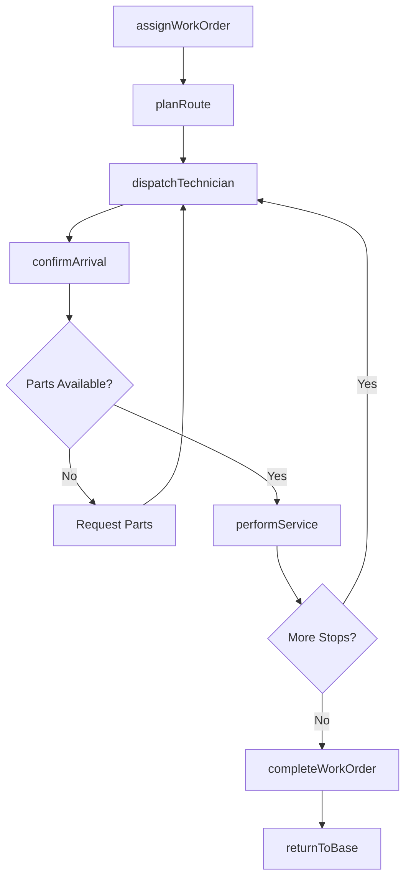
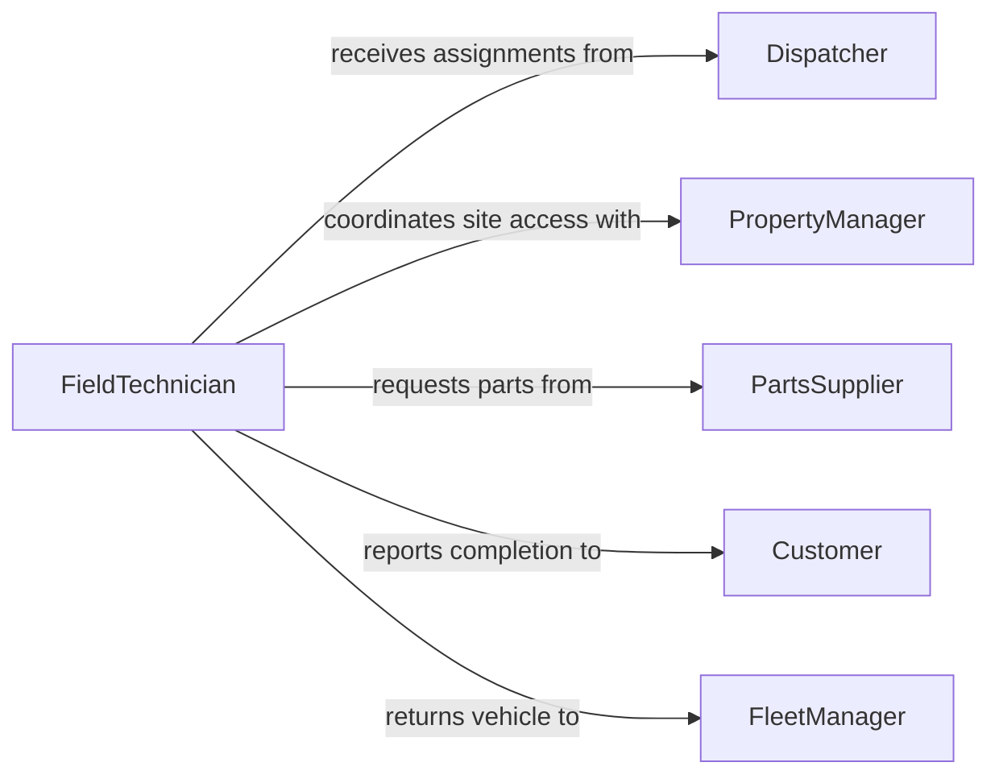

# Travel Work Sites Perform Installation

> Business-as-Code definition for traveling to work sites to perform installation, repair, or maintenance work. Models the complete field service dispatch lifecycle from assignment through travel, on-site execution, and completion.

## Overview

Traveling to work sites for installation, repair, or maintenance involves dispatching skilled technicians to customer or facility locations with the appropriate tools, parts, and documentation. This activity covers route planning, vehicle operation, site arrival verification, and on-site service execution. It is essential for field service organizations in telecommunications, HVAC, electrical, plumbing, and equipment maintenance industries.

## Actors

| Actor | Description |
|-------|-------------|
| Customer | Requests on-site installation, repair, or maintenance services |
| Dispatcher | Assigns work orders and coordinates technician schedules |
| PartsSupplier | Provides replacement components and materials for field work |
| PropertyManager | Grants site access and coordinates facility entry |
| FleetManager | Maintains service vehicles and manages fleet logistics |

## Roles

| Role | Description |
|------|-------------|
| FieldTechnician | Travels to sites and performs hands-on installation or repair work |
| ServiceSupervisor | Oversees technician assignments and quality of completed work |
| RoutePlanner | Optimizes travel sequences to minimize drive time and fuel usage |
| InventoryCoordinator | Ensures technicians carry required parts and tools for each job |

## Entities

| Entity | Description |
|--------|-------------|
| WorkOrder | A documented request for installation, repair, or maintenance at a site |
| ServiceVehicle | The truck or van used to transport technicians and equipment |
| Route | A planned sequence of site visits for a given workday |
| SiteLocation | The physical address and access details for the work site |
| PartsKit | The collection of tools, parts, and materials loaded for a job |
| ServiceReport | A completed record of work performed, time spent, and parts used |

## Actions

| Action | Description |
|--------|-------------|
| assignWorkOrder | Allocate a work order to a specific technician and time slot |
| planRoute | Calculate the optimal travel sequence for multiple site visits |
| dispatchTechnician | Send the technician en route to the next work site |
| confirmArrival | Record technician arrival and verify site access |
| performService | Execute the installation, repair, or maintenance task on site |
| completeWorkOrder | Finalize the service report and close the work order |
| returnToBase | Log the technician return trip and vehicle status |

## Events

| Event | Description |
|-------|-------------|
| workOrderAssigned | A work order has been allocated to a technician |
| technicianDispatched | Technician has departed for the work site |
| arrivalConfirmed | Technician has arrived and checked in at the site |
| serviceStarted | On-site work has begun |
| serviceCompleted | Installation, repair, or maintenance has been finished |
| workOrderClosed | Service report has been filed and work order finalized |
| technicianReturned | Technician has returned to the depot or home base |

## Searches

| Search | Description |
|--------|-------------|
| findWorkOrders | List work orders by technician, date, status, or location |
| getTechnicianLocation | Retrieve real-time GPS position of a field technician |
| getRouteStatus | Check progress of a planned route including completed and pending stops |
| findAvailableParts | Search inventory for parts required by a specific work order |

## Entity Relationships



## State Diagram



## Workflow



## Actor Relationships



## Usage

### Calling Actions

```typescript
import { travelWorkSitesPerformInstallation } from '@headlessly/travel-work-sites-perform-installation'

const fieldService = travelWorkSitesPerformInstallation()

// Assign a work order to a technician
const assignment = await fieldService.assignWorkOrder({
  workOrderId: 'WO-2026-4892',
  technicianId: 'tech-martinez',
  scheduledDate: '2026-03-20',
  timeSlot: '08:00-12:00'
})

// Plan optimal route for the day
const route = await fieldService.planRoute({
  technicianId: 'tech-martinez',
  date: '2026-03-20',
  startLocation: 'depot-north',
  workOrders: ['WO-2026-4892', 'WO-2026-4893', 'WO-2026-4895']
})

// Complete the work order after service
await fieldService.completeWorkOrder({
  workOrderId: 'WO-2026-4892',
  partsUsed: [{ partNumber: 'COMP-4410', quantity: 2 }],
  laborHours: 1.5,
  notes: 'Replaced compressor unit and tested system performance'
})
```

### Event-Driven Automation

```typescript
// Notify customer when technician is en route
fieldService.technicianDispatched(async ({ workOrderId, technicianId, eta }) => {
  await notify({
    to: 'customer',
    message: `Your technician is on the way. Estimated arrival: ${eta}`
  })
})

// Trigger inventory reorder when parts are consumed
fieldService.workOrderClosed(async ({ partsUsed }) => {
  for (const part of partsUsed) {
    const stock = await getStockLevel(part.partNumber)
    if (stock.quantity < stock.reorderPoint) {
      await createPurchaseOrder({ partNumber: part.partNumber, quantity: stock.reorderQuantity })
    }
  }
})
```
