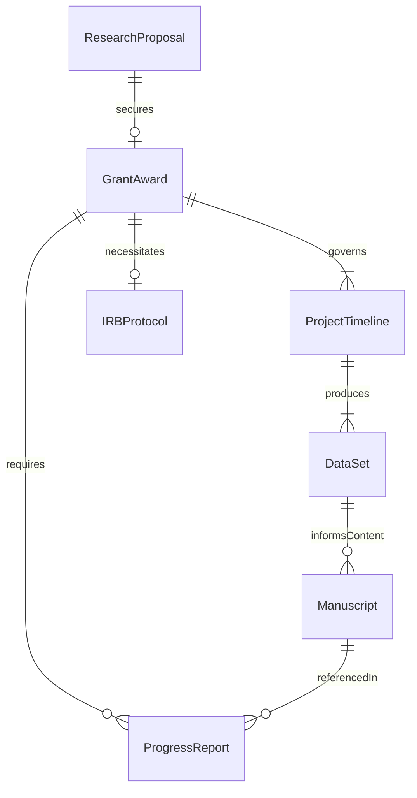
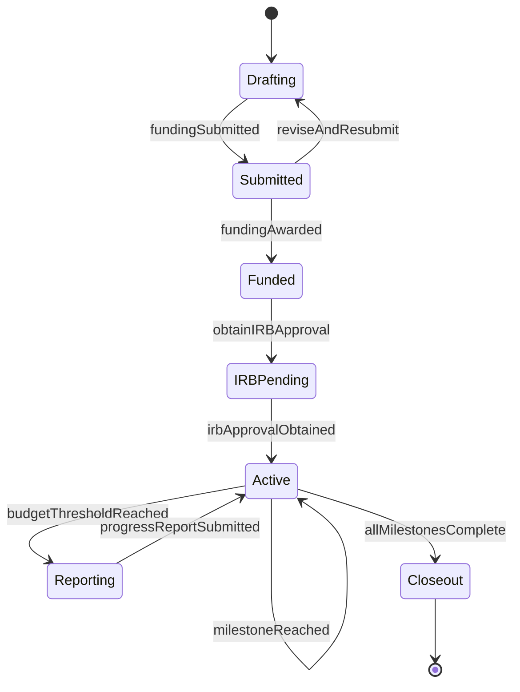
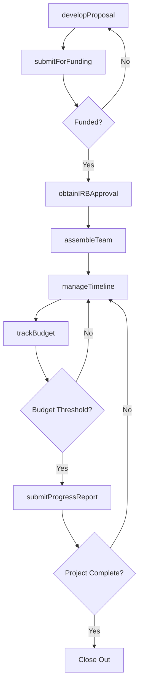
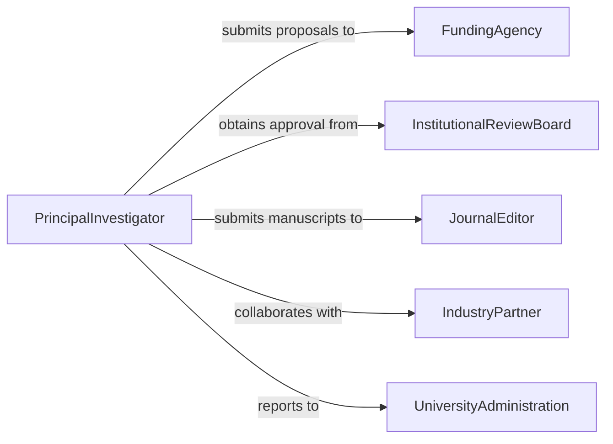

# Coordinate Academic Research Projects

> Business-as-Code definition for coordinating academic research projects from proposal development through execution, data collection, publication, and grant closeout.

## Overview

Academic research project coordination involves securing funding, assembling research teams, managing Institutional Review Board approvals, overseeing data collection and analysis, tracking budgets and timelines, ensuring regulatory compliance, and coordinating publication and dissemination of findings. This definition models the complete research lifecycle from initial proposal through grant closeout and archival.

## Actors

| Actor | Description |
|-------|-------------|
| FundingAgency | Organization providing grants such as NSF, NIH, or DOE |
| InstitutionalReviewBoard | Committee approving research involving human subjects |
| JournalEditor | Publication gatekeeper managing peer review of manuscripts |
| IndustryPartner | Corporate collaborator providing funding or resources |
| UniversityAdministration | Institutional leadership overseeing research compliance |
| ExternalReviewer | Independent expert evaluating proposals or manuscripts |

## Roles

| Role | Description |
|------|-------------|
| PrincipalInvestigator | Lead researcher directing the project and accountable for outcomes |
| ProjectCoordinator | Administrative lead managing timelines, budgets, and logistics |
| ResearchAssistant | Team member conducting experiments or data collection |
| GrantsAccountant | Financial specialist tracking expenditures against the award budget |

## Entities

| Entity | Description |
|--------|-------------|
| ResearchProposal | Formal application for funding describing objectives and methods |
| GrantAward | Approved funding agreement with terms and reporting requirements |
| IRBProtocol | Approved plan for ethical conduct of human-subjects research |
| ProjectTimeline | Milestone schedule with deliverables and deadlines |
| DataSet | Collected research data governed by management and sharing plans |
| Manuscript | Draft publication documenting research findings |
| ProgressReport | Periodic update submitted to the funding agency |

## Actions

| Action | Description |
|--------|-------------|
| developProposal | Draft the research proposal including budget and methodology |
| submitForFunding | File the proposal with the targeted funding agency |
| obtainIRBApproval | Submit and receive approval for human-subjects research protocols |
| assembleTeam | Recruit and assign researchers, assistants, and collaborators |
| manageTimeline | Track milestones, adjust schedules, and resolve delays |
| trackBudget | Monitor expenditures against the grant award budget |
| submitProgressReport | File periodic updates with the funding agency |

## Events

| Event | Description |
|-------|-------------|
| proposalDeveloped | Research proposal has been drafted and internally reviewed |
| fundingSubmitted | Proposal has been filed with the funding agency |
| irbApprovalObtained | Human-subjects protocol has been approved |
| teamAssembled | Research personnel have been recruited and assigned |
| milestoneReached | A scheduled project deliverable has been completed |
| budgetThresholdReached | Spending has crossed a planned percentage of the award |
| progressReportSubmitted | Periodic update has been filed with the funding agency |

## Searches

| Search | Description |
|--------|-------------|
| findProposals | List research proposals by investigator, status, or discipline |
| getGrantAwards | Retrieve active grants by funding agency or department |
| getTimelines | Look up project milestones and upcoming deadlines |
| getBudgetStatus | Check expenditure rates against award balances |
| getPublications | Find manuscripts and publications linked to a project |

## Entity Relationships



## State Diagram



## Workflow



## Actor Relationships



## Usage

### Calling Actions

```typescript
import { coordinateAcademicResearchProjects } from '@headlessly/coordinate-academic-research-projects'

const research = coordinateAcademicResearchProjects()

// Develop a research proposal
const proposal = await research.developProposal({
  title: 'Machine Learning Approaches to Early Alzheimer Detection',
  pi: 'dr-chen-neuroscience',
  agency: 'NIH-NIA',
  mechanism: 'R01',
  budget: { total: 1250000, years: 3 },
  aims: [
    'Develop MRI-based biomarker detection pipeline',
    'Validate model on longitudinal ADNI cohort',
    'Conduct prospective clinical evaluation'
  ]
})

// Submit for funding
await research.submitForFunding({
  proposalId: proposal.id,
  agency: 'NIH-NIA',
  deadline: '2026-06-05T17:00:00-05:00',
  grantNumber: 'PA-26-042'
})

// Manage the project timeline
await research.manageTimeline({
  grantId: 'NIH-1R01AG099123-01',
  milestones: [
    { name: 'IRB approval', deadline: '2026-09-01' },
    { name: 'Data collection complete', deadline: '2027-08-31' },
    { name: 'Model validation', deadline: '2028-03-31' },
    { name: 'Manuscript submission', deadline: '2028-12-01' }
  ]
})
```

### Event-Driven Automation

```typescript
// Alert PI when budget threshold is reached
research.budgetThresholdReached(async ({ grantId, percentSpent }) => {
  if (percentSpent >= 75) {
    await notify({
      to: 'principal-investigator',
      message: `Grant ${grantId} is at ${percentSpent}% expenditure - review remaining milestones`
    })
  }
})

// Auto-remind for progress report deadlines
research.milestoneReached(async ({ grantId, milestone }) => {
  if (milestone === 'annual-report-due') {
    await research.submitProgressReport({ grantId })
  }
})
```
