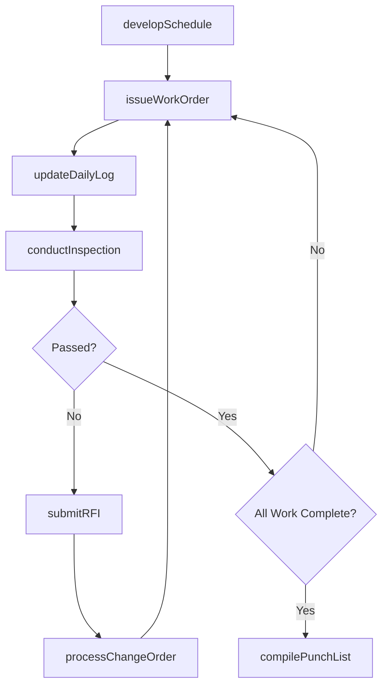
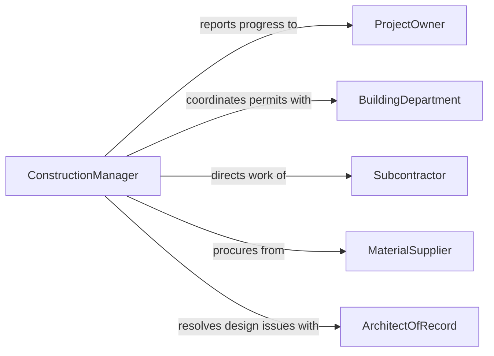

# Manage Construction Activities

> Business-as-Code definition for managing construction activities including scheduling, resource allocation, subcontractor coordination, quality control, and regulatory compliance across building, infrastructure, and renovation projects.

## Overview

Construction activity management involves planning and sequencing work phases, coordinating trades and subcontractors, tracking schedules and budgets, ensuring code compliance, managing material procurement, conducting quality inspections, and resolving field issues. This definition covers the complete construction management lifecycle from project mobilization through substantial completion and closeout.

## Actors

| Actor | Description |
|-------|-------------|
| ProjectOwner | Client funding the construction and defining project requirements |
| BuildingDepartment | Municipal authority issuing permits and conducting inspections |
| Subcontractor | Specialty trade firm performing specific scopes of work |
| MaterialSupplier | Vendor providing construction materials and equipment |
| ArchitectOfRecord | Design professional responsible for construction documents |
| SuretyCompany | Bond provider guaranteeing project completion and payment |

## Roles

| Role | Description |
|------|-------------|
| ConstructionManager | Oversees all construction activities, schedule, and budget |
| ProjectEngineer | Manages technical submittals, RFIs, and change orders |
| Superintendent | Directs daily field operations and coordinates trade crews |
| SafetyManager | Ensures OSHA compliance and administers the site safety plan |

## Entities

| Entity | Description |
|--------|-------------|
| ConstructionSchedule | Critical path method schedule with activities and dependencies |
| WorkOrder | Instruction authorizing specific scope of work on site |
| ChangeOrder | Modification to contract scope, cost, or schedule |
| RFI | Request for Information seeking design clarification |
| DailyLog | Field report documenting weather, labor, equipment, and activities |
| PunchList | Deficiency list compiled before substantial completion |
| Permit | Government authorization required before specific work begins |

## Actions

| Action | Description |
|--------|-------------|
| developSchedule | Create the construction schedule with critical path analysis |
| issueWorkOrder | Authorize a subcontractor or crew to begin a scope of work |
| processChangeOrder | Evaluate, price, and approve a scope modification |
| submitRFI | Send a design clarification request to the architect |
| conductInspection | Perform quality or code compliance inspection on completed work |
| updateDailyLog | Record daily field conditions, progress, and personnel |
| compilePunchList | Document remaining deficiencies before final completion |

## Events

| Event | Description |
|-------|-------------|
| schedulePublished | Construction schedule has been issued to all parties |
| workOrderIssued | A scope of work has been authorized to proceed |
| changeOrderProcessed | A scope modification has been evaluated and approved |
| rfiSubmitted | A design clarification request has been sent |
| inspectionCompleted | Quality or code inspection has been performed |
| dailyLogUpdated | Field conditions and progress have been recorded |
| punchListCompiled | Deficiency list has been documented |

## Searches

| Search | Description |
|--------|-------------|
| findWorkOrders | List work orders by trade, status, or date range |
| getScheduleStatus | Retrieve schedule progress and critical path updates |
| getChangeOrders | Look up change orders by cost impact or approval status |
| getInspectionResults | Find inspection records by trade or compliance status |
| getRFIs | Search requests for information by status or discipline |

## Workflow



## Actor Relationships



## Usage

### Calling Actions

```typescript
import { manageConstructionActivities } from '@headlessly/manage-construction-activities'

const construction = manageConstructionActivities()

// Develop the construction schedule
const schedule = await construction.developSchedule({
  projectId: 'PRJ-2026-0412',
  name: 'Riverside Mixed-Use Development',
  phases: [
    { name: 'Site Preparation', duration: '4w', predecessors: [] },
    { name: 'Foundation', duration: '6w', predecessors: ['Site Preparation'] },
    { name: 'Structural Steel', duration: '10w', predecessors: ['Foundation'] },
    { name: 'Building Envelope', duration: '8w', predecessors: ['Structural Steel'] },
    { name: 'MEP Rough-In', duration: '12w', predecessors: ['Structural Steel'] },
    { name: 'Interior Finishes', duration: '14w', predecessors: ['Building Envelope', 'MEP Rough-In'] }
  ],
  targetCompletion: '2027-11-30'
})

// Issue a work order to a subcontractor
const workOrder = await construction.issueWorkOrder({
  scheduleId: schedule.id,
  trade: 'structural-steel',
  subcontractorId: 'ironworks-inc',
  scope: 'Erect structural steel floors 1-8',
  contractValue: 2400000,
  startDate: '2026-08-15'
})

// Conduct a quality inspection
await construction.conductInspection({
  workOrderId: workOrder.id,
  type: 'structural-steel-connections',
  inspector: 'third-party-QA',
  criteria: ['bolt-torque', 'weld-quality', 'plumbness', 'alignment']
})
```

### Event-Driven Automation

```typescript
// Alert project owner on change orders exceeding threshold
construction.changeOrderProcessed(async ({ projectId, amount, cumulativeTotal }) => {
  if (cumulativeTotal > 500000) {
    await notify({
      to: 'project-owner',
      message: `Cumulative change orders on ${projectId} have reached $${cumulativeTotal.toLocaleString()}`
    })
  }
})

// Auto-schedule follow-up when inspection fails
construction.inspectionCompleted(async ({ workOrderId, passed }) => {
  if (!passed) {
    await construction.submitRFI({
      workOrderId,
      subject: 'Failed inspection - design clarification needed',
      priority: 'high'
    })
  }
})
```
