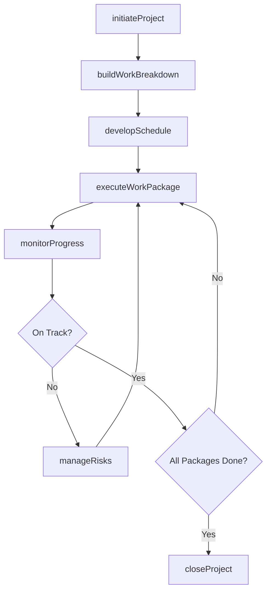
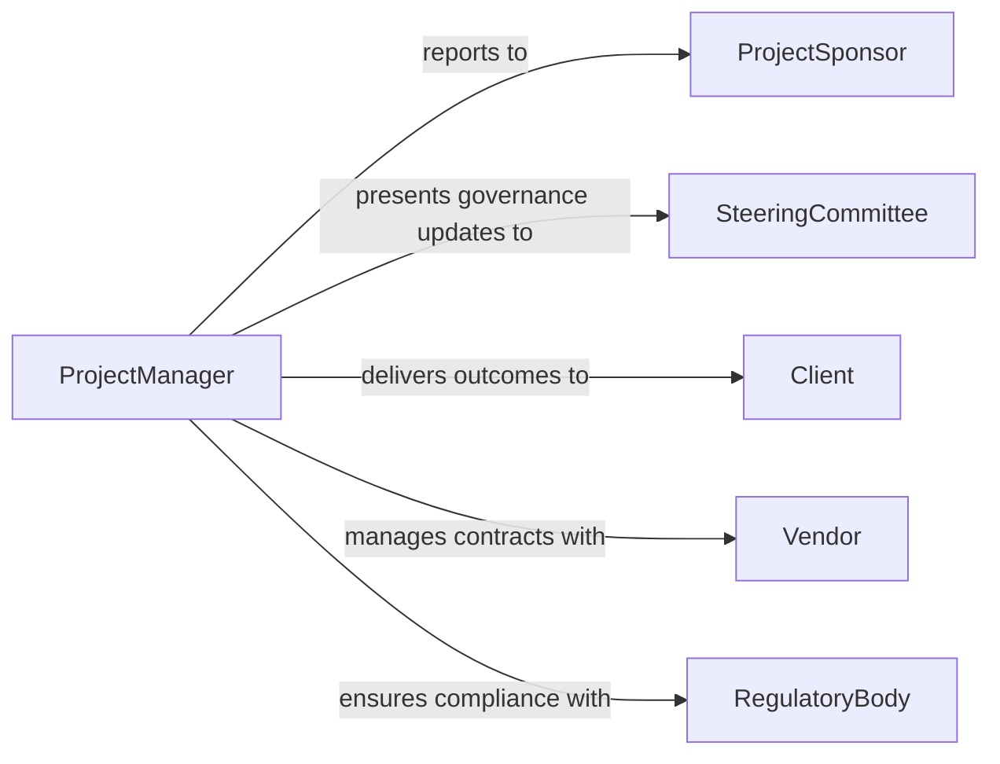

# Manage Projects and Oversee Project Execution

> Business-as-Code definition for managing projects and overseeing execution across disciplines including IT, engineering, operations, and professional services. Models the complete project management lifecycle from initiation through planning, execution, monitoring, and closeout.

## Overview

Project management and execution oversight involves defining project scope, assembling teams, creating work breakdown structures, tracking schedules and budgets, managing risks and issues, conducting status reviews, and delivering project outcomes within constraints. This definition covers generic project management practices applicable across industries, following PMI-aligned lifecycle phases from charter through lessons learned.

## Actors

| Actor | Description |
|-------|-------------|
| ProjectSponsor | Executive providing funding and strategic direction |
| SteeringCommittee | Cross-functional leadership group making governance decisions |
| Client | External or internal customer receiving project deliverables |
| Vendor | Third-party supplier providing contracted goods or services |
| RegulatoryBody | Authority whose requirements constrain project scope or schedule |
| AuditTeam | Group reviewing project governance and financial controls |

## Roles

| Role | Description |
|------|-------------|
| ProjectManager | Leads planning, execution, and delivery of the project |
| ProjectScheduler | Develops and maintains the project schedule and critical path |
| RiskAnalyst | Identifies, assesses, and tracks project risks and mitigations |
| QualityLead | Ensures deliverables meet defined acceptance criteria |

## Entities

| Entity | Description |
|--------|-------------|
| ProjectCharter | Document authorizing the project and defining high-level scope |
| WorkBreakdownStructure | Hierarchical decomposition of project deliverables into tasks |
| ProjectSchedule | Time-phased plan with milestones, dependencies, and resources |
| RiskRegister | Log of identified risks with probability, impact, and responses |
| StatusReport | Periodic summary of schedule, budget, scope, and issues |
| ChangeRequest | Formal proposal to modify project scope, schedule, or budget |
| LessonsLearned | Post-project documentation of successes and improvement areas |

## Actions

| Action | Description |
|--------|-------------|
| initiateProject | Create the project charter and secure sponsor approval |
| buildWorkBreakdown | Decompose scope into manageable work packages and tasks |
| developSchedule | Sequence tasks, assign resources, and identify the critical path |
| executeWorkPackage | Perform project tasks and produce deliverables |
| monitorProgress | Track schedule, budget, and scope against baselines |
| manageRisks | Identify new risks and execute mitigation or contingency plans |
| closeProject | Finalize deliverables, release resources, and capture lessons learned |

## Events

| Event | Description |
|-------|-------------|
| projectInitiated | Charter has been approved and the project has started |
| workBreakdownBuilt | Work breakdown structure has been completed |
| scheduleBaselined | Project schedule has been approved as the baseline |
| workPackageCompleted | A set of project tasks has been finished |
| progressReviewed | Schedule, budget, and scope have been assessed against baselines |
| riskEscalated | A risk has exceeded threshold and requires leadership attention |
| projectClosed | Deliverables accepted, resources released, lessons documented |

## Searches

| Search | Description |
|--------|-------------|
| findProjects | List projects by status, sponsor, or department |
| getScheduleVariance | Retrieve schedule performance against the baseline |
| getBudgetStatus | Check actual spend versus planned budget |
| getRisks | Search the risk register by probability or impact level |
| getChangeRequests | Find change requests by status or impact category |

## Workflow



## Actor Relationships



## Usage

### Calling Actions

```typescript
import { manageProjectsAndOverseeProjectExecution } from '@headlessly/manage-projects-and-oversee-project-execution'

const projects = manageProjectsAndOverseeProjectExecution()

// Initiate a new project
const charter = await projects.initiateProject({
  name: 'Enterprise ERP Migration',
  sponsor: 'cfo-office',
  objectives: [
    'Migrate from legacy ERP to cloud-native platform',
    'Complete data migration with zero data loss',
    'Train 500 end users across 8 departments'
  ],
  budget: 3200000,
  targetDate: '2027-06-30'
})

// Build the work breakdown structure
const wbs = await projects.buildWorkBreakdown({
  charterId: charter.id,
  packages: [
    { code: '1.1', name: 'Requirements Gathering', effort: '320h' },
    { code: '1.2', name: 'System Configuration', effort: '640h' },
    { code: '1.3', name: 'Data Migration', effort: '480h' },
    { code: '1.4', name: 'Integration Testing', effort: '240h' },
    { code: '1.5', name: 'User Training', effort: '160h' },
    { code: '1.6', name: 'Go-Live and Hypercare', effort: '120h' }
  ]
})

// Monitor progress
const status = await projects.monitorProgress({
  projectId: charter.id,
  asOfDate: '2027-01-15',
  metrics: ['schedule-variance', 'cost-variance', 'earned-value']
})
```

### Event-Driven Automation

```typescript
// Escalate to steering committee when risk is elevated
projects.riskEscalated(async ({ projectId, riskId, impact }) => {
  await notify({
    to: 'steering-committee',
    message: `Project ${projectId} risk ${riskId} escalated - impact: ${impact}`
  })
})

// Auto-generate lessons learned at project close
projects.projectClosed(async ({ projectId, metrics }) => {
  await notify({
    to: 'pmo-office',
    message: `Project ${projectId} closed - schedule variance: ${metrics.scheduleVariance}, cost variance: ${metrics.costVariance}`
  })
})
```
