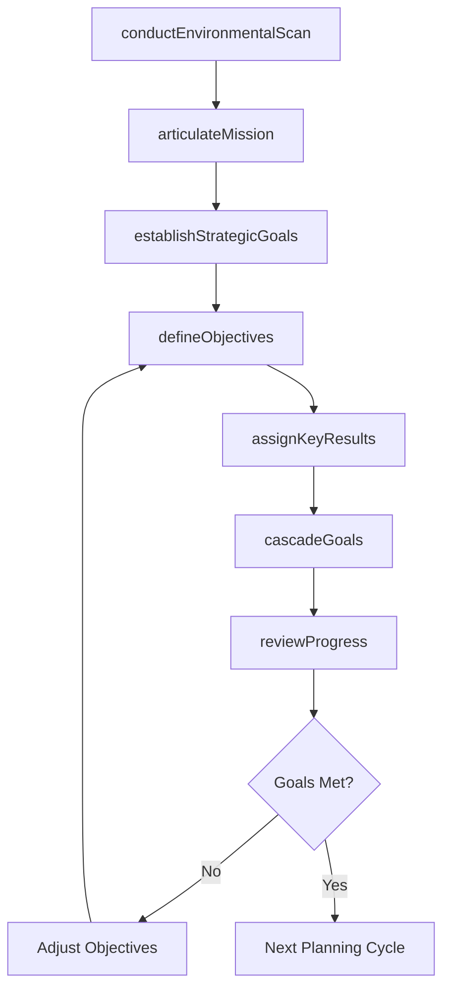
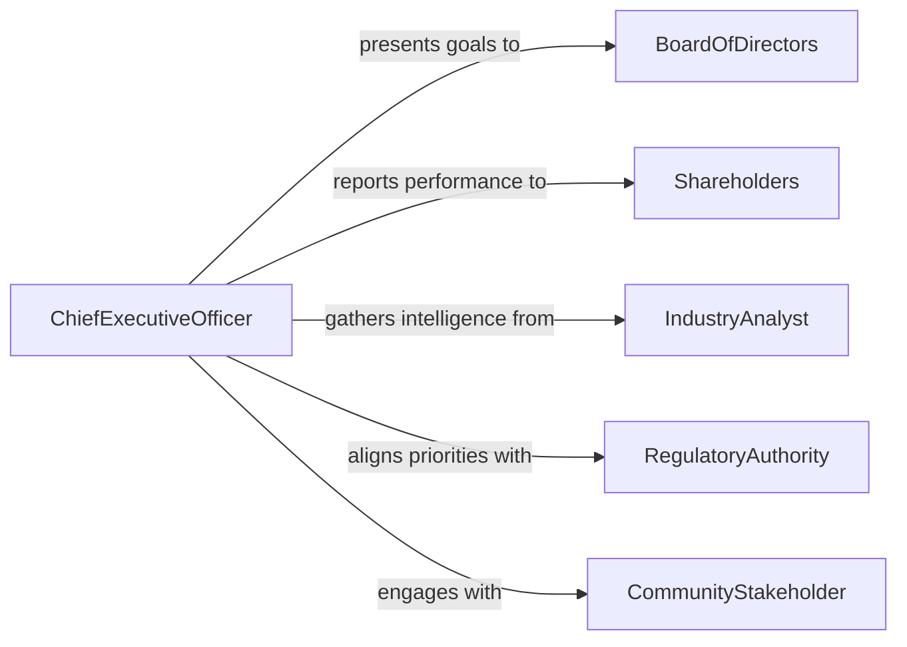

# Develop Organizational Goals Objectives

> Business-as-Code definition for developing organizational goals and objectives including mission articulation, strategic planning, performance target setting, and cascading goals across divisions and departments.

## Overview

Developing organizational goals and objectives involves analyzing the current state, articulating the organizational mission and vision, establishing measurable strategic goals, setting departmental objectives, defining key results, and creating alignment mechanisms that cascade direction from leadership to individual contributors. This definition models the process from environmental scan through goal ratification, communication, and periodic review.

## Actors

| Actor | Description |
|-------|-------------|
| BoardOfDirectors | Governing body approving organizational strategic direction |
| Shareholders | Owners with financial interest in organizational performance |
| IndustryAnalyst | External expert providing market and competitive intelligence |
| RegulatoryAuthority | Government body whose mandates shape organizational priorities |
| CommunityStakeholder | Local group affected by organizational decisions |
| StrategicConsultant | External advisor facilitating goal-setting processes |

## Roles

| Role | Description |
|------|-------------|
| ChiefExecutiveOfficer | Sets overall organizational direction and priorities |
| StrategyDirector | Facilitates the goal development process and ensures alignment |
| DivisionHead | Translates organizational goals into divisional objectives |
| PerformanceAnalyst | Defines metrics and tracks progress toward goals |

## Entities

| Entity | Description |
|--------|-------------|
| MissionStatement | Declaration of the organization's core purpose |
| VisionStatement | Aspirational description of the desired future state |
| StrategicGoal | High-level outcome the organization aims to achieve |
| DepartmentalObjective | Specific target supporting a strategic goal within a unit |
| KeyResult | Measurable indicator of progress toward an objective |
| EnvironmentalScan | Analysis of internal strengths and external opportunities and threats |
| GoalCascadeMap | Visual alignment of goals from organizational to individual level |

## Actions

| Action | Description |
|--------|-------------|
| conductEnvironmentalScan | Analyze internal capabilities and external conditions |
| articulateMission | Define or refine the organization's core purpose |
| establishStrategicGoals | Set high-level outcomes for the planning period |
| defineObjectives | Break strategic goals into specific departmental targets |
| assignKeyResults | Attach measurable indicators to each objective |
| cascadeGoals | Align goals across divisions, departments, and individuals |
| reviewProgress | Assess goal attainment and adjust as needed |

## Events

| Event | Description |
|-------|-------------|
| environmentalScanCompleted | Internal and external analysis has been finished |
| missionArticulated | Organizational purpose has been defined or updated |
| strategicGoalsEstablished | High-level outcomes have been set for the period |
| objectivesDefined | Departmental targets have been specified |
| keyResultsAssigned | Measurable indicators have been attached to objectives |
| goalsCascaded | Alignment across all organizational levels is complete |
| progressReviewed | Goal attainment has been assessed and adjustments made |

## Searches

| Search | Description |
|--------|-------------|
| findGoals | List strategic goals by period, theme, or status |
| getObjectives | Retrieve departmental objectives linked to a strategic goal |
| getKeyResults | Look up measurable indicators for a specific objective |
| getProgressReports | Find periodic progress assessments by goal or department |
| getCascadeMap | View goal alignment from organizational to individual level |

## Workflow



## Actor Relationships



## Usage

### Calling Actions

```typescript
import { developOrganizationalGoalsObjectives } from '@headlessly/develop-organizational-goals-objectives'

const goals = developOrganizationalGoalsObjectives()

// Conduct environmental scan
const scan = await goals.conductEnvironmentalScan({
  organization: 'Meridian Health Systems',
  strengths: ['top-rated-cardiac-program', 'regional-market-leader'],
  weaknesses: ['aging-IT-infrastructure', 'nursing-shortage'],
  opportunities: ['telehealth-expansion', 'value-based-care-contracts'],
  threats: ['competitor-mergers', 'reimbursement-cuts']
})

// Establish strategic goals
const strategic = await goals.establishStrategicGoals({
  scanId: scan.id,
  planningPeriod: 'FY2026-FY2028',
  goals: [
    { name: 'Expand Telehealth Services', target: '40% of outpatient visits by 2028' },
    { name: 'Improve Patient Satisfaction', target: 'Top quartile HCAHPS by 2027' },
    { name: 'Reduce Operating Costs', target: '8% reduction in cost per case by 2028' }
  ]
})

// Define departmental objectives
await goals.defineObjectives({
  goalId: strategic.goals[0].id,
  objectives: [
    { department: 'IT', target: 'Deploy unified telehealth platform by Q2 2026' },
    { department: 'Clinical Operations', target: 'Train 200 providers on virtual care by Q4 2026' },
    { department: 'Marketing', target: 'Achieve 50,000 patient portal registrations by Q1 2027' }
  ]
})
```

### Event-Driven Automation

```typescript
// Notify leadership when goals are cascaded
goals.goalsCascaded(async ({ organizationId, planningPeriod }) => {
  await notify({
    to: 'executive-team',
    message: `${planningPeriod} goals have been cascaded - review individual objectives in the portal`
  })
})

// Flag underperforming objectives during review
goals.progressReviewed(async ({ objectiveId, actual, target }) => {
  if (actual / target < 0.6) {
    await notify({
      to: 'strategy-director',
      message: `Objective ${objectiveId} is at ${Math.round(actual / target * 100)}% of target - intervention needed`
    })
  }
})
```
