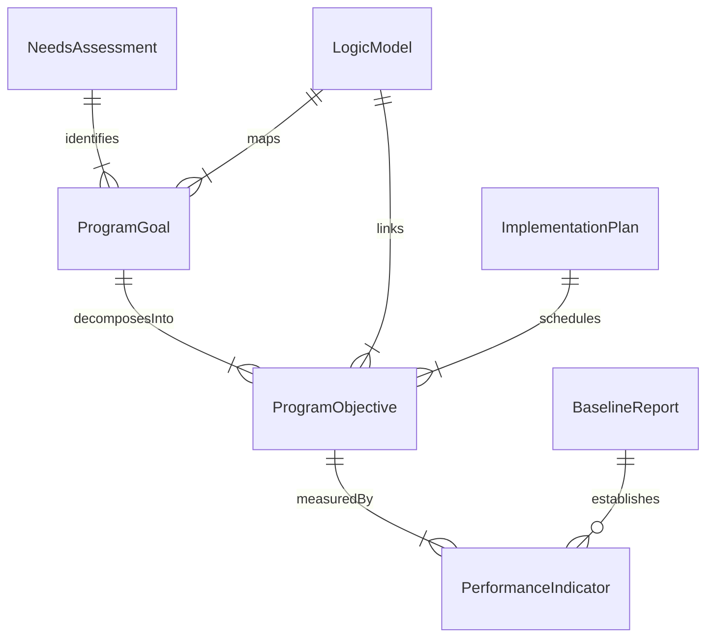
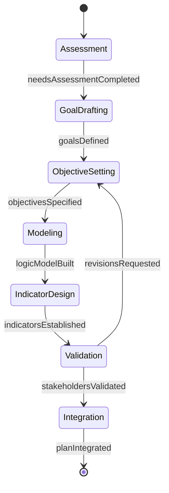
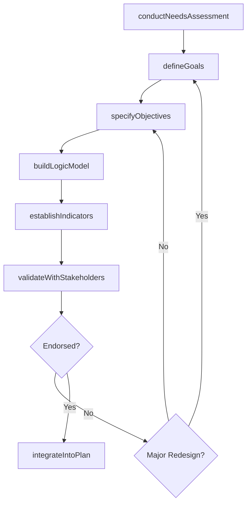
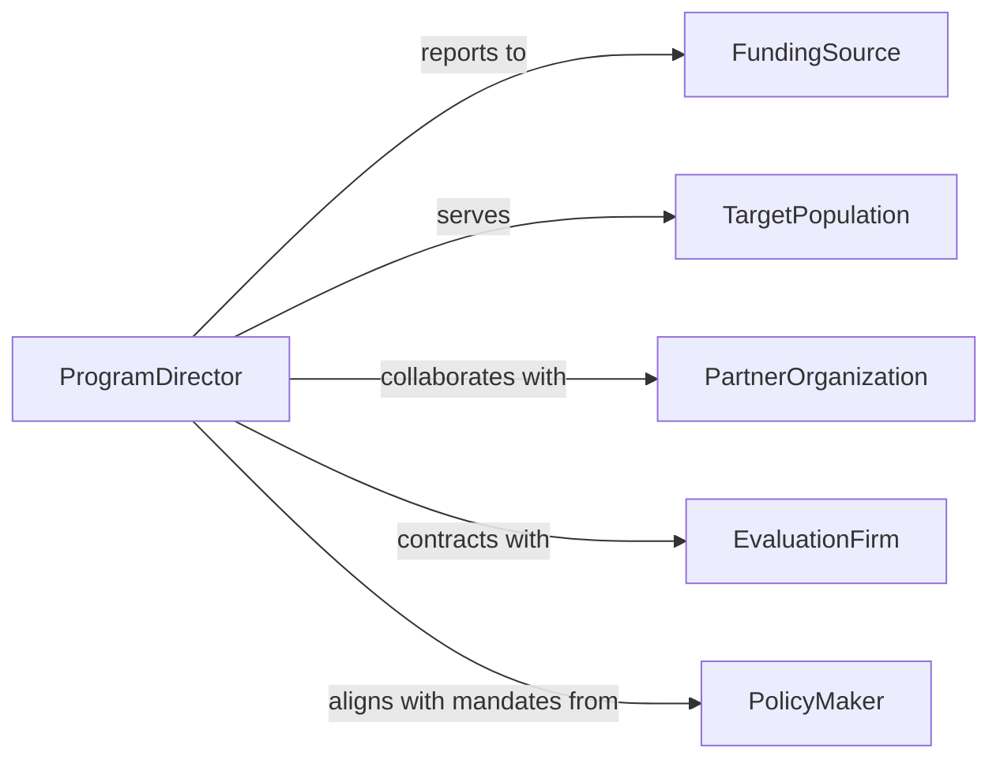

# Develop Program Goals and Objectives

> Business-as-Code definition for developing goals and objectives for specific programs including grant-funded initiatives, public health campaigns, workforce development programs, and community outreach efforts.

## Overview

Program goal and objective development involves conducting needs assessments, defining target populations, articulating measurable outcomes, establishing timelines, identifying resource requirements, and creating logic models that link activities to intended results. This definition covers the process from initial program concept through formal goal specification, stakeholder validation, and integration into program implementation plans.

## Actors

| Actor | Description |
|-------|-------------|
| FundingSource | Grant agency, donor, or budget authority providing program resources |
| TargetPopulation | Community or group the program is designed to serve |
| PartnerOrganization | Collaborating entity contributing resources or access |
| EvaluationFirm | External organization contracted to assess program effectiveness |
| PolicyMaker | Elected official or agency head shaping program mandates |
| AdvisoryCouncil | Stakeholder group providing guidance on program direction |

## Roles

| Role | Description |
|------|-------------|
| ProgramDirector | Leads the program design and oversees goal attainment |
| ProgramPlanner | Conducts needs assessments and designs the logic model |
| EvaluationSpecialist | Defines measurable indicators and data collection methods |
| StakeholderLiaison | Facilitates input from the target population and partners |

## Entities

| Entity | Description |
|--------|-------------|
| NeedsAssessment | Analysis of the gap between current and desired conditions |
| ProgramGoal | Broad statement of intended long-term change |
| ProgramObjective | Specific, measurable target supporting a program goal |
| LogicModel | Visual framework linking inputs, activities, outputs, and outcomes |
| PerformanceIndicator | Quantitative or qualitative measure of objective attainment |
| ImplementationPlan | Detailed schedule of activities and responsible parties |
| BaselineReport | Pre-program data establishing the starting point for measurement |

## Actions

| Action | Description |
|--------|-------------|
| conductNeedsAssessment | Analyze conditions and gaps the program should address |
| defineGoals | Articulate the broad intended outcomes of the program |
| specifyObjectives | Write measurable targets with timeframes and benchmarks |
| buildLogicModel | Create the framework linking activities to outcomes |
| establishIndicators | Define performance measures for each objective |
| validateWithStakeholders | Review goals and objectives with advisory groups |
| integrateIntoPlan | Embed approved goals into the program implementation plan |

## Events

| Event | Description |
|-------|-------------|
| needsAssessmentCompleted | Gap analysis for the program area has been finished |
| goalsDefined | Broad program outcomes have been articulated |
| objectivesSpecified | Measurable targets have been written and benchmarked |
| logicModelBuilt | Activity-to-outcome framework has been created |
| indicatorsEstablished | Performance measures have been defined |
| stakeholdersValidated | Advisory groups have reviewed and endorsed the goals |
| planIntegrated | Goals have been embedded into the implementation plan |

## Searches

| Search | Description |
|--------|-------------|
| findPrograms | List programs by focus area, funding source, or status |
| getGoals | Retrieve program goals by theme or target population |
| getObjectives | Look up measurable objectives linked to a program goal |
| getIndicators | Find performance measures for a specific objective |
| getBaselineData | Retrieve pre-program data for comparison |

## Entity Relationships



## State Diagram



## Workflow



## Actor Relationships



## Usage

### Calling Actions

```typescript
import { developProgramGoalsAndObjectives } from '@headlessly/develop-program-goals-and-objectives'

const program = developProgramGoalsAndObjectives()

// Conduct needs assessment
const needs = await program.conductNeedsAssessment({
  programArea: 'youth-workforce-development',
  region: 'Appalachian-Kentucky',
  dataSource: ['census-ACS', 'BLS-LAUS', 'local-school-district'],
  gaps: [
    'Youth unemployment rate 2.5x state average',
    '38% of adults lack post-secondary credential',
    'Limited employer-sponsored training opportunities'
  ]
})

// Define program goals
const goals = await program.defineGoals({
  assessmentId: needs.id,
  goals: [
    'Increase youth employment rates in the target region by 20% over 3 years',
    'Provide industry-recognized credentials to 500 young adults annually',
    'Establish 15 employer apprenticeship partnerships'
  ]
})

// Specify measurable objectives
await program.specifyObjectives({
  goalId: goals.items[0].id,
  objectives: [
    { description: 'Enroll 200 participants in cohort 1 by Q3 2026', measure: 'enrollment-count', baseline: 0, target: 200 },
    { description: 'Achieve 75% program completion rate', measure: 'completion-rate', baseline: 0, target: 0.75 },
    { description: 'Place 60% of completers in employment within 90 days', measure: 'placement-rate', baseline: 0, target: 0.60 }
  ]
})
```

### Event-Driven Automation

```typescript
// Notify funder when goals are validated by stakeholders
program.stakeholdersValidated(async ({ programId, endorsedBy }) => {
  await notify({
    to: 'grants-office',
    message: `Program ${programId} goals endorsed by ${endorsedBy.length} advisory members - ready for grant submission`
  })
})

// Alert program director when objectives are off track
program.indicatorsEstablished(async ({ programId, indicators }) => {
  for (const indicator of indicators) {
    await scheduleCheck({
      interval: 'quarterly',
      action: async (current) => {
        if (current < indicator.target * 0.5) {
          await notify({
            to: 'program-director',
            message: `Indicator ${indicator.name} at ${current} vs target ${indicator.target} - corrective action needed`
          })
        }
      }
    })
  }
})
```
