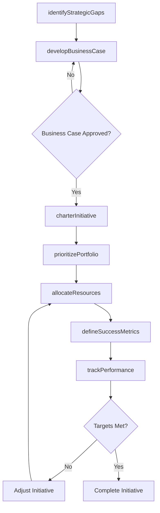
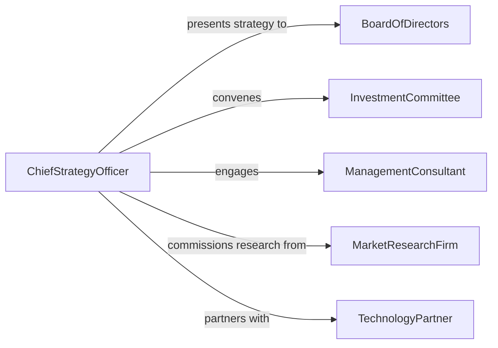

# Develop Strategic Initiatives

> Business-as-Code definition for developing strategic initiatives including market expansion, digital transformation, operational excellence programs, and innovation portfolios that translate organizational strategy into executable action.

## Overview

Strategic initiative development involves identifying strategic gaps, prioritizing opportunities, scoping cross-functional programs, allocating resources, defining success metrics, and establishing governance structures that drive organizational transformation. This definition models the lifecycle from strategic analysis through initiative chartering, portfolio prioritization, execution planning, and performance tracking.

## Actors

| Actor | Description |
|-------|-------------|
| BoardOfDirectors | Governing body approving strategic investment decisions |
| InvestmentCommittee | Cross-functional group evaluating initiative business cases |
| ManagementConsultant | External advisor supporting strategy formulation |
| MarketResearchFirm | Provider of competitive and market intelligence |
| TechnologyPartner | Vendor enabling digital or technical components of initiatives |
| RegulatoryAdvisor | Counsel on compliance implications of strategic shifts |

## Roles

| Role | Description |
|------|-------------|
| ChiefStrategyOfficer | Leads the strategic planning process and initiative portfolio |
| InitiativeSponsor | Executive accountable for a specific strategic initiative |
| PortfolioManager | Prioritizes and balances the portfolio of active initiatives |
| BusinessCaseAnalyst | Develops financial models and ROI projections for initiatives |

## Entities

| Entity | Description |
|--------|-------------|
| StrategicPlan | Multi-year document defining organizational direction and priorities |
| InitiativeCharter | Formal document defining scope, objectives, and governance |
| BusinessCase | Financial and strategic justification for an initiative |
| InitiativePortfolio | Prioritized collection of all active strategic programs |
| ResourceAllocation | Budget and headcount assigned to an initiative |
| SuccessMetric | Quantifiable measure of initiative impact |
| GovernanceDashboard | Real-time view of initiative health and performance |

## Actions

| Action | Description |
|--------|-------------|
| identifyStrategicGaps | Analyze where current capabilities fall short of strategy |
| developBusinessCase | Build the financial and strategic justification |
| charterInitiative | Formally define scope, objectives, and governance |
| prioritizePortfolio | Rank initiatives based on strategic value and feasibility |
| allocateResources | Assign budget, personnel, and technology to initiatives |
| defineSuccessMetrics | Establish quantifiable measures of initiative impact |
| trackPerformance | Monitor initiative execution against defined metrics |

## Events

| Event | Description |
|-------|-------------|
| strategicGapsIdentified | Capability gaps relative to strategy have been documented |
| businessCaseDeveloped | Financial and strategic justification has been completed |
| initiativeChartered | Formal initiative document has been approved |
| portfolioPrioritized | Initiatives have been ranked and sequenced |
| resourcesAllocated | Budget and personnel have been assigned |
| successMetricsDefined | Quantifiable impact measures have been established |
| performanceTracked | Initiative execution data has been reviewed against metrics |

## Searches

| Search | Description |
|--------|-------------|
| findInitiatives | List strategic initiatives by theme, sponsor, or status |
| getPortfolio | Retrieve the current prioritized initiative portfolio |
| getBusinessCases | Look up business case details by initiative or ROI range |
| getResourceAllocations | Find budget and headcount assignments by initiative |
| getPerformanceDashboard | View current health and metrics for active initiatives |

## Workflow



## Actor Relationships



## Usage

### Calling Actions

```typescript
import { developStrategicInitiatives } from '@headlessly/develop-strategic-initiatives'

const strategy = developStrategicInitiatives()

// Identify strategic gaps
const gaps = await strategy.identifyStrategicGaps({
  organization: 'Consolidated Industries',
  strategicPlan: 'SP-2026-2030',
  areas: [
    { capability: 'digital-commerce', current: 'emerging', target: 'advanced' },
    { capability: 'supply-chain-resilience', current: 'basic', target: 'leading' },
    { capability: 'sustainability-reporting', current: 'none', target: 'compliant' }
  ]
})

// Develop business case
const businessCase = await strategy.developBusinessCase({
  gapId: gaps.items[0].id,
  title: 'Direct-to-Consumer Digital Platform',
  investment: 4500000,
  timeline: '18 months',
  projectedROI: 2.8,
  revenueImpact: 12000000,
  risks: ['channel-conflict', 'technology-integration', 'customer-acquisition-cost']
})

// Charter the initiative
await strategy.charterInitiative({
  businessCaseId: businessCase.id,
  sponsor: 'cro-office',
  objectives: [
    'Launch D2C platform within 12 months',
    'Acquire 50,000 direct customers in year one',
    'Achieve 15% gross margin improvement on direct sales'
  ],
  governance: { steeringReview: 'monthly', boardUpdate: 'quarterly' }
})
```

### Event-Driven Automation

```typescript
// Alert investment committee when high-value initiatives are chartered
strategy.initiativeChartered(async ({ initiativeId, investment }) => {
  if (investment > 2000000) {
    await notify({
      to: 'investment-committee',
      message: `Initiative ${initiativeId} chartered at $${investment.toLocaleString()} - governance review required`
    })
  }
})

// Escalate underperforming initiatives
strategy.performanceTracked(async ({ initiativeId, metrics }) => {
  const underperforming = metrics.filter(m => m.actual < m.target * 0.7)
  if (underperforming.length > 0) {
    await notify({
      to: 'chief-strategy-officer',
      message: `Initiative ${initiativeId} underperforming on ${underperforming.length} metric(s) - review needed`
    })
  }
})
```
