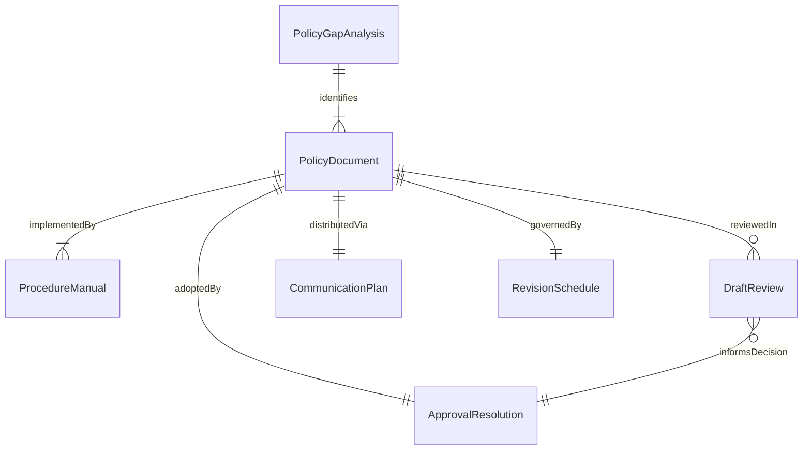
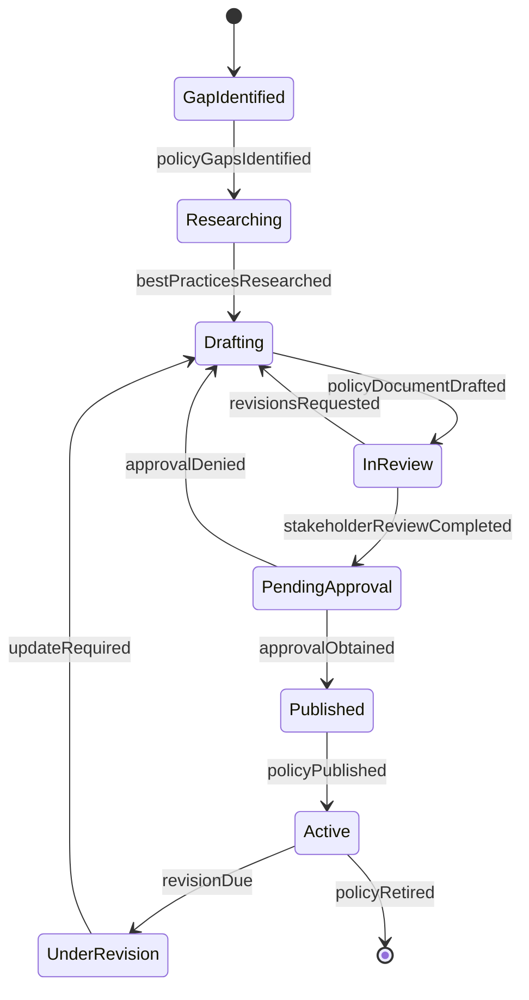
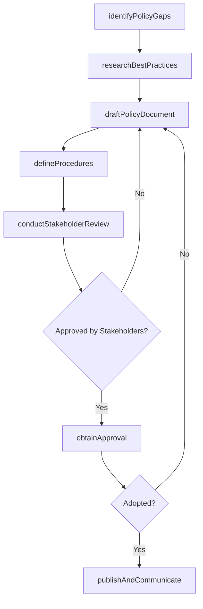
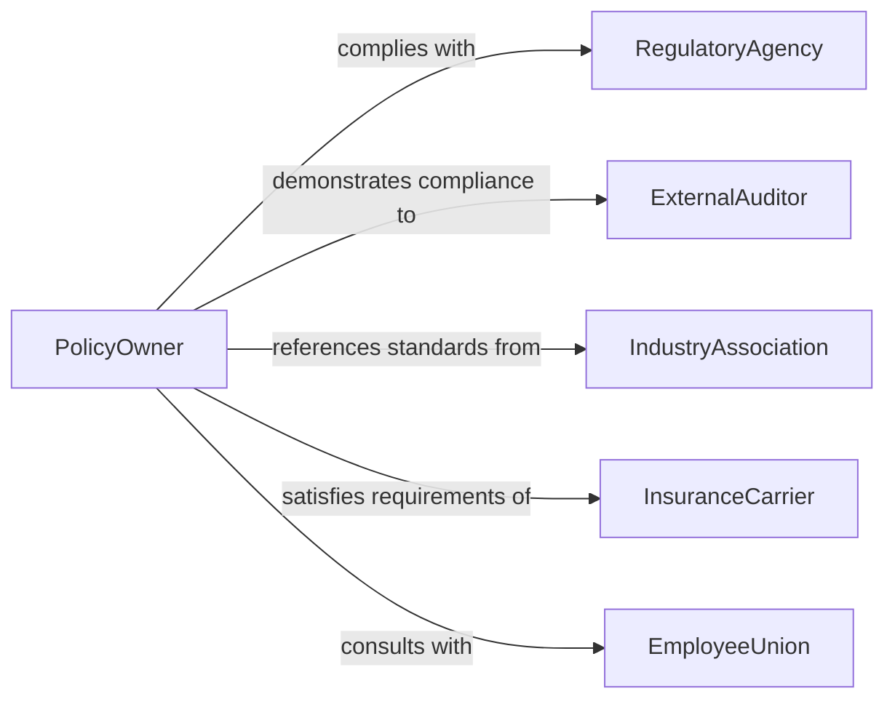

# Create Organizational Policies and Procedures

> Business-as-Code definition for creating organizational policies and procedures including governance frameworks, operational guidelines, compliance requirements, and standard operating procedures that direct organizational conduct.

## Overview

Creating organizational policies and procedures involves identifying regulatory and operational needs, researching best practices, drafting policy language, defining procedural steps, conducting stakeholder review, obtaining leadership approval, and communicating finalized documents across the organization. This definition covers the complete policy development lifecycle from gap identification through publication, training, and periodic revision.

## Actors

| Actor | Description |
|-------|-------------|
| RegulatoryAgency | Government body whose regulations the organization must address |
| ExternalAuditor | Independent firm reviewing policy compliance and effectiveness |
| IndustryAssociation | Professional group publishing best practice guidelines |
| InsuranceCarrier | Provider whose underwriting standards influence policy requirements |
| EmployeeUnion | Collective bargaining unit providing workforce input on policies |
| LegalCounsel | Outside attorney advising on policy legal implications |

## Roles

| Role | Description |
|------|-------------|
| PolicyOwner | Executive accountable for a specific policy domain |
| PolicyWriter | Specialist who drafts and revises policy and procedure documents |
| ComplianceOfficer | Ensures policies satisfy regulatory and legal requirements |
| TrainingCoordinator | Develops and delivers policy education to staff |

## Entities

| Entity | Description |
|--------|-------------|
| PolicyDocument | Formal statement of organizational rules and expectations |
| ProcedureManual | Step-by-step instructions for executing policy requirements |
| PolicyGapAnalysis | Assessment identifying areas lacking formal governance |
| DraftReview | Record of stakeholder comments on a proposed policy |
| ApprovalResolution | Formal leadership decision adopting the policy |
| CommunicationPlan | Schedule and channels for distributing the policy |
| RevisionSchedule | Planned dates for periodic policy review and update |

## Actions

| Action | Description |
|--------|-------------|
| identifyPolicyGaps | Analyze which operational areas lack formal governance |
| researchBestPractices | Survey regulatory requirements and peer organizations |
| draftPolicyDocument | Write the policy statement, scope, and applicability |
| defineProcedures | Document the step-by-step process for policy compliance |
| conductStakeholderReview | Circulate drafts and collect feedback from affected parties |
| obtainApproval | Present the policy for executive or board adoption |
| publishAndCommunicate | Distribute the finalized policy and train staff |

## Events

| Event | Description |
|-------|-------------|
| policyGapsIdentified | Areas lacking formal governance have been documented |
| bestPracticesResearched | Regulatory and peer research has been completed |
| policyDocumentDrafted | Policy statement and scope have been written |
| proceduresDefined | Step-by-step compliance instructions have been documented |
| stakeholderReviewCompleted | Feedback from affected parties has been collected |
| approvalObtained | Executive or board has adopted the policy |
| policyPublished | Finalized policy has been distributed and training delivered |

## Searches

| Search | Description |
|--------|-------------|
| findPolicies | List policies by domain, owner, or effective date |
| getDrafts | Retrieve policy drafts currently under review |
| getReviewComments | Look up stakeholder feedback for a specific draft |
| getComplianceStatus | Check adherence levels for an active policy |
| getRevisionSchedule | Find upcoming policy review dates |

## Entity Relationships



## State Diagram



## Workflow



## Actor Relationships



## Usage

### Calling Actions

```typescript
import { createOrganizationalPoliciesAndProcedures } from '@headlessly/create-organizational-policies-and-procedures'

const policyMgmt = createOrganizationalPoliciesAndProcedures()

// Identify policy gaps
const gaps = await policyMgmt.identifyPolicyGaps({
  organization: 'Regional Medical Center',
  domains: ['data-privacy', 'workplace-safety', 'vendor-management', 'remote-work'],
  regulations: ['HIPAA', 'OSHA', 'state-labor-code']
})

// Draft a policy document
const draft = await policyMgmt.draftPolicyDocument({
  gapId: gaps.items[0].id,
  title: 'Protected Health Information Access and Handling Policy',
  scope: 'All workforce members with access to patient data',
  sections: [
    'purpose',
    'definitions',
    'minimum-necessary-standard',
    'access-authorization',
    'breach-notification',
    'sanctions-for-violations'
  ],
  effectiveDate: '2026-07-01'
})

// Define supporting procedures
await policyMgmt.defineProcedures({
  policyId: draft.id,
  procedures: [
    { name: 'PHI Access Request Process', steps: ['submit-form', 'manager-review', 'privacy-officer-approval', 'IT-provisioning'] },
    { name: 'Breach Reporting Process', steps: ['identify-incident', 'report-to-privacy-officer', 'assess-scope', 'notify-HHS-if-required'] }
  ]
})
```

### Event-Driven Automation

```typescript
// Notify compliance team when policy is published
policyMgmt.policyPublished(async ({ policyId, title }) => {
  await notify({
    to: 'compliance-team',
    message: `New policy published: ${title} - update compliance tracking and training schedule`
  })
})

// Auto-schedule periodic review
policyMgmt.approvalObtained(async ({ policyId, reviewCycle }) => {
  await scheduleReminder({
    date: addMonths(new Date(), reviewCycle),
    to: 'policy-owner',
    message: `Policy ${policyId} is due for scheduled review`
  })
})
```
